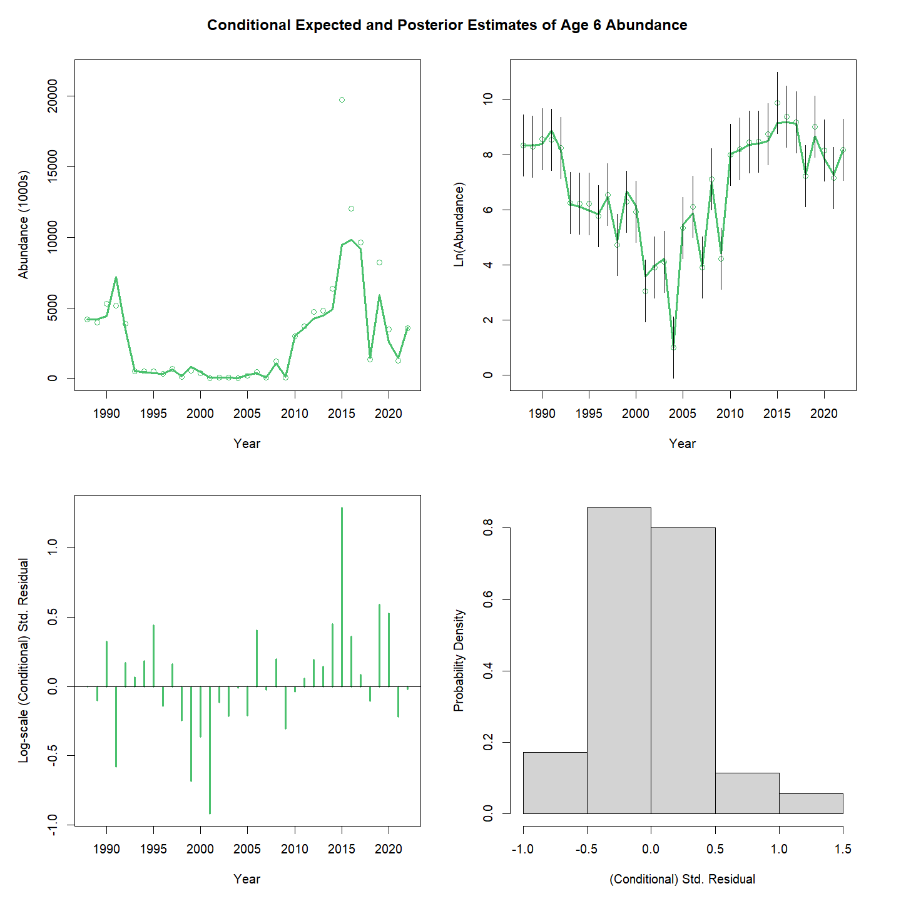
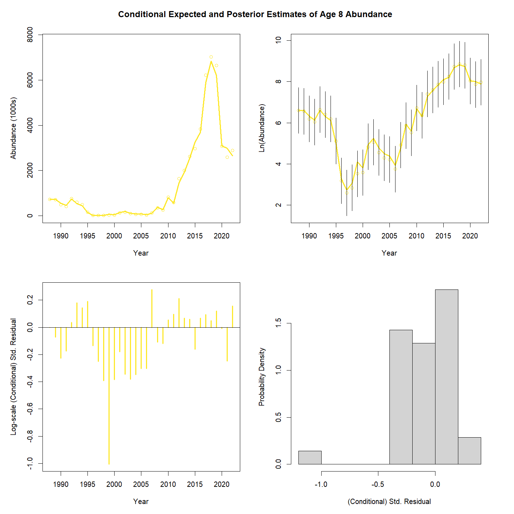
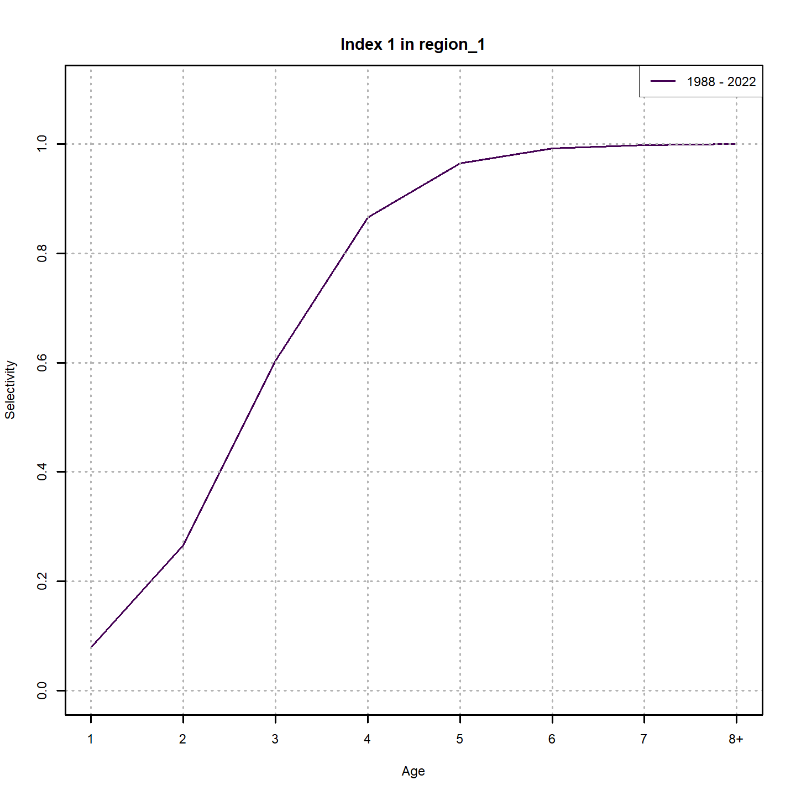
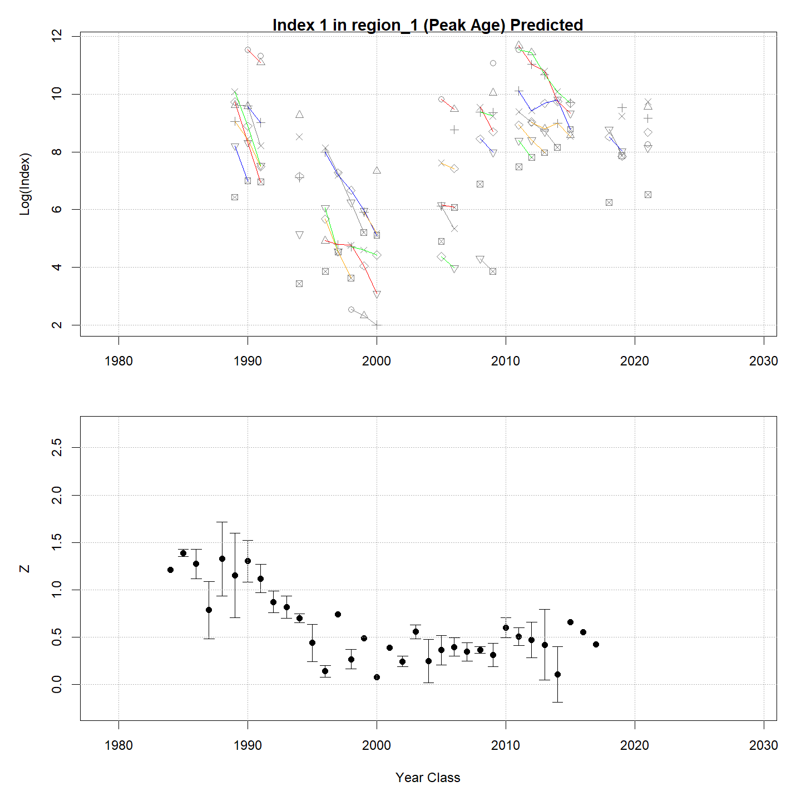

---
output:
  html_document:
    df_print: paged
    keep_md: yes
  word_document: default
  pdf_document:
    fig_caption: yes
    includes:
    keep_tex: yes
    number_sections: no
title: "WHAM figures and tables"
header-includes:
  - \usepackage{longtable}
  - \usepackage{booktabs}
  - \usepackage{caption,graphics}
  - \usepackage{makecell}
  - \usepackage{lscape}
  - \renewcommand\figurename{Fig.}
  - \captionsetup{labelsep=period, singlelinecheck=false}
  - \newcommand{\changesize}[1]{\fontsize{#1pt}{#1pt}\selectfont}
  - \renewcommand{\arraystretch}{1.5}
  - \renewcommand\theadfont{}
---

# {.tabset}

## Figures {.tabset}

### Input

### Diagnostics

### Results

### Retro

### Reference points

### Miscellaneous

## Tables {.tabset}

### Parameter estimates

<table class="table" style="margin-left: auto; margin-right: auto;">
<caption>Parameter estimates, standard errors, and confidence intervals. Rounded to 3 decimal places.</caption>
 <thead>
  <tr>
   <th style="text-align:left;">   </th>
   <th style="text-align:right;"> Estimate </th>
   <th style="text-align:right;"> Std. Error </th>
   <th style="text-align:right;"> 95\% CI lower </th>
   <th style="text-align:right;"> 95\% CI upper </th>
  </tr>
 </thead>
<tbody>
  <tr>
   <td style="text-align:left;"> stock 1 Mean Recruitment </td>
   <td style="text-align:right;"> $80302.193$ </td>
   <td style="text-align:right;"> -- </td>
   <td style="text-align:right;"> -- </td>
   <td style="text-align:right;"> -- </td>
  </tr>
  <tr>
   <td style="text-align:left;"> stock 1 NAA $\sigma$ (age 1) </td>
   <td style="text-align:right;"> $1.600$ </td>
   <td style="text-align:right;"> -- </td>
   <td style="text-align:right;"> -- </td>
   <td style="text-align:right;"> -- </td>
  </tr>
  <tr>
   <td style="text-align:left;"> stock 1 NAA $\sigma$ (ages 2-8+) </td>
   <td style="text-align:right;"> $0.521$ </td>
   <td style="text-align:right;"> -- </td>
   <td style="text-align:right;"> -- </td>
   <td style="text-align:right;"> -- </td>
  </tr>
  <tr>
   <td style="text-align:left;"> stock 1   NAA AR1 $\rho$ age </td>
   <td style="text-align:right;"> $0.447$ </td>
   <td style="text-align:right;"> -- </td>
   <td style="text-align:right;"> -- </td>
   <td style="text-align:right;"> -- </td>
  </tr>
  <tr>
   <td style="text-align:left;"> stock 1   NAA AR1 $\rho$ year </td>
   <td style="text-align:right;"> $0.012$ </td>
   <td style="text-align:right;"> -- </td>
   <td style="text-align:right;"> -- </td>
   <td style="text-align:right;"> -- </td>
  </tr>
  <tr>
   <td style="text-align:left;"> stock 1   Recruitment AR1 $\rho$ year </td>
   <td style="text-align:right;"> $0.012$ </td>
   <td style="text-align:right;"> -- </td>
   <td style="text-align:right;"> -- </td>
   <td style="text-align:right;"> -- </td>
  </tr>
  <tr>
   <td style="text-align:left;"> Index 1 fully selected q </td>
   <td style="text-align:right;"> $1.246$ </td>
   <td style="text-align:right;"> -- </td>
   <td style="text-align:right;"> -- </td>
   <td style="text-align:right;"> -- </td>
  </tr>
  <tr>
   <td style="text-align:left;"> Block 1: Fleet 1 Mean Selectivity for age 1 </td>
   <td style="text-align:right;"> $6.823\times 10^{-7}$ </td>
   <td style="text-align:right;"> -- </td>
   <td style="text-align:right;"> -- </td>
   <td style="text-align:right;"> -- </td>
  </tr>
  <tr>
   <td style="text-align:left;"> Block 1: Fleet 1 Mean Selectivity for age 2 </td>
   <td style="text-align:right;"> $2.613\times 10^{-4}$ </td>
   <td style="text-align:right;"> -- </td>
   <td style="text-align:right;"> -- </td>
   <td style="text-align:right;"> -- </td>
  </tr>
  <tr>
   <td style="text-align:left;"> Block 1: Fleet 1 Mean Selectivity for age 3 </td>
   <td style="text-align:right;"> $0.006$ </td>
   <td style="text-align:right;"> -- </td>
   <td style="text-align:right;"> -- </td>
   <td style="text-align:right;"> -- </td>
  </tr>
  <tr>
   <td style="text-align:left;"> Block 1: Fleet 1 Mean Selectivity for age 4 </td>
   <td style="text-align:right;"> $0.014$ </td>
   <td style="text-align:right;"> -- </td>
   <td style="text-align:right;"> -- </td>
   <td style="text-align:right;"> -- </td>
  </tr>
  <tr>
   <td style="text-align:left;"> Block 1: Fleet 1 Mean Selectivity for age 5 </td>
   <td style="text-align:right;"> $0.024$ </td>
   <td style="text-align:right;"> -- </td>
   <td style="text-align:right;"> -- </td>
   <td style="text-align:right;"> -- </td>
  </tr>
  <tr>
   <td style="text-align:left;"> Block 1: Fleet 1 Mean Selectivity for age 6 </td>
   <td style="text-align:right;"> $0.029$ </td>
   <td style="text-align:right;"> -- </td>
   <td style="text-align:right;"> -- </td>
   <td style="text-align:right;"> -- </td>
  </tr>
  <tr>
   <td style="text-align:left;"> Block 1: Fleet 1 Mean Selectivity for age 7 </td>
   <td style="text-align:right;"> $0.024$ </td>
   <td style="text-align:right;"> -- </td>
   <td style="text-align:right;"> -- </td>
   <td style="text-align:right;"> -- </td>
  </tr>
  <tr>
   <td style="text-align:left;"> Block 1: Fleet 1 Mean Selectivity for age 8+ </td>
   <td style="text-align:right;"> $0.013$ </td>
   <td style="text-align:right;"> -- </td>
   <td style="text-align:right;"> -- </td>
   <td style="text-align:right;"> -- </td>
  </tr>
  <tr>
   <td style="text-align:left;"> Block 2: Index 1 Selectivity for age 1 </td>
   <td style="text-align:right;"> $0.069$ </td>
   <td style="text-align:right;"> -- </td>
   <td style="text-align:right;"> -- </td>
   <td style="text-align:right;"> -- </td>
  </tr>
  <tr>
   <td style="text-align:left;"> Block 2: Index 1 Selectivity for age 2 </td>
   <td style="text-align:right;"> $0.261$ </td>
   <td style="text-align:right;"> -- </td>
   <td style="text-align:right;"> -- </td>
   <td style="text-align:right;"> -- </td>
  </tr>
  <tr>
   <td style="text-align:left;"> Block 2: Index 1 Selectivity for age 3 </td>
   <td style="text-align:right;"> $0.547$ </td>
   <td style="text-align:right;"> -- </td>
   <td style="text-align:right;"> -- </td>
   <td style="text-align:right;"> -- </td>
  </tr>
  <tr>
   <td style="text-align:left;"> Block 2: Index 1 Selectivity for age 4 </td>
   <td style="text-align:right;"> $0.654$ </td>
   <td style="text-align:right;"> -- </td>
   <td style="text-align:right;"> -- </td>
   <td style="text-align:right;"> -- </td>
  </tr>
  <tr>
   <td style="text-align:left;"> Block 2: Index 1 Selectivity for age 5 </td>
   <td style="text-align:right;"> $0.869$ </td>
   <td style="text-align:right;"> -- </td>
   <td style="text-align:right;"> -- </td>
   <td style="text-align:right;"> -- </td>
  </tr>
  <tr>
   <td style="text-align:left;"> Block 2: Index 1 Selectivity for age 6 </td>
   <td style="text-align:right;"> $1.000$ </td>
   <td style="text-align:right;"> -- </td>
   <td style="text-align:right;"> -- </td>
   <td style="text-align:right;"> -- </td>
  </tr>
  <tr>
   <td style="text-align:left;"> Block 2: Index 1 Selectivity for age 7 </td>
   <td style="text-align:right;"> $0.620$ </td>
   <td style="text-align:right;"> -- </td>
   <td style="text-align:right;"> -- </td>
   <td style="text-align:right;"> -- </td>
  </tr>
  <tr>
   <td style="text-align:left;"> Block 2: Index 1 Selectivity for age 8+ </td>
   <td style="text-align:right;"> $0.337$ </td>
   <td style="text-align:right;"> -- </td>
   <td style="text-align:right;"> -- </td>
   <td style="text-align:right;"> -- </td>
  </tr>
  <tr>
   <td style="text-align:left;"> Block 1: Fleet 1 Selectivity RE $\sigma$ </td>
   <td style="text-align:right;"> $0.490$ </td>
   <td style="text-align:right;"> -- </td>
   <td style="text-align:right;"> -- </td>
   <td style="text-align:right;"> -- </td>
  </tr>
  <tr>
   <td style="text-align:left;"> Block 1: Fleet 1 Selectivity RE AR1 $\rho$ (age) </td>
   <td style="text-align:right;"> $0.905$ </td>
   <td style="text-align:right;"> -- </td>
   <td style="text-align:right;"> -- </td>
   <td style="text-align:right;"> -- </td>
  </tr>
  <tr>
   <td style="text-align:left;"> Block 1: Fleet 1 Selectivity RE AR1 $\rho$ (year) </td>
   <td style="text-align:right;"> $0.644$ </td>
   <td style="text-align:right;"> -- </td>
   <td style="text-align:right;"> -- </td>
   <td style="text-align:right;"> -- </td>
  </tr>
</tbody>
</table>

### Abundance at age

<table class="table" style="margin-left: auto; margin-right: auto;">
<caption>Abundance at age (1000s) for stock 1 in region 1.</caption>
 <thead>
  <tr>
   <th style="text-align:left;">   </th>
   <th style="text-align:right;"> 1 </th>
   <th style="text-align:right;"> 2 </th>
   <th style="text-align:right;"> 3 </th>
   <th style="text-align:right;"> 4 </th>
   <th style="text-align:right;"> 5 </th>
   <th style="text-align:right;"> 6 </th>
   <th style="text-align:right;"> 7 </th>
   <th style="text-align:right;"> 8+ </th>
  </tr>
 </thead>
<tbody>
  <tr>
   <td style="text-align:left;"> 1988 </td>
   <td style="text-align:right;"> 1248900 </td>
   <td style="text-align:right;"> 263138 </td>
   <td style="text-align:right;"> 88275 </td>
   <td style="text-align:right;"> 34689 </td>
   <td style="text-align:right;"> 12153 </td>
   <td style="text-align:right;"> 3678 </td>
   <td style="text-align:right;"> 1042 </td>
   <td style="text-align:right;"> 791 </td>
  </tr>
  <tr>
   <td style="text-align:left;"> 1989 </td>
   <td style="text-align:right;"> 439707 </td>
   <td style="text-align:right;"> 158224 </td>
   <td style="text-align:right;"> 139194 </td>
   <td style="text-align:right;"> 70729 </td>
   <td style="text-align:right;"> 19981 </td>
   <td style="text-align:right;"> 4684 </td>
   <td style="text-align:right;"> 1234 </td>
   <td style="text-align:right;"> 848 </td>
  </tr>
  <tr>
   <td style="text-align:left;"> 1990 </td>
   <td style="text-align:right;"> 166540 </td>
   <td style="text-align:right;"> 67402 </td>
   <td style="text-align:right;"> 20907 </td>
   <td style="text-align:right;"> 45420 </td>
   <td style="text-align:right;"> 26625 </td>
   <td style="text-align:right;"> 5808 </td>
   <td style="text-align:right;"> 1159 </td>
   <td style="text-align:right;"> 804 </td>
  </tr>
  <tr>
   <td style="text-align:left;"> 1991 </td>
   <td style="text-align:right;"> 2183736 </td>
   <td style="text-align:right;"> 77748 </td>
   <td style="text-align:right;"> 32435 </td>
   <td style="text-align:right;"> 7888 </td>
   <td style="text-align:right;"> 9565 </td>
   <td style="text-align:right;"> 4821 </td>
   <td style="text-align:right;"> 1355 </td>
   <td style="text-align:right;"> 738 </td>
  </tr>
  <tr>
   <td style="text-align:left;"> 1992 </td>
   <td style="text-align:right;"> 1886094 </td>
   <td style="text-align:right;"> 318726 </td>
   <td style="text-align:right;"> 24010 </td>
   <td style="text-align:right;"> 9376 </td>
   <td style="text-align:right;"> 3952 </td>
   <td style="text-align:right;"> 3829 </td>
   <td style="text-align:right;"> 1927 </td>
   <td style="text-align:right;"> 1114 </td>
  </tr>
  <tr>
   <td style="text-align:left;"> 1993 </td>
   <td style="text-align:right;"> 95735 </td>
   <td style="text-align:right;"> 403530 </td>
   <td style="text-align:right;"> 111915 </td>
   <td style="text-align:right;"> 6799 </td>
   <td style="text-align:right;"> 1923 </td>
   <td style="text-align:right;"> 502 </td>
   <td style="text-align:right;"> 489 </td>
   <td style="text-align:right;"> 809 </td>
  </tr>
  <tr>
   <td style="text-align:left;"> 1994 </td>
   <td style="text-align:right;"> 172012 </td>
   <td style="text-align:right;"> 11174 </td>
   <td style="text-align:right;"> 64507 </td>
   <td style="text-align:right;"> 25028 </td>
   <td style="text-align:right;"> 2586 </td>
   <td style="text-align:right;"> 671 </td>
   <td style="text-align:right;"> 150 </td>
   <td style="text-align:right;"> 601 </td>
  </tr>
  <tr>
   <td style="text-align:left;"> 1995 </td>
   <td style="text-align:right;"> 42727 </td>
   <td style="text-align:right;"> 49803 </td>
   <td style="text-align:right;"> 2874 </td>
   <td style="text-align:right;"> 11567 </td>
   <td style="text-align:right;"> 3265 </td>
   <td style="text-align:right;"> 485 </td>
   <td style="text-align:right;"> 107 </td>
   <td style="text-align:right;"> 258 </td>
  </tr>
  <tr>
   <td style="text-align:left;"> 1996 </td>
   <td style="text-align:right;"> 3216 </td>
   <td style="text-align:right;"> 13613 </td>
   <td style="text-align:right;"> 16496 </td>
   <td style="text-align:right;"> 1128 </td>
   <td style="text-align:right;"> 2480 </td>
   <td style="text-align:right;"> 413 </td>
   <td style="text-align:right;"> 38 </td>
   <td style="text-align:right;"> 69 </td>
  </tr>
  <tr>
   <td style="text-align:left;"> 1997 </td>
   <td style="text-align:right;"> 1462 </td>
   <td style="text-align:right;"> 733 </td>
   <td style="text-align:right;"> 7347 </td>
   <td style="text-align:right;"> 6789 </td>
   <td style="text-align:right;"> 543 </td>
   <td style="text-align:right;"> 919 </td>
   <td style="text-align:right;"> 127 </td>
   <td style="text-align:right;"> 42 </td>
  </tr>
  <tr>
   <td style="text-align:left;"> 1998 </td>
   <td style="text-align:right;"> 1464 </td>
   <td style="text-align:right;"> 389 </td>
   <td style="text-align:right;"> 261 </td>
   <td style="text-align:right;"> 2299 </td>
   <td style="text-align:right;"> 2083 </td>
   <td style="text-align:right;"> 149 </td>
   <td style="text-align:right;"> 192 </td>
   <td style="text-align:right;"> 51 </td>
  </tr>
  <tr>
   <td style="text-align:left;"> 1999 </td>
   <td style="text-align:right;"> 131 </td>
   <td style="text-align:right;"> 681 </td>
   <td style="text-align:right;"> 243 </td>
   <td style="text-align:right;"> 178 </td>
   <td style="text-align:right;"> 1027 </td>
   <td style="text-align:right;"> 623 </td>
   <td style="text-align:right;"> 49 </td>
   <td style="text-align:right;"> 86 </td>
  </tr>
  <tr>
   <td style="text-align:left;"> 2000 </td>
   <td style="text-align:right;"> 5682 </td>
   <td style="text-align:right;"> 39 </td>
   <td style="text-align:right;"> 753 </td>
   <td style="text-align:right;"> 165 </td>
   <td style="text-align:right;"> 72 </td>
   <td style="text-align:right;"> 407 </td>
   <td style="text-align:right;"> 264 </td>
   <td style="text-align:right;"> 78 </td>
  </tr>
  <tr>
   <td style="text-align:left;"> 2001 </td>
   <td style="text-align:right;"> 8425 </td>
   <td style="text-align:right;"> 6382 </td>
   <td style="text-align:right;"> 18 </td>
   <td style="text-align:right;"> 261 </td>
   <td style="text-align:right;"> 89 </td>
   <td style="text-align:right;"> 25 </td>
   <td style="text-align:right;"> 204 </td>
   <td style="text-align:right;"> 257 </td>
  </tr>
  <tr>
   <td style="text-align:left;"> 2002 </td>
   <td style="text-align:right;"> 2709 </td>
   <td style="text-align:right;"> 2597 </td>
   <td style="text-align:right;"> 2170 </td>
   <td style="text-align:right;"> 8 </td>
   <td style="text-align:right;"> 131 </td>
   <td style="text-align:right;"> 49 </td>
   <td style="text-align:right;"> 15 </td>
   <td style="text-align:right;"> 263 </td>
  </tr>
  <tr>
   <td style="text-align:left;"> 2003 </td>
   <td style="text-align:right;"> 18705 </td>
   <td style="text-align:right;"> 543 </td>
   <td style="text-align:right;"> 990 </td>
   <td style="text-align:right;"> 762 </td>
   <td style="text-align:right;"> 4 </td>
   <td style="text-align:right;"> 68 </td>
   <td style="text-align:right;"> 28 </td>
   <td style="text-align:right;"> 162 </td>
  </tr>
  <tr>
   <td style="text-align:left;"> 2004 </td>
   <td style="text-align:right;"> 11384 </td>
   <td style="text-align:right;"> 8465 </td>
   <td style="text-align:right;"> 268 </td>
   <td style="text-align:right;"> 661 </td>
   <td style="text-align:right;"> 389 </td>
   <td style="text-align:right;"> 2 </td>
   <td style="text-align:right;"> 39 </td>
   <td style="text-align:right;"> 109 </td>
  </tr>
  <tr>
   <td style="text-align:left;"> 2005 </td>
   <td style="text-align:right;"> 108841 </td>
   <td style="text-align:right;"> 2443 </td>
   <td style="text-align:right;"> 4456 </td>
   <td style="text-align:right;"> 147 </td>
   <td style="text-align:right;"> 515 </td>
   <td style="text-align:right;"> 249 </td>
   <td style="text-align:right;"> 1 </td>
   <td style="text-align:right;"> 95 </td>
  </tr>
  <tr>
   <td style="text-align:left;"> 2006 </td>
   <td style="text-align:right;"> 377285 </td>
   <td style="text-align:right;"> 24733 </td>
   <td style="text-align:right;"> 890 </td>
   <td style="text-align:right;"> 2924 </td>
   <td style="text-align:right;"> 93 </td>
   <td style="text-align:right;"> 473 </td>
   <td style="text-align:right;"> 178 </td>
   <td style="text-align:right;"> 68 </td>
  </tr>
  <tr>
   <td style="text-align:left;"> 2007 </td>
   <td style="text-align:right;"> 113806 </td>
   <td style="text-align:right;"> 54207 </td>
   <td style="text-align:right;"> 10819 </td>
   <td style="text-align:right;"> 282 </td>
   <td style="text-align:right;"> 1856 </td>
   <td style="text-align:right;"> 70 </td>
   <td style="text-align:right;"> 547 </td>
   <td style="text-align:right;"> 271 </td>
  </tr>
  <tr>
   <td style="text-align:left;"> 2008 </td>
   <td style="text-align:right;"> 130990 </td>
   <td style="text-align:right;"> 39735 </td>
   <td style="text-align:right;"> 32839 </td>
   <td style="text-align:right;"> 7815 </td>
   <td style="text-align:right;"> 186 </td>
   <td style="text-align:right;"> 1596 </td>
   <td style="text-align:right;"> 55 </td>
   <td style="text-align:right;"> 625 </td>
  </tr>
  <tr>
   <td style="text-align:left;"> 2009 </td>
   <td style="text-align:right;"> 167879 </td>
   <td style="text-align:right;"> 40867 </td>
   <td style="text-align:right;"> 23198 </td>
   <td style="text-align:right;"> 19920 </td>
   <td style="text-align:right;"> 5377 </td>
   <td style="text-align:right;"> 112 </td>
   <td style="text-align:right;"> 1313 </td>
   <td style="text-align:right;"> 536 </td>
  </tr>
  <tr>
   <td style="text-align:left;"> 2010 </td>
   <td style="text-align:right;"> 1477220 </td>
   <td style="text-align:right;"> 110452 </td>
   <td style="text-align:right;"> 24968 </td>
   <td style="text-align:right;"> 14872 </td>
   <td style="text-align:right;"> 7504 </td>
   <td style="text-align:right;"> 3124 </td>
   <td style="text-align:right;"> 78 </td>
   <td style="text-align:right;"> 1528 </td>
  </tr>
  <tr>
   <td style="text-align:left;"> 2011 </td>
   <td style="text-align:right;"> 6162641 </td>
   <td style="text-align:right;"> 311147 </td>
   <td style="text-align:right;"> 49256 </td>
   <td style="text-align:right;"> 17041 </td>
   <td style="text-align:right;"> 10020 </td>
   <td style="text-align:right;"> 4993 </td>
   <td style="text-align:right;"> 2566 </td>
   <td style="text-align:right;"> 1416 </td>
  </tr>
  <tr>
   <td style="text-align:left;"> 2012 </td>
   <td style="text-align:right;"> 2228336 </td>
   <td style="text-align:right;"> 532903 </td>
   <td style="text-align:right;"> 51343 </td>
   <td style="text-align:right;"> 16569 </td>
   <td style="text-align:right;"> 9094 </td>
   <td style="text-align:right;"> 5702 </td>
   <td style="text-align:right;"> 2946 </td>
   <td style="text-align:right;"> 3319 </td>
  </tr>
  <tr>
   <td style="text-align:left;"> 2013 </td>
   <td style="text-align:right;"> 174166 </td>
   <td style="text-align:right;"> 424524 </td>
   <td style="text-align:right;"> 116356 </td>
   <td style="text-align:right;"> 16672 </td>
   <td style="text-align:right;"> 8650 </td>
   <td style="text-align:right;"> 5254 </td>
   <td style="text-align:right;"> 3615 </td>
   <td style="text-align:right;"> 4463 </td>
  </tr>
  <tr>
   <td style="text-align:left;"> 2014 </td>
   <td style="text-align:right;"> 193392 </td>
   <td style="text-align:right;"> 31601 </td>
   <td style="text-align:right;"> 91431 </td>
   <td style="text-align:right;"> 72259 </td>
   <td style="text-align:right;"> 20389 </td>
   <td style="text-align:right;"> 7612 </td>
   <td style="text-align:right;"> 4591 </td>
   <td style="text-align:right;"> 6681 </td>
  </tr>
  <tr>
   <td style="text-align:left;"> 2015 </td>
   <td style="text-align:right;"> 66769 </td>
   <td style="text-align:right;"> 67266 </td>
   <td style="text-align:right;"> 15977 </td>
   <td style="text-align:right;"> 37623 </td>
   <td style="text-align:right;"> 22752 </td>
   <td style="text-align:right;"> 20971 </td>
   <td style="text-align:right;"> 5829 </td>
   <td style="text-align:right;"> 8144 </td>
  </tr>
  <tr>
   <td style="text-align:left;"> 2016 </td>
   <td style="text-align:right;"> 26504 </td>
   <td style="text-align:right;"> 25016 </td>
   <td style="text-align:right;"> 34326 </td>
   <td style="text-align:right;"> 8137 </td>
   <td style="text-align:right;"> 20629 </td>
   <td style="text-align:right;"> 12662 </td>
   <td style="text-align:right;"> 10032 </td>
   <td style="text-align:right;"> 9645 </td>
  </tr>
  <tr>
   <td style="text-align:left;"> 2017 </td>
   <td style="text-align:right;"> 107357 </td>
   <td style="text-align:right;"> 8066 </td>
   <td style="text-align:right;"> 14499 </td>
   <td style="text-align:right;"> 23140 </td>
   <td style="text-align:right;"> 4368 </td>
   <td style="text-align:right;"> 13230 </td>
   <td style="text-align:right;"> 8482 </td>
   <td style="text-align:right;"> 14697 </td>
  </tr>
  <tr>
   <td style="text-align:left;"> 2018 </td>
   <td style="text-align:right;"> 97436 </td>
   <td style="text-align:right;"> 31244 </td>
   <td style="text-align:right;"> 4061 </td>
   <td style="text-align:right;"> 8987 </td>
   <td style="text-align:right;"> 13814 </td>
   <td style="text-align:right;"> 2072 </td>
   <td style="text-align:right;"> 7106 </td>
   <td style="text-align:right;"> 15343 </td>
  </tr>
  <tr>
   <td style="text-align:left;"> 2019 </td>
   <td style="text-align:right;"> 247431 </td>
   <td style="text-align:right;"> 24214 </td>
   <td style="text-align:right;"> 16076 </td>
   <td style="text-align:right;"> 2566 </td>
   <td style="text-align:right;"> 6418 </td>
   <td style="text-align:right;"> 8851 </td>
   <td style="text-align:right;"> 1035 </td>
   <td style="text-align:right;"> 15316 </td>
  </tr>
  <tr>
   <td style="text-align:left;"> 2020 </td>
   <td style="text-align:right;"> 144390 </td>
   <td style="text-align:right;"> 47722 </td>
   <td style="text-align:right;"> 29083 </td>
   <td style="text-align:right;"> 18805 </td>
   <td style="text-align:right;"> 3880 </td>
   <td style="text-align:right;"> 4552 </td>
   <td style="text-align:right;"> 4760 </td>
   <td style="text-align:right;"> 9309 </td>
  </tr>
  <tr>
   <td style="text-align:left;"> 2021 </td>
   <td style="text-align:right;"> 260094 </td>
   <td style="text-align:right;"> 48042 </td>
   <td style="text-align:right;"> 34064 </td>
   <td style="text-align:right;"> 14298 </td>
   <td style="text-align:right;"> 8474 </td>
   <td style="text-align:right;"> 1787 </td>
   <td style="text-align:right;"> 2178 </td>
   <td style="text-align:right;"> 8044 </td>
  </tr>
  <tr>
   <td style="text-align:left;"> 2022 </td>
   <td style="text-align:right;"> 92970 </td>
   <td style="text-align:right;"> 75580 </td>
   <td style="text-align:right;"> 23381 </td>
   <td style="text-align:right;"> 28613 </td>
   <td style="text-align:right;"> 8032 </td>
   <td style="text-align:right;"> 4445 </td>
   <td style="text-align:right;"> 1079 </td>
   <td style="text-align:right;"> 7887 </td>
  </tr>
</tbody>
</table>

### Fishing mortality at age by region

<table class="table" style="margin-left: auto; margin-right: auto;">
<caption>Total fishing mortality at age in region 1.</caption>
 <thead>
  <tr>
   <th style="text-align:left;">   </th>
   <th style="text-align:right;"> 1 </th>
   <th style="text-align:right;"> 2 </th>
   <th style="text-align:right;"> 3 </th>
   <th style="text-align:right;"> 4 </th>
   <th style="text-align:right;"> 5 </th>
   <th style="text-align:right;"> 6 </th>
   <th style="text-align:right;"> 7 </th>
   <th style="text-align:right;"> 8+ </th>
  </tr>
 </thead>
<tbody>
  <tr>
   <td style="text-align:left;"> 1988 </td>
   <td style="text-align:right;"> 0 </td>
   <td style="text-align:right;"> 0.005 </td>
   <td style="text-align:right;"> 0.121 </td>
   <td style="text-align:right;"> 0.352 </td>
   <td style="text-align:right;"> 0.618 </td>
   <td style="text-align:right;"> 0.732 </td>
   <td style="text-align:right;"> 0.569 </td>
   <td style="text-align:right;"> 0.284 </td>
  </tr>
  <tr>
   <td style="text-align:left;"> 1989 </td>
   <td style="text-align:right;"> 0 </td>
   <td style="text-align:right;"> 0.007 </td>
   <td style="text-align:right;"> 0.162 </td>
   <td style="text-align:right;"> 0.463 </td>
   <td style="text-align:right;"> 0.722 </td>
   <td style="text-align:right;"> 0.820 </td>
   <td style="text-align:right;"> 0.632 </td>
   <td style="text-align:right;"> 0.311 </td>
  </tr>
  <tr>
   <td style="text-align:left;"> 1990 </td>
   <td style="text-align:right;"> 0 </td>
   <td style="text-align:right;"> 0.008 </td>
   <td style="text-align:right;"> 0.194 </td>
   <td style="text-align:right;"> 0.554 </td>
   <td style="text-align:right;"> 0.702 </td>
   <td style="text-align:right;"> 0.698 </td>
   <td style="text-align:right;"> 0.521 </td>
   <td style="text-align:right;"> 0.250 </td>
  </tr>
  <tr>
   <td style="text-align:left;"> 1991 </td>
   <td style="text-align:right;"> 0 </td>
   <td style="text-align:right;"> 0.012 </td>
   <td style="text-align:right;"> 0.238 </td>
   <td style="text-align:right;"> 0.412 </td>
   <td style="text-align:right;"> 0.539 </td>
   <td style="text-align:right;"> 0.551 </td>
   <td style="text-align:right;"> 0.404 </td>
   <td style="text-align:right;"> 0.193 </td>
  </tr>
  <tr>
   <td style="text-align:left;"> 1992 </td>
   <td style="text-align:right;"> 0 </td>
   <td style="text-align:right;"> 0.068 </td>
   <td style="text-align:right;"> 0.840 </td>
   <td style="text-align:right;"> 1.269 </td>
   <td style="text-align:right;"> 1.674 </td>
   <td style="text-align:right;"> 1.676 </td>
   <td style="text-align:right;"> 1.283 </td>
   <td style="text-align:right;"> 0.650 </td>
  </tr>
  <tr>
   <td style="text-align:left;"> 1993 </td>
   <td style="text-align:right;"> 0 </td>
   <td style="text-align:right;"> 0.013 </td>
   <td style="text-align:right;"> 0.256 </td>
   <td style="text-align:right;"> 0.503 </td>
   <td style="text-align:right;"> 0.716 </td>
   <td style="text-align:right;"> 0.832 </td>
   <td style="text-align:right;"> 0.666 </td>
   <td style="text-align:right;"> 0.343 </td>
  </tr>
  <tr>
   <td style="text-align:left;"> 1994 </td>
   <td style="text-align:right;"> 0 </td>
   <td style="text-align:right;"> 0.015 </td>
   <td style="text-align:right;"> 0.435 </td>
   <td style="text-align:right;"> 1.075 </td>
   <td style="text-align:right;"> 1.359 </td>
   <td style="text-align:right;"> 1.591 </td>
   <td style="text-align:right;"> 1.307 </td>
   <td style="text-align:right;"> 0.704 </td>
  </tr>
  <tr>
   <td style="text-align:left;"> 1995 </td>
   <td style="text-align:right;"> 0 </td>
   <td style="text-align:right;"> 0.004 </td>
   <td style="text-align:right;"> 0.180 </td>
   <td style="text-align:right;"> 0.759 </td>
   <td style="text-align:right;"> 1.440 </td>
   <td style="text-align:right;"> 1.969 </td>
   <td style="text-align:right;"> 1.720 </td>
   <td style="text-align:right;"> 0.992 </td>
  </tr>
  <tr>
   <td style="text-align:left;"> 1996 </td>
   <td style="text-align:right;"> 0 </td>
   <td style="text-align:right;"> 0.003 </td>
   <td style="text-align:right;"> 0.091 </td>
   <td style="text-align:right;"> 0.209 </td>
   <td style="text-align:right;"> 0.446 </td>
   <td style="text-align:right;"> 0.669 </td>
   <td style="text-align:right;"> 0.574 </td>
   <td style="text-align:right;"> 0.294 </td>
  </tr>
  <tr>
   <td style="text-align:left;"> 1997 </td>
   <td style="text-align:right;"> 0 </td>
   <td style="text-align:right;"> 0.005 </td>
   <td style="text-align:right;"> 0.184 </td>
   <td style="text-align:right;"> 0.217 </td>
   <td style="text-align:right;"> 0.470 </td>
   <td style="text-align:right;"> 0.654 </td>
   <td style="text-align:right;"> 0.505 </td>
   <td style="text-align:right;"> 0.228 </td>
  </tr>
  <tr>
   <td style="text-align:left;"> 1998 </td>
   <td style="text-align:right;"> 0 </td>
   <td style="text-align:right;"> 0.002 </td>
   <td style="text-align:right;"> 0.072 </td>
   <td style="text-align:right;"> 0.098 </td>
   <td style="text-align:right;"> 0.188 </td>
   <td style="text-align:right;"> 0.238 </td>
   <td style="text-align:right;"> 0.146 </td>
   <td style="text-align:right;"> 0.066 </td>
  </tr>
  <tr>
   <td style="text-align:left;"> 1999 </td>
   <td style="text-align:right;"> 0 </td>
   <td style="text-align:right;"> 0.003 </td>
   <td style="text-align:right;"> 0.088 </td>
   <td style="text-align:right;"> 0.085 </td>
   <td style="text-align:right;"> 0.117 </td>
   <td style="text-align:right;"> 0.114 </td>
   <td style="text-align:right;"> 0.062 </td>
   <td style="text-align:right;"> 0.028 </td>
  </tr>
  <tr>
   <td style="text-align:left;"> 2000 </td>
   <td style="text-align:right;"> 0 </td>
   <td style="text-align:right;"> 0.003 </td>
   <td style="text-align:right;"> 0.079 </td>
   <td style="text-align:right;"> 0.023 </td>
   <td style="text-align:right;"> 0.021 </td>
   <td style="text-align:right;"> 0.012 </td>
   <td style="text-align:right;"> 0.007 </td>
   <td style="text-align:right;"> 0.004 </td>
  </tr>
  <tr>
   <td style="text-align:left;"> 2001 </td>
   <td style="text-align:right;"> 0 </td>
   <td style="text-align:right;"> 0.002 </td>
   <td style="text-align:right;"> 0.030 </td>
   <td style="text-align:right;"> 0.021 </td>
   <td style="text-align:right;"> 0.026 </td>
   <td style="text-align:right;"> 0.016 </td>
   <td style="text-align:right;"> 0.013 </td>
   <td style="text-align:right;"> 0.009 </td>
  </tr>
  <tr>
   <td style="text-align:left;"> 2002 </td>
   <td style="text-align:right;"> 0 </td>
   <td style="text-align:right;"> 0.001 </td>
   <td style="text-align:right;"> 0.009 </td>
   <td style="text-align:right;"> 0.009 </td>
   <td style="text-align:right;"> 0.012 </td>
   <td style="text-align:right;"> 0.010 </td>
   <td style="text-align:right;"> 0.008 </td>
   <td style="text-align:right;"> 0.006 </td>
  </tr>
  <tr>
   <td style="text-align:left;"> 2003 </td>
   <td style="text-align:right;"> 0 </td>
   <td style="text-align:right;"> 0.000 </td>
   <td style="text-align:right;"> 0.005 </td>
   <td style="text-align:right;"> 0.006 </td>
   <td style="text-align:right;"> 0.008 </td>
   <td style="text-align:right;"> 0.008 </td>
   <td style="text-align:right;"> 0.007 </td>
   <td style="text-align:right;"> 0.005 </td>
  </tr>
  <tr>
   <td style="text-align:left;"> 2004 </td>
   <td style="text-align:right;"> 0 </td>
   <td style="text-align:right;"> 0.000 </td>
   <td style="text-align:right;"> 0.001 </td>
   <td style="text-align:right;"> 0.001 </td>
   <td style="text-align:right;"> 0.002 </td>
   <td style="text-align:right;"> 0.002 </td>
   <td style="text-align:right;"> 0.002 </td>
   <td style="text-align:right;"> 0.001 </td>
  </tr>
  <tr>
   <td style="text-align:left;"> 2005 </td>
   <td style="text-align:right;"> 0 </td>
   <td style="text-align:right;"> 0.000 </td>
   <td style="text-align:right;"> 0.002 </td>
   <td style="text-align:right;"> 0.003 </td>
   <td style="text-align:right;"> 0.003 </td>
   <td style="text-align:right;"> 0.003 </td>
   <td style="text-align:right;"> 0.003 </td>
   <td style="text-align:right;"> 0.002 </td>
  </tr>
  <tr>
   <td style="text-align:left;"> 2006 </td>
   <td style="text-align:right;"> 0 </td>
   <td style="text-align:right;"> 0.001 </td>
   <td style="text-align:right;"> 0.026 </td>
   <td style="text-align:right;"> 0.036 </td>
   <td style="text-align:right;"> 0.036 </td>
   <td style="text-align:right;"> 0.028 </td>
   <td style="text-align:right;"> 0.022 </td>
   <td style="text-align:right;"> 0.013 </td>
  </tr>
  <tr>
   <td style="text-align:left;"> 2007 </td>
   <td style="text-align:right;"> 0 </td>
   <td style="text-align:right;"> 0.000 </td>
   <td style="text-align:right;"> 0.004 </td>
   <td style="text-align:right;"> 0.009 </td>
   <td style="text-align:right;"> 0.019 </td>
   <td style="text-align:right;"> 0.024 </td>
   <td style="text-align:right;"> 0.032 </td>
   <td style="text-align:right;"> 0.021 </td>
  </tr>
  <tr>
   <td style="text-align:left;"> 2008 </td>
   <td style="text-align:right;"> 0 </td>
   <td style="text-align:right;"> 0.000 </td>
   <td style="text-align:right;"> 0.006 </td>
   <td style="text-align:right;"> 0.016 </td>
   <td style="text-align:right;"> 0.030 </td>
   <td style="text-align:right;"> 0.035 </td>
   <td style="text-align:right;"> 0.040 </td>
   <td style="text-align:right;"> 0.025 </td>
  </tr>
  <tr>
   <td style="text-align:left;"> 2009 </td>
   <td style="text-align:right;"> 0 </td>
   <td style="text-align:right;"> 0.000 </td>
   <td style="text-align:right;"> 0.004 </td>
   <td style="text-align:right;"> 0.013 </td>
   <td style="text-align:right;"> 0.023 </td>
   <td style="text-align:right;"> 0.026 </td>
   <td style="text-align:right;"> 0.028 </td>
   <td style="text-align:right;"> 0.017 </td>
  </tr>
  <tr>
   <td style="text-align:left;"> 2010 </td>
   <td style="text-align:right;"> 0 </td>
   <td style="text-align:right;"> 0.005 </td>
   <td style="text-align:right;"> 0.057 </td>
   <td style="text-align:right;"> 0.124 </td>
   <td style="text-align:right;"> 0.146 </td>
   <td style="text-align:right;"> 0.151 </td>
   <td style="text-align:right;"> 0.135 </td>
   <td style="text-align:right;"> 0.078 </td>
  </tr>
  <tr>
   <td style="text-align:left;"> 2011 </td>
   <td style="text-align:right;"> 0 </td>
   <td style="text-align:right;"> 0.003 </td>
   <td style="text-align:right;"> 0.052 </td>
   <td style="text-align:right;"> 0.110 </td>
   <td style="text-align:right;"> 0.170 </td>
   <td style="text-align:right;"> 0.192 </td>
   <td style="text-align:right;"> 0.170 </td>
   <td style="text-align:right;"> 0.104 </td>
  </tr>
  <tr>
   <td style="text-align:left;"> 2012 </td>
   <td style="text-align:right;"> 0 </td>
   <td style="text-align:right;"> 0.001 </td>
   <td style="text-align:right;"> 0.036 </td>
   <td style="text-align:right;"> 0.072 </td>
   <td style="text-align:right;"> 0.143 </td>
   <td style="text-align:right;"> 0.174 </td>
   <td style="text-align:right;"> 0.165 </td>
   <td style="text-align:right;"> 0.112 </td>
  </tr>
  <tr>
   <td style="text-align:left;"> 2013 </td>
   <td style="text-align:right;"> 0 </td>
   <td style="text-align:right;"> 0.002 </td>
   <td style="text-align:right;"> 0.043 </td>
   <td style="text-align:right;"> 0.085 </td>
   <td style="text-align:right;"> 0.149 </td>
   <td style="text-align:right;"> 0.183 </td>
   <td style="text-align:right;"> 0.169 </td>
   <td style="text-align:right;"> 0.100 </td>
  </tr>
  <tr>
   <td style="text-align:left;"> 2014 </td>
   <td style="text-align:right;"> 0 </td>
   <td style="text-align:right;"> 0.001 </td>
   <td style="text-align:right;"> 0.015 </td>
   <td style="text-align:right;"> 0.065 </td>
   <td style="text-align:right;"> 0.092 </td>
   <td style="text-align:right;"> 0.139 </td>
   <td style="text-align:right;"> 0.129 </td>
   <td style="text-align:right;"> 0.071 </td>
  </tr>
  <tr>
   <td style="text-align:left;"> 2015 </td>
   <td style="text-align:right;"> 0 </td>
   <td style="text-align:right;"> 0.001 </td>
   <td style="text-align:right;"> 0.026 </td>
   <td style="text-align:right;"> 0.062 </td>
   <td style="text-align:right;"> 0.090 </td>
   <td style="text-align:right;"> 0.155 </td>
   <td style="text-align:right;"> 0.132 </td>
   <td style="text-align:right;"> 0.075 </td>
  </tr>
  <tr>
   <td style="text-align:left;"> 2016 </td>
   <td style="text-align:right;"> 0 </td>
   <td style="text-align:right;"> 0.002 </td>
   <td style="text-align:right;"> 0.038 </td>
   <td style="text-align:right;"> 0.104 </td>
   <td style="text-align:right;"> 0.120 </td>
   <td style="text-align:right;"> 0.133 </td>
   <td style="text-align:right;"> 0.124 </td>
   <td style="text-align:right;"> 0.087 </td>
  </tr>
  <tr>
   <td style="text-align:left;"> 2017 </td>
   <td style="text-align:right;"> 0 </td>
   <td style="text-align:right;"> 0.002 </td>
   <td style="text-align:right;"> 0.035 </td>
   <td style="text-align:right;"> 0.098 </td>
   <td style="text-align:right;"> 0.154 </td>
   <td style="text-align:right;"> 0.177 </td>
   <td style="text-align:right;"> 0.149 </td>
   <td style="text-align:right;"> 0.095 </td>
  </tr>
  <tr>
   <td style="text-align:left;"> 2018 </td>
   <td style="text-align:right;"> 0 </td>
   <td style="text-align:right;"> 0.001 </td>
   <td style="text-align:right;"> 0.031 </td>
   <td style="text-align:right;"> 0.092 </td>
   <td style="text-align:right;"> 0.185 </td>
   <td style="text-align:right;"> 0.219 </td>
   <td style="text-align:right;"> 0.166 </td>
   <td style="text-align:right;"> 0.097 </td>
  </tr>
  <tr>
   <td style="text-align:left;"> 2019 </td>
   <td style="text-align:right;"> 0 </td>
   <td style="text-align:right;"> 0.002 </td>
   <td style="text-align:right;"> 0.044 </td>
   <td style="text-align:right;"> 0.145 </td>
   <td style="text-align:right;"> 0.385 </td>
   <td style="text-align:right;"> 0.450 </td>
   <td style="text-align:right;"> 0.314 </td>
   <td style="text-align:right;"> 0.174 </td>
  </tr>
  <tr>
   <td style="text-align:left;"> 2020 </td>
   <td style="text-align:right;"> 0 </td>
   <td style="text-align:right;"> 0.000 </td>
   <td style="text-align:right;"> 0.006 </td>
   <td style="text-align:right;"> 0.037 </td>
   <td style="text-align:right;"> 0.140 </td>
   <td style="text-align:right;"> 0.216 </td>
   <td style="text-align:right;"> 0.169 </td>
   <td style="text-align:right;"> 0.092 </td>
  </tr>
  <tr>
   <td style="text-align:left;"> 2021 </td>
   <td style="text-align:right;"> 0 </td>
   <td style="text-align:right;"> 0.000 </td>
   <td style="text-align:right;"> 0.002 </td>
   <td style="text-align:right;"> 0.011 </td>
   <td style="text-align:right;"> 0.033 </td>
   <td style="text-align:right;"> 0.056 </td>
   <td style="text-align:right;"> 0.045 </td>
   <td style="text-align:right;"> 0.026 </td>
  </tr>
  <tr>
   <td style="text-align:left;"> 2022 </td>
   <td style="text-align:right;"> 0 </td>
   <td style="text-align:right;"> 0.000 </td>
   <td style="text-align:right;"> 0.002 </td>
   <td style="text-align:right;"> 0.018 </td>
   <td style="text-align:right;"> 0.053 </td>
   <td style="text-align:right;"> 0.108 </td>
   <td style="text-align:right;"> 0.095 </td>
   <td style="text-align:right;"> 0.056 </td>
  </tr>
</tbody>
</table>

### Fishing mortality at age by fleet

<table class="table" style="margin-left: auto; margin-right: auto;">
<caption>Total fishing mortality at age in Fleet 1.</caption>
 <thead>
  <tr>
   <th style="text-align:left;">   </th>
   <th style="text-align:right;"> 1 </th>
   <th style="text-align:right;"> 2 </th>
   <th style="text-align:right;"> 3 </th>
   <th style="text-align:right;"> 4 </th>
   <th style="text-align:right;"> 5 </th>
   <th style="text-align:right;"> 6 </th>
   <th style="text-align:right;"> 7 </th>
   <th style="text-align:right;"> 8+ </th>
  </tr>
 </thead>
<tbody>
  <tr>
   <td style="text-align:left;"> 1988 </td>
   <td style="text-align:right;"> 0 </td>
   <td style="text-align:right;"> 0.005 </td>
   <td style="text-align:right;"> 0.121 </td>
   <td style="text-align:right;"> 0.352 </td>
   <td style="text-align:right;"> 0.618 </td>
   <td style="text-align:right;"> 0.732 </td>
   <td style="text-align:right;"> 0.569 </td>
   <td style="text-align:right;"> 0.284 </td>
  </tr>
  <tr>
   <td style="text-align:left;"> 1989 </td>
   <td style="text-align:right;"> 0 </td>
   <td style="text-align:right;"> 0.007 </td>
   <td style="text-align:right;"> 0.162 </td>
   <td style="text-align:right;"> 0.463 </td>
   <td style="text-align:right;"> 0.722 </td>
   <td style="text-align:right;"> 0.820 </td>
   <td style="text-align:right;"> 0.632 </td>
   <td style="text-align:right;"> 0.311 </td>
  </tr>
  <tr>
   <td style="text-align:left;"> 1990 </td>
   <td style="text-align:right;"> 0 </td>
   <td style="text-align:right;"> 0.008 </td>
   <td style="text-align:right;"> 0.194 </td>
   <td style="text-align:right;"> 0.554 </td>
   <td style="text-align:right;"> 0.702 </td>
   <td style="text-align:right;"> 0.698 </td>
   <td style="text-align:right;"> 0.521 </td>
   <td style="text-align:right;"> 0.250 </td>
  </tr>
  <tr>
   <td style="text-align:left;"> 1991 </td>
   <td style="text-align:right;"> 0 </td>
   <td style="text-align:right;"> 0.012 </td>
   <td style="text-align:right;"> 0.238 </td>
   <td style="text-align:right;"> 0.412 </td>
   <td style="text-align:right;"> 0.539 </td>
   <td style="text-align:right;"> 0.551 </td>
   <td style="text-align:right;"> 0.404 </td>
   <td style="text-align:right;"> 0.193 </td>
  </tr>
  <tr>
   <td style="text-align:left;"> 1992 </td>
   <td style="text-align:right;"> 0 </td>
   <td style="text-align:right;"> 0.068 </td>
   <td style="text-align:right;"> 0.840 </td>
   <td style="text-align:right;"> 1.269 </td>
   <td style="text-align:right;"> 1.674 </td>
   <td style="text-align:right;"> 1.676 </td>
   <td style="text-align:right;"> 1.283 </td>
   <td style="text-align:right;"> 0.650 </td>
  </tr>
  <tr>
   <td style="text-align:left;"> 1993 </td>
   <td style="text-align:right;"> 0 </td>
   <td style="text-align:right;"> 0.013 </td>
   <td style="text-align:right;"> 0.256 </td>
   <td style="text-align:right;"> 0.503 </td>
   <td style="text-align:right;"> 0.716 </td>
   <td style="text-align:right;"> 0.832 </td>
   <td style="text-align:right;"> 0.666 </td>
   <td style="text-align:right;"> 0.343 </td>
  </tr>
  <tr>
   <td style="text-align:left;"> 1994 </td>
   <td style="text-align:right;"> 0 </td>
   <td style="text-align:right;"> 0.015 </td>
   <td style="text-align:right;"> 0.435 </td>
   <td style="text-align:right;"> 1.075 </td>
   <td style="text-align:right;"> 1.359 </td>
   <td style="text-align:right;"> 1.591 </td>
   <td style="text-align:right;"> 1.307 </td>
   <td style="text-align:right;"> 0.704 </td>
  </tr>
  <tr>
   <td style="text-align:left;"> 1995 </td>
   <td style="text-align:right;"> 0 </td>
   <td style="text-align:right;"> 0.004 </td>
   <td style="text-align:right;"> 0.180 </td>
   <td style="text-align:right;"> 0.759 </td>
   <td style="text-align:right;"> 1.440 </td>
   <td style="text-align:right;"> 1.969 </td>
   <td style="text-align:right;"> 1.720 </td>
   <td style="text-align:right;"> 0.992 </td>
  </tr>
  <tr>
   <td style="text-align:left;"> 1996 </td>
   <td style="text-align:right;"> 0 </td>
   <td style="text-align:right;"> 0.003 </td>
   <td style="text-align:right;"> 0.091 </td>
   <td style="text-align:right;"> 0.209 </td>
   <td style="text-align:right;"> 0.446 </td>
   <td style="text-align:right;"> 0.669 </td>
   <td style="text-align:right;"> 0.574 </td>
   <td style="text-align:right;"> 0.294 </td>
  </tr>
  <tr>
   <td style="text-align:left;"> 1997 </td>
   <td style="text-align:right;"> 0 </td>
   <td style="text-align:right;"> 0.005 </td>
   <td style="text-align:right;"> 0.184 </td>
   <td style="text-align:right;"> 0.217 </td>
   <td style="text-align:right;"> 0.470 </td>
   <td style="text-align:right;"> 0.654 </td>
   <td style="text-align:right;"> 0.505 </td>
   <td style="text-align:right;"> 0.228 </td>
  </tr>
  <tr>
   <td style="text-align:left;"> 1998 </td>
   <td style="text-align:right;"> 0 </td>
   <td style="text-align:right;"> 0.002 </td>
   <td style="text-align:right;"> 0.072 </td>
   <td style="text-align:right;"> 0.098 </td>
   <td style="text-align:right;"> 0.188 </td>
   <td style="text-align:right;"> 0.238 </td>
   <td style="text-align:right;"> 0.146 </td>
   <td style="text-align:right;"> 0.066 </td>
  </tr>
  <tr>
   <td style="text-align:left;"> 1999 </td>
   <td style="text-align:right;"> 0 </td>
   <td style="text-align:right;"> 0.003 </td>
   <td style="text-align:right;"> 0.088 </td>
   <td style="text-align:right;"> 0.085 </td>
   <td style="text-align:right;"> 0.117 </td>
   <td style="text-align:right;"> 0.114 </td>
   <td style="text-align:right;"> 0.062 </td>
   <td style="text-align:right;"> 0.028 </td>
  </tr>
  <tr>
   <td style="text-align:left;"> 2000 </td>
   <td style="text-align:right;"> 0 </td>
   <td style="text-align:right;"> 0.003 </td>
   <td style="text-align:right;"> 0.079 </td>
   <td style="text-align:right;"> 0.023 </td>
   <td style="text-align:right;"> 0.021 </td>
   <td style="text-align:right;"> 0.012 </td>
   <td style="text-align:right;"> 0.007 </td>
   <td style="text-align:right;"> 0.004 </td>
  </tr>
  <tr>
   <td style="text-align:left;"> 2001 </td>
   <td style="text-align:right;"> 0 </td>
   <td style="text-align:right;"> 0.002 </td>
   <td style="text-align:right;"> 0.030 </td>
   <td style="text-align:right;"> 0.021 </td>
   <td style="text-align:right;"> 0.026 </td>
   <td style="text-align:right;"> 0.016 </td>
   <td style="text-align:right;"> 0.013 </td>
   <td style="text-align:right;"> 0.009 </td>
  </tr>
  <tr>
   <td style="text-align:left;"> 2002 </td>
   <td style="text-align:right;"> 0 </td>
   <td style="text-align:right;"> 0.001 </td>
   <td style="text-align:right;"> 0.009 </td>
   <td style="text-align:right;"> 0.009 </td>
   <td style="text-align:right;"> 0.012 </td>
   <td style="text-align:right;"> 0.010 </td>
   <td style="text-align:right;"> 0.008 </td>
   <td style="text-align:right;"> 0.006 </td>
  </tr>
  <tr>
   <td style="text-align:left;"> 2003 </td>
   <td style="text-align:right;"> 0 </td>
   <td style="text-align:right;"> 0.000 </td>
   <td style="text-align:right;"> 0.005 </td>
   <td style="text-align:right;"> 0.006 </td>
   <td style="text-align:right;"> 0.008 </td>
   <td style="text-align:right;"> 0.008 </td>
   <td style="text-align:right;"> 0.007 </td>
   <td style="text-align:right;"> 0.005 </td>
  </tr>
  <tr>
   <td style="text-align:left;"> 2004 </td>
   <td style="text-align:right;"> 0 </td>
   <td style="text-align:right;"> 0.000 </td>
   <td style="text-align:right;"> 0.001 </td>
   <td style="text-align:right;"> 0.001 </td>
   <td style="text-align:right;"> 0.002 </td>
   <td style="text-align:right;"> 0.002 </td>
   <td style="text-align:right;"> 0.002 </td>
   <td style="text-align:right;"> 0.001 </td>
  </tr>
  <tr>
   <td style="text-align:left;"> 2005 </td>
   <td style="text-align:right;"> 0 </td>
   <td style="text-align:right;"> 0.000 </td>
   <td style="text-align:right;"> 0.002 </td>
   <td style="text-align:right;"> 0.003 </td>
   <td style="text-align:right;"> 0.003 </td>
   <td style="text-align:right;"> 0.003 </td>
   <td style="text-align:right;"> 0.003 </td>
   <td style="text-align:right;"> 0.002 </td>
  </tr>
  <tr>
   <td style="text-align:left;"> 2006 </td>
   <td style="text-align:right;"> 0 </td>
   <td style="text-align:right;"> 0.001 </td>
   <td style="text-align:right;"> 0.026 </td>
   <td style="text-align:right;"> 0.036 </td>
   <td style="text-align:right;"> 0.036 </td>
   <td style="text-align:right;"> 0.028 </td>
   <td style="text-align:right;"> 0.022 </td>
   <td style="text-align:right;"> 0.013 </td>
  </tr>
  <tr>
   <td style="text-align:left;"> 2007 </td>
   <td style="text-align:right;"> 0 </td>
   <td style="text-align:right;"> 0.000 </td>
   <td style="text-align:right;"> 0.004 </td>
   <td style="text-align:right;"> 0.009 </td>
   <td style="text-align:right;"> 0.019 </td>
   <td style="text-align:right;"> 0.024 </td>
   <td style="text-align:right;"> 0.032 </td>
   <td style="text-align:right;"> 0.021 </td>
  </tr>
  <tr>
   <td style="text-align:left;"> 2008 </td>
   <td style="text-align:right;"> 0 </td>
   <td style="text-align:right;"> 0.000 </td>
   <td style="text-align:right;"> 0.006 </td>
   <td style="text-align:right;"> 0.016 </td>
   <td style="text-align:right;"> 0.030 </td>
   <td style="text-align:right;"> 0.035 </td>
   <td style="text-align:right;"> 0.040 </td>
   <td style="text-align:right;"> 0.025 </td>
  </tr>
  <tr>
   <td style="text-align:left;"> 2009 </td>
   <td style="text-align:right;"> 0 </td>
   <td style="text-align:right;"> 0.000 </td>
   <td style="text-align:right;"> 0.004 </td>
   <td style="text-align:right;"> 0.013 </td>
   <td style="text-align:right;"> 0.023 </td>
   <td style="text-align:right;"> 0.026 </td>
   <td style="text-align:right;"> 0.028 </td>
   <td style="text-align:right;"> 0.017 </td>
  </tr>
  <tr>
   <td style="text-align:left;"> 2010 </td>
   <td style="text-align:right;"> 0 </td>
   <td style="text-align:right;"> 0.005 </td>
   <td style="text-align:right;"> 0.057 </td>
   <td style="text-align:right;"> 0.124 </td>
   <td style="text-align:right;"> 0.146 </td>
   <td style="text-align:right;"> 0.151 </td>
   <td style="text-align:right;"> 0.135 </td>
   <td style="text-align:right;"> 0.078 </td>
  </tr>
  <tr>
   <td style="text-align:left;"> 2011 </td>
   <td style="text-align:right;"> 0 </td>
   <td style="text-align:right;"> 0.003 </td>
   <td style="text-align:right;"> 0.052 </td>
   <td style="text-align:right;"> 0.110 </td>
   <td style="text-align:right;"> 0.170 </td>
   <td style="text-align:right;"> 0.192 </td>
   <td style="text-align:right;"> 0.170 </td>
   <td style="text-align:right;"> 0.104 </td>
  </tr>
  <tr>
   <td style="text-align:left;"> 2012 </td>
   <td style="text-align:right;"> 0 </td>
   <td style="text-align:right;"> 0.001 </td>
   <td style="text-align:right;"> 0.036 </td>
   <td style="text-align:right;"> 0.072 </td>
   <td style="text-align:right;"> 0.143 </td>
   <td style="text-align:right;"> 0.174 </td>
   <td style="text-align:right;"> 0.165 </td>
   <td style="text-align:right;"> 0.112 </td>
  </tr>
  <tr>
   <td style="text-align:left;"> 2013 </td>
   <td style="text-align:right;"> 0 </td>
   <td style="text-align:right;"> 0.002 </td>
   <td style="text-align:right;"> 0.043 </td>
   <td style="text-align:right;"> 0.085 </td>
   <td style="text-align:right;"> 0.149 </td>
   <td style="text-align:right;"> 0.183 </td>
   <td style="text-align:right;"> 0.169 </td>
   <td style="text-align:right;"> 0.100 </td>
  </tr>
  <tr>
   <td style="text-align:left;"> 2014 </td>
   <td style="text-align:right;"> 0 </td>
   <td style="text-align:right;"> 0.001 </td>
   <td style="text-align:right;"> 0.015 </td>
   <td style="text-align:right;"> 0.065 </td>
   <td style="text-align:right;"> 0.092 </td>
   <td style="text-align:right;"> 0.139 </td>
   <td style="text-align:right;"> 0.129 </td>
   <td style="text-align:right;"> 0.071 </td>
  </tr>
  <tr>
   <td style="text-align:left;"> 2015 </td>
   <td style="text-align:right;"> 0 </td>
   <td style="text-align:right;"> 0.001 </td>
   <td style="text-align:right;"> 0.026 </td>
   <td style="text-align:right;"> 0.062 </td>
   <td style="text-align:right;"> 0.090 </td>
   <td style="text-align:right;"> 0.155 </td>
   <td style="text-align:right;"> 0.132 </td>
   <td style="text-align:right;"> 0.075 </td>
  </tr>
  <tr>
   <td style="text-align:left;"> 2016 </td>
   <td style="text-align:right;"> 0 </td>
   <td style="text-align:right;"> 0.002 </td>
   <td style="text-align:right;"> 0.038 </td>
   <td style="text-align:right;"> 0.104 </td>
   <td style="text-align:right;"> 0.120 </td>
   <td style="text-align:right;"> 0.133 </td>
   <td style="text-align:right;"> 0.124 </td>
   <td style="text-align:right;"> 0.087 </td>
  </tr>
  <tr>
   <td style="text-align:left;"> 2017 </td>
   <td style="text-align:right;"> 0 </td>
   <td style="text-align:right;"> 0.002 </td>
   <td style="text-align:right;"> 0.035 </td>
   <td style="text-align:right;"> 0.098 </td>
   <td style="text-align:right;"> 0.154 </td>
   <td style="text-align:right;"> 0.177 </td>
   <td style="text-align:right;"> 0.149 </td>
   <td style="text-align:right;"> 0.095 </td>
  </tr>
  <tr>
   <td style="text-align:left;"> 2018 </td>
   <td style="text-align:right;"> 0 </td>
   <td style="text-align:right;"> 0.001 </td>
   <td style="text-align:right;"> 0.031 </td>
   <td style="text-align:right;"> 0.092 </td>
   <td style="text-align:right;"> 0.185 </td>
   <td style="text-align:right;"> 0.219 </td>
   <td style="text-align:right;"> 0.166 </td>
   <td style="text-align:right;"> 0.097 </td>
  </tr>
  <tr>
   <td style="text-align:left;"> 2019 </td>
   <td style="text-align:right;"> 0 </td>
   <td style="text-align:right;"> 0.002 </td>
   <td style="text-align:right;"> 0.044 </td>
   <td style="text-align:right;"> 0.145 </td>
   <td style="text-align:right;"> 0.385 </td>
   <td style="text-align:right;"> 0.450 </td>
   <td style="text-align:right;"> 0.314 </td>
   <td style="text-align:right;"> 0.174 </td>
  </tr>
  <tr>
   <td style="text-align:left;"> 2020 </td>
   <td style="text-align:right;"> 0 </td>
   <td style="text-align:right;"> 0.000 </td>
   <td style="text-align:right;"> 0.006 </td>
   <td style="text-align:right;"> 0.037 </td>
   <td style="text-align:right;"> 0.140 </td>
   <td style="text-align:right;"> 0.216 </td>
   <td style="text-align:right;"> 0.169 </td>
   <td style="text-align:right;"> 0.092 </td>
  </tr>
  <tr>
   <td style="text-align:left;"> 2021 </td>
   <td style="text-align:right;"> 0 </td>
   <td style="text-align:right;"> 0.000 </td>
   <td style="text-align:right;"> 0.002 </td>
   <td style="text-align:right;"> 0.011 </td>
   <td style="text-align:right;"> 0.033 </td>
   <td style="text-align:right;"> 0.056 </td>
   <td style="text-align:right;"> 0.045 </td>
   <td style="text-align:right;"> 0.026 </td>
  </tr>
  <tr>
   <td style="text-align:left;"> 2022 </td>
   <td style="text-align:right;"> 0 </td>
   <td style="text-align:right;"> 0.000 </td>
   <td style="text-align:right;"> 0.002 </td>
   <td style="text-align:right;"> 0.018 </td>
   <td style="text-align:right;"> 0.053 </td>
   <td style="text-align:right;"> 0.108 </td>
   <td style="text-align:right;"> 0.095 </td>
   <td style="text-align:right;"> 0.056 </td>
  </tr>
</tbody>
</table>
