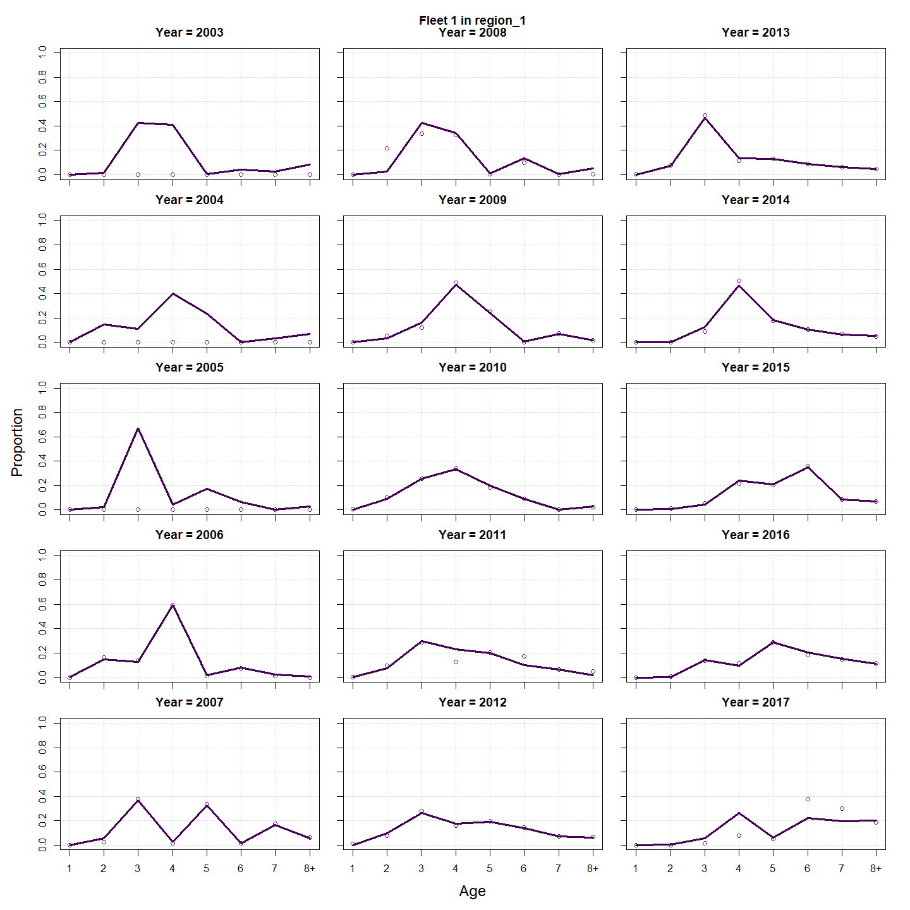
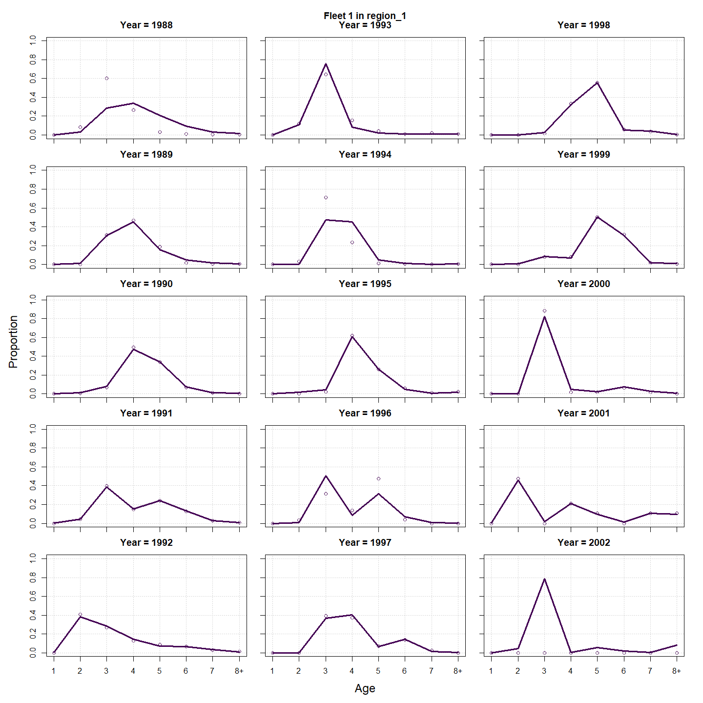
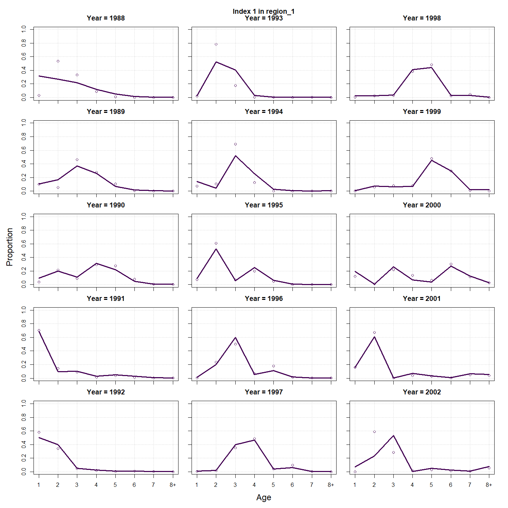
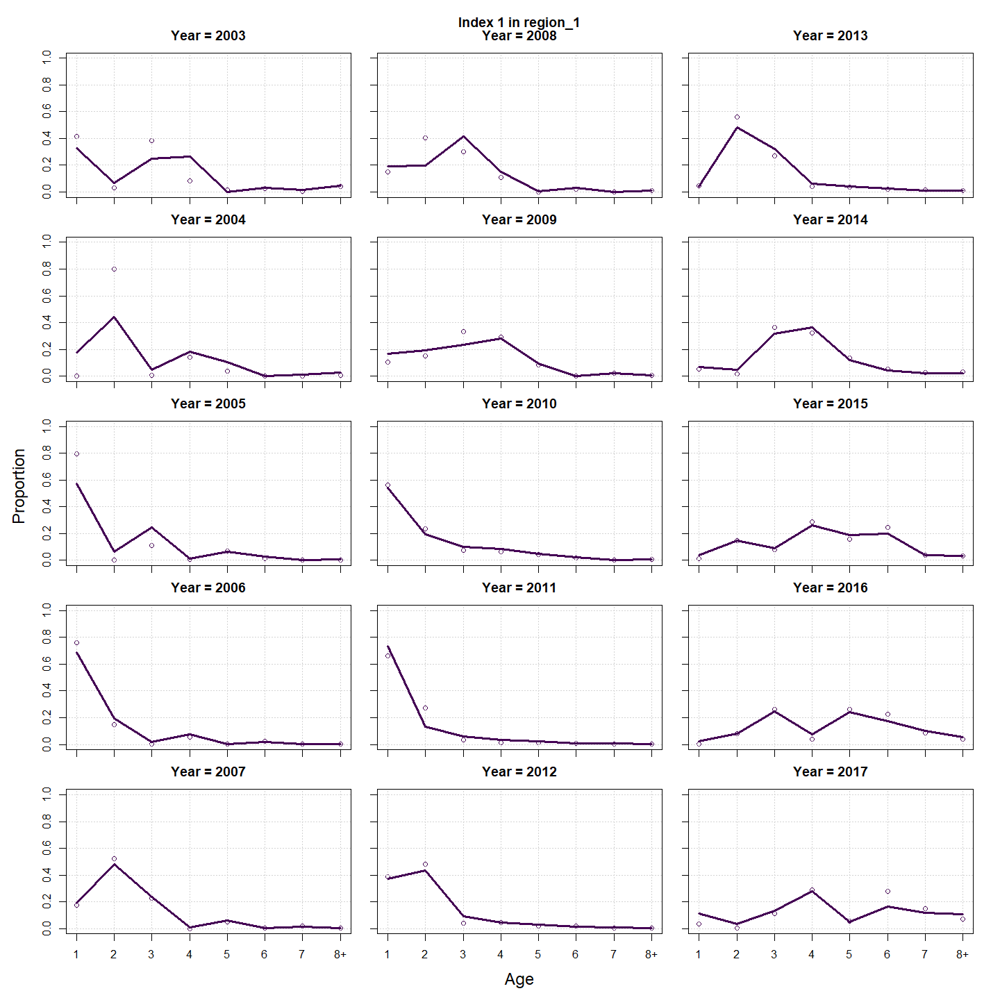
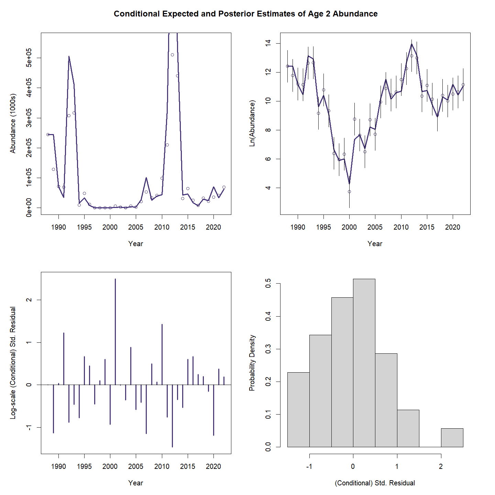
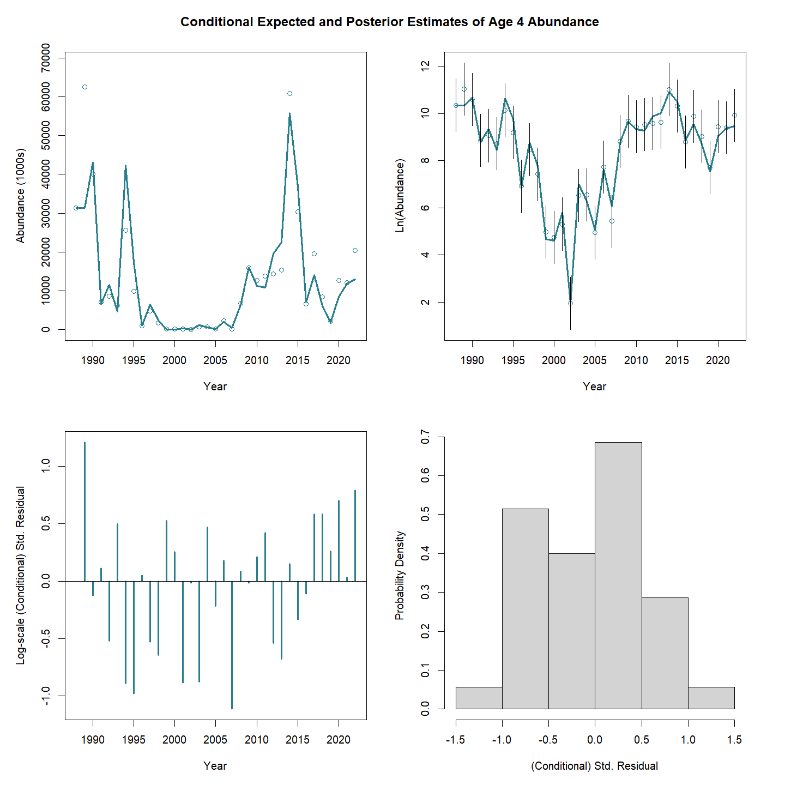
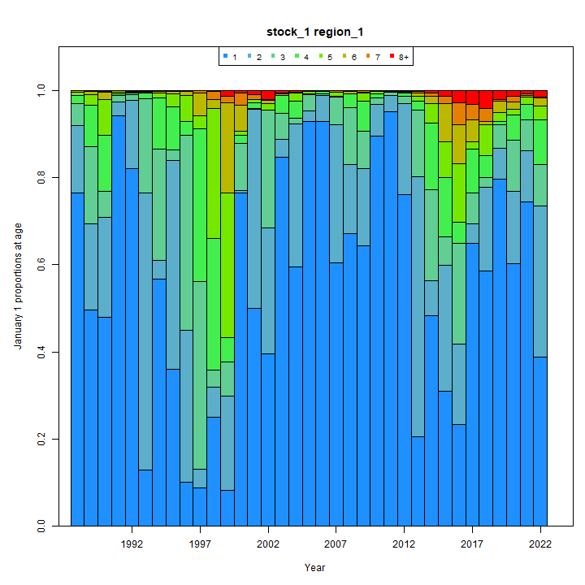
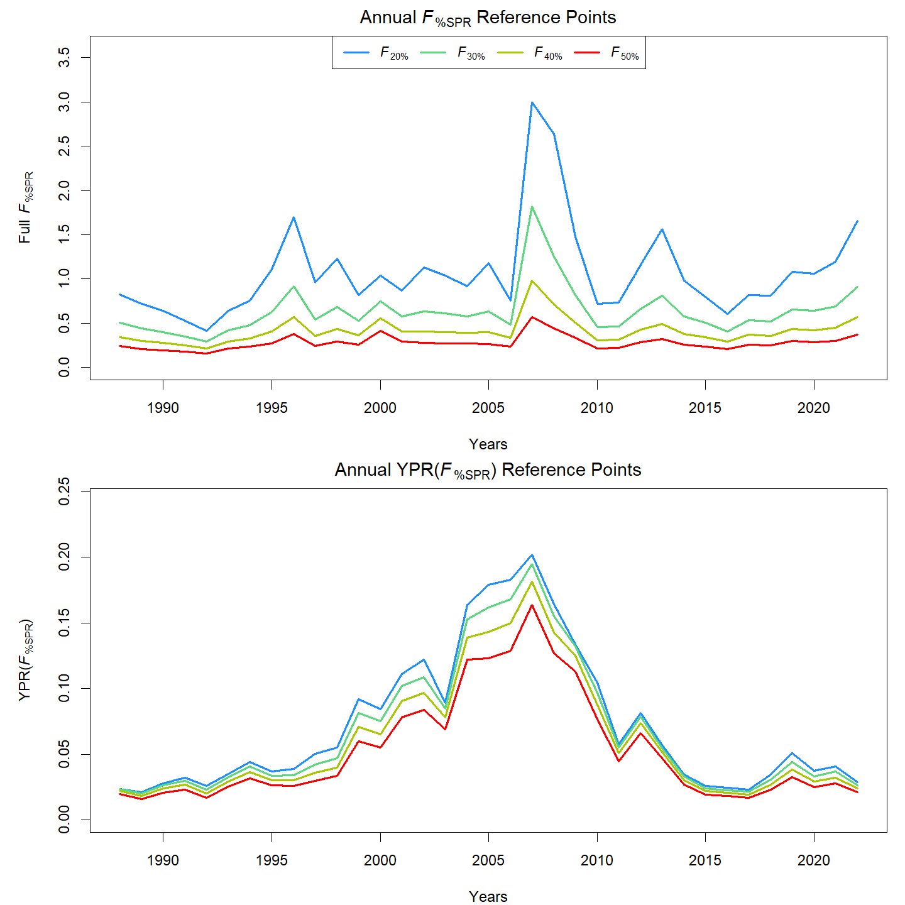
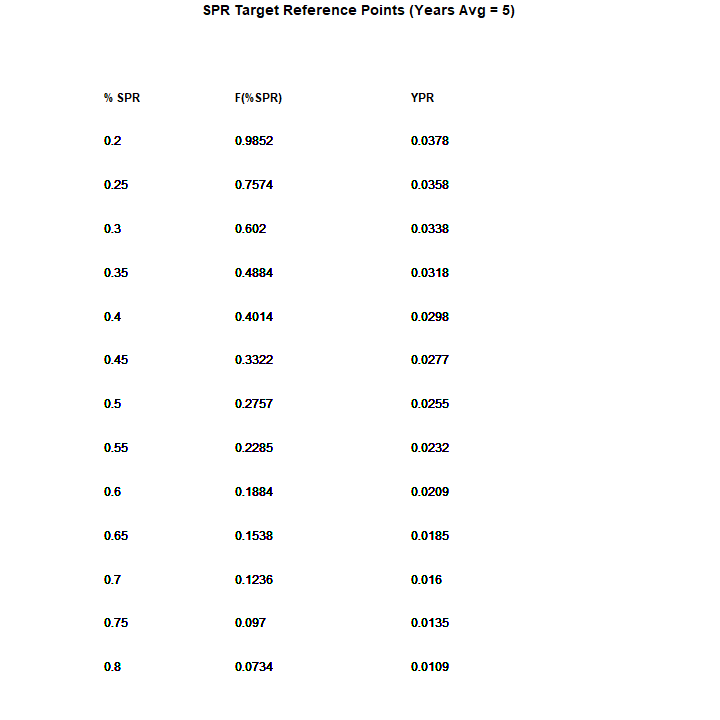
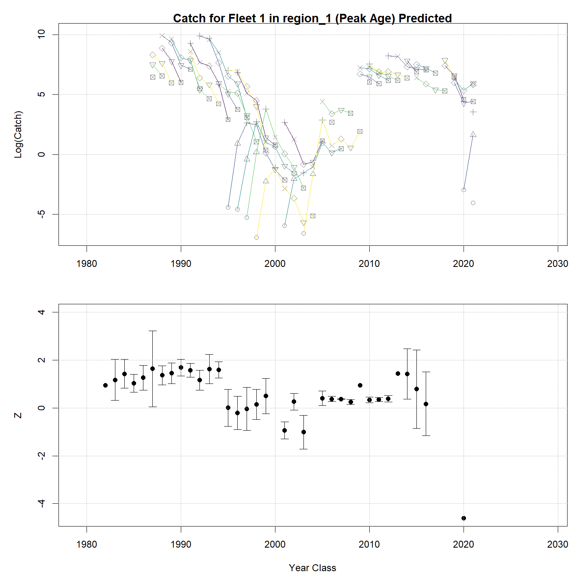

---
output:
  html_document:
    df_print: paged
    keep_md: yes
  word_document: default
  pdf_document:
    fig_caption: yes
    includes:
    keep_tex: yes
    number_sections: no
title: "WHAM figures and tables"
header-includes:
  - \usepackage{longtable}
  - \usepackage{booktabs}
  - \usepackage{caption,graphics}
  - \usepackage{makecell}
  - \usepackage{lscape}
  - \renewcommand\figurename{Fig.}
  - \captionsetup{labelsep=period, singlelinecheck=false}
  - \newcommand{\changesize}[1]{\fontsize{#1pt}{#1pt}\selectfont}
  - \renewcommand{\arraystretch}{1.5}
  - \renewcommand\theadfont{}
---

# {.tabset}

## Figures {.tabset}

### Input

### Diagnostics

### Results

### Retro

### Reference points

### Miscellaneous

## Tables {.tabset}

### Parameter estimates

<table class="table" style="margin-left: auto; margin-right: auto;">
<caption>Parameter estimates, standard errors, and confidence intervals. Rounded to 3 decimal places.</caption>
 <thead>
  <tr>
   <th style="text-align:left;">   </th>
   <th style="text-align:right;"> Estimate </th>
   <th style="text-align:right;"> Std. Error </th>
   <th style="text-align:right;"> 95\% CI lower </th>
   <th style="text-align:right;"> 95\% CI upper </th>
  </tr>
 </thead>
<tbody>
  <tr>
   <td style="text-align:left;"> Index 1 fully selected q </td>
   <td style="text-align:right;"> $2.418$ </td>
   <td style="text-align:right;"> -- </td>
   <td style="text-align:right;"> -- </td>
   <td style="text-align:right;"> -- </td>
  </tr>
  <tr>
   <td style="text-align:left;"> Block 1: Fleet 1 Mean Selectivity for age 1 </td>
   <td style="text-align:right;"> $1.049\times 10^{-5}$ </td>
   <td style="text-align:right;"> -- </td>
   <td style="text-align:right;"> -- </td>
   <td style="text-align:right;"> -- </td>
  </tr>
  <tr>
   <td style="text-align:left;"> Block 1: Fleet 1 Mean Selectivity for age 2 </td>
   <td style="text-align:right;"> $0.002$ </td>
   <td style="text-align:right;"> -- </td>
   <td style="text-align:right;"> -- </td>
   <td style="text-align:right;"> -- </td>
  </tr>
  <tr>
   <td style="text-align:left;"> Block 1: Fleet 1 Mean Selectivity for age 3 </td>
   <td style="text-align:right;"> $0.017$ </td>
   <td style="text-align:right;"> -- </td>
   <td style="text-align:right;"> -- </td>
   <td style="text-align:right;"> -- </td>
  </tr>
  <tr>
   <td style="text-align:left;"> Block 1: Fleet 1 Mean Selectivity for age 4 </td>
   <td style="text-align:right;"> $0.027$ </td>
   <td style="text-align:right;"> -- </td>
   <td style="text-align:right;"> -- </td>
   <td style="text-align:right;"> -- </td>
  </tr>
  <tr>
   <td style="text-align:left;"> Block 1: Fleet 1 Mean Selectivity for age 5 </td>
   <td style="text-align:right;"> $0.041$ </td>
   <td style="text-align:right;"> -- </td>
   <td style="text-align:right;"> -- </td>
   <td style="text-align:right;"> -- </td>
  </tr>
  <tr>
   <td style="text-align:left;"> Block 1: Fleet 1 Mean Selectivity for age 6 </td>
   <td style="text-align:right;"> $0.055$ </td>
   <td style="text-align:right;"> -- </td>
   <td style="text-align:right;"> -- </td>
   <td style="text-align:right;"> -- </td>
  </tr>
  <tr>
   <td style="text-align:left;"> Block 1: Fleet 1 Mean Selectivity for age 7 </td>
   <td style="text-align:right;"> $0.055$ </td>
   <td style="text-align:right;"> -- </td>
   <td style="text-align:right;"> -- </td>
   <td style="text-align:right;"> -- </td>
  </tr>
  <tr>
   <td style="text-align:left;"> Block 1: Fleet 1 Mean Selectivity for age 8+ </td>
   <td style="text-align:right;"> $0.037$ </td>
   <td style="text-align:right;"> -- </td>
   <td style="text-align:right;"> -- </td>
   <td style="text-align:right;"> -- </td>
  </tr>
  <tr>
   <td style="text-align:left;"> Block 2: Index 1 $a_{50}$ </td>
   <td style="text-align:right;"> $1.132$ </td>
   <td style="text-align:right;"> -- </td>
   <td style="text-align:right;"> -- </td>
   <td style="text-align:right;"> -- </td>
  </tr>
  <tr>
   <td style="text-align:left;"> Block 2: Index 1 1/slope (increasing) </td>
   <td style="text-align:right;"> $0.884$ </td>
   <td style="text-align:right;"> -- </td>
   <td style="text-align:right;"> -- </td>
   <td style="text-align:right;"> -- </td>
  </tr>
  <tr>
   <td style="text-align:left;"> Block 1: Fleet 1 Selectivity RE $\sigma$ </td>
   <td style="text-align:right;"> $0.880$ </td>
   <td style="text-align:right;"> -- </td>
   <td style="text-align:right;"> -- </td>
   <td style="text-align:right;"> -- </td>
  </tr>
  <tr>
   <td style="text-align:left;"> Block 1: Fleet 1 Selectivity RE AR1 $\rho$ (age) </td>
   <td style="text-align:right;"> $0.825$ </td>
   <td style="text-align:right;"> -- </td>
   <td style="text-align:right;"> -- </td>
   <td style="text-align:right;"> -- </td>
  </tr>
  <tr>
   <td style="text-align:left;"> Block 1: Fleet 1 Selectivity RE AR1 $\rho$ (year) </td>
   <td style="text-align:right;"> $0.493$ </td>
   <td style="text-align:right;"> -- </td>
   <td style="text-align:right;"> -- </td>
   <td style="text-align:right;"> -- </td>
  </tr>
</tbody>
</table>

### Abundance at age

<table class="table" style="margin-left: auto; margin-right: auto;">
<caption>Abundance at age (1000s) for stock 1 in region 1.</caption>
 <thead>
  <tr>
   <th style="text-align:left;">   </th>
   <th style="text-align:right;"> 1 </th>
   <th style="text-align:right;"> 2 </th>
   <th style="text-align:right;"> 3 </th>
   <th style="text-align:right;"> 4 </th>
   <th style="text-align:right;"> 5 </th>
   <th style="text-align:right;"> 6 </th>
   <th style="text-align:right;"> 7 </th>
   <th style="text-align:right;"> 8+ </th>
  </tr>
 </thead>
<tbody>
  <tr>
   <td style="text-align:left;"> 1988 </td>
   <td style="text-align:right;"> 65406 </td>
   <td style="text-align:right;"> 53526 </td>
   <td style="text-align:right;"> 39801 </td>
   <td style="text-align:right;"> 26143 </td>
   <td style="text-align:right;"> 12627 </td>
   <td style="text-align:right;"> 2631 </td>
   <td style="text-align:right;"> 392 </td>
   <td style="text-align:right;"> 125 </td>
  </tr>
  <tr>
   <td style="text-align:left;"> 1989 </td>
   <td style="text-align:right;"> 18557 </td>
   <td style="text-align:right;"> 53536 </td>
   <td style="text-align:right;"> 41368 </td>
   <td style="text-align:right;"> 28557 </td>
   <td style="text-align:right;"> 15602 </td>
   <td style="text-align:right;"> 4554 </td>
   <td style="text-align:right;"> 777 </td>
   <td style="text-align:right;"> 202 </td>
  </tr>
  <tr>
   <td style="text-align:left;"> 1990 </td>
   <td style="text-align:right;"> 16375 </td>
   <td style="text-align:right;"> 15115 </td>
   <td style="text-align:right;"> 9430 </td>
   <td style="text-align:right;"> 22410 </td>
   <td style="text-align:right;"> 15552 </td>
   <td style="text-align:right;"> 4297 </td>
   <td style="text-align:right;"> 825 </td>
   <td style="text-align:right;"> 273 </td>
  </tr>
  <tr>
   <td style="text-align:left;"> 1991 </td>
   <td style="text-align:right;"> 75349 </td>
   <td style="text-align:right;"> 13404 </td>
   <td style="text-align:right;"> 11728 </td>
   <td style="text-align:right;"> 5531 </td>
   <td style="text-align:right;"> 6615 </td>
   <td style="text-align:right;"> 3779 </td>
   <td style="text-align:right;"> 1128 </td>
   <td style="text-align:right;"> 376 </td>
  </tr>
  <tr>
   <td style="text-align:left;"> 1992 </td>
   <td style="text-align:right;"> 81998 </td>
   <td style="text-align:right;"> 61679 </td>
   <td style="text-align:right;"> 10445 </td>
   <td style="text-align:right;"> 5430 </td>
   <td style="text-align:right;"> 2757 </td>
   <td style="text-align:right;"> 2736 </td>
   <td style="text-align:right;"> 1571 </td>
   <td style="text-align:right;"> 764 </td>
  </tr>
  <tr>
   <td style="text-align:left;"> 1993 </td>
   <td style="text-align:right;"> 1482 </td>
   <td style="text-align:right;"> 67076 </td>
   <td style="text-align:right;"> 37323 </td>
   <td style="text-align:right;"> 1586 </td>
   <td style="text-align:right;"> 653 </td>
   <td style="text-align:right;"> 190 </td>
   <td style="text-align:right;"> 186 </td>
   <td style="text-align:right;"> 297 </td>
  </tr>
  <tr>
   <td style="text-align:left;"> 1994 </td>
   <td style="text-align:right;"> 7240 </td>
   <td style="text-align:right;"> 1213 </td>
   <td style="text-align:right;"> 46143 </td>
   <td style="text-align:right;"> 9410 </td>
   <td style="text-align:right;"> 738 </td>
   <td style="text-align:right;"> 303 </td>
   <td style="text-align:right;"> 79 </td>
   <td style="text-align:right;"> 246 </td>
  </tr>
  <tr>
   <td style="text-align:left;"> 1995 </td>
   <td style="text-align:right;"> 2704 </td>
   <td style="text-align:right;"> 5925 </td>
   <td style="text-align:right;"> 873 </td>
   <td style="text-align:right;"> 6206 </td>
   <td style="text-align:right;"> 2353 </td>
   <td style="text-align:right;"> 315 </td>
   <td style="text-align:right;"> 105 </td>
   <td style="text-align:right;"> 151 </td>
  </tr>
  <tr>
   <td style="text-align:left;"> 1996 </td>
   <td style="text-align:right;"> 100 </td>
   <td style="text-align:right;"> 2214 </td>
   <td style="text-align:right;"> 4777 </td>
   <td style="text-align:right;"> 430 </td>
   <td style="text-align:right;"> 857 </td>
   <td style="text-align:right;"> 158 </td>
   <td style="text-align:right;"> 10 </td>
   <td style="text-align:right;"> 13 </td>
  </tr>
  <tr>
   <td style="text-align:left;"> 1997 </td>
   <td style="text-align:right;"> 101 </td>
   <td style="text-align:right;"> 82 </td>
   <td style="text-align:right;"> 1764 </td>
   <td style="text-align:right;"> 1909 </td>
   <td style="text-align:right;"> 215 </td>
   <td style="text-align:right;"> 427 </td>
   <td style="text-align:right;"> 52 </td>
   <td style="text-align:right;"> 7 </td>
  </tr>
  <tr>
   <td style="text-align:left;"> 1998 </td>
   <td style="text-align:right;"> 189 </td>
   <td style="text-align:right;"> 83 </td>
   <td style="text-align:right;"> 65 </td>
   <td style="text-align:right;"> 578 </td>
   <td style="text-align:right;"> 597 </td>
   <td style="text-align:right;"> 44 </td>
   <td style="text-align:right;"> 40 </td>
   <td style="text-align:right;"> 5 </td>
  </tr>
  <tr>
   <td style="text-align:left;"> 1999 </td>
   <td style="text-align:right;"> 1 </td>
   <td style="text-align:right;"> 155 </td>
   <td style="text-align:right;"> 67 </td>
   <td style="text-align:right;"> 43 </td>
   <td style="text-align:right;"> 318 </td>
   <td style="text-align:right;"> 215 </td>
   <td style="text-align:right;"> 11 </td>
   <td style="text-align:right;"> 13 </td>
  </tr>
  <tr>
   <td style="text-align:left;"> 2000 </td>
   <td style="text-align:right;"> 592 </td>
   <td style="text-align:right;"> 1 </td>
   <td style="text-align:right;"> 126 </td>
   <td style="text-align:right;"> 42 </td>
   <td style="text-align:right;"> 25 </td>
   <td style="text-align:right;"> 178 </td>
   <td style="text-align:right;"> 121 </td>
   <td style="text-align:right;"> 16 </td>
  </tr>
  <tr>
   <td style="text-align:left;"> 2001 </td>
   <td style="text-align:right;"> 439 </td>
   <td style="text-align:right;"> 484 </td>
   <td style="text-align:right;"> 1 </td>
   <td style="text-align:right;"> 62 </td>
   <td style="text-align:right;"> 33 </td>
   <td style="text-align:right;"> 20 </td>
   <td style="text-align:right;"> 142 </td>
   <td style="text-align:right;"> 111 </td>
  </tr>
  <tr>
   <td style="text-align:left;"> 2002 </td>
   <td style="text-align:right;"> 42 </td>
   <td style="text-align:right;"> 359 </td>
   <td style="text-align:right;"> 388 </td>
   <td style="text-align:right;"> 1 </td>
   <td style="text-align:right;"> 47 </td>
   <td style="text-align:right;"> 25 </td>
   <td style="text-align:right;"> 16 </td>
   <td style="text-align:right;"> 204 </td>
  </tr>
  <tr>
   <td style="text-align:left;"> 2003 </td>
   <td style="text-align:right;"> 1463 </td>
   <td style="text-align:right;"> 35 </td>
   <td style="text-align:right;"> 293 </td>
   <td style="text-align:right;"> 308 </td>
   <td style="text-align:right;"> 0 </td>
   <td style="text-align:right;"> 37 </td>
   <td style="text-align:right;"> 20 </td>
   <td style="text-align:right;"> 178 </td>
  </tr>
  <tr>
   <td style="text-align:left;"> 2004 </td>
   <td style="text-align:right;"> 163 </td>
   <td style="text-align:right;"> 1198 </td>
   <td style="text-align:right;"> 28 </td>
   <td style="text-align:right;"> 237 </td>
   <td style="text-align:right;"> 249 </td>
   <td style="text-align:right;"> 0 </td>
   <td style="text-align:right;"> 30 </td>
   <td style="text-align:right;"> 161 </td>
  </tr>
  <tr>
   <td style="text-align:left;"> 2005 </td>
   <td style="text-align:right;"> 4891 </td>
   <td style="text-align:right;"> 134 </td>
   <td style="text-align:right;"> 980 </td>
   <td style="text-align:right;"> 23 </td>
   <td style="text-align:right;"> 194 </td>
   <td style="text-align:right;"> 204 </td>
   <td style="text-align:right;"> 0 </td>
   <td style="text-align:right;"> 156 </td>
  </tr>
  <tr>
   <td style="text-align:left;"> 2006 </td>
   <td style="text-align:right;"> 13849 </td>
   <td style="text-align:right;"> 4004 </td>
   <td style="text-align:right;"> 110 </td>
   <td style="text-align:right;"> 798 </td>
   <td style="text-align:right;"> 19 </td>
   <td style="text-align:right;"> 158 </td>
   <td style="text-align:right;"> 166 </td>
   <td style="text-align:right;"> 128 </td>
  </tr>
  <tr>
   <td style="text-align:left;"> 2007 </td>
   <td style="text-align:right;"> 10219 </td>
   <td style="text-align:right;"> 11338 </td>
   <td style="text-align:right;"> 3258 </td>
   <td style="text-align:right;"> 74 </td>
   <td style="text-align:right;"> 576 </td>
   <td style="text-align:right;"> 14 </td>
   <td style="text-align:right;"> 120 </td>
   <td style="text-align:right;"> 236 </td>
  </tr>
  <tr>
   <td style="text-align:left;"> 2008 </td>
   <td style="text-align:right;"> 10781 </td>
   <td style="text-align:right;"> 8367 </td>
   <td style="text-align:right;"> 9280 </td>
   <td style="text-align:right;"> 2637 </td>
   <td style="text-align:right;"> 59 </td>
   <td style="text-align:right;"> 445 </td>
   <td style="text-align:right;"> 10 </td>
   <td style="text-align:right;"> 274 </td>
  </tr>
  <tr>
   <td style="text-align:left;"> 2009 </td>
   <td style="text-align:right;"> 13798 </td>
   <td style="text-align:right;"> 8827 </td>
   <td style="text-align:right;"> 6839 </td>
   <td style="text-align:right;"> 7450 </td>
   <td style="text-align:right;"> 2069 </td>
   <td style="text-align:right;"> 45 </td>
   <td style="text-align:right;"> 326 </td>
   <td style="text-align:right;"> 220 </td>
  </tr>
  <tr>
   <td style="text-align:left;"> 2010 </td>
   <td style="text-align:right;"> 29061 </td>
   <td style="text-align:right;"> 11296 </td>
   <td style="text-align:right;"> 7209 </td>
   <td style="text-align:right;"> 5546 </td>
   <td style="text-align:right;"> 5909 </td>
   <td style="text-align:right;"> 1600 </td>
   <td style="text-align:right;"> 34 </td>
   <td style="text-align:right;"> 413 </td>
  </tr>
  <tr>
   <td style="text-align:left;"> 2011 </td>
   <td style="text-align:right;"> 42219 </td>
   <td style="text-align:right;"> 23784 </td>
   <td style="text-align:right;"> 8882 </td>
   <td style="text-align:right;"> 4957 </td>
   <td style="text-align:right;"> 3349 </td>
   <td style="text-align:right;"> 4053 </td>
   <td style="text-align:right;"> 974 </td>
   <td style="text-align:right;"> 283 </td>
  </tr>
  <tr>
   <td style="text-align:left;"> 2012 </td>
   <td style="text-align:right;"> 35581 </td>
   <td style="text-align:right;"> 34558 </td>
   <td style="text-align:right;"> 19042 </td>
   <td style="text-align:right;"> 6540 </td>
   <td style="text-align:right;"> 3503 </td>
   <td style="text-align:right;"> 2148 </td>
   <td style="text-align:right;"> 1700 </td>
   <td style="text-align:right;"> 665 </td>
  </tr>
  <tr>
   <td style="text-align:left;"> 2013 </td>
   <td style="text-align:right;"> 5085 </td>
   <td style="text-align:right;"> 29125 </td>
   <td style="text-align:right;"> 27909 </td>
   <td style="text-align:right;"> 14205 </td>
   <td style="text-align:right;"> 4635 </td>
   <td style="text-align:right;"> 2058 </td>
   <td style="text-align:right;"> 1122 </td>
   <td style="text-align:right;"> 1293 </td>
  </tr>
  <tr>
   <td style="text-align:left;"> 2014 </td>
   <td style="text-align:right;"> 15308 </td>
   <td style="text-align:right;"> 4162 </td>
   <td style="text-align:right;"> 23272 </td>
   <td style="text-align:right;"> 19216 </td>
   <td style="text-align:right;"> 10535 </td>
   <td style="text-align:right;"> 2933 </td>
   <td style="text-align:right;"> 1112 </td>
   <td style="text-align:right;"> 1273 </td>
  </tr>
  <tr>
   <td style="text-align:left;"> 2015 </td>
   <td style="text-align:right;"> 7611 </td>
   <td style="text-align:right;"> 12533 </td>
   <td style="text-align:right;"> 3388 </td>
   <td style="text-align:right;"> 18141 </td>
   <td style="text-align:right;"> 12137 </td>
   <td style="text-align:right;"> 7266 </td>
   <td style="text-align:right;"> 1667 </td>
   <td style="text-align:right;"> 1261 </td>
  </tr>
  <tr>
   <td style="text-align:left;"> 2016 </td>
   <td style="text-align:right;"> 2536 </td>
   <td style="text-align:right;"> 6231 </td>
   <td style="text-align:right;"> 10168 </td>
   <td style="text-align:right;"> 2497 </td>
   <td style="text-align:right;"> 13083 </td>
   <td style="text-align:right;"> 8422 </td>
   <td style="text-align:right;"> 3639 </td>
   <td style="text-align:right;"> 1456 </td>
  </tr>
  <tr>
   <td style="text-align:left;"> 2017 </td>
   <td style="text-align:right;"> 7825 </td>
   <td style="text-align:right;"> 2076 </td>
   <td style="text-align:right;"> 5059 </td>
   <td style="text-align:right;"> 7469 </td>
   <td style="text-align:right;"> 1461 </td>
   <td style="text-align:right;"> 8849 </td>
   <td style="text-align:right;"> 5616 </td>
   <td style="text-align:right;"> 2660 </td>
  </tr>
  <tr>
   <td style="text-align:left;"> 2018 </td>
   <td style="text-align:right;"> 6963 </td>
   <td style="text-align:right;"> 6407 </td>
   <td style="text-align:right;"> 1694 </td>
   <td style="text-align:right;"> 3994 </td>
   <td style="text-align:right;"> 5638 </td>
   <td style="text-align:right;"> 1020 </td>
   <td style="text-align:right;"> 5044 </td>
   <td style="text-align:right;"> 4403 </td>
  </tr>
  <tr>
   <td style="text-align:left;"> 2019 </td>
   <td style="text-align:right;"> 11212 </td>
   <td style="text-align:right;"> 5701 </td>
   <td style="text-align:right;"> 5233 </td>
   <td style="text-align:right;"> 1349 </td>
   <td style="text-align:right;"> 3124 </td>
   <td style="text-align:right;"> 4108 </td>
   <td style="text-align:right;"> 557 </td>
   <td style="text-align:right;"> 4872 </td>
  </tr>
  <tr>
   <td style="text-align:left;"> 2020 </td>
   <td style="text-align:right;"> 6703 </td>
   <td style="text-align:right;"> 9179 </td>
   <td style="text-align:right;"> 4642 </td>
   <td style="text-align:right;"> 3822 </td>
   <td style="text-align:right;"> 910 </td>
   <td style="text-align:right;"> 1312 </td>
   <td style="text-align:right;"> 1300 </td>
   <td style="text-align:right;"> 2238 </td>
  </tr>
  <tr>
   <td style="text-align:left;"> 2021 </td>
   <td style="text-align:right;"> 10677 </td>
   <td style="text-align:right;"> 5488 </td>
   <td style="text-align:right;"> 7506 </td>
   <td style="text-align:right;"> 3729 </td>
   <td style="text-align:right;"> 2677 </td>
   <td style="text-align:right;"> 415 </td>
   <td style="text-align:right;"> 463 </td>
   <td style="text-align:right;"> 1723 </td>
  </tr>
  <tr>
   <td style="text-align:left;"> 2022 </td>
   <td style="text-align:right;"> 3094 </td>
   <td style="text-align:right;"> 8741 </td>
   <td style="text-align:right;"> 4490 </td>
   <td style="text-align:right;"> 6095 </td>
   <td style="text-align:right;"> 2904 </td>
   <td style="text-align:right;"> 1959 </td>
   <td style="text-align:right;"> 288 </td>
   <td style="text-align:right;"> 1583 </td>
  </tr>
</tbody>
</table>

### Fishing mortality at age by region

<table class="table" style="margin-left: auto; margin-right: auto;">
<caption>Total fishing mortality at age in region 1.</caption>
 <thead>
  <tr>
   <th style="text-align:left;">   </th>
   <th style="text-align:right;"> 1 </th>
   <th style="text-align:right;"> 2 </th>
   <th style="text-align:right;"> 3 </th>
   <th style="text-align:right;"> 4 </th>
   <th style="text-align:right;"> 5 </th>
   <th style="text-align:right;"> 6 </th>
   <th style="text-align:right;"> 7 </th>
   <th style="text-align:right;"> 8+ </th>
  </tr>
 </thead>
<tbody>
  <tr>
   <td style="text-align:left;"> 1988 </td>
   <td style="text-align:right;"> 0.000 </td>
   <td style="text-align:right;"> 0.058 </td>
   <td style="text-align:right;"> 0.132 </td>
   <td style="text-align:right;"> 0.316 </td>
   <td style="text-align:right;"> 0.820 </td>
   <td style="text-align:right;"> 1.020 </td>
   <td style="text-align:right;"> 0.832 </td>
   <td style="text-align:right;"> 0.494 </td>
  </tr>
  <tr>
   <td style="text-align:left;"> 1989 </td>
   <td style="text-align:right;"> 0.005 </td>
   <td style="text-align:right;"> 1.536 </td>
   <td style="text-align:right;"> 0.413 </td>
   <td style="text-align:right;"> 0.408 </td>
   <td style="text-align:right;"> 1.089 </td>
   <td style="text-align:right;"> 1.508 </td>
   <td style="text-align:right;"> 1.199 </td>
   <td style="text-align:right;"> 0.707 </td>
  </tr>
  <tr>
   <td style="text-align:left;"> 1990 </td>
   <td style="text-align:right;"> 0.000 </td>
   <td style="text-align:right;"> 0.054 </td>
   <td style="text-align:right;"> 0.334 </td>
   <td style="text-align:right;"> 1.020 </td>
   <td style="text-align:right;"> 1.215 </td>
   <td style="text-align:right;"> 1.137 </td>
   <td style="text-align:right;"> 0.975 </td>
   <td style="text-align:right;"> 0.612 </td>
  </tr>
  <tr>
   <td style="text-align:left;"> 1991 </td>
   <td style="text-align:right;"> 0.000 </td>
   <td style="text-align:right;"> 0.049 </td>
   <td style="text-align:right;"> 0.570 </td>
   <td style="text-align:right;"> 0.496 </td>
   <td style="text-align:right;"> 0.683 </td>
   <td style="text-align:right;"> 0.678 </td>
   <td style="text-align:right;"> 0.527 </td>
   <td style="text-align:right;"> 0.343 </td>
  </tr>
  <tr>
   <td style="text-align:left;"> 1992 </td>
   <td style="text-align:right;"> 0.001 </td>
   <td style="text-align:right;"> 0.302 </td>
   <td style="text-align:right;"> 1.685 </td>
   <td style="text-align:right;"> 1.918 </td>
   <td style="text-align:right;"> 2.474 </td>
   <td style="text-align:right;"> 2.488 </td>
   <td style="text-align:right;"> 2.162 </td>
   <td style="text-align:right;"> 1.435 </td>
  </tr>
  <tr>
   <td style="text-align:left;"> 1993 </td>
   <td style="text-align:right;"> 0.001 </td>
   <td style="text-align:right;"> 0.174 </td>
   <td style="text-align:right;"> 1.178 </td>
   <td style="text-align:right;"> 0.566 </td>
   <td style="text-align:right;"> 0.569 </td>
   <td style="text-align:right;"> 0.682 </td>
   <td style="text-align:right;"> 0.616 </td>
   <td style="text-align:right;"> 0.394 </td>
  </tr>
  <tr>
   <td style="text-align:left;"> 1994 </td>
   <td style="text-align:right;"> 0.000 </td>
   <td style="text-align:right;"> 0.129 </td>
   <td style="text-align:right;"> 1.806 </td>
   <td style="text-align:right;"> 1.186 </td>
   <td style="text-align:right;"> 0.652 </td>
   <td style="text-align:right;"> 0.860 </td>
   <td style="text-align:right;"> 0.794 </td>
   <td style="text-align:right;"> 0.500 </td>
  </tr>
  <tr>
   <td style="text-align:left;"> 1995 </td>
   <td style="text-align:right;"> 0.000 </td>
   <td style="text-align:right;"> 0.015 </td>
   <td style="text-align:right;"> 0.509 </td>
   <td style="text-align:right;"> 1.780 </td>
   <td style="text-align:right;"> 2.502 </td>
   <td style="text-align:right;"> 3.231 </td>
   <td style="text-align:right;"> 3.217 </td>
   <td style="text-align:right;"> 2.513 </td>
  </tr>
  <tr>
   <td style="text-align:left;"> 1996 </td>
   <td style="text-align:right;"> 0.000 </td>
   <td style="text-align:right;"> 0.027 </td>
   <td style="text-align:right;"> 0.717 </td>
   <td style="text-align:right;"> 0.494 </td>
   <td style="text-align:right;"> 0.495 </td>
   <td style="text-align:right;"> 0.919 </td>
   <td style="text-align:right;"> 1.250 </td>
   <td style="text-align:right;"> 0.921 </td>
  </tr>
  <tr>
   <td style="text-align:left;"> 1997 </td>
   <td style="text-align:right;"> 0.000 </td>
   <td style="text-align:right;"> 0.037 </td>
   <td style="text-align:right;"> 0.917 </td>
   <td style="text-align:right;"> 0.962 </td>
   <td style="text-align:right;"> 1.396 </td>
   <td style="text-align:right;"> 2.165 </td>
   <td style="text-align:right;"> 2.442 </td>
   <td style="text-align:right;"> 1.584 </td>
  </tr>
  <tr>
   <td style="text-align:left;"> 1998 </td>
   <td style="text-align:right;"> 0.000 </td>
   <td style="text-align:right;"> 0.009 </td>
   <td style="text-align:right;"> 0.203 </td>
   <td style="text-align:right;"> 0.395 </td>
   <td style="text-align:right;"> 0.823 </td>
   <td style="text-align:right;"> 1.159 </td>
   <td style="text-align:right;"> 1.086 </td>
   <td style="text-align:right;"> 0.639 </td>
  </tr>
  <tr>
   <td style="text-align:left;"> 1999 </td>
   <td style="text-align:right;"> 0.000 </td>
   <td style="text-align:right;"> 0.009 </td>
   <td style="text-align:right;"> 0.261 </td>
   <td style="text-align:right;"> 0.342 </td>
   <td style="text-align:right;"> 0.381 </td>
   <td style="text-align:right;"> 0.371 </td>
   <td style="text-align:right;"> 0.268 </td>
   <td style="text-align:right;"> 0.144 </td>
  </tr>
  <tr>
   <td style="text-align:left;"> 2000 </td>
   <td style="text-align:right;"> 0.000 </td>
   <td style="text-align:right;"> 0.029 </td>
   <td style="text-align:right;"> 0.512 </td>
   <td style="text-align:right;"> 0.061 </td>
   <td style="text-align:right;"> 0.048 </td>
   <td style="text-align:right;"> 0.024 </td>
   <td style="text-align:right;"> 0.014 </td>
   <td style="text-align:right;"> 0.012 </td>
  </tr>
  <tr>
   <td style="text-align:left;"> 2001 </td>
   <td style="text-align:right;"> 0.000 </td>
   <td style="text-align:right;"> 0.022 </td>
   <td style="text-align:right;"> 0.175 </td>
   <td style="text-align:right;"> 0.078 </td>
   <td style="text-align:right;"> 0.067 </td>
   <td style="text-align:right;"> 0.018 </td>
   <td style="text-align:right;"> 0.017 </td>
   <td style="text-align:right;"> 0.020 </td>
  </tr>
  <tr>
   <td style="text-align:left;"> 2002 </td>
   <td style="text-align:right;"> 0.000 </td>
   <td style="text-align:right;"> 0.004 </td>
   <td style="text-align:right;"> 0.032 </td>
   <td style="text-align:right;"> 0.024 </td>
   <td style="text-align:right;"> 0.026 </td>
   <td style="text-align:right;"> 0.015 </td>
   <td style="text-align:right;"> 0.014 </td>
   <td style="text-align:right;"> 0.012 </td>
  </tr>
  <tr>
   <td style="text-align:left;"> 2003 </td>
   <td style="text-align:right;"> 0.000 </td>
   <td style="text-align:right;"> 0.001 </td>
   <td style="text-align:right;"> 0.011 </td>
   <td style="text-align:right;"> 0.010 </td>
   <td style="text-align:right;"> 0.011 </td>
   <td style="text-align:right;"> 0.010 </td>
   <td style="text-align:right;"> 0.009 </td>
   <td style="text-align:right;"> 0.007 </td>
  </tr>
  <tr>
   <td style="text-align:left;"> 2004 </td>
   <td style="text-align:right;"> 0.000 </td>
   <td style="text-align:right;"> 0.000 </td>
   <td style="text-align:right;"> 0.003 </td>
   <td style="text-align:right;"> 0.002 </td>
   <td style="text-align:right;"> 0.002 </td>
   <td style="text-align:right;"> 0.002 </td>
   <td style="text-align:right;"> 0.002 </td>
   <td style="text-align:right;"> 0.001 </td>
  </tr>
  <tr>
   <td style="text-align:left;"> 2005 </td>
   <td style="text-align:right;"> 0.000 </td>
   <td style="text-align:right;"> 0.001 </td>
   <td style="text-align:right;"> 0.006 </td>
   <td style="text-align:right;"> 0.005 </td>
   <td style="text-align:right;"> 0.005 </td>
   <td style="text-align:right;"> 0.005 </td>
   <td style="text-align:right;"> 0.004 </td>
   <td style="text-align:right;"> 0.002 </td>
  </tr>
  <tr>
   <td style="text-align:left;"> 2006 </td>
   <td style="text-align:right;"> 0.000 </td>
   <td style="text-align:right;"> 0.006 </td>
   <td style="text-align:right;"> 0.193 </td>
   <td style="text-align:right;"> 0.126 </td>
   <td style="text-align:right;"> 0.112 </td>
   <td style="text-align:right;"> 0.071 </td>
   <td style="text-align:right;"> 0.026 </td>
   <td style="text-align:right;"> 0.008 </td>
  </tr>
  <tr>
   <td style="text-align:left;"> 2007 </td>
   <td style="text-align:right;"> 0.000 </td>
   <td style="text-align:right;"> 0.000 </td>
   <td style="text-align:right;"> 0.011 </td>
   <td style="text-align:right;"> 0.022 </td>
   <td style="text-align:right;"> 0.058 </td>
   <td style="text-align:right;"> 0.098 </td>
   <td style="text-align:right;"> 0.134 </td>
   <td style="text-align:right;"> 0.029 </td>
  </tr>
  <tr>
   <td style="text-align:left;"> 2008 </td>
   <td style="text-align:right;"> 0.000 </td>
   <td style="text-align:right;"> 0.002 </td>
   <td style="text-align:right;"> 0.020 </td>
   <td style="text-align:right;"> 0.043 </td>
   <td style="text-align:right;"> 0.083 </td>
   <td style="text-align:right;"> 0.109 </td>
   <td style="text-align:right;"> 0.146 </td>
   <td style="text-align:right;"> 0.055 </td>
  </tr>
  <tr>
   <td style="text-align:left;"> 2009 </td>
   <td style="text-align:right;"> 0.000 </td>
   <td style="text-align:right;"> 0.003 </td>
   <td style="text-align:right;"> 0.010 </td>
   <td style="text-align:right;"> 0.032 </td>
   <td style="text-align:right;"> 0.057 </td>
   <td style="text-align:right;"> 0.070 </td>
   <td style="text-align:right;"> 0.102 </td>
   <td style="text-align:right;"> 0.048 </td>
  </tr>
  <tr>
   <td style="text-align:left;"> 2010 </td>
   <td style="text-align:right;"> 0.000 </td>
   <td style="text-align:right;"> 0.040 </td>
   <td style="text-align:right;"> 0.174 </td>
   <td style="text-align:right;"> 0.304 </td>
   <td style="text-align:right;"> 0.177 </td>
   <td style="text-align:right;"> 0.297 </td>
   <td style="text-align:right;"> 0.315 </td>
   <td style="text-align:right;"> 0.251 </td>
  </tr>
  <tr>
   <td style="text-align:left;"> 2011 </td>
   <td style="text-align:right;"> 0.000 </td>
   <td style="text-align:right;"> 0.022 </td>
   <td style="text-align:right;"> 0.106 </td>
   <td style="text-align:right;"> 0.147 </td>
   <td style="text-align:right;"> 0.244 </td>
   <td style="text-align:right;"> 0.669 </td>
   <td style="text-align:right;"> 0.442 </td>
   <td style="text-align:right;"> 0.420 </td>
  </tr>
  <tr>
   <td style="text-align:left;"> 2012 </td>
   <td style="text-align:right;"> 0.000 </td>
   <td style="text-align:right;"> 0.014 </td>
   <td style="text-align:right;"> 0.093 </td>
   <td style="text-align:right;"> 0.144 </td>
   <td style="text-align:right;"> 0.332 </td>
   <td style="text-align:right;"> 0.449 </td>
   <td style="text-align:right;"> 0.344 </td>
   <td style="text-align:right;"> 0.573 </td>
  </tr>
  <tr>
   <td style="text-align:left;"> 2013 </td>
   <td style="text-align:right;"> 0.000 </td>
   <td style="text-align:right;"> 0.024 </td>
   <td style="text-align:right;"> 0.173 </td>
   <td style="text-align:right;"> 0.099 </td>
   <td style="text-align:right;"> 0.257 </td>
   <td style="text-align:right;"> 0.416 </td>
   <td style="text-align:right;"> 0.496 </td>
   <td style="text-align:right;"> 0.395 </td>
  </tr>
  <tr>
   <td style="text-align:left;"> 2014 </td>
   <td style="text-align:right;"> 0.000 </td>
   <td style="text-align:right;"> 0.006 </td>
   <td style="text-align:right;"> 0.049 </td>
   <td style="text-align:right;"> 0.259 </td>
   <td style="text-align:right;"> 0.172 </td>
   <td style="text-align:right;"> 0.365 </td>
   <td style="text-align:right;"> 0.520 </td>
   <td style="text-align:right;"> 0.369 </td>
  </tr>
  <tr>
   <td style="text-align:left;"> 2015 </td>
   <td style="text-align:right;"> 0.000 </td>
   <td style="text-align:right;"> 0.009 </td>
   <td style="text-align:right;"> 0.105 </td>
   <td style="text-align:right;"> 0.127 </td>
   <td style="text-align:right;"> 0.165 </td>
   <td style="text-align:right;"> 0.491 </td>
   <td style="text-align:right;"> 0.510 </td>
   <td style="text-align:right;"> 0.483 </td>
  </tr>
  <tr>
   <td style="text-align:left;"> 2016 </td>
   <td style="text-align:right;"> 0.000 </td>
   <td style="text-align:right;"> 0.008 </td>
   <td style="text-align:right;"> 0.109 </td>
   <td style="text-align:right;"> 0.336 </td>
   <td style="text-align:right;"> 0.191 </td>
   <td style="text-align:right;"> 0.205 </td>
   <td style="text-align:right;"> 0.381 </td>
   <td style="text-align:right;"> 0.647 </td>
  </tr>
  <tr>
   <td style="text-align:left;"> 2017 </td>
   <td style="text-align:right;"> 0.000 </td>
   <td style="text-align:right;"> 0.003 </td>
   <td style="text-align:right;"> 0.036 </td>
   <td style="text-align:right;"> 0.081 </td>
   <td style="text-align:right;"> 0.160 </td>
   <td style="text-align:right;"> 0.362 </td>
   <td style="text-align:right;"> 0.461 </td>
   <td style="text-align:right;"> 0.370 </td>
  </tr>
  <tr>
   <td style="text-align:left;"> 2018 </td>
   <td style="text-align:right;"> 0.000 </td>
   <td style="text-align:right;"> 0.002 </td>
   <td style="text-align:right;"> 0.028 </td>
   <td style="text-align:right;"> 0.046 </td>
   <td style="text-align:right;"> 0.116 </td>
   <td style="text-align:right;"> 0.405 </td>
   <td style="text-align:right;"> 0.533 </td>
   <td style="text-align:right;"> 0.387 </td>
  </tr>
  <tr>
   <td style="text-align:left;"> 2019 </td>
   <td style="text-align:right;"> 0.000 </td>
   <td style="text-align:right;"> 0.005 </td>
   <td style="text-align:right;"> 0.114 </td>
   <td style="text-align:right;"> 0.194 </td>
   <td style="text-align:right;"> 0.668 </td>
   <td style="text-align:right;"> 0.950 </td>
   <td style="text-align:right;"> 0.813 </td>
   <td style="text-align:right;"> 0.673 </td>
  </tr>
  <tr>
   <td style="text-align:left;"> 2020 </td>
   <td style="text-align:right;"> 0.000 </td>
   <td style="text-align:right;"> 0.001 </td>
   <td style="text-align:right;"> 0.019 </td>
   <td style="text-align:right;"> 0.156 </td>
   <td style="text-align:right;"> 0.586 </td>
   <td style="text-align:right;"> 0.841 </td>
   <td style="text-align:right;"> 0.699 </td>
   <td style="text-align:right;"> 0.429 </td>
  </tr>
  <tr>
   <td style="text-align:left;"> 2021 </td>
   <td style="text-align:right;"> 0.000 </td>
   <td style="text-align:right;"> 0.001 </td>
   <td style="text-align:right;"> 0.008 </td>
   <td style="text-align:right;"> 0.050 </td>
   <td style="text-align:right;"> 0.112 </td>
   <td style="text-align:right;"> 0.166 </td>
   <td style="text-align:right;"> 0.166 </td>
   <td style="text-align:right;"> 0.111 </td>
  </tr>
  <tr>
   <td style="text-align:left;"> 2022 </td>
   <td style="text-align:right;"> 0.000 </td>
   <td style="text-align:right;"> 0.001 </td>
   <td style="text-align:right;"> 0.006 </td>
   <td style="text-align:right;"> 0.071 </td>
   <td style="text-align:right;"> 0.132 </td>
   <td style="text-align:right;"> 0.248 </td>
   <td style="text-align:right;"> 0.353 </td>
   <td style="text-align:right;"> 0.292 </td>
  </tr>
</tbody>
</table>

### Fishing mortality at age by fleet

<table class="table" style="margin-left: auto; margin-right: auto;">
<caption>Total fishing mortality at age in Fleet 1.</caption>
 <thead>
  <tr>
   <th style="text-align:left;">   </th>
   <th style="text-align:right;"> 1 </th>
   <th style="text-align:right;"> 2 </th>
   <th style="text-align:right;"> 3 </th>
   <th style="text-align:right;"> 4 </th>
   <th style="text-align:right;"> 5 </th>
   <th style="text-align:right;"> 6 </th>
   <th style="text-align:right;"> 7 </th>
   <th style="text-align:right;"> 8+ </th>
  </tr>
 </thead>
<tbody>
  <tr>
   <td style="text-align:left;"> 1988 </td>
   <td style="text-align:right;"> 0.000 </td>
   <td style="text-align:right;"> 0.058 </td>
   <td style="text-align:right;"> 0.132 </td>
   <td style="text-align:right;"> 0.316 </td>
   <td style="text-align:right;"> 0.820 </td>
   <td style="text-align:right;"> 1.020 </td>
   <td style="text-align:right;"> 0.832 </td>
   <td style="text-align:right;"> 0.494 </td>
  </tr>
  <tr>
   <td style="text-align:left;"> 1989 </td>
   <td style="text-align:right;"> 0.005 </td>
   <td style="text-align:right;"> 1.536 </td>
   <td style="text-align:right;"> 0.413 </td>
   <td style="text-align:right;"> 0.408 </td>
   <td style="text-align:right;"> 1.089 </td>
   <td style="text-align:right;"> 1.508 </td>
   <td style="text-align:right;"> 1.199 </td>
   <td style="text-align:right;"> 0.707 </td>
  </tr>
  <tr>
   <td style="text-align:left;"> 1990 </td>
   <td style="text-align:right;"> 0.000 </td>
   <td style="text-align:right;"> 0.054 </td>
   <td style="text-align:right;"> 0.334 </td>
   <td style="text-align:right;"> 1.020 </td>
   <td style="text-align:right;"> 1.215 </td>
   <td style="text-align:right;"> 1.137 </td>
   <td style="text-align:right;"> 0.975 </td>
   <td style="text-align:right;"> 0.612 </td>
  </tr>
  <tr>
   <td style="text-align:left;"> 1991 </td>
   <td style="text-align:right;"> 0.000 </td>
   <td style="text-align:right;"> 0.049 </td>
   <td style="text-align:right;"> 0.570 </td>
   <td style="text-align:right;"> 0.496 </td>
   <td style="text-align:right;"> 0.683 </td>
   <td style="text-align:right;"> 0.678 </td>
   <td style="text-align:right;"> 0.527 </td>
   <td style="text-align:right;"> 0.343 </td>
  </tr>
  <tr>
   <td style="text-align:left;"> 1992 </td>
   <td style="text-align:right;"> 0.001 </td>
   <td style="text-align:right;"> 0.302 </td>
   <td style="text-align:right;"> 1.685 </td>
   <td style="text-align:right;"> 1.918 </td>
   <td style="text-align:right;"> 2.474 </td>
   <td style="text-align:right;"> 2.488 </td>
   <td style="text-align:right;"> 2.162 </td>
   <td style="text-align:right;"> 1.435 </td>
  </tr>
  <tr>
   <td style="text-align:left;"> 1993 </td>
   <td style="text-align:right;"> 0.001 </td>
   <td style="text-align:right;"> 0.174 </td>
   <td style="text-align:right;"> 1.178 </td>
   <td style="text-align:right;"> 0.566 </td>
   <td style="text-align:right;"> 0.569 </td>
   <td style="text-align:right;"> 0.682 </td>
   <td style="text-align:right;"> 0.616 </td>
   <td style="text-align:right;"> 0.394 </td>
  </tr>
  <tr>
   <td style="text-align:left;"> 1994 </td>
   <td style="text-align:right;"> 0.000 </td>
   <td style="text-align:right;"> 0.129 </td>
   <td style="text-align:right;"> 1.806 </td>
   <td style="text-align:right;"> 1.186 </td>
   <td style="text-align:right;"> 0.652 </td>
   <td style="text-align:right;"> 0.860 </td>
   <td style="text-align:right;"> 0.794 </td>
   <td style="text-align:right;"> 0.500 </td>
  </tr>
  <tr>
   <td style="text-align:left;"> 1995 </td>
   <td style="text-align:right;"> 0.000 </td>
   <td style="text-align:right;"> 0.015 </td>
   <td style="text-align:right;"> 0.509 </td>
   <td style="text-align:right;"> 1.780 </td>
   <td style="text-align:right;"> 2.502 </td>
   <td style="text-align:right;"> 3.231 </td>
   <td style="text-align:right;"> 3.217 </td>
   <td style="text-align:right;"> 2.513 </td>
  </tr>
  <tr>
   <td style="text-align:left;"> 1996 </td>
   <td style="text-align:right;"> 0.000 </td>
   <td style="text-align:right;"> 0.027 </td>
   <td style="text-align:right;"> 0.717 </td>
   <td style="text-align:right;"> 0.494 </td>
   <td style="text-align:right;"> 0.495 </td>
   <td style="text-align:right;"> 0.919 </td>
   <td style="text-align:right;"> 1.250 </td>
   <td style="text-align:right;"> 0.921 </td>
  </tr>
  <tr>
   <td style="text-align:left;"> 1997 </td>
   <td style="text-align:right;"> 0.000 </td>
   <td style="text-align:right;"> 0.037 </td>
   <td style="text-align:right;"> 0.917 </td>
   <td style="text-align:right;"> 0.962 </td>
   <td style="text-align:right;"> 1.396 </td>
   <td style="text-align:right;"> 2.165 </td>
   <td style="text-align:right;"> 2.442 </td>
   <td style="text-align:right;"> 1.584 </td>
  </tr>
  <tr>
   <td style="text-align:left;"> 1998 </td>
   <td style="text-align:right;"> 0.000 </td>
   <td style="text-align:right;"> 0.009 </td>
   <td style="text-align:right;"> 0.203 </td>
   <td style="text-align:right;"> 0.395 </td>
   <td style="text-align:right;"> 0.823 </td>
   <td style="text-align:right;"> 1.159 </td>
   <td style="text-align:right;"> 1.086 </td>
   <td style="text-align:right;"> 0.639 </td>
  </tr>
  <tr>
   <td style="text-align:left;"> 1999 </td>
   <td style="text-align:right;"> 0.000 </td>
   <td style="text-align:right;"> 0.009 </td>
   <td style="text-align:right;"> 0.261 </td>
   <td style="text-align:right;"> 0.342 </td>
   <td style="text-align:right;"> 0.381 </td>
   <td style="text-align:right;"> 0.371 </td>
   <td style="text-align:right;"> 0.268 </td>
   <td style="text-align:right;"> 0.144 </td>
  </tr>
  <tr>
   <td style="text-align:left;"> 2000 </td>
   <td style="text-align:right;"> 0.000 </td>
   <td style="text-align:right;"> 0.029 </td>
   <td style="text-align:right;"> 0.512 </td>
   <td style="text-align:right;"> 0.061 </td>
   <td style="text-align:right;"> 0.048 </td>
   <td style="text-align:right;"> 0.024 </td>
   <td style="text-align:right;"> 0.014 </td>
   <td style="text-align:right;"> 0.012 </td>
  </tr>
  <tr>
   <td style="text-align:left;"> 2001 </td>
   <td style="text-align:right;"> 0.000 </td>
   <td style="text-align:right;"> 0.022 </td>
   <td style="text-align:right;"> 0.175 </td>
   <td style="text-align:right;"> 0.078 </td>
   <td style="text-align:right;"> 0.067 </td>
   <td style="text-align:right;"> 0.018 </td>
   <td style="text-align:right;"> 0.017 </td>
   <td style="text-align:right;"> 0.020 </td>
  </tr>
  <tr>
   <td style="text-align:left;"> 2002 </td>
   <td style="text-align:right;"> 0.000 </td>
   <td style="text-align:right;"> 0.004 </td>
   <td style="text-align:right;"> 0.032 </td>
   <td style="text-align:right;"> 0.024 </td>
   <td style="text-align:right;"> 0.026 </td>
   <td style="text-align:right;"> 0.015 </td>
   <td style="text-align:right;"> 0.014 </td>
   <td style="text-align:right;"> 0.012 </td>
  </tr>
  <tr>
   <td style="text-align:left;"> 2003 </td>
   <td style="text-align:right;"> 0.000 </td>
   <td style="text-align:right;"> 0.001 </td>
   <td style="text-align:right;"> 0.011 </td>
   <td style="text-align:right;"> 0.010 </td>
   <td style="text-align:right;"> 0.011 </td>
   <td style="text-align:right;"> 0.010 </td>
   <td style="text-align:right;"> 0.009 </td>
   <td style="text-align:right;"> 0.007 </td>
  </tr>
  <tr>
   <td style="text-align:left;"> 2004 </td>
   <td style="text-align:right;"> 0.000 </td>
   <td style="text-align:right;"> 0.000 </td>
   <td style="text-align:right;"> 0.003 </td>
   <td style="text-align:right;"> 0.002 </td>
   <td style="text-align:right;"> 0.002 </td>
   <td style="text-align:right;"> 0.002 </td>
   <td style="text-align:right;"> 0.002 </td>
   <td style="text-align:right;"> 0.001 </td>
  </tr>
  <tr>
   <td style="text-align:left;"> 2005 </td>
   <td style="text-align:right;"> 0.000 </td>
   <td style="text-align:right;"> 0.001 </td>
   <td style="text-align:right;"> 0.006 </td>
   <td style="text-align:right;"> 0.005 </td>
   <td style="text-align:right;"> 0.005 </td>
   <td style="text-align:right;"> 0.005 </td>
   <td style="text-align:right;"> 0.004 </td>
   <td style="text-align:right;"> 0.002 </td>
  </tr>
  <tr>
   <td style="text-align:left;"> 2006 </td>
   <td style="text-align:right;"> 0.000 </td>
   <td style="text-align:right;"> 0.006 </td>
   <td style="text-align:right;"> 0.193 </td>
   <td style="text-align:right;"> 0.126 </td>
   <td style="text-align:right;"> 0.112 </td>
   <td style="text-align:right;"> 0.071 </td>
   <td style="text-align:right;"> 0.026 </td>
   <td style="text-align:right;"> 0.008 </td>
  </tr>
  <tr>
   <td style="text-align:left;"> 2007 </td>
   <td style="text-align:right;"> 0.000 </td>
   <td style="text-align:right;"> 0.000 </td>
   <td style="text-align:right;"> 0.011 </td>
   <td style="text-align:right;"> 0.022 </td>
   <td style="text-align:right;"> 0.058 </td>
   <td style="text-align:right;"> 0.098 </td>
   <td style="text-align:right;"> 0.134 </td>
   <td style="text-align:right;"> 0.029 </td>
  </tr>
  <tr>
   <td style="text-align:left;"> 2008 </td>
   <td style="text-align:right;"> 0.000 </td>
   <td style="text-align:right;"> 0.002 </td>
   <td style="text-align:right;"> 0.020 </td>
   <td style="text-align:right;"> 0.043 </td>
   <td style="text-align:right;"> 0.083 </td>
   <td style="text-align:right;"> 0.109 </td>
   <td style="text-align:right;"> 0.146 </td>
   <td style="text-align:right;"> 0.055 </td>
  </tr>
  <tr>
   <td style="text-align:left;"> 2009 </td>
   <td style="text-align:right;"> 0.000 </td>
   <td style="text-align:right;"> 0.003 </td>
   <td style="text-align:right;"> 0.010 </td>
   <td style="text-align:right;"> 0.032 </td>
   <td style="text-align:right;"> 0.057 </td>
   <td style="text-align:right;"> 0.070 </td>
   <td style="text-align:right;"> 0.102 </td>
   <td style="text-align:right;"> 0.048 </td>
  </tr>
  <tr>
   <td style="text-align:left;"> 2010 </td>
   <td style="text-align:right;"> 0.000 </td>
   <td style="text-align:right;"> 0.040 </td>
   <td style="text-align:right;"> 0.174 </td>
   <td style="text-align:right;"> 0.304 </td>
   <td style="text-align:right;"> 0.177 </td>
   <td style="text-align:right;"> 0.297 </td>
   <td style="text-align:right;"> 0.315 </td>
   <td style="text-align:right;"> 0.251 </td>
  </tr>
  <tr>
   <td style="text-align:left;"> 2011 </td>
   <td style="text-align:right;"> 0.000 </td>
   <td style="text-align:right;"> 0.022 </td>
   <td style="text-align:right;"> 0.106 </td>
   <td style="text-align:right;"> 0.147 </td>
   <td style="text-align:right;"> 0.244 </td>
   <td style="text-align:right;"> 0.669 </td>
   <td style="text-align:right;"> 0.442 </td>
   <td style="text-align:right;"> 0.420 </td>
  </tr>
  <tr>
   <td style="text-align:left;"> 2012 </td>
   <td style="text-align:right;"> 0.000 </td>
   <td style="text-align:right;"> 0.014 </td>
   <td style="text-align:right;"> 0.093 </td>
   <td style="text-align:right;"> 0.144 </td>
   <td style="text-align:right;"> 0.332 </td>
   <td style="text-align:right;"> 0.449 </td>
   <td style="text-align:right;"> 0.344 </td>
   <td style="text-align:right;"> 0.573 </td>
  </tr>
  <tr>
   <td style="text-align:left;"> 2013 </td>
   <td style="text-align:right;"> 0.000 </td>
   <td style="text-align:right;"> 0.024 </td>
   <td style="text-align:right;"> 0.173 </td>
   <td style="text-align:right;"> 0.099 </td>
   <td style="text-align:right;"> 0.257 </td>
   <td style="text-align:right;"> 0.416 </td>
   <td style="text-align:right;"> 0.496 </td>
   <td style="text-align:right;"> 0.395 </td>
  </tr>
  <tr>
   <td style="text-align:left;"> 2014 </td>
   <td style="text-align:right;"> 0.000 </td>
   <td style="text-align:right;"> 0.006 </td>
   <td style="text-align:right;"> 0.049 </td>
   <td style="text-align:right;"> 0.259 </td>
   <td style="text-align:right;"> 0.172 </td>
   <td style="text-align:right;"> 0.365 </td>
   <td style="text-align:right;"> 0.520 </td>
   <td style="text-align:right;"> 0.369 </td>
  </tr>
  <tr>
   <td style="text-align:left;"> 2015 </td>
   <td style="text-align:right;"> 0.000 </td>
   <td style="text-align:right;"> 0.009 </td>
   <td style="text-align:right;"> 0.105 </td>
   <td style="text-align:right;"> 0.127 </td>
   <td style="text-align:right;"> 0.165 </td>
   <td style="text-align:right;"> 0.491 </td>
   <td style="text-align:right;"> 0.510 </td>
   <td style="text-align:right;"> 0.483 </td>
  </tr>
  <tr>
   <td style="text-align:left;"> 2016 </td>
   <td style="text-align:right;"> 0.000 </td>
   <td style="text-align:right;"> 0.008 </td>
   <td style="text-align:right;"> 0.109 </td>
   <td style="text-align:right;"> 0.336 </td>
   <td style="text-align:right;"> 0.191 </td>
   <td style="text-align:right;"> 0.205 </td>
   <td style="text-align:right;"> 0.381 </td>
   <td style="text-align:right;"> 0.647 </td>
  </tr>
  <tr>
   <td style="text-align:left;"> 2017 </td>
   <td style="text-align:right;"> 0.000 </td>
   <td style="text-align:right;"> 0.003 </td>
   <td style="text-align:right;"> 0.036 </td>
   <td style="text-align:right;"> 0.081 </td>
   <td style="text-align:right;"> 0.160 </td>
   <td style="text-align:right;"> 0.362 </td>
   <td style="text-align:right;"> 0.461 </td>
   <td style="text-align:right;"> 0.370 </td>
  </tr>
  <tr>
   <td style="text-align:left;"> 2018 </td>
   <td style="text-align:right;"> 0.000 </td>
   <td style="text-align:right;"> 0.002 </td>
   <td style="text-align:right;"> 0.028 </td>
   <td style="text-align:right;"> 0.046 </td>
   <td style="text-align:right;"> 0.116 </td>
   <td style="text-align:right;"> 0.405 </td>
   <td style="text-align:right;"> 0.533 </td>
   <td style="text-align:right;"> 0.387 </td>
  </tr>
  <tr>
   <td style="text-align:left;"> 2019 </td>
   <td style="text-align:right;"> 0.000 </td>
   <td style="text-align:right;"> 0.005 </td>
   <td style="text-align:right;"> 0.114 </td>
   <td style="text-align:right;"> 0.194 </td>
   <td style="text-align:right;"> 0.668 </td>
   <td style="text-align:right;"> 0.950 </td>
   <td style="text-align:right;"> 0.813 </td>
   <td style="text-align:right;"> 0.673 </td>
  </tr>
  <tr>
   <td style="text-align:left;"> 2020 </td>
   <td style="text-align:right;"> 0.000 </td>
   <td style="text-align:right;"> 0.001 </td>
   <td style="text-align:right;"> 0.019 </td>
   <td style="text-align:right;"> 0.156 </td>
   <td style="text-align:right;"> 0.586 </td>
   <td style="text-align:right;"> 0.841 </td>
   <td style="text-align:right;"> 0.699 </td>
   <td style="text-align:right;"> 0.429 </td>
  </tr>
  <tr>
   <td style="text-align:left;"> 2021 </td>
   <td style="text-align:right;"> 0.000 </td>
   <td style="text-align:right;"> 0.001 </td>
   <td style="text-align:right;"> 0.008 </td>
   <td style="text-align:right;"> 0.050 </td>
   <td style="text-align:right;"> 0.112 </td>
   <td style="text-align:right;"> 0.166 </td>
   <td style="text-align:right;"> 0.166 </td>
   <td style="text-align:right;"> 0.111 </td>
  </tr>
  <tr>
   <td style="text-align:left;"> 2022 </td>
   <td style="text-align:right;"> 0.000 </td>
   <td style="text-align:right;"> 0.001 </td>
   <td style="text-align:right;"> 0.006 </td>
   <td style="text-align:right;"> 0.071 </td>
   <td style="text-align:right;"> 0.132 </td>
   <td style="text-align:right;"> 0.248 </td>
   <td style="text-align:right;"> 0.353 </td>
   <td style="text-align:right;"> 0.292 </td>
  </tr>
</tbody>
</table>
