---
output:
  html_document:
    df_print: paged
    keep_md: yes
  word_document: default
  pdf_document:
    fig_caption: yes
    includes:
    keep_tex: yes
    number_sections: no
title: "WHAM figures and tables"
header-includes:
  - \usepackage{longtable}
  - \usepackage{booktabs}
  - \usepackage{caption,graphics}
  - \usepackage{makecell}
  - \usepackage{lscape}
  - \renewcommand\figurename{Fig.}
  - \captionsetup{labelsep=period, singlelinecheck=false}
  - \newcommand{\changesize}[1]{\fontsize{#1pt}{#1pt}\selectfont}
  - \renewcommand{\arraystretch}{1.5}
  - \renewcommand\theadfont{}
---

# {.tabset}

## Figures {.tabset}

### Input

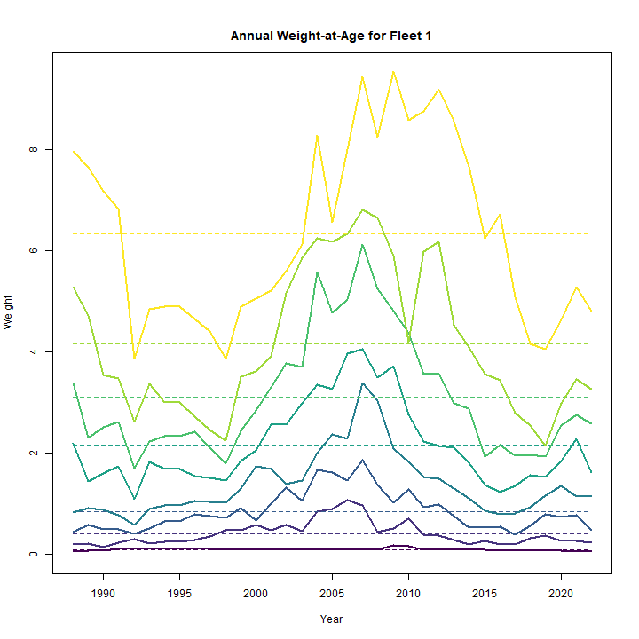

### Diagnostics

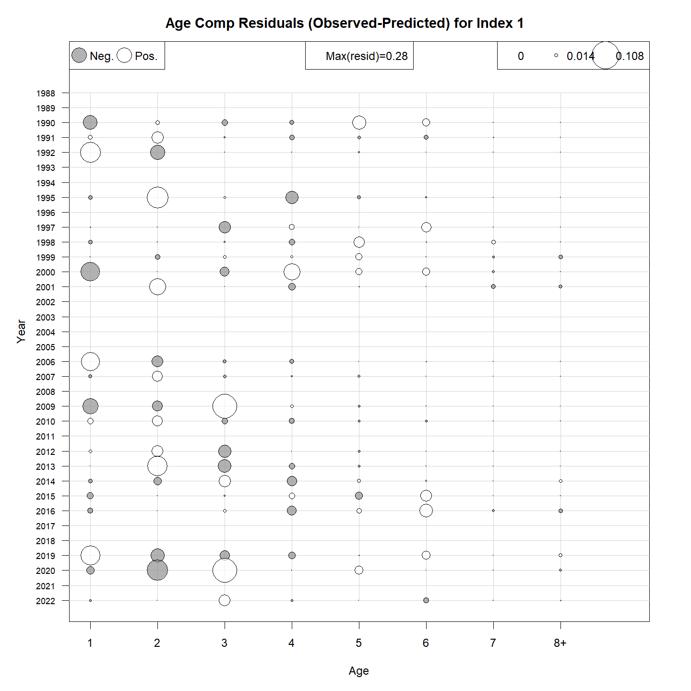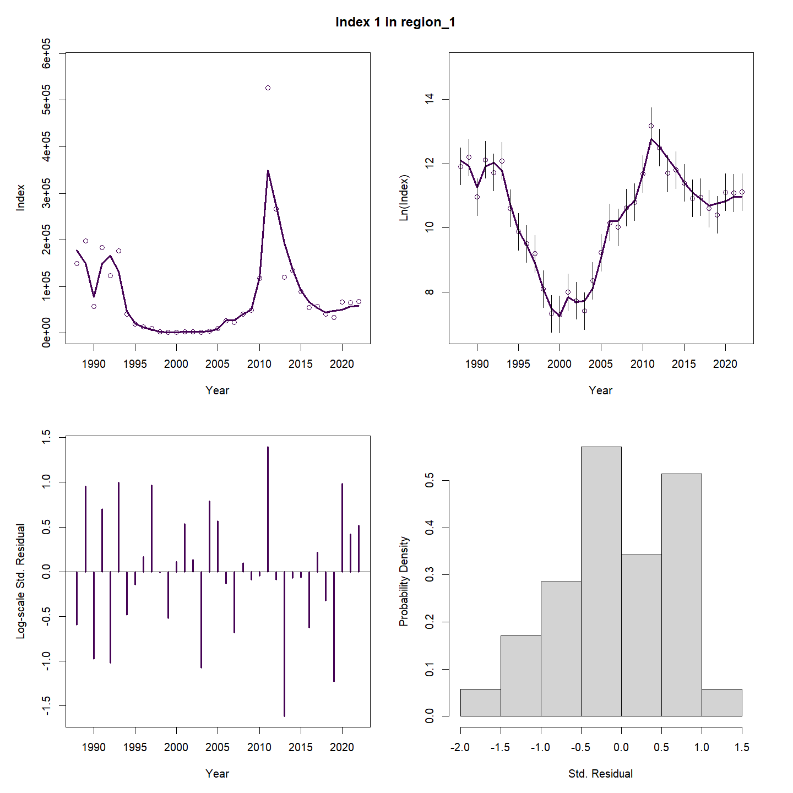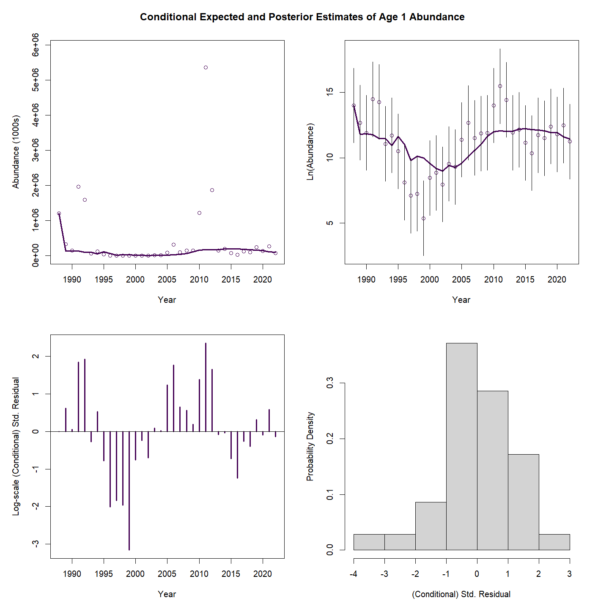

### Results

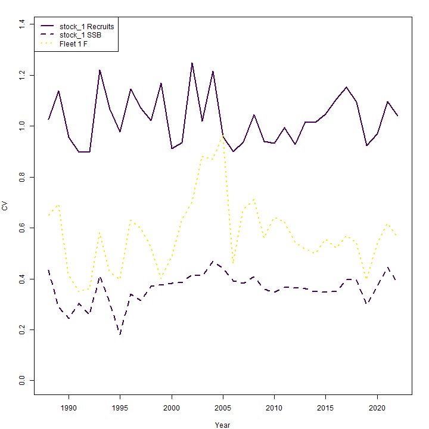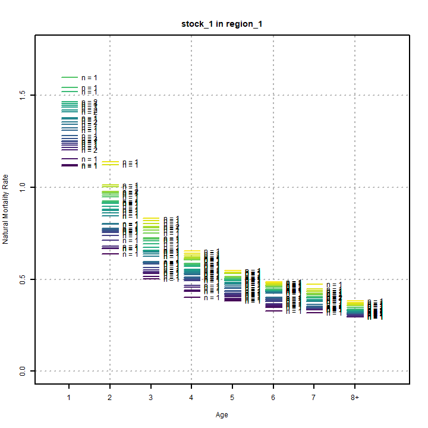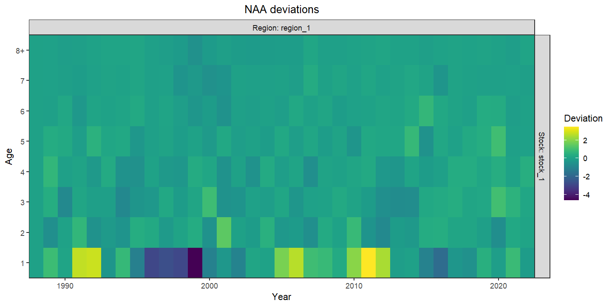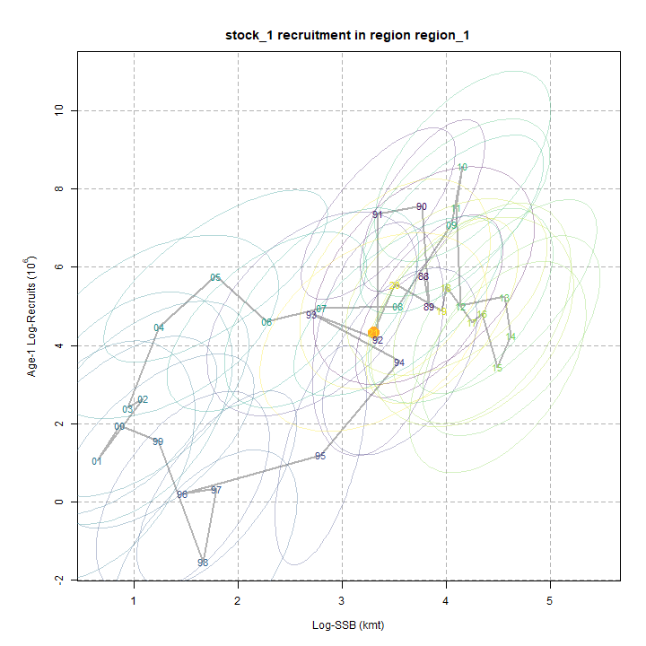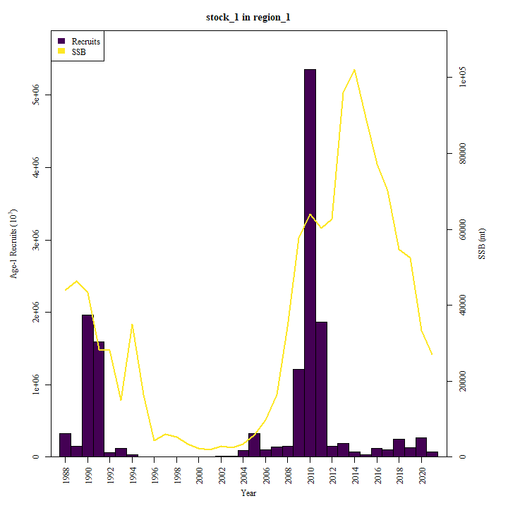

### Retro

### Reference points

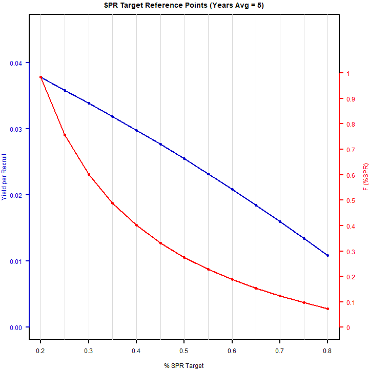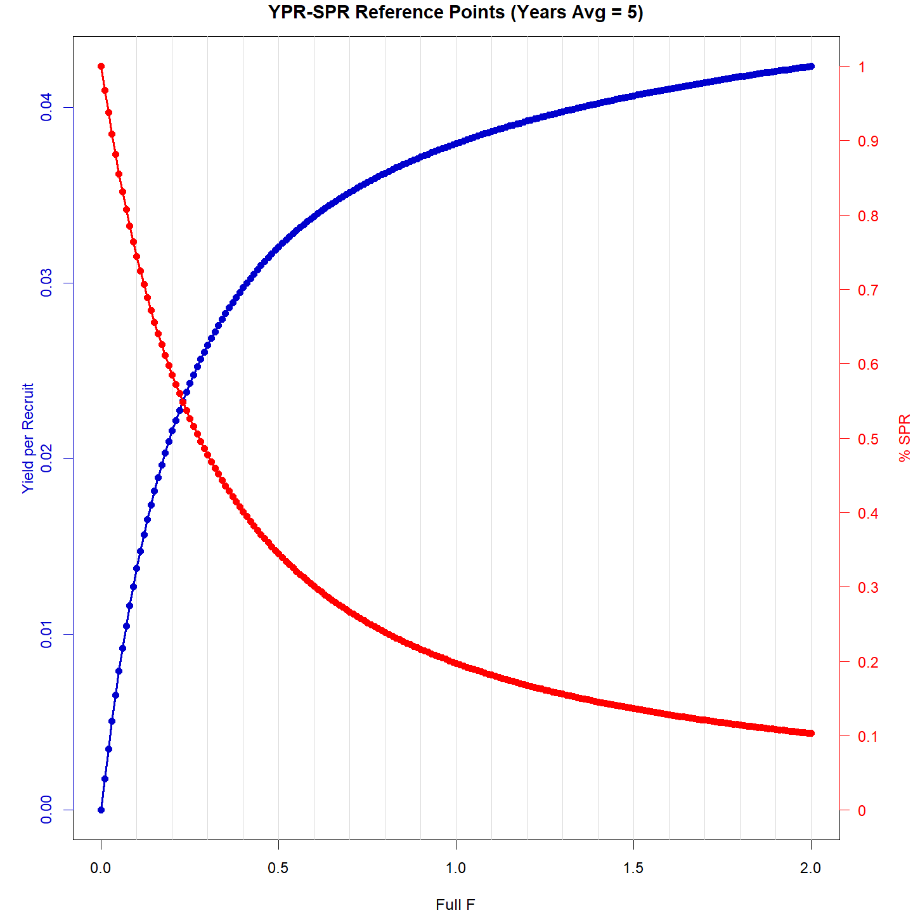

### Miscellaneous

## Tables {.tabset}

### Parameter estimates

<table class="table" style="margin-left: auto; margin-right: auto;">
<caption>Parameter estimates, standard errors, and confidence intervals. Rounded to 3 decimal places.</caption>
 <thead>
  <tr>
   <th style="text-align:left;">   </th>
   <th style="text-align:right;"> Estimate </th>
   <th style="text-align:right;"> Std. Error </th>
   <th style="text-align:right;"> 95\% CI lower </th>
   <th style="text-align:right;"> 95\% CI upper </th>
  </tr>
 </thead>
<tbody>
  <tr>
   <td style="text-align:left;"> Index 1 fully selected q </td>
   <td style="text-align:right;"> $2.043$ </td>
   <td style="text-align:right;"> -- </td>
   <td style="text-align:right;"> -- </td>
   <td style="text-align:right;"> -- </td>
  </tr>
  <tr>
   <td style="text-align:left;"> Block 1: Fleet 1 $a_{50}$ </td>
   <td style="text-align:right;"> $2.191$ </td>
   <td style="text-align:right;"> -- </td>
   <td style="text-align:right;"> -- </td>
   <td style="text-align:right;"> -- </td>
  </tr>
  <tr>
   <td style="text-align:left;"> Block 1: Fleet 1 1/slope (increasing) </td>
   <td style="text-align:right;"> $0.118$ </td>
   <td style="text-align:right;"> -- </td>
   <td style="text-align:right;"> -- </td>
   <td style="text-align:right;"> -- </td>
  </tr>
  <tr>
   <td style="text-align:left;"> Block 2: Index 1 $a_{50}$ </td>
   <td style="text-align:right;"> $0.513$ </td>
   <td style="text-align:right;"> -- </td>
   <td style="text-align:right;"> -- </td>
   <td style="text-align:right;"> -- </td>
  </tr>
  <tr>
   <td style="text-align:left;"> Block 2: Index 1 1/slope (increasing) </td>
   <td style="text-align:right;"> $0.456$ </td>
   <td style="text-align:right;"> -- </td>
   <td style="text-align:right;"> -- </td>
   <td style="text-align:right;"> -- </td>
  </tr>
  <tr>
   <td style="text-align:left;"> Block 3: Fleet 1 $a_{50}$ </td>
   <td style="text-align:right;"> $3.372$ </td>
   <td style="text-align:right;"> -- </td>
   <td style="text-align:right;"> -- </td>
   <td style="text-align:right;"> -- </td>
  </tr>
  <tr>
   <td style="text-align:left;"> Block 3: Fleet 1 1/slope (increasing) </td>
   <td style="text-align:right;"> $0.492$ </td>
   <td style="text-align:right;"> -- </td>
   <td style="text-align:right;"> -- </td>
   <td style="text-align:right;"> -- </td>
  </tr>
</tbody>
</table>

### Abundance at age

<table class="table" style="margin-left: auto; margin-right: auto;">
<caption>Abundance at age (1000s) for stock 1 in region 1.</caption>
 <thead>
  <tr>
   <th style="text-align:left;">   </th>
   <th style="text-align:right;"> 1 </th>
   <th style="text-align:right;"> 2 </th>
   <th style="text-align:right;"> 3 </th>
   <th style="text-align:right;"> 4 </th>
   <th style="text-align:right;"> 5 </th>
   <th style="text-align:right;"> 6 </th>
   <th style="text-align:right;"> 7 </th>
   <th style="text-align:right;"> 8+ </th>
  </tr>
 </thead>
<tbody>
  <tr>
   <td style="text-align:left;"> 1988 </td>
   <td style="text-align:right;"> 25892 </td>
   <td style="text-align:right;"> 25891 </td>
   <td style="text-align:right;"> 24455 </td>
   <td style="text-align:right;"> 17331 </td>
   <td style="text-align:right;"> 12277 </td>
   <td style="text-align:right;"> 6226 </td>
   <td style="text-align:right;"> 3157 </td>
   <td style="text-align:right;"> 3247 </td>
  </tr>
  <tr>
   <td style="text-align:left;"> 1989 </td>
   <td style="text-align:right;"> 11951 </td>
   <td style="text-align:right;"> 25891 </td>
   <td style="text-align:right;"> 24655 </td>
   <td style="text-align:right;"> 18203 </td>
   <td style="text-align:right;"> 12896 </td>
   <td style="text-align:right;"> 6539 </td>
   <td style="text-align:right;"> 3316 </td>
   <td style="text-align:right;"> 3411 </td>
  </tr>
  <tr>
   <td style="text-align:left;"> 1990 </td>
   <td style="text-align:right;"> 10347 </td>
   <td style="text-align:right;"> 11951 </td>
   <td style="text-align:right;"> 23733 </td>
   <td style="text-align:right;"> 14580 </td>
   <td style="text-align:right;"> 10759 </td>
   <td style="text-align:right;"> 5456 </td>
   <td style="text-align:right;"> 2766 </td>
   <td style="text-align:right;"> 2846 </td>
  </tr>
  <tr>
   <td style="text-align:left;"> 1991 </td>
   <td style="text-align:right;"> 47610 </td>
   <td style="text-align:right;"> 10346 </td>
   <td style="text-align:right;"> 10184 </td>
   <td style="text-align:right;"> 9037 </td>
   <td style="text-align:right;"> 5546 </td>
   <td style="text-align:right;"> 2930 </td>
   <td style="text-align:right;"> 1486 </td>
   <td style="text-align:right;"> 1528 </td>
  </tr>
  <tr>
   <td style="text-align:left;"> 1992 </td>
   <td style="text-align:right;"> 41195 </td>
   <td style="text-align:right;"> 47607 </td>
   <td style="text-align:right;"> 9497 </td>
   <td style="text-align:right;"> 6077 </td>
   <td style="text-align:right;"> 5390 </td>
   <td style="text-align:right;"> 2368 </td>
   <td style="text-align:right;"> 1251 </td>
   <td style="text-align:right;"> 1287 </td>
  </tr>
  <tr>
   <td style="text-align:left;"> 1993 </td>
   <td style="text-align:right;"> 1926 </td>
   <td style="text-align:right;"> 41191 </td>
   <td style="text-align:right;"> 35735 </td>
   <td style="text-align:right;"> 1682 </td>
   <td style="text-align:right;"> 1075 </td>
   <td style="text-align:right;"> 682 </td>
   <td style="text-align:right;"> 300 </td>
   <td style="text-align:right;"> 321 </td>
  </tr>
  <tr>
   <td style="text-align:left;"> 1994 </td>
   <td style="text-align:right;"> 4871 </td>
   <td style="text-align:right;"> 1926 </td>
   <td style="text-align:right;"> 35394 </td>
   <td style="text-align:right;"> 14309 </td>
   <td style="text-align:right;"> 673 </td>
   <td style="text-align:right;"> 308 </td>
   <td style="text-align:right;"> 195 </td>
   <td style="text-align:right;"> 178 </td>
  </tr>
  <tr>
   <td style="text-align:left;"> 1995 </td>
   <td style="text-align:right;"> 1790 </td>
   <td style="text-align:right;"> 4870 </td>
   <td style="text-align:right;"> 1468 </td>
   <td style="text-align:right;"> 6867 </td>
   <td style="text-align:right;"> 2772 </td>
   <td style="text-align:right;"> 93 </td>
   <td style="text-align:right;"> 43 </td>
   <td style="text-align:right;"> 52 </td>
  </tr>
  <tr>
   <td style="text-align:left;"> 1996 </td>
   <td style="text-align:right;"> 57 </td>
   <td style="text-align:right;"> 1790 </td>
   <td style="text-align:right;"> 3553 </td>
   <td style="text-align:right;"> 219 </td>
   <td style="text-align:right;"> 1022 </td>
   <td style="text-align:right;"> 295 </td>
   <td style="text-align:right;"> 10 </td>
   <td style="text-align:right;"> 10 </td>
  </tr>
  <tr>
   <td style="text-align:left;"> 1997 </td>
   <td style="text-align:right;"> 47 </td>
   <td style="text-align:right;"> 57 </td>
   <td style="text-align:right;"> 1597 </td>
   <td style="text-align:right;"> 1782 </td>
   <td style="text-align:right;"> 110 </td>
   <td style="text-align:right;"> 367 </td>
   <td style="text-align:right;"> 106 </td>
   <td style="text-align:right;"> 7 </td>
  </tr>
  <tr>
   <td style="text-align:left;"> 1998 </td>
   <td style="text-align:right;"> 140 </td>
   <td style="text-align:right;"> 47 </td>
   <td style="text-align:right;"> 46 </td>
   <td style="text-align:right;"> 433 </td>
   <td style="text-align:right;"> 483 </td>
   <td style="text-align:right;"> 21 </td>
   <td style="text-align:right;"> 71 </td>
   <td style="text-align:right;"> 22 </td>
  </tr>
  <tr>
   <td style="text-align:left;"> 1999 </td>
   <td style="text-align:right;"> 2 </td>
   <td style="text-align:right;"> 140 </td>
   <td style="text-align:right;"> 41 </td>
   <td style="text-align:right;"> 20 </td>
   <td style="text-align:right;"> 188 </td>
   <td style="text-align:right;"> 150 </td>
   <td style="text-align:right;"> 7 </td>
   <td style="text-align:right;"> 29 </td>
  </tr>
  <tr>
   <td style="text-align:left;"> 2000 </td>
   <td style="text-align:right;"> 478 </td>
   <td style="text-align:right;"> 2 </td>
   <td style="text-align:right;"> 126 </td>
   <td style="text-align:right;"> 22 </td>
   <td style="text-align:right;"> 11 </td>
   <td style="text-align:right;"> 72 </td>
   <td style="text-align:right;"> 57 </td>
   <td style="text-align:right;"> 14 </td>
  </tr>
  <tr>
   <td style="text-align:left;"> 2001 </td>
   <td style="text-align:right;"> 408 </td>
   <td style="text-align:right;"> 478 </td>
   <td style="text-align:right;"> 1 </td>
   <td style="text-align:right;"> 113 </td>
   <td style="text-align:right;"> 20 </td>
   <td style="text-align:right;"> 7 </td>
   <td style="text-align:right;"> 46 </td>
   <td style="text-align:right;"> 46 </td>
  </tr>
  <tr>
   <td style="text-align:left;"> 2002 </td>
   <td style="text-align:right;"> 44 </td>
   <td style="text-align:right;"> 408 </td>
   <td style="text-align:right;"> 473 </td>
   <td style="text-align:right;"> 1 </td>
   <td style="text-align:right;"> 107 </td>
   <td style="text-align:right;"> 13 </td>
   <td style="text-align:right;"> 5 </td>
   <td style="text-align:right;"> 62 </td>
  </tr>
  <tr>
   <td style="text-align:left;"> 2003 </td>
   <td style="text-align:right;"> 1374 </td>
   <td style="text-align:right;"> 44 </td>
   <td style="text-align:right;"> 407 </td>
   <td style="text-align:right;"> 467 </td>
   <td style="text-align:right;"> 1 </td>
   <td style="text-align:right;"> 73 </td>
   <td style="text-align:right;"> 9 </td>
   <td style="text-align:right;"> 46 </td>
  </tr>
  <tr>
   <td style="text-align:left;"> 2004 </td>
   <td style="text-align:right;"> 284 </td>
   <td style="text-align:right;"> 1373 </td>
   <td style="text-align:right;"> 44 </td>
   <td style="text-align:right;"> 405 </td>
   <td style="text-align:right;"> 462 </td>
   <td style="text-align:right;"> 1 </td>
   <td style="text-align:right;"> 52 </td>
   <td style="text-align:right;"> 39 </td>
  </tr>
  <tr>
   <td style="text-align:left;"> 2005 </td>
   <td style="text-align:right;"> 3693 </td>
   <td style="text-align:right;"> 284 </td>
   <td style="text-align:right;"> 1373 </td>
   <td style="text-align:right;"> 44 </td>
   <td style="text-align:right;"> 404 </td>
   <td style="text-align:right;"> 330 </td>
   <td style="text-align:right;"> 1 </td>
   <td style="text-align:right;"> 65 </td>
  </tr>
  <tr>
   <td style="text-align:left;"> 2006 </td>
   <td style="text-align:right;"> 7160 </td>
   <td style="text-align:right;"> 3693 </td>
   <td style="text-align:right;"> 283 </td>
   <td style="text-align:right;"> 1371 </td>
   <td style="text-align:right;"> 44 </td>
   <td style="text-align:right;"> 288 </td>
   <td style="text-align:right;"> 235 </td>
   <td style="text-align:right;"> 47 </td>
  </tr>
  <tr>
   <td style="text-align:left;"> 2007 </td>
   <td style="text-align:right;"> 6977 </td>
   <td style="text-align:right;"> 7156 </td>
   <td style="text-align:right;"> 3680 </td>
   <td style="text-align:right;"> 278 </td>
   <td style="text-align:right;"> 1308 </td>
   <td style="text-align:right;"> 30 </td>
   <td style="text-align:right;"> 194 </td>
   <td style="text-align:right;"> 190 </td>
  </tr>
  <tr>
   <td style="text-align:left;"> 2008 </td>
   <td style="text-align:right;"> 9409 </td>
   <td style="text-align:right;"> 6975 </td>
   <td style="text-align:right;"> 7143 </td>
   <td style="text-align:right;"> 3641 </td>
   <td style="text-align:right;"> 271 </td>
   <td style="text-align:right;"> 907 </td>
   <td style="text-align:right;"> 21 </td>
   <td style="text-align:right;"> 266 </td>
  </tr>
  <tr>
   <td style="text-align:left;"> 2009 </td>
   <td style="text-align:right;"> 9552 </td>
   <td style="text-align:right;"> 9405 </td>
   <td style="text-align:right;"> 6955 </td>
   <td style="text-align:right;"> 7033 </td>
   <td style="text-align:right;"> 3507 </td>
   <td style="text-align:right;"> 185 </td>
   <td style="text-align:right;"> 619 </td>
   <td style="text-align:right;"> 195 </td>
  </tr>
  <tr>
   <td style="text-align:left;"> 2010 </td>
   <td style="text-align:right;"> 19376 </td>
   <td style="text-align:right;"> 9549 </td>
   <td style="text-align:right;"> 9383 </td>
   <td style="text-align:right;"> 6869 </td>
   <td style="text-align:right;"> 6822 </td>
   <td style="text-align:right;"> 2417 </td>
   <td style="text-align:right;"> 127 </td>
   <td style="text-align:right;"> 560 </td>
  </tr>
  <tr>
   <td style="text-align:left;"> 2011 </td>
   <td style="text-align:right;"> 28900 </td>
   <td style="text-align:right;"> 19340 </td>
   <td style="text-align:right;"> 9424 </td>
   <td style="text-align:right;"> 8723 </td>
   <td style="text-align:right;"> 5745 </td>
   <td style="text-align:right;"> 3917 </td>
   <td style="text-align:right;"> 1378 </td>
   <td style="text-align:right;"> 392 </td>
  </tr>
  <tr>
   <td style="text-align:left;"> 2012 </td>
   <td style="text-align:right;"> 21990 </td>
   <td style="text-align:right;"> 28830 </td>
   <td style="text-align:right;"> 19007 </td>
   <td style="text-align:right;"> 8562 </td>
   <td style="text-align:right;"> 6897 </td>
   <td style="text-align:right;"> 3078 </td>
   <td style="text-align:right;"> 2079 </td>
   <td style="text-align:right;"> 938 </td>
  </tr>
  <tr>
   <td style="text-align:left;"> 2013 </td>
   <td style="text-align:right;"> 4205 </td>
   <td style="text-align:right;"> 21947 </td>
   <td style="text-align:right;"> 28422 </td>
   <td style="text-align:right;"> 17568 </td>
   <td style="text-align:right;"> 7061 </td>
   <td style="text-align:right;"> 3892 </td>
   <td style="text-align:right;"> 1724 </td>
   <td style="text-align:right;"> 1688 </td>
  </tr>
  <tr>
   <td style="text-align:left;"> 2014 </td>
   <td style="text-align:right;"> 14266 </td>
   <td style="text-align:right;"> 4197 </td>
   <td style="text-align:right;"> 21664 </td>
   <td style="text-align:right;"> 26458 </td>
   <td style="text-align:right;"> 14742 </td>
   <td style="text-align:right;"> 4071 </td>
   <td style="text-align:right;"> 2229 </td>
   <td style="text-align:right;"> 1952 </td>
  </tr>
  <tr>
   <td style="text-align:left;"> 2015 </td>
   <td style="text-align:right;"> 6944 </td>
   <td style="text-align:right;"> 14243 </td>
   <td style="text-align:right;"> 4150 </td>
   <td style="text-align:right;"> 20354 </td>
   <td style="text-align:right;"> 22712 </td>
   <td style="text-align:right;"> 8741 </td>
   <td style="text-align:right;"> 2399 </td>
   <td style="text-align:right;"> 2462 </td>
  </tr>
  <tr>
   <td style="text-align:left;"> 2016 </td>
   <td style="text-align:right;"> 2156 </td>
   <td style="text-align:right;"> 6932 </td>
   <td style="text-align:right;"> 14072 </td>
   <td style="text-align:right;"> 3882 </td>
   <td style="text-align:right;"> 17282 </td>
   <td style="text-align:right;"> 13285 </td>
   <td style="text-align:right;"> 5080 </td>
   <td style="text-align:right;"> 2823 </td>
  </tr>
  <tr>
   <td style="text-align:left;"> 2017 </td>
   <td style="text-align:right;"> 5302 </td>
   <td style="text-align:right;"> 2152 </td>
   <td style="text-align:right;"> 6851 </td>
   <td style="text-align:right;"> 13187 </td>
   <td style="text-align:right;"> 3311 </td>
   <td style="text-align:right;"> 10168 </td>
   <td style="text-align:right;"> 7768 </td>
   <td style="text-align:right;"> 4617 </td>
  </tr>
  <tr>
   <td style="text-align:left;"> 2018 </td>
   <td style="text-align:right;"> 3790 </td>
   <td style="text-align:right;"> 5292 </td>
   <td style="text-align:right;"> 2124 </td>
   <td style="text-align:right;"> 6369 </td>
   <td style="text-align:right;"> 11028 </td>
   <td style="text-align:right;"> 1901 </td>
   <td style="text-align:right;"> 5796 </td>
   <td style="text-align:right;"> 7053 </td>
  </tr>
  <tr>
   <td style="text-align:left;"> 2019 </td>
   <td style="text-align:right;"> 5635 </td>
   <td style="text-align:right;"> 3784 </td>
   <td style="text-align:right;"> 5229 </td>
   <td style="text-align:right;"> 1988 </td>
   <td style="text-align:right;"> 5416 </td>
   <td style="text-align:right;"> 6464 </td>
   <td style="text-align:right;"> 1107 </td>
   <td style="text-align:right;"> 7477 </td>
  </tr>
  <tr>
   <td style="text-align:left;"> 2020 </td>
   <td style="text-align:right;"> 2792 </td>
   <td style="text-align:right;"> 5616 </td>
   <td style="text-align:right;"> 3694 </td>
   <td style="text-align:right;"> 4584 </td>
   <td style="text-align:right;"> 1440 </td>
   <td style="text-align:right;"> 2604 </td>
   <td style="text-align:right;"> 3068 </td>
   <td style="text-align:right;"> 4067 </td>
  </tr>
  <tr>
   <td style="text-align:left;"> 2021 </td>
   <td style="text-align:right;"> 5548 </td>
   <td style="text-align:right;"> 2787 </td>
   <td style="text-align:right;"> 5537 </td>
   <td style="text-align:right;"> 3417 </td>
   <td style="text-align:right;"> 3785 </td>
   <td style="text-align:right;"> 814 </td>
   <td style="text-align:right;"> 1461 </td>
   <td style="text-align:right;"> 3999 </td>
  </tr>
  <tr>
   <td style="text-align:left;"> 2022 </td>
   <td style="text-align:right;"> 1839 </td>
   <td style="text-align:right;"> 5545 </td>
   <td style="text-align:right;"> 2777 </td>
   <td style="text-align:right;"> 5434 </td>
   <td style="text-align:right;"> 3263 </td>
   <td style="text-align:right;"> 2560 </td>
   <td style="text-align:right;"> 549 </td>
   <td style="text-align:right;"> 3685 </td>
  </tr>
</tbody>
</table>

### Fishing mortality at age by region

<table class="table" style="margin-left: auto; margin-right: auto;">
<caption>Total fishing mortality at age in region 1.</caption>
 <thead>
  <tr>
   <th style="text-align:left;">   </th>
   <th style="text-align:right;"> 1 </th>
   <th style="text-align:right;"> 2 </th>
   <th style="text-align:right;"> 3 </th>
   <th style="text-align:right;"> 4 </th>
   <th style="text-align:right;"> 5 </th>
   <th style="text-align:right;"> 6 </th>
   <th style="text-align:right;"> 7 </th>
   <th style="text-align:right;"> 8+ </th>
  </tr>
 </thead>
<tbody>
  <tr>
   <td style="text-align:left;"> 1988 </td>
   <td style="text-align:right;"> 0.000 </td>
   <td style="text-align:right;"> 0.049 </td>
   <td style="text-align:right;"> 0.295 </td>
   <td style="text-align:right;"> 0.296 </td>
   <td style="text-align:right;"> 0.296 </td>
   <td style="text-align:right;"> 0.296 </td>
   <td style="text-align:right;"> 0.296 </td>
   <td style="text-align:right;"> 0.296 </td>
  </tr>
  <tr>
   <td style="text-align:left;"> 1989 </td>
   <td style="text-align:right;"> 0.000 </td>
   <td style="text-align:right;"> 0.087 </td>
   <td style="text-align:right;"> 0.525 </td>
   <td style="text-align:right;"> 0.526 </td>
   <td style="text-align:right;"> 0.526 </td>
   <td style="text-align:right;"> 0.526 </td>
   <td style="text-align:right;"> 0.526 </td>
   <td style="text-align:right;"> 0.526 </td>
  </tr>
  <tr>
   <td style="text-align:left;"> 1990 </td>
   <td style="text-align:right;"> 0.000 </td>
   <td style="text-align:right;"> 0.160 </td>
   <td style="text-align:right;"> 0.965 </td>
   <td style="text-align:right;"> 0.967 </td>
   <td style="text-align:right;"> 0.967 </td>
   <td style="text-align:right;"> 0.967 </td>
   <td style="text-align:right;"> 0.967 </td>
   <td style="text-align:right;"> 0.967 </td>
  </tr>
  <tr>
   <td style="text-align:left;"> 1991 </td>
   <td style="text-align:right;"> 0.000 </td>
   <td style="text-align:right;"> 0.086 </td>
   <td style="text-align:right;"> 0.516 </td>
   <td style="text-align:right;"> 0.517 </td>
   <td style="text-align:right;"> 0.517 </td>
   <td style="text-align:right;"> 0.517 </td>
   <td style="text-align:right;"> 0.517 </td>
   <td style="text-align:right;"> 0.517 </td>
  </tr>
  <tr>
   <td style="text-align:left;"> 1992 </td>
   <td style="text-align:right;"> 0.000 </td>
   <td style="text-align:right;"> 0.287 </td>
   <td style="text-align:right;"> 1.731 </td>
   <td style="text-align:right;"> 1.733 </td>
   <td style="text-align:right;"> 1.733 </td>
   <td style="text-align:right;"> 1.733 </td>
   <td style="text-align:right;"> 1.733 </td>
   <td style="text-align:right;"> 1.733 </td>
  </tr>
  <tr>
   <td style="text-align:left;"> 1993 </td>
   <td style="text-align:right;"> 0.000 </td>
   <td style="text-align:right;"> 0.152 </td>
   <td style="text-align:right;"> 0.915 </td>
   <td style="text-align:right;"> 0.916 </td>
   <td style="text-align:right;"> 0.916 </td>
   <td style="text-align:right;"> 0.916 </td>
   <td style="text-align:right;"> 0.916 </td>
   <td style="text-align:right;"> 0.916 </td>
  </tr>
  <tr>
   <td style="text-align:left;"> 1994 </td>
   <td style="text-align:right;"> 0.000 </td>
   <td style="text-align:right;"> 0.272 </td>
   <td style="text-align:right;"> 1.640 </td>
   <td style="text-align:right;"> 1.641 </td>
   <td style="text-align:right;"> 1.641 </td>
   <td style="text-align:right;"> 1.641 </td>
   <td style="text-align:right;"> 1.641 </td>
   <td style="text-align:right;"> 1.641 </td>
  </tr>
  <tr>
   <td style="text-align:left;"> 1995 </td>
   <td style="text-align:right;"> 0.000 </td>
   <td style="text-align:right;"> 0.315 </td>
   <td style="text-align:right;"> 1.903 </td>
   <td style="text-align:right;"> 1.905 </td>
   <td style="text-align:right;"> 1.905 </td>
   <td style="text-align:right;"> 1.905 </td>
   <td style="text-align:right;"> 1.905 </td>
   <td style="text-align:right;"> 1.905 </td>
  </tr>
  <tr>
   <td style="text-align:left;"> 1996 </td>
   <td style="text-align:right;"> 0.000 </td>
   <td style="text-align:right;"> 0.114 </td>
   <td style="text-align:right;"> 0.690 </td>
   <td style="text-align:right;"> 0.691 </td>
   <td style="text-align:right;"> 0.691 </td>
   <td style="text-align:right;"> 0.691 </td>
   <td style="text-align:right;"> 0.691 </td>
   <td style="text-align:right;"> 0.691 </td>
  </tr>
  <tr>
   <td style="text-align:left;"> 1997 </td>
   <td style="text-align:right;"> 0.000 </td>
   <td style="text-align:right;"> 0.216 </td>
   <td style="text-align:right;"> 1.305 </td>
   <td style="text-align:right;"> 1.306 </td>
   <td style="text-align:right;"> 1.306 </td>
   <td style="text-align:right;"> 1.306 </td>
   <td style="text-align:right;"> 1.306 </td>
   <td style="text-align:right;"> 1.306 </td>
  </tr>
  <tr>
   <td style="text-align:left;"> 1998 </td>
   <td style="text-align:right;"> 0.000 </td>
   <td style="text-align:right;"> 0.138 </td>
   <td style="text-align:right;"> 0.833 </td>
   <td style="text-align:right;"> 0.834 </td>
   <td style="text-align:right;"> 0.834 </td>
   <td style="text-align:right;"> 0.834 </td>
   <td style="text-align:right;"> 0.834 </td>
   <td style="text-align:right;"> 0.834 </td>
  </tr>
  <tr>
   <td style="text-align:left;"> 1999 </td>
   <td style="text-align:right;"> 0.000 </td>
   <td style="text-align:right;"> 0.104 </td>
   <td style="text-align:right;"> 0.626 </td>
   <td style="text-align:right;"> 0.627 </td>
   <td style="text-align:right;"> 0.627 </td>
   <td style="text-align:right;"> 0.627 </td>
   <td style="text-align:right;"> 0.627 </td>
   <td style="text-align:right;"> 0.627 </td>
  </tr>
  <tr>
   <td style="text-align:left;"> 2000 </td>
   <td style="text-align:right;"> 0.000 </td>
   <td style="text-align:right;"> 0.018 </td>
   <td style="text-align:right;"> 0.106 </td>
   <td style="text-align:right;"> 0.107 </td>
   <td style="text-align:right;"> 0.107 </td>
   <td style="text-align:right;"> 0.107 </td>
   <td style="text-align:right;"> 0.107 </td>
   <td style="text-align:right;"> 0.107 </td>
  </tr>
  <tr>
   <td style="text-align:left;"> 2001 </td>
   <td style="text-align:right;"> 0.000 </td>
   <td style="text-align:right;"> 0.010 </td>
   <td style="text-align:right;"> 0.059 </td>
   <td style="text-align:right;"> 0.059 </td>
   <td style="text-align:right;"> 0.059 </td>
   <td style="text-align:right;"> 0.059 </td>
   <td style="text-align:right;"> 0.059 </td>
   <td style="text-align:right;"> 0.059 </td>
  </tr>
  <tr>
   <td style="text-align:left;"> 2002 </td>
   <td style="text-align:right;"> 0.000 </td>
   <td style="text-align:right;"> 0.002 </td>
   <td style="text-align:right;"> 0.013 </td>
   <td style="text-align:right;"> 0.033 </td>
   <td style="text-align:right;"> 0.041 </td>
   <td style="text-align:right;"> 0.042 </td>
   <td style="text-align:right;"> 0.042 </td>
   <td style="text-align:right;"> 0.042 </td>
  </tr>
  <tr>
   <td style="text-align:left;"> 2003 </td>
   <td style="text-align:right;"> 0.000 </td>
   <td style="text-align:right;"> 0.001 </td>
   <td style="text-align:right;"> 0.004 </td>
   <td style="text-align:right;"> 0.011 </td>
   <td style="text-align:right;"> 0.013 </td>
   <td style="text-align:right;"> 0.013 </td>
   <td style="text-align:right;"> 0.014 </td>
   <td style="text-align:right;"> 0.014 </td>
  </tr>
  <tr>
   <td style="text-align:left;"> 2004 </td>
   <td style="text-align:right;"> 0.000 </td>
   <td style="text-align:right;"> 0.000 </td>
   <td style="text-align:right;"> 0.001 </td>
   <td style="text-align:right;"> 0.002 </td>
   <td style="text-align:right;"> 0.002 </td>
   <td style="text-align:right;"> 0.002 </td>
   <td style="text-align:right;"> 0.002 </td>
   <td style="text-align:right;"> 0.002 </td>
  </tr>
  <tr>
   <td style="text-align:left;"> 2005 </td>
   <td style="text-align:right;"> 0.000 </td>
   <td style="text-align:right;"> 0.000 </td>
   <td style="text-align:right;"> 0.002 </td>
   <td style="text-align:right;"> 0.004 </td>
   <td style="text-align:right;"> 0.005 </td>
   <td style="text-align:right;"> 0.005 </td>
   <td style="text-align:right;"> 0.005 </td>
   <td style="text-align:right;"> 0.005 </td>
  </tr>
  <tr>
   <td style="text-align:left;"> 2006 </td>
   <td style="text-align:right;"> 0.000 </td>
   <td style="text-align:right;"> 0.003 </td>
   <td style="text-align:right;"> 0.019 </td>
   <td style="text-align:right;"> 0.047 </td>
   <td style="text-align:right;"> 0.058 </td>
   <td style="text-align:right;"> 0.060 </td>
   <td style="text-align:right;"> 0.060 </td>
   <td style="text-align:right;"> 0.060 </td>
  </tr>
  <tr>
   <td style="text-align:left;"> 2007 </td>
   <td style="text-align:right;"> 0.000 </td>
   <td style="text-align:right;"> 0.002 </td>
   <td style="text-align:right;"> 0.011 </td>
   <td style="text-align:right;"> 0.026 </td>
   <td style="text-align:right;"> 0.032 </td>
   <td style="text-align:right;"> 0.033 </td>
   <td style="text-align:right;"> 0.033 </td>
   <td style="text-align:right;"> 0.033 </td>
  </tr>
  <tr>
   <td style="text-align:left;"> 2008 </td>
   <td style="text-align:right;"> 0.000 </td>
   <td style="text-align:right;"> 0.003 </td>
   <td style="text-align:right;"> 0.015 </td>
   <td style="text-align:right;"> 0.038 </td>
   <td style="text-align:right;"> 0.047 </td>
   <td style="text-align:right;"> 0.048 </td>
   <td style="text-align:right;"> 0.048 </td>
   <td style="text-align:right;"> 0.048 </td>
  </tr>
  <tr>
   <td style="text-align:left;"> 2009 </td>
   <td style="text-align:right;"> 0.000 </td>
   <td style="text-align:right;"> 0.002 </td>
   <td style="text-align:right;"> 0.012 </td>
   <td style="text-align:right;"> 0.031 </td>
   <td style="text-align:right;"> 0.038 </td>
   <td style="text-align:right;"> 0.039 </td>
   <td style="text-align:right;"> 0.039 </td>
   <td style="text-align:right;"> 0.039 </td>
  </tr>
  <tr>
   <td style="text-align:left;"> 2010 </td>
   <td style="text-align:right;"> 0.002 </td>
   <td style="text-align:right;"> 0.013 </td>
   <td style="text-align:right;"> 0.073 </td>
   <td style="text-align:right;"> 0.179 </td>
   <td style="text-align:right;"> 0.220 </td>
   <td style="text-align:right;"> 0.227 </td>
   <td style="text-align:right;"> 0.228 </td>
   <td style="text-align:right;"> 0.228 </td>
  </tr>
  <tr>
   <td style="text-align:left;"> 2011 </td>
   <td style="text-align:right;"> 0.002 </td>
   <td style="text-align:right;"> 0.017 </td>
   <td style="text-align:right;"> 0.096 </td>
   <td style="text-align:right;"> 0.235 </td>
   <td style="text-align:right;"> 0.290 </td>
   <td style="text-align:right;"> 0.299 </td>
   <td style="text-align:right;"> 0.300 </td>
   <td style="text-align:right;"> 0.300 </td>
  </tr>
  <tr>
   <td style="text-align:left;"> 2012 </td>
   <td style="text-align:right;"> 0.002 </td>
   <td style="text-align:right;"> 0.014 </td>
   <td style="text-align:right;"> 0.079 </td>
   <td style="text-align:right;"> 0.193 </td>
   <td style="text-align:right;"> 0.238 </td>
   <td style="text-align:right;"> 0.245 </td>
   <td style="text-align:right;"> 0.246 </td>
   <td style="text-align:right;"> 0.246 </td>
  </tr>
  <tr>
   <td style="text-align:left;"> 2013 </td>
   <td style="text-align:right;"> 0.002 </td>
   <td style="text-align:right;"> 0.013 </td>
   <td style="text-align:right;"> 0.072 </td>
   <td style="text-align:right;"> 0.175 </td>
   <td style="text-align:right;"> 0.216 </td>
   <td style="text-align:right;"> 0.223 </td>
   <td style="text-align:right;"> 0.224 </td>
   <td style="text-align:right;"> 0.224 </td>
  </tr>
  <tr>
   <td style="text-align:left;"> 2014 </td>
   <td style="text-align:right;"> 0.002 </td>
   <td style="text-align:right;"> 0.011 </td>
   <td style="text-align:right;"> 0.062 </td>
   <td style="text-align:right;"> 0.153 </td>
   <td style="text-align:right;"> 0.188 </td>
   <td style="text-align:right;"> 0.194 </td>
   <td style="text-align:right;"> 0.195 </td>
   <td style="text-align:right;"> 0.195 </td>
  </tr>
  <tr>
   <td style="text-align:left;"> 2015 </td>
   <td style="text-align:right;"> 0.002 </td>
   <td style="text-align:right;"> 0.012 </td>
   <td style="text-align:right;"> 0.067 </td>
   <td style="text-align:right;"> 0.164 </td>
   <td style="text-align:right;"> 0.202 </td>
   <td style="text-align:right;"> 0.208 </td>
   <td style="text-align:right;"> 0.209 </td>
   <td style="text-align:right;"> 0.209 </td>
  </tr>
  <tr>
   <td style="text-align:left;"> 2016 </td>
   <td style="text-align:right;"> 0.002 </td>
   <td style="text-align:right;"> 0.012 </td>
   <td style="text-align:right;"> 0.065 </td>
   <td style="text-align:right;"> 0.159 </td>
   <td style="text-align:right;"> 0.196 </td>
   <td style="text-align:right;"> 0.202 </td>
   <td style="text-align:right;"> 0.203 </td>
   <td style="text-align:right;"> 0.203 </td>
  </tr>
  <tr>
   <td style="text-align:left;"> 2017 </td>
   <td style="text-align:right;"> 0.002 </td>
   <td style="text-align:right;"> 0.013 </td>
   <td style="text-align:right;"> 0.073 </td>
   <td style="text-align:right;"> 0.179 </td>
   <td style="text-align:right;"> 0.221 </td>
   <td style="text-align:right;"> 0.228 </td>
   <td style="text-align:right;"> 0.229 </td>
   <td style="text-align:right;"> 0.229 </td>
  </tr>
  <tr>
   <td style="text-align:left;"> 2018 </td>
   <td style="text-align:right;"> 0.002 </td>
   <td style="text-align:right;"> 0.012 </td>
   <td style="text-align:right;"> 0.066 </td>
   <td style="text-align:right;"> 0.162 </td>
   <td style="text-align:right;"> 0.200 </td>
   <td style="text-align:right;"> 0.206 </td>
   <td style="text-align:right;"> 0.207 </td>
   <td style="text-align:right;"> 0.207 </td>
  </tr>
  <tr>
   <td style="text-align:left;"> 2019 </td>
   <td style="text-align:right;"> 0.003 </td>
   <td style="text-align:right;"> 0.024 </td>
   <td style="text-align:right;"> 0.132 </td>
   <td style="text-align:right;"> 0.323 </td>
   <td style="text-align:right;"> 0.398 </td>
   <td style="text-align:right;"> 0.411 </td>
   <td style="text-align:right;"> 0.412 </td>
   <td style="text-align:right;"> 0.413 </td>
  </tr>
  <tr>
   <td style="text-align:left;"> 2020 </td>
   <td style="text-align:right;"> 0.002 </td>
   <td style="text-align:right;"> 0.014 </td>
   <td style="text-align:right;"> 0.078 </td>
   <td style="text-align:right;"> 0.191 </td>
   <td style="text-align:right;"> 0.236 </td>
   <td style="text-align:right;"> 0.244 </td>
   <td style="text-align:right;"> 0.245 </td>
   <td style="text-align:right;"> 0.245 </td>
  </tr>
  <tr>
   <td style="text-align:left;"> 2021 </td>
   <td style="text-align:right;"> 0.000 </td>
   <td style="text-align:right;"> 0.003 </td>
   <td style="text-align:right;"> 0.019 </td>
   <td style="text-align:right;"> 0.046 </td>
   <td style="text-align:right;"> 0.057 </td>
   <td style="text-align:right;"> 0.059 </td>
   <td style="text-align:right;"> 0.059 </td>
   <td style="text-align:right;"> 0.059 </td>
  </tr>
  <tr>
   <td style="text-align:left;"> 2022 </td>
   <td style="text-align:right;"> 0.001 </td>
   <td style="text-align:right;"> 0.008 </td>
   <td style="text-align:right;"> 0.042 </td>
   <td style="text-align:right;"> 0.103 </td>
   <td style="text-align:right;"> 0.128 </td>
   <td style="text-align:right;"> 0.132 </td>
   <td style="text-align:right;"> 0.132 </td>
   <td style="text-align:right;"> 0.132 </td>
  </tr>
</tbody>
</table>

### Fishing mortality at age by fleet

<table class="table" style="margin-left: auto; margin-right: auto;">
<caption>Total fishing mortality at age in Fleet 1.</caption>
 <thead>
  <tr>
   <th style="text-align:left;">   </th>
   <th style="text-align:right;"> 1 </th>
   <th style="text-align:right;"> 2 </th>
   <th style="text-align:right;"> 3 </th>
   <th style="text-align:right;"> 4 </th>
   <th style="text-align:right;"> 5 </th>
   <th style="text-align:right;"> 6 </th>
   <th style="text-align:right;"> 7 </th>
   <th style="text-align:right;"> 8+ </th>
  </tr>
 </thead>
<tbody>
  <tr>
   <td style="text-align:left;"> 1988 </td>
   <td style="text-align:right;"> 0.000 </td>
   <td style="text-align:right;"> 0.049 </td>
   <td style="text-align:right;"> 0.295 </td>
   <td style="text-align:right;"> 0.296 </td>
   <td style="text-align:right;"> 0.296 </td>
   <td style="text-align:right;"> 0.296 </td>
   <td style="text-align:right;"> 0.296 </td>
   <td style="text-align:right;"> 0.296 </td>
  </tr>
  <tr>
   <td style="text-align:left;"> 1989 </td>
   <td style="text-align:right;"> 0.000 </td>
   <td style="text-align:right;"> 0.087 </td>
   <td style="text-align:right;"> 0.525 </td>
   <td style="text-align:right;"> 0.526 </td>
   <td style="text-align:right;"> 0.526 </td>
   <td style="text-align:right;"> 0.526 </td>
   <td style="text-align:right;"> 0.526 </td>
   <td style="text-align:right;"> 0.526 </td>
  </tr>
  <tr>
   <td style="text-align:left;"> 1990 </td>
   <td style="text-align:right;"> 0.000 </td>
   <td style="text-align:right;"> 0.160 </td>
   <td style="text-align:right;"> 0.965 </td>
   <td style="text-align:right;"> 0.967 </td>
   <td style="text-align:right;"> 0.967 </td>
   <td style="text-align:right;"> 0.967 </td>
   <td style="text-align:right;"> 0.967 </td>
   <td style="text-align:right;"> 0.967 </td>
  </tr>
  <tr>
   <td style="text-align:left;"> 1991 </td>
   <td style="text-align:right;"> 0.000 </td>
   <td style="text-align:right;"> 0.086 </td>
   <td style="text-align:right;"> 0.516 </td>
   <td style="text-align:right;"> 0.517 </td>
   <td style="text-align:right;"> 0.517 </td>
   <td style="text-align:right;"> 0.517 </td>
   <td style="text-align:right;"> 0.517 </td>
   <td style="text-align:right;"> 0.517 </td>
  </tr>
  <tr>
   <td style="text-align:left;"> 1992 </td>
   <td style="text-align:right;"> 0.000 </td>
   <td style="text-align:right;"> 0.287 </td>
   <td style="text-align:right;"> 1.731 </td>
   <td style="text-align:right;"> 1.733 </td>
   <td style="text-align:right;"> 1.733 </td>
   <td style="text-align:right;"> 1.733 </td>
   <td style="text-align:right;"> 1.733 </td>
   <td style="text-align:right;"> 1.733 </td>
  </tr>
  <tr>
   <td style="text-align:left;"> 1993 </td>
   <td style="text-align:right;"> 0.000 </td>
   <td style="text-align:right;"> 0.152 </td>
   <td style="text-align:right;"> 0.915 </td>
   <td style="text-align:right;"> 0.916 </td>
   <td style="text-align:right;"> 0.916 </td>
   <td style="text-align:right;"> 0.916 </td>
   <td style="text-align:right;"> 0.916 </td>
   <td style="text-align:right;"> 0.916 </td>
  </tr>
  <tr>
   <td style="text-align:left;"> 1994 </td>
   <td style="text-align:right;"> 0.000 </td>
   <td style="text-align:right;"> 0.272 </td>
   <td style="text-align:right;"> 1.640 </td>
   <td style="text-align:right;"> 1.641 </td>
   <td style="text-align:right;"> 1.641 </td>
   <td style="text-align:right;"> 1.641 </td>
   <td style="text-align:right;"> 1.641 </td>
   <td style="text-align:right;"> 1.641 </td>
  </tr>
  <tr>
   <td style="text-align:left;"> 1995 </td>
   <td style="text-align:right;"> 0.000 </td>
   <td style="text-align:right;"> 0.315 </td>
   <td style="text-align:right;"> 1.903 </td>
   <td style="text-align:right;"> 1.905 </td>
   <td style="text-align:right;"> 1.905 </td>
   <td style="text-align:right;"> 1.905 </td>
   <td style="text-align:right;"> 1.905 </td>
   <td style="text-align:right;"> 1.905 </td>
  </tr>
  <tr>
   <td style="text-align:left;"> 1996 </td>
   <td style="text-align:right;"> 0.000 </td>
   <td style="text-align:right;"> 0.114 </td>
   <td style="text-align:right;"> 0.690 </td>
   <td style="text-align:right;"> 0.691 </td>
   <td style="text-align:right;"> 0.691 </td>
   <td style="text-align:right;"> 0.691 </td>
   <td style="text-align:right;"> 0.691 </td>
   <td style="text-align:right;"> 0.691 </td>
  </tr>
  <tr>
   <td style="text-align:left;"> 1997 </td>
   <td style="text-align:right;"> 0.000 </td>
   <td style="text-align:right;"> 0.216 </td>
   <td style="text-align:right;"> 1.305 </td>
   <td style="text-align:right;"> 1.306 </td>
   <td style="text-align:right;"> 1.306 </td>
   <td style="text-align:right;"> 1.306 </td>
   <td style="text-align:right;"> 1.306 </td>
   <td style="text-align:right;"> 1.306 </td>
  </tr>
  <tr>
   <td style="text-align:left;"> 1998 </td>
   <td style="text-align:right;"> 0.000 </td>
   <td style="text-align:right;"> 0.138 </td>
   <td style="text-align:right;"> 0.833 </td>
   <td style="text-align:right;"> 0.834 </td>
   <td style="text-align:right;"> 0.834 </td>
   <td style="text-align:right;"> 0.834 </td>
   <td style="text-align:right;"> 0.834 </td>
   <td style="text-align:right;"> 0.834 </td>
  </tr>
  <tr>
   <td style="text-align:left;"> 1999 </td>
   <td style="text-align:right;"> 0.000 </td>
   <td style="text-align:right;"> 0.104 </td>
   <td style="text-align:right;"> 0.626 </td>
   <td style="text-align:right;"> 0.627 </td>
   <td style="text-align:right;"> 0.627 </td>
   <td style="text-align:right;"> 0.627 </td>
   <td style="text-align:right;"> 0.627 </td>
   <td style="text-align:right;"> 0.627 </td>
  </tr>
  <tr>
   <td style="text-align:left;"> 2000 </td>
   <td style="text-align:right;"> 0.000 </td>
   <td style="text-align:right;"> 0.018 </td>
   <td style="text-align:right;"> 0.106 </td>
   <td style="text-align:right;"> 0.107 </td>
   <td style="text-align:right;"> 0.107 </td>
   <td style="text-align:right;"> 0.107 </td>
   <td style="text-align:right;"> 0.107 </td>
   <td style="text-align:right;"> 0.107 </td>
  </tr>
  <tr>
   <td style="text-align:left;"> 2001 </td>
   <td style="text-align:right;"> 0.000 </td>
   <td style="text-align:right;"> 0.010 </td>
   <td style="text-align:right;"> 0.059 </td>
   <td style="text-align:right;"> 0.059 </td>
   <td style="text-align:right;"> 0.059 </td>
   <td style="text-align:right;"> 0.059 </td>
   <td style="text-align:right;"> 0.059 </td>
   <td style="text-align:right;"> 0.059 </td>
  </tr>
  <tr>
   <td style="text-align:left;"> 2002 </td>
   <td style="text-align:right;"> 0.000 </td>
   <td style="text-align:right;"> 0.002 </td>
   <td style="text-align:right;"> 0.013 </td>
   <td style="text-align:right;"> 0.033 </td>
   <td style="text-align:right;"> 0.041 </td>
   <td style="text-align:right;"> 0.042 </td>
   <td style="text-align:right;"> 0.042 </td>
   <td style="text-align:right;"> 0.042 </td>
  </tr>
  <tr>
   <td style="text-align:left;"> 2003 </td>
   <td style="text-align:right;"> 0.000 </td>
   <td style="text-align:right;"> 0.001 </td>
   <td style="text-align:right;"> 0.004 </td>
   <td style="text-align:right;"> 0.011 </td>
   <td style="text-align:right;"> 0.013 </td>
   <td style="text-align:right;"> 0.013 </td>
   <td style="text-align:right;"> 0.014 </td>
   <td style="text-align:right;"> 0.014 </td>
  </tr>
  <tr>
   <td style="text-align:left;"> 2004 </td>
   <td style="text-align:right;"> 0.000 </td>
   <td style="text-align:right;"> 0.000 </td>
   <td style="text-align:right;"> 0.001 </td>
   <td style="text-align:right;"> 0.002 </td>
   <td style="text-align:right;"> 0.002 </td>
   <td style="text-align:right;"> 0.002 </td>
   <td style="text-align:right;"> 0.002 </td>
   <td style="text-align:right;"> 0.002 </td>
  </tr>
  <tr>
   <td style="text-align:left;"> 2005 </td>
   <td style="text-align:right;"> 0.000 </td>
   <td style="text-align:right;"> 0.000 </td>
   <td style="text-align:right;"> 0.002 </td>
   <td style="text-align:right;"> 0.004 </td>
   <td style="text-align:right;"> 0.005 </td>
   <td style="text-align:right;"> 0.005 </td>
   <td style="text-align:right;"> 0.005 </td>
   <td style="text-align:right;"> 0.005 </td>
  </tr>
  <tr>
   <td style="text-align:left;"> 2006 </td>
   <td style="text-align:right;"> 0.000 </td>
   <td style="text-align:right;"> 0.003 </td>
   <td style="text-align:right;"> 0.019 </td>
   <td style="text-align:right;"> 0.047 </td>
   <td style="text-align:right;"> 0.058 </td>
   <td style="text-align:right;"> 0.060 </td>
   <td style="text-align:right;"> 0.060 </td>
   <td style="text-align:right;"> 0.060 </td>
  </tr>
  <tr>
   <td style="text-align:left;"> 2007 </td>
   <td style="text-align:right;"> 0.000 </td>
   <td style="text-align:right;"> 0.002 </td>
   <td style="text-align:right;"> 0.011 </td>
   <td style="text-align:right;"> 0.026 </td>
   <td style="text-align:right;"> 0.032 </td>
   <td style="text-align:right;"> 0.033 </td>
   <td style="text-align:right;"> 0.033 </td>
   <td style="text-align:right;"> 0.033 </td>
  </tr>
  <tr>
   <td style="text-align:left;"> 2008 </td>
   <td style="text-align:right;"> 0.000 </td>
   <td style="text-align:right;"> 0.003 </td>
   <td style="text-align:right;"> 0.015 </td>
   <td style="text-align:right;"> 0.038 </td>
   <td style="text-align:right;"> 0.047 </td>
   <td style="text-align:right;"> 0.048 </td>
   <td style="text-align:right;"> 0.048 </td>
   <td style="text-align:right;"> 0.048 </td>
  </tr>
  <tr>
   <td style="text-align:left;"> 2009 </td>
   <td style="text-align:right;"> 0.000 </td>
   <td style="text-align:right;"> 0.002 </td>
   <td style="text-align:right;"> 0.012 </td>
   <td style="text-align:right;"> 0.031 </td>
   <td style="text-align:right;"> 0.038 </td>
   <td style="text-align:right;"> 0.039 </td>
   <td style="text-align:right;"> 0.039 </td>
   <td style="text-align:right;"> 0.039 </td>
  </tr>
  <tr>
   <td style="text-align:left;"> 2010 </td>
   <td style="text-align:right;"> 0.002 </td>
   <td style="text-align:right;"> 0.013 </td>
   <td style="text-align:right;"> 0.073 </td>
   <td style="text-align:right;"> 0.179 </td>
   <td style="text-align:right;"> 0.220 </td>
   <td style="text-align:right;"> 0.227 </td>
   <td style="text-align:right;"> 0.228 </td>
   <td style="text-align:right;"> 0.228 </td>
  </tr>
  <tr>
   <td style="text-align:left;"> 2011 </td>
   <td style="text-align:right;"> 0.002 </td>
   <td style="text-align:right;"> 0.017 </td>
   <td style="text-align:right;"> 0.096 </td>
   <td style="text-align:right;"> 0.235 </td>
   <td style="text-align:right;"> 0.290 </td>
   <td style="text-align:right;"> 0.299 </td>
   <td style="text-align:right;"> 0.300 </td>
   <td style="text-align:right;"> 0.300 </td>
  </tr>
  <tr>
   <td style="text-align:left;"> 2012 </td>
   <td style="text-align:right;"> 0.002 </td>
   <td style="text-align:right;"> 0.014 </td>
   <td style="text-align:right;"> 0.079 </td>
   <td style="text-align:right;"> 0.193 </td>
   <td style="text-align:right;"> 0.238 </td>
   <td style="text-align:right;"> 0.245 </td>
   <td style="text-align:right;"> 0.246 </td>
   <td style="text-align:right;"> 0.246 </td>
  </tr>
  <tr>
   <td style="text-align:left;"> 2013 </td>
   <td style="text-align:right;"> 0.002 </td>
   <td style="text-align:right;"> 0.013 </td>
   <td style="text-align:right;"> 0.072 </td>
   <td style="text-align:right;"> 0.175 </td>
   <td style="text-align:right;"> 0.216 </td>
   <td style="text-align:right;"> 0.223 </td>
   <td style="text-align:right;"> 0.224 </td>
   <td style="text-align:right;"> 0.224 </td>
  </tr>
  <tr>
   <td style="text-align:left;"> 2014 </td>
   <td style="text-align:right;"> 0.002 </td>
   <td style="text-align:right;"> 0.011 </td>
   <td style="text-align:right;"> 0.062 </td>
   <td style="text-align:right;"> 0.153 </td>
   <td style="text-align:right;"> 0.188 </td>
   <td style="text-align:right;"> 0.194 </td>
   <td style="text-align:right;"> 0.195 </td>
   <td style="text-align:right;"> 0.195 </td>
  </tr>
  <tr>
   <td style="text-align:left;"> 2015 </td>
   <td style="text-align:right;"> 0.002 </td>
   <td style="text-align:right;"> 0.012 </td>
   <td style="text-align:right;"> 0.067 </td>
   <td style="text-align:right;"> 0.164 </td>
   <td style="text-align:right;"> 0.202 </td>
   <td style="text-align:right;"> 0.208 </td>
   <td style="text-align:right;"> 0.209 </td>
   <td style="text-align:right;"> 0.209 </td>
  </tr>
  <tr>
   <td style="text-align:left;"> 2016 </td>
   <td style="text-align:right;"> 0.002 </td>
   <td style="text-align:right;"> 0.012 </td>
   <td style="text-align:right;"> 0.065 </td>
   <td style="text-align:right;"> 0.159 </td>
   <td style="text-align:right;"> 0.196 </td>
   <td style="text-align:right;"> 0.202 </td>
   <td style="text-align:right;"> 0.203 </td>
   <td style="text-align:right;"> 0.203 </td>
  </tr>
  <tr>
   <td style="text-align:left;"> 2017 </td>
   <td style="text-align:right;"> 0.002 </td>
   <td style="text-align:right;"> 0.013 </td>
   <td style="text-align:right;"> 0.073 </td>
   <td style="text-align:right;"> 0.179 </td>
   <td style="text-align:right;"> 0.221 </td>
   <td style="text-align:right;"> 0.228 </td>
   <td style="text-align:right;"> 0.229 </td>
   <td style="text-align:right;"> 0.229 </td>
  </tr>
  <tr>
   <td style="text-align:left;"> 2018 </td>
   <td style="text-align:right;"> 0.002 </td>
   <td style="text-align:right;"> 0.012 </td>
   <td style="text-align:right;"> 0.066 </td>
   <td style="text-align:right;"> 0.162 </td>
   <td style="text-align:right;"> 0.200 </td>
   <td style="text-align:right;"> 0.206 </td>
   <td style="text-align:right;"> 0.207 </td>
   <td style="text-align:right;"> 0.207 </td>
  </tr>
  <tr>
   <td style="text-align:left;"> 2019 </td>
   <td style="text-align:right;"> 0.003 </td>
   <td style="text-align:right;"> 0.024 </td>
   <td style="text-align:right;"> 0.132 </td>
   <td style="text-align:right;"> 0.323 </td>
   <td style="text-align:right;"> 0.398 </td>
   <td style="text-align:right;"> 0.411 </td>
   <td style="text-align:right;"> 0.412 </td>
   <td style="text-align:right;"> 0.413 </td>
  </tr>
  <tr>
   <td style="text-align:left;"> 2020 </td>
   <td style="text-align:right;"> 0.002 </td>
   <td style="text-align:right;"> 0.014 </td>
   <td style="text-align:right;"> 0.078 </td>
   <td style="text-align:right;"> 0.191 </td>
   <td style="text-align:right;"> 0.236 </td>
   <td style="text-align:right;"> 0.244 </td>
   <td style="text-align:right;"> 0.245 </td>
   <td style="text-align:right;"> 0.245 </td>
  </tr>
  <tr>
   <td style="text-align:left;"> 2021 </td>
   <td style="text-align:right;"> 0.000 </td>
   <td style="text-align:right;"> 0.003 </td>
   <td style="text-align:right;"> 0.019 </td>
   <td style="text-align:right;"> 0.046 </td>
   <td style="text-align:right;"> 0.057 </td>
   <td style="text-align:right;"> 0.059 </td>
   <td style="text-align:right;"> 0.059 </td>
   <td style="text-align:right;"> 0.059 </td>
  </tr>
  <tr>
   <td style="text-align:left;"> 2022 </td>
   <td style="text-align:right;"> 0.001 </td>
   <td style="text-align:right;"> 0.008 </td>
   <td style="text-align:right;"> 0.042 </td>
   <td style="text-align:right;"> 0.103 </td>
   <td style="text-align:right;"> 0.128 </td>
   <td style="text-align:right;"> 0.132 </td>
   <td style="text-align:right;"> 0.132 </td>
   <td style="text-align:right;"> 0.132 </td>
  </tr>
</tbody>
</table>
