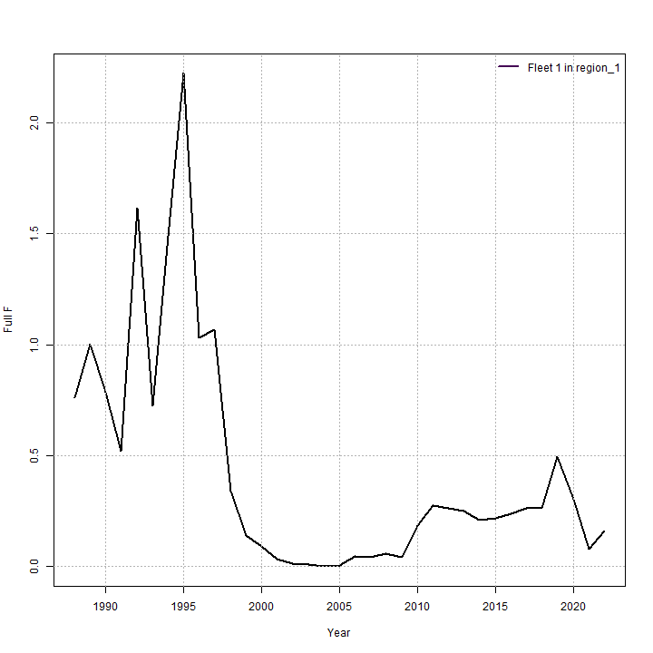
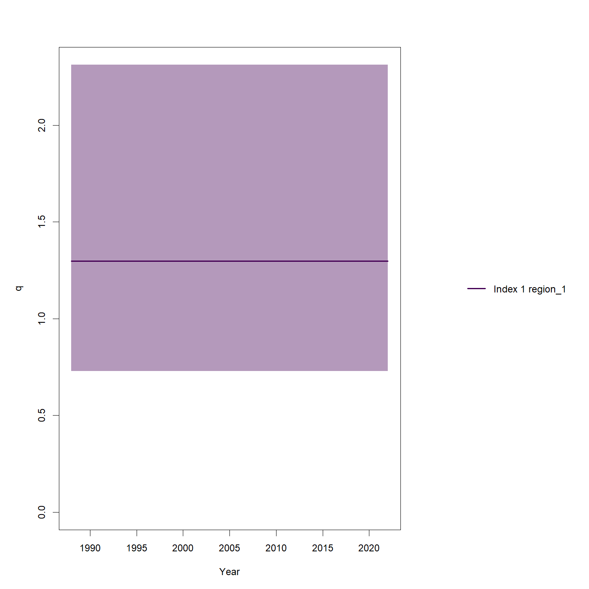
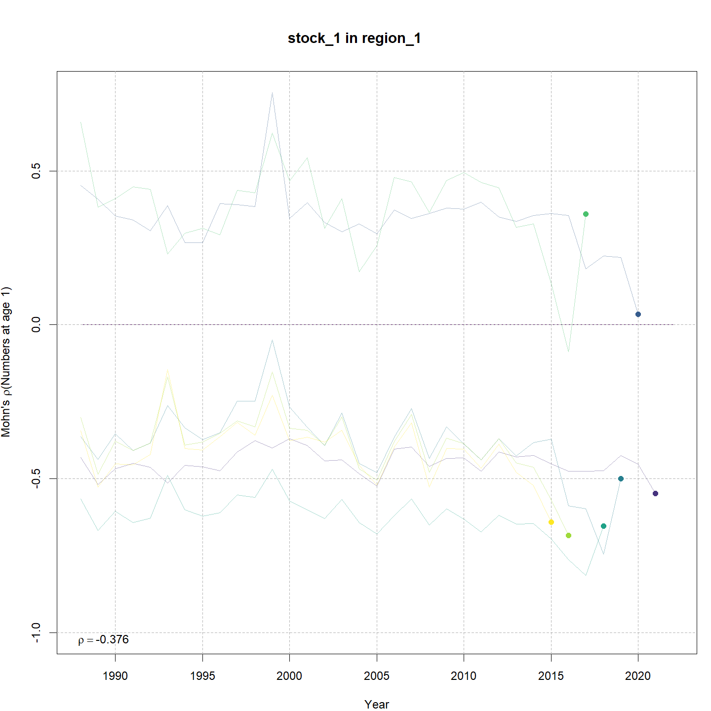
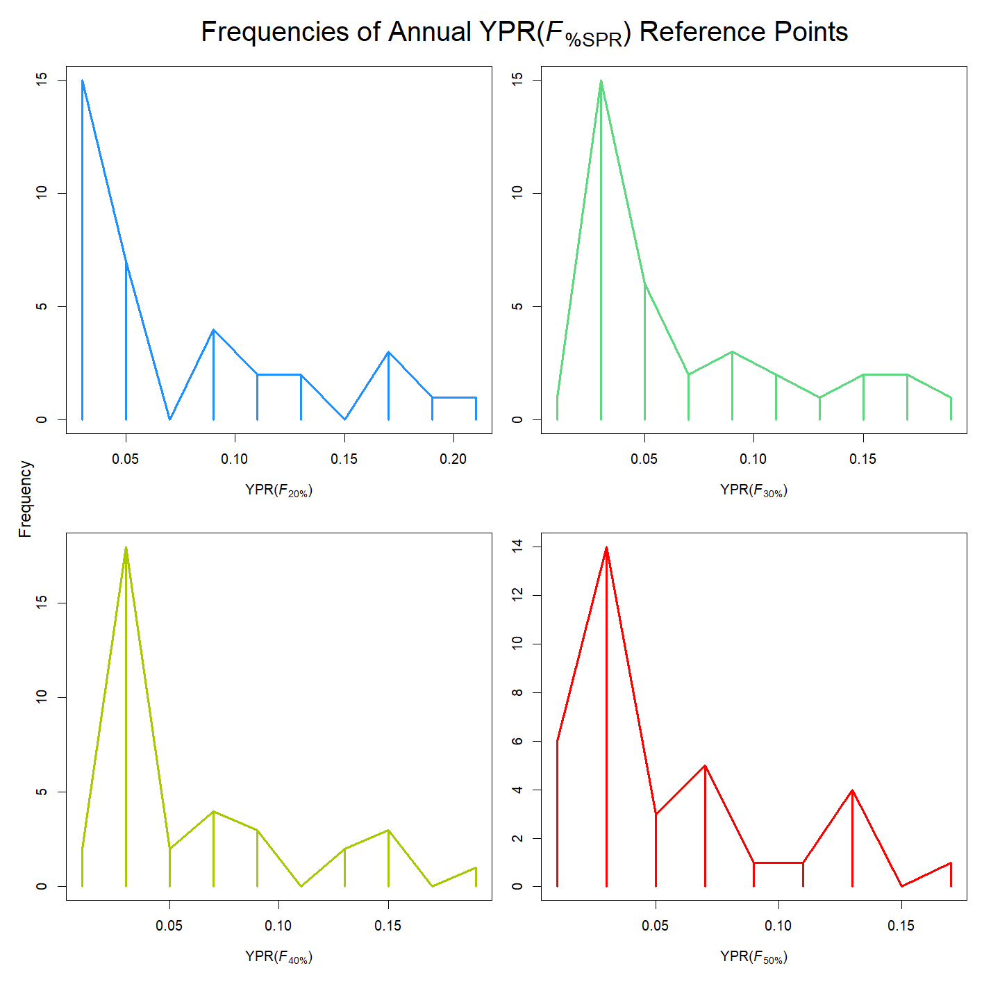

---
output:
  html_document:
    df_print: paged
    keep_md: yes
  word_document: default
  pdf_document:
    fig_caption: yes
    includes:
    keep_tex: yes
    number_sections: no
title: "WHAM figures and tables"
header-includes:
  - \usepackage{longtable}
  - \usepackage{booktabs}
  - \usepackage{caption,graphics}
  - \usepackage{makecell}
  - \usepackage{lscape}
  - \renewcommand\figurename{Fig.}
  - \captionsetup{labelsep=period, singlelinecheck=false}
  - \newcommand{\changesize}[1]{\fontsize{#1pt}{#1pt}\selectfont}
  - \renewcommand{\arraystretch}{1.5}
  - \renewcommand\theadfont{}
---

# {.tabset}

## Figures {.tabset}

### Input

### Diagnostics

### Results

### Retro

### Reference points

### Miscellaneous

## Tables {.tabset}

### Parameter estimates

<table class="table" style="margin-left: auto; margin-right: auto;">
<caption>Parameter estimates, standard errors, and confidence intervals. Rounded to 3 decimal places.</caption>
 <thead>
  <tr>
   <th style="text-align:left;">   </th>
   <th style="text-align:right;"> Estimate </th>
   <th style="text-align:right;"> Std. Error </th>
   <th style="text-align:right;"> 95\% CI lower </th>
   <th style="text-align:right;"> 95\% CI upper </th>
  </tr>
 </thead>
<tbody>
  <tr>
   <td style="text-align:left;"> stock 1 Mean Recruitment </td>
   <td style="text-align:right;"> $25579.824$ </td>
   <td style="text-align:right;"> $11621.186$ </td>
   <td style="text-align:right;"> $10499.960$ </td>
   <td style="text-align:right;"> $62317.134$ </td>
  </tr>
  <tr>
   <td style="text-align:left;"> stock 1 NAA $\sigma$ (age 1) </td>
   <td style="text-align:right;"> $2.357$ </td>
   <td style="text-align:right;"> $0.312$ </td>
   <td style="text-align:right;"> $1.818$ </td>
   <td style="text-align:right;"> $3.056$ </td>
  </tr>
  <tr>
   <td style="text-align:left;"> stock 1 NAA $\sigma$ (ages 2-8+) </td>
   <td style="text-align:right;"> $0.553$ </td>
   <td style="text-align:right;"> $0.061$ </td>
   <td style="text-align:right;"> $0.445$ </td>
   <td style="text-align:right;"> $0.686$ </td>
  </tr>
  <tr>
   <td style="text-align:left;"> Index 1 fully selected q </td>
   <td style="text-align:right;"> $1.459$ </td>
   <td style="text-align:right;"> $0.284$ </td>
   <td style="text-align:right;"> $0.996$ </td>
   <td style="text-align:right;"> $2.136$ </td>
  </tr>
  <tr>
   <td style="text-align:left;"> Block 1: Fleet 1 Mean Selectivity for age 1 </td>
   <td style="text-align:right;"> $1.700\times 10^{-6}$ </td>
   <td style="text-align:right;"> $1.695\times 10^{-6}$ </td>
   <td style="text-align:right;"> $2.409\times 10^{-7}$ </td>
   <td style="text-align:right;"> $1.200\times 10^{-5}$ </td>
  </tr>
  <tr>
   <td style="text-align:left;"> Block 1: Fleet 1 Mean Selectivity for age 2 </td>
   <td style="text-align:right;"> $6.060\times 10^{-4}$ </td>
   <td style="text-align:right;"> $3.722\times 10^{-4}$ </td>
   <td style="text-align:right;"> $1.817\times 10^{-4}$ </td>
   <td style="text-align:right;"> $0.002$ </td>
  </tr>
  <tr>
   <td style="text-align:left;"> Block 1: Fleet 1 Mean Selectivity for age 3 </td>
   <td style="text-align:right;"> $0.011$ </td>
   <td style="text-align:right;"> $0.006$ </td>
   <td style="text-align:right;"> $0.004$ </td>
   <td style="text-align:right;"> $0.034$ </td>
  </tr>
  <tr>
   <td style="text-align:left;"> Block 1: Fleet 1 Mean Selectivity for age 4 </td>
   <td style="text-align:right;"> $0.023$ </td>
   <td style="text-align:right;"> $0.013$ </td>
   <td style="text-align:right;"> $0.008$ </td>
   <td style="text-align:right;"> $0.066$ </td>
  </tr>
  <tr>
   <td style="text-align:left;"> Block 1: Fleet 1 Mean Selectivity for age 5 </td>
   <td style="text-align:right;"> $0.031$ </td>
   <td style="text-align:right;"> $0.017$ </td>
   <td style="text-align:right;"> $0.010$ </td>
   <td style="text-align:right;"> $0.090$ </td>
  </tr>
  <tr>
   <td style="text-align:left;"> Block 1: Fleet 1 Mean Selectivity for age 6 </td>
   <td style="text-align:right;"> $0.035$ </td>
   <td style="text-align:right;"> $0.020$ </td>
   <td style="text-align:right;"> $0.012$ </td>
   <td style="text-align:right;"> $0.102$ </td>
  </tr>
  <tr>
   <td style="text-align:left;"> Block 1: Fleet 1 Mean Selectivity for age 7 </td>
   <td style="text-align:right;"> $0.037$ </td>
   <td style="text-align:right;"> $0.021$ </td>
   <td style="text-align:right;"> $0.012$ </td>
   <td style="text-align:right;"> $0.111$ </td>
  </tr>
  <tr>
   <td style="text-align:left;"> Block 1: Fleet 1 Mean Selectivity for age 8+ </td>
   <td style="text-align:right;"> $0.036$ </td>
   <td style="text-align:right;"> $0.023$ </td>
   <td style="text-align:right;"> $0.010$ </td>
   <td style="text-align:right;"> $0.119$ </td>
  </tr>
  <tr>
   <td style="text-align:left;"> Block 2: Index 1 $a_{50}$ </td>
   <td style="text-align:right;"> $1.901$ </td>
   <td style="text-align:right;"> $0.248$ </td>
   <td style="text-align:right;"> $1.458$ </td>
   <td style="text-align:right;"> $2.428$ </td>
  </tr>
  <tr>
   <td style="text-align:left;"> Block 2: Index 1 1/slope (increasing) </td>
   <td style="text-align:right;"> $0.546$ </td>
   <td style="text-align:right;"> $0.111$ </td>
   <td style="text-align:right;"> $0.365$ </td>
   <td style="text-align:right;"> $0.807$ </td>
  </tr>
  <tr>
   <td style="text-align:left;"> Block 1: Fleet 1 Selectivity RE $\sigma$ </td>
   <td style="text-align:right;"> $0.500$ </td>
   <td style="text-align:right;"> $0.069$ </td>
   <td style="text-align:right;"> $0.381$ </td>
   <td style="text-align:right;"> $0.656$ </td>
  </tr>
  <tr>
   <td style="text-align:left;"> Block 1: Fleet 1 Selectivity RE AR1 $\rho$ (age) </td>
   <td style="text-align:right;"> $0.901$ </td>
   <td style="text-align:right;"> $0.030$ </td>
   <td style="text-align:right;"> $0.824$ </td>
   <td style="text-align:right;"> $0.946$ </td>
  </tr>
  <tr>
   <td style="text-align:left;"> Block 1: Fleet 1 Selectivity RE AR1 $\rho$ (year) </td>
   <td style="text-align:right;"> $0.655$ </td>
   <td style="text-align:right;"> $0.081$ </td>
   <td style="text-align:right;"> $0.467$ </td>
   <td style="text-align:right;"> $0.787$ </td>
  </tr>
</tbody>
</table>

### Abundance at age

<table class="table" style="margin-left: auto; margin-right: auto;">
<caption>Abundance at age (1000s) for stock 1 in region 1.</caption>
 <thead>
  <tr>
   <th style="text-align:left;">   </th>
   <th style="text-align:right;"> 1 </th>
   <th style="text-align:right;"> 2 </th>
   <th style="text-align:right;"> 3 </th>
   <th style="text-align:right;"> 4 </th>
   <th style="text-align:right;"> 5 </th>
   <th style="text-align:right;"> 6 </th>
   <th style="text-align:right;"> 7 </th>
   <th style="text-align:right;"> 8+ </th>
  </tr>
 </thead>
<tbody>
  <tr>
   <td style="text-align:left;"> 1988 </td>
   <td style="text-align:right;"> 289376 </td>
   <td style="text-align:right;"> 75847 </td>
   <td style="text-align:right;"> 41115 </td>
   <td style="text-align:right;"> 23825 </td>
   <td style="text-align:right;"> 11155 </td>
   <td style="text-align:right;"> 3916 </td>
   <td style="text-align:right;"> 1049 </td>
   <td style="text-align:right;"> 388 </td>
  </tr>
  <tr>
   <td style="text-align:left;"> 1989 </td>
   <td style="text-align:right;"> 101956 </td>
   <td style="text-align:right;"> 39827 </td>
   <td style="text-align:right;"> 59026 </td>
   <td style="text-align:right;"> 44064 </td>
   <td style="text-align:right;"> 15226 </td>
   <td style="text-align:right;"> 4142 </td>
   <td style="text-align:right;"> 1225 </td>
   <td style="text-align:right;"> 465 </td>
  </tr>
  <tr>
   <td style="text-align:left;"> 1990 </td>
   <td style="text-align:right;"> 50062 </td>
   <td style="text-align:right;"> 26392 </td>
   <td style="text-align:right;"> 9535 </td>
   <td style="text-align:right;"> 28607 </td>
   <td style="text-align:right;"> 20345 </td>
   <td style="text-align:right;"> 4877 </td>
   <td style="text-align:right;"> 848 </td>
   <td style="text-align:right;"> 396 </td>
  </tr>
  <tr>
   <td style="text-align:left;"> 1991 </td>
   <td style="text-align:right;"> 864325 </td>
   <td style="text-align:right;"> 27164 </td>
   <td style="text-align:right;"> 17206 </td>
   <td style="text-align:right;"> 5042 </td>
   <td style="text-align:right;"> 7903 </td>
   <td style="text-align:right;"> 4630 </td>
   <td style="text-align:right;"> 1216 </td>
   <td style="text-align:right;"> 365 </td>
  </tr>
  <tr>
   <td style="text-align:left;"> 1992 </td>
   <td style="text-align:right;"> 743060 </td>
   <td style="text-align:right;"> 129759 </td>
   <td style="text-align:right;"> 15590 </td>
   <td style="text-align:right;"> 6926 </td>
   <td style="text-align:right;"> 3668 </td>
   <td style="text-align:right;"> 3765 </td>
   <td style="text-align:right;"> 1852 </td>
   <td style="text-align:right;"> 753 </td>
  </tr>
  <tr>
   <td style="text-align:left;"> 1993 </td>
   <td style="text-align:right;"> 8741 </td>
   <td style="text-align:right;"> 151876 </td>
   <td style="text-align:right;"> 57397 </td>
   <td style="text-align:right;"> 3693 </td>
   <td style="text-align:right;"> 1102 </td>
   <td style="text-align:right;"> 512 </td>
   <td style="text-align:right;"> 568 </td>
   <td style="text-align:right;"> 523 </td>
  </tr>
  <tr>
   <td style="text-align:left;"> 1994 </td>
   <td style="text-align:right;"> 61119 </td>
   <td style="text-align:right;"> 2147 </td>
   <td style="text-align:right;"> 39036 </td>
   <td style="text-align:right;"> 17822 </td>
   <td style="text-align:right;"> 1861 </td>
   <td style="text-align:right;"> 452 </td>
   <td style="text-align:right;"> 179 </td>
   <td style="text-align:right;"> 458 </td>
  </tr>
  <tr>
   <td style="text-align:left;"> 1995 </td>
   <td style="text-align:right;"> 15030 </td>
   <td style="text-align:right;"> 18495 </td>
   <td style="text-align:right;"> 1078 </td>
   <td style="text-align:right;"> 7467 </td>
   <td style="text-align:right;"> 2666 </td>
   <td style="text-align:right;"> 468 </td>
   <td style="text-align:right;"> 85 </td>
   <td style="text-align:right;"> 168 </td>
  </tr>
  <tr>
   <td style="text-align:left;"> 1996 </td>
   <td style="text-align:right;"> 1095 </td>
   <td style="text-align:right;"> 5007 </td>
   <td style="text-align:right;"> 7477 </td>
   <td style="text-align:right;"> 548 </td>
   <td style="text-align:right;"> 1517 </td>
   <td style="text-align:right;"> 284 </td>
   <td style="text-align:right;"> 30 </td>
   <td style="text-align:right;"> 22 </td>
  </tr>
  <tr>
   <td style="text-align:left;"> 1997 </td>
   <td style="text-align:right;"> 783 </td>
   <td style="text-align:right;"> 241 </td>
   <td style="text-align:right;"> 3310 </td>
   <td style="text-align:right;"> 3283 </td>
   <td style="text-align:right;"> 326 </td>
   <td style="text-align:right;"> 629 </td>
   <td style="text-align:right;"> 71 </td>
   <td style="text-align:right;"> 12 </td>
  </tr>
  <tr>
   <td style="text-align:left;"> 1998 </td>
   <td style="text-align:right;"> 867 </td>
   <td style="text-align:right;"> 192 </td>
   <td style="text-align:right;"> 117 </td>
   <td style="text-align:right;"> 1182 </td>
   <td style="text-align:right;"> 1355 </td>
   <td style="text-align:right;"> 98 </td>
   <td style="text-align:right;"> 93 </td>
   <td style="text-align:right;"> 16 </td>
  </tr>
  <tr>
   <td style="text-align:left;"> 1999 </td>
   <td style="text-align:right;"> 67 </td>
   <td style="text-align:right;"> 271 </td>
   <td style="text-align:right;"> 115 </td>
   <td style="text-align:right;"> 98 </td>
   <td style="text-align:right;"> 686 </td>
   <td style="text-align:right;"> 474 </td>
   <td style="text-align:right;"> 35 </td>
   <td style="text-align:right;"> 33 </td>
  </tr>
  <tr>
   <td style="text-align:left;"> 2000 </td>
   <td style="text-align:right;"> 2719 </td>
   <td style="text-align:right;"> 13 </td>
   <td style="text-align:right;"> 377 </td>
   <td style="text-align:right;"> 81 </td>
   <td style="text-align:right;"> 49 </td>
   <td style="text-align:right;"> 342 </td>
   <td style="text-align:right;"> 159 </td>
   <td style="text-align:right;"> 35 </td>
  </tr>
  <tr>
   <td style="text-align:left;"> 2001 </td>
   <td style="text-align:right;"> 3730 </td>
   <td style="text-align:right;"> 2736 </td>
   <td style="text-align:right;"> 5 </td>
   <td style="text-align:right;"> 143 </td>
   <td style="text-align:right;"> 72 </td>
   <td style="text-align:right;"> 22 </td>
   <td style="text-align:right;"> 153 </td>
   <td style="text-align:right;"> 126 </td>
  </tr>
  <tr>
   <td style="text-align:left;"> 2002 </td>
   <td style="text-align:right;"> 1185 </td>
   <td style="text-align:right;"> 951 </td>
   <td style="text-align:right;"> 951 </td>
   <td style="text-align:right;"> 3 </td>
   <td style="text-align:right;"> 94 </td>
   <td style="text-align:right;"> 51 </td>
   <td style="text-align:right;"> 15 </td>
   <td style="text-align:right;"> 157 </td>
  </tr>
  <tr>
   <td style="text-align:left;"> 2003 </td>
   <td style="text-align:right;"> 7675 </td>
   <td style="text-align:right;"> 258 </td>
   <td style="text-align:right;"> 477 </td>
   <td style="text-align:right;"> 416 </td>
   <td style="text-align:right;"> 2 </td>
   <td style="text-align:right;"> 63 </td>
   <td style="text-align:right;"> 32 </td>
   <td style="text-align:right;"> 93 </td>
  </tr>
  <tr>
   <td style="text-align:left;"> 2004 </td>
   <td style="text-align:right;"> 4274 </td>
   <td style="text-align:right;"> 3095 </td>
   <td style="text-align:right;"> 127 </td>
   <td style="text-align:right;"> 398 </td>
   <td style="text-align:right;"> 260 </td>
   <td style="text-align:right;"> 2 </td>
   <td style="text-align:right;"> 39 </td>
   <td style="text-align:right;"> 68 </td>
  </tr>
  <tr>
   <td style="text-align:left;"> 2005 </td>
   <td style="text-align:right;"> 46233 </td>
   <td style="text-align:right;"> 911 </td>
   <td style="text-align:right;"> 1831 </td>
   <td style="text-align:right;"> 82 </td>
   <td style="text-align:right;"> 385 </td>
   <td style="text-align:right;"> 176 </td>
   <td style="text-align:right;"> 1 </td>
   <td style="text-align:right;"> 61 </td>
  </tr>
  <tr>
   <td style="text-align:left;"> 2006 </td>
   <td style="text-align:right;"> 160339 </td>
   <td style="text-align:right;"> 9497 </td>
   <td style="text-align:right;"> 396 </td>
   <td style="text-align:right;"> 1567 </td>
   <td style="text-align:right;"> 59 </td>
   <td style="text-align:right;"> 393 </td>
   <td style="text-align:right;"> 111 </td>
   <td style="text-align:right;"> 35 </td>
  </tr>
  <tr>
   <td style="text-align:left;"> 2007 </td>
   <td style="text-align:right;"> 41189 </td>
   <td style="text-align:right;"> 22357 </td>
   <td style="text-align:right;"> 5684 </td>
   <td style="text-align:right;"> 152 </td>
   <td style="text-align:right;"> 1297 </td>
   <td style="text-align:right;"> 44 </td>
   <td style="text-align:right;"> 363 </td>
   <td style="text-align:right;"> 118 </td>
  </tr>
  <tr>
   <td style="text-align:left;"> 2008 </td>
   <td style="text-align:right;"> 62563 </td>
   <td style="text-align:right;"> 14613 </td>
   <td style="text-align:right;"> 14132 </td>
   <td style="text-align:right;"> 4481 </td>
   <td style="text-align:right;"> 100 </td>
   <td style="text-align:right;"> 1106 </td>
   <td style="text-align:right;"> 29 </td>
   <td style="text-align:right;"> 315 </td>
  </tr>
  <tr>
   <td style="text-align:left;"> 2009 </td>
   <td style="text-align:right;"> 62118 </td>
   <td style="text-align:right;"> 16558 </td>
   <td style="text-align:right;"> 10347 </td>
   <td style="text-align:right;"> 10451 </td>
   <td style="text-align:right;"> 3600 </td>
   <td style="text-align:right;"> 63 </td>
   <td style="text-align:right;"> 805 </td>
   <td style="text-align:right;"> 203 </td>
  </tr>
  <tr>
   <td style="text-align:left;"> 2010 </td>
   <td style="text-align:right;"> 502926 </td>
   <td style="text-align:right;"> 37846 </td>
   <td style="text-align:right;"> 10496 </td>
   <td style="text-align:right;"> 8287 </td>
   <td style="text-align:right;"> 5041 </td>
   <td style="text-align:right;"> 2652 </td>
   <td style="text-align:right;"> 41 </td>
   <td style="text-align:right;"> 704 </td>
  </tr>
  <tr>
   <td style="text-align:left;"> 2011 </td>
   <td style="text-align:right;"> 2006431 </td>
   <td style="text-align:right;"> 84082 </td>
   <td style="text-align:right;"> 18297 </td>
   <td style="text-align:right;"> 8430 </td>
   <td style="text-align:right;"> 6359 </td>
   <td style="text-align:right;"> 3349 </td>
   <td style="text-align:right;"> 1876 </td>
   <td style="text-align:right;"> 421 </td>
  </tr>
  <tr>
   <td style="text-align:left;"> 2012 </td>
   <td style="text-align:right;"> 815255 </td>
   <td style="text-align:right;"> 204070 </td>
   <td style="text-align:right;"> 22780 </td>
   <td style="text-align:right;"> 9090 </td>
   <td style="text-align:right;"> 6298 </td>
   <td style="text-align:right;"> 4177 </td>
   <td style="text-align:right;"> 1739 </td>
   <td style="text-align:right;"> 1445 </td>
  </tr>
  <tr>
   <td style="text-align:left;"> 2013 </td>
   <td style="text-align:right;"> 48183 </td>
   <td style="text-align:right;"> 153502 </td>
   <td style="text-align:right;"> 55967 </td>
   <td style="text-align:right;"> 9781 </td>
   <td style="text-align:right;"> 6939 </td>
   <td style="text-align:right;"> 4200 </td>
   <td style="text-align:right;"> 2389 </td>
   <td style="text-align:right;"> 1763 </td>
  </tr>
  <tr>
   <td style="text-align:left;"> 2014 </td>
   <td style="text-align:right;"> 71330 </td>
   <td style="text-align:right;"> 10214 </td>
   <td style="text-align:right;"> 38114 </td>
   <td style="text-align:right;"> 38499 </td>
   <td style="text-align:right;"> 12986 </td>
   <td style="text-align:right;"> 5461 </td>
   <td style="text-align:right;"> 2727 </td>
   <td style="text-align:right;"> 2347 </td>
  </tr>
  <tr>
   <td style="text-align:left;"> 2015 </td>
   <td style="text-align:right;"> 24506 </td>
   <td style="text-align:right;"> 23063 </td>
   <td style="text-align:right;"> 7094 </td>
   <td style="text-align:right;"> 19217 </td>
   <td style="text-align:right;"> 14046 </td>
   <td style="text-align:right;"> 16540 </td>
   <td style="text-align:right;"> 3283 </td>
   <td style="text-align:right;"> 2663 </td>
  </tr>
  <tr>
   <td style="text-align:left;"> 2016 </td>
   <td style="text-align:right;"> 8662 </td>
   <td style="text-align:right;"> 8764 </td>
   <td style="text-align:right;"> 15167 </td>
   <td style="text-align:right;"> 4256 </td>
   <td style="text-align:right;"> 13777 </td>
   <td style="text-align:right;"> 10230 </td>
   <td style="text-align:right;"> 6006 </td>
   <td style="text-align:right;"> 3436 </td>
  </tr>
  <tr>
   <td style="text-align:left;"> 2017 </td>
   <td style="text-align:right;"> 55471 </td>
   <td style="text-align:right;"> 2717 </td>
   <td style="text-align:right;"> 6270 </td>
   <td style="text-align:right;"> 12132 </td>
   <td style="text-align:right;"> 2452 </td>
   <td style="text-align:right;"> 9338 </td>
   <td style="text-align:right;"> 6134 </td>
   <td style="text-align:right;"> 5355 </td>
  </tr>
  <tr>
   <td style="text-align:left;"> 2018 </td>
   <td style="text-align:right;"> 30016 </td>
   <td style="text-align:right;"> 14825 </td>
   <td style="text-align:right;"> 1766 </td>
   <td style="text-align:right;"> 5386 </td>
   <td style="text-align:right;"> 9345 </td>
   <td style="text-align:right;"> 1344 </td>
   <td style="text-align:right;"> 5139 </td>
   <td style="text-align:right;"> 5897 </td>
  </tr>
  <tr>
   <td style="text-align:left;"> 2019 </td>
   <td style="text-align:right;"> 110808 </td>
   <td style="text-align:right;"> 8167 </td>
   <td style="text-align:right;"> 8851 </td>
   <td style="text-align:right;"> 1446 </td>
   <td style="text-align:right;"> 4998 </td>
   <td style="text-align:right;"> 7311 </td>
   <td style="text-align:right;"> 630 </td>
   <td style="text-align:right;"> 6228 </td>
  </tr>
  <tr>
   <td style="text-align:left;"> 2020 </td>
   <td style="text-align:right;"> 49501 </td>
   <td style="text-align:right;"> 13735 </td>
   <td style="text-align:right;"> 11978 </td>
   <td style="text-align:right;"> 8138 </td>
   <td style="text-align:right;"> 2208 </td>
   <td style="text-align:right;"> 3039 </td>
   <td style="text-align:right;"> 2607 </td>
   <td style="text-align:right;"> 2743 </td>
  </tr>
  <tr>
   <td style="text-align:left;"> 2021 </td>
   <td style="text-align:right;"> 102046 </td>
   <td style="text-align:right;"> 15385 </td>
   <td style="text-align:right;"> 12940 </td>
   <td style="text-align:right;"> 7773 </td>
   <td style="text-align:right;"> 5121 </td>
   <td style="text-align:right;"> 1193 </td>
   <td style="text-align:right;"> 1505 </td>
   <td style="text-align:right;"> 2400 </td>
  </tr>
  <tr>
   <td style="text-align:left;"> 2022 </td>
   <td style="text-align:right;"> 29605 </td>
   <td style="text-align:right;"> 26227 </td>
   <td style="text-align:right;"> 9314 </td>
   <td style="text-align:right;"> 14268 </td>
   <td style="text-align:right;"> 5274 </td>
   <td style="text-align:right;"> 3426 </td>
   <td style="text-align:right;"> 690 </td>
   <td style="text-align:right;"> 2745 </td>
  </tr>
</tbody>
</table>

### Fishing mortality at age by region

<table class="table" style="margin-left: auto; margin-right: auto;">
<caption>Total fishing mortality at age in region 1.</caption>
 <thead>
  <tr>
   <th style="text-align:left;">   </th>
   <th style="text-align:right;"> 1 </th>
   <th style="text-align:right;"> 2 </th>
   <th style="text-align:right;"> 3 </th>
   <th style="text-align:right;"> 4 </th>
   <th style="text-align:right;"> 5 </th>
   <th style="text-align:right;"> 6 </th>
   <th style="text-align:right;"> 7 </th>
   <th style="text-align:right;"> 8+ </th>
  </tr>
 </thead>
<tbody>
  <tr>
   <td style="text-align:left;"> 1988 </td>
   <td style="text-align:right;"> 0 </td>
   <td style="text-align:right;"> 0.009 </td>
   <td style="text-align:right;"> 0.166 </td>
   <td style="text-align:right;"> 0.415 </td>
   <td style="text-align:right;"> 0.635 </td>
   <td style="text-align:right;"> 0.763 </td>
   <td style="text-align:right;"> 0.784 </td>
   <td style="text-align:right;"> 0.729 </td>
  </tr>
  <tr>
   <td style="text-align:left;"> 1989 </td>
   <td style="text-align:right;"> 0 </td>
   <td style="text-align:right;"> 0.015 </td>
   <td style="text-align:right;"> 0.292 </td>
   <td style="text-align:right;"> 0.687 </td>
   <td style="text-align:right;"> 0.917 </td>
   <td style="text-align:right;"> 1.059 </td>
   <td style="text-align:right;"> 1.047 </td>
   <td style="text-align:right;"> 0.925 </td>
  </tr>
  <tr>
   <td style="text-align:left;"> 1990 </td>
   <td style="text-align:right;"> 0 </td>
   <td style="text-align:right;"> 0.021 </td>
   <td style="text-align:right;"> 0.386 </td>
   <td style="text-align:right;"> 0.879 </td>
   <td style="text-align:right;"> 0.911 </td>
   <td style="text-align:right;"> 0.881 </td>
   <td style="text-align:right;"> 0.823 </td>
   <td style="text-align:right;"> 0.707 </td>
  </tr>
  <tr>
   <td style="text-align:left;"> 1991 </td>
   <td style="text-align:right;"> 0 </td>
   <td style="text-align:right;"> 0.028 </td>
   <td style="text-align:right;"> 0.417 </td>
   <td style="text-align:right;"> 0.591 </td>
   <td style="text-align:right;"> 0.599 </td>
   <td style="text-align:right;"> 0.562 </td>
   <td style="text-align:right;"> 0.496 </td>
   <td style="text-align:right;"> 0.431 </td>
  </tr>
  <tr>
   <td style="text-align:left;"> 1992 </td>
   <td style="text-align:right;"> 0 </td>
   <td style="text-align:right;"> 0.158 </td>
   <td style="text-align:right;"> 1.408 </td>
   <td style="text-align:right;"> 1.709 </td>
   <td style="text-align:right;"> 1.751 </td>
   <td style="text-align:right;"> 1.582 </td>
   <td style="text-align:right;"> 1.373 </td>
   <td style="text-align:right;"> 1.146 </td>
  </tr>
  <tr>
   <td style="text-align:left;"> 1993 </td>
   <td style="text-align:right;"> 0 </td>
   <td style="text-align:right;"> 0.034 </td>
   <td style="text-align:right;"> 0.538 </td>
   <td style="text-align:right;"> 0.735 </td>
   <td style="text-align:right;"> 0.746 </td>
   <td style="text-align:right;"> 0.724 </td>
   <td style="text-align:right;"> 0.650 </td>
   <td style="text-align:right;"> 0.553 </td>
  </tr>
  <tr>
   <td style="text-align:left;"> 1994 </td>
   <td style="text-align:right;"> 0 </td>
   <td style="text-align:right;"> 0.038 </td>
   <td style="text-align:right;"> 0.913 </td>
   <td style="text-align:right;"> 1.477 </td>
   <td style="text-align:right;"> 1.426 </td>
   <td style="text-align:right;"> 1.412 </td>
   <td style="text-align:right;"> 1.249 </td>
   <td style="text-align:right;"> 1.015 </td>
  </tr>
  <tr>
   <td style="text-align:left;"> 1995 </td>
   <td style="text-align:right;"> 0 </td>
   <td style="text-align:right;"> 0.011 </td>
   <td style="text-align:right;"> 0.436 </td>
   <td style="text-align:right;"> 1.290 </td>
   <td style="text-align:right;"> 1.913 </td>
   <td style="text-align:right;"> 2.303 </td>
   <td style="text-align:right;"> 2.224 </td>
   <td style="text-align:right;"> 1.904 </td>
  </tr>
  <tr>
   <td style="text-align:left;"> 1996 </td>
   <td style="text-align:right;"> 0 </td>
   <td style="text-align:right;"> 0.006 </td>
   <td style="text-align:right;"> 0.208 </td>
   <td style="text-align:right;"> 0.391 </td>
   <td style="text-align:right;"> 0.687 </td>
   <td style="text-align:right;"> 0.995 </td>
   <td style="text-align:right;"> 1.055 </td>
   <td style="text-align:right;"> 0.891 </td>
  </tr>
  <tr>
   <td style="text-align:left;"> 1997 </td>
   <td style="text-align:right;"> 0 </td>
   <td style="text-align:right;"> 0.013 </td>
   <td style="text-align:right;"> 0.403 </td>
   <td style="text-align:right;"> 0.433 </td>
   <td style="text-align:right;"> 0.804 </td>
   <td style="text-align:right;"> 1.132 </td>
   <td style="text-align:right;"> 1.143 </td>
   <td style="text-align:right;"> 0.888 </td>
  </tr>
  <tr>
   <td style="text-align:left;"> 1998 </td>
   <td style="text-align:right;"> 0 </td>
   <td style="text-align:right;"> 0.005 </td>
   <td style="text-align:right;"> 0.145 </td>
   <td style="text-align:right;"> 0.175 </td>
   <td style="text-align:right;"> 0.276 </td>
   <td style="text-align:right;"> 0.376 </td>
   <td style="text-align:right;"> 0.317 </td>
   <td style="text-align:right;"> 0.246 </td>
  </tr>
  <tr>
   <td style="text-align:left;"> 1999 </td>
   <td style="text-align:right;"> 0 </td>
   <td style="text-align:right;"> 0.006 </td>
   <td style="text-align:right;"> 0.171 </td>
   <td style="text-align:right;"> 0.144 </td>
   <td style="text-align:right;"> 0.162 </td>
   <td style="text-align:right;"> 0.149 </td>
   <td style="text-align:right;"> 0.105 </td>
   <td style="text-align:right;"> 0.081 </td>
  </tr>
  <tr>
   <td style="text-align:left;"> 2000 </td>
   <td style="text-align:right;"> 0 </td>
   <td style="text-align:right;"> 0.007 </td>
   <td style="text-align:right;"> 0.150 </td>
   <td style="text-align:right;"> 0.039 </td>
   <td style="text-align:right;"> 0.027 </td>
   <td style="text-align:right;"> 0.014 </td>
   <td style="text-align:right;"> 0.011 </td>
   <td style="text-align:right;"> 0.011 </td>
  </tr>
  <tr>
   <td style="text-align:left;"> 2001 </td>
   <td style="text-align:right;"> 0 </td>
   <td style="text-align:right;"> 0.005 </td>
   <td style="text-align:right;"> 0.065 </td>
   <td style="text-align:right;"> 0.034 </td>
   <td style="text-align:right;"> 0.031 </td>
   <td style="text-align:right;"> 0.017 </td>
   <td style="text-align:right;"> 0.017 </td>
   <td style="text-align:right;"> 0.020 </td>
  </tr>
  <tr>
   <td style="text-align:left;"> 2002 </td>
   <td style="text-align:right;"> 0 </td>
   <td style="text-align:right;"> 0.001 </td>
   <td style="text-align:right;"> 0.018 </td>
   <td style="text-align:right;"> 0.014 </td>
   <td style="text-align:right;"> 0.014 </td>
   <td style="text-align:right;"> 0.010 </td>
   <td style="text-align:right;"> 0.010 </td>
   <td style="text-align:right;"> 0.012 </td>
  </tr>
  <tr>
   <td style="text-align:left;"> 2003 </td>
   <td style="text-align:right;"> 0 </td>
   <td style="text-align:right;"> 0.001 </td>
   <td style="text-align:right;"> 0.009 </td>
   <td style="text-align:right;"> 0.009 </td>
   <td style="text-align:right;"> 0.009 </td>
   <td style="text-align:right;"> 0.007 </td>
   <td style="text-align:right;"> 0.008 </td>
   <td style="text-align:right;"> 0.010 </td>
  </tr>
  <tr>
   <td style="text-align:left;"> 2004 </td>
   <td style="text-align:right;"> 0 </td>
   <td style="text-align:right;"> 0.000 </td>
   <td style="text-align:right;"> 0.002 </td>
   <td style="text-align:right;"> 0.002 </td>
   <td style="text-align:right;"> 0.002 </td>
   <td style="text-align:right;"> 0.002 </td>
   <td style="text-align:right;"> 0.002 </td>
   <td style="text-align:right;"> 0.003 </td>
  </tr>
  <tr>
   <td style="text-align:left;"> 2005 </td>
   <td style="text-align:right;"> 0 </td>
   <td style="text-align:right;"> 0.000 </td>
   <td style="text-align:right;"> 0.004 </td>
   <td style="text-align:right;"> 0.004 </td>
   <td style="text-align:right;"> 0.004 </td>
   <td style="text-align:right;"> 0.004 </td>
   <td style="text-align:right;"> 0.004 </td>
   <td style="text-align:right;"> 0.005 </td>
  </tr>
  <tr>
   <td style="text-align:left;"> 2006 </td>
   <td style="text-align:right;"> 0 </td>
   <td style="text-align:right;"> 0.003 </td>
   <td style="text-align:right;"> 0.053 </td>
   <td style="text-align:right;"> 0.062 </td>
   <td style="text-align:right;"> 0.050 </td>
   <td style="text-align:right;"> 0.035 </td>
   <td style="text-align:right;"> 0.034 </td>
   <td style="text-align:right;"> 0.032 </td>
  </tr>
  <tr>
   <td style="text-align:left;"> 2007 </td>
   <td style="text-align:right;"> 0 </td>
   <td style="text-align:right;"> 0.000 </td>
   <td style="text-align:right;"> 0.007 </td>
   <td style="text-align:right;"> 0.015 </td>
   <td style="text-align:right;"> 0.026 </td>
   <td style="text-align:right;"> 0.032 </td>
   <td style="text-align:right;"> 0.048 </td>
   <td style="text-align:right;"> 0.054 </td>
  </tr>
  <tr>
   <td style="text-align:left;"> 2008 </td>
   <td style="text-align:right;"> 0 </td>
   <td style="text-align:right;"> 0.001 </td>
   <td style="text-align:right;"> 0.011 </td>
   <td style="text-align:right;"> 0.027 </td>
   <td style="text-align:right;"> 0.042 </td>
   <td style="text-align:right;"> 0.047 </td>
   <td style="text-align:right;"> 0.064 </td>
   <td style="text-align:right;"> 0.068 </td>
  </tr>
  <tr>
   <td style="text-align:left;"> 2009 </td>
   <td style="text-align:right;"> 0 </td>
   <td style="text-align:right;"> 0.001 </td>
   <td style="text-align:right;"> 0.008 </td>
   <td style="text-align:right;"> 0.023 </td>
   <td style="text-align:right;"> 0.034 </td>
   <td style="text-align:right;"> 0.035 </td>
   <td style="text-align:right;"> 0.046 </td>
   <td style="text-align:right;"> 0.049 </td>
  </tr>
  <tr>
   <td style="text-align:left;"> 2010 </td>
   <td style="text-align:right;"> 0 </td>
   <td style="text-align:right;"> 0.013 </td>
   <td style="text-align:right;"> 0.126 </td>
   <td style="text-align:right;"> 0.209 </td>
   <td style="text-align:right;"> 0.204 </td>
   <td style="text-align:right;"> 0.189 </td>
   <td style="text-align:right;"> 0.207 </td>
   <td style="text-align:right;"> 0.200 </td>
  </tr>
  <tr>
   <td style="text-align:left;"> 2011 </td>
   <td style="text-align:right;"> 0 </td>
   <td style="text-align:right;"> 0.008 </td>
   <td style="text-align:right;"> 0.125 </td>
   <td style="text-align:right;"> 0.207 </td>
   <td style="text-align:right;"> 0.261 </td>
   <td style="text-align:right;"> 0.276 </td>
   <td style="text-align:right;"> 0.304 </td>
   <td style="text-align:right;"> 0.306 </td>
  </tr>
  <tr>
   <td style="text-align:left;"> 2012 </td>
   <td style="text-align:right;"> 0 </td>
   <td style="text-align:right;"> 0.003 </td>
   <td style="text-align:right;"> 0.074 </td>
   <td style="text-align:right;"> 0.119 </td>
   <td style="text-align:right;"> 0.194 </td>
   <td style="text-align:right;"> 0.236 </td>
   <td style="text-align:right;"> 0.281 </td>
   <td style="text-align:right;"> 0.310 </td>
  </tr>
  <tr>
   <td style="text-align:left;"> 2013 </td>
   <td style="text-align:right;"> 0 </td>
   <td style="text-align:right;"> 0.005 </td>
   <td style="text-align:right;"> 0.081 </td>
   <td style="text-align:right;"> 0.129 </td>
   <td style="text-align:right;"> 0.180 </td>
   <td style="text-align:right;"> 0.225 </td>
   <td style="text-align:right;"> 0.268 </td>
   <td style="text-align:right;"> 0.283 </td>
  </tr>
  <tr>
   <td style="text-align:left;"> 2014 </td>
   <td style="text-align:right;"> 0 </td>
   <td style="text-align:right;"> 0.002 </td>
   <td style="text-align:right;"> 0.031 </td>
   <td style="text-align:right;"> 0.109 </td>
   <td style="text-align:right;"> 0.131 </td>
   <td style="text-align:right;"> 0.189 </td>
   <td style="text-align:right;"> 0.229 </td>
   <td style="text-align:right;"> 0.233 </td>
  </tr>
  <tr>
   <td style="text-align:left;"> 2015 </td>
   <td style="text-align:right;"> 0 </td>
   <td style="text-align:right;"> 0.004 </td>
   <td style="text-align:right;"> 0.052 </td>
   <td style="text-align:right;"> 0.106 </td>
   <td style="text-align:right;"> 0.130 </td>
   <td style="text-align:right;"> 0.197 </td>
   <td style="text-align:right;"> 0.235 </td>
   <td style="text-align:right;"> 0.258 </td>
  </tr>
  <tr>
   <td style="text-align:left;"> 2016 </td>
   <td style="text-align:right;"> 0 </td>
   <td style="text-align:right;"> 0.004 </td>
   <td style="text-align:right;"> 0.073 </td>
   <td style="text-align:right;"> 0.173 </td>
   <td style="text-align:right;"> 0.163 </td>
   <td style="text-align:right;"> 0.162 </td>
   <td style="text-align:right;"> 0.208 </td>
   <td style="text-align:right;"> 0.280 </td>
  </tr>
  <tr>
   <td style="text-align:left;"> 2017 </td>
   <td style="text-align:right;"> 0 </td>
   <td style="text-align:right;"> 0.003 </td>
   <td style="text-align:right;"> 0.062 </td>
   <td style="text-align:right;"> 0.154 </td>
   <td style="text-align:right;"> 0.199 </td>
   <td style="text-align:right;"> 0.217 </td>
   <td style="text-align:right;"> 0.248 </td>
   <td style="text-align:right;"> 0.298 </td>
  </tr>
  <tr>
   <td style="text-align:left;"> 2018 </td>
   <td style="text-align:right;"> 0 </td>
   <td style="text-align:right;"> 0.003 </td>
   <td style="text-align:right;"> 0.051 </td>
   <td style="text-align:right;"> 0.134 </td>
   <td style="text-align:right;"> 0.222 </td>
   <td style="text-align:right;"> 0.259 </td>
   <td style="text-align:right;"> 0.264 </td>
   <td style="text-align:right;"> 0.294 </td>
  </tr>
  <tr>
   <td style="text-align:left;"> 2019 </td>
   <td style="text-align:right;"> 0 </td>
   <td style="text-align:right;"> 0.003 </td>
   <td style="text-align:right;"> 0.072 </td>
   <td style="text-align:right;"> 0.218 </td>
   <td style="text-align:right;"> 0.465 </td>
   <td style="text-align:right;"> 0.547 </td>
   <td style="text-align:right;"> 0.497 </td>
   <td style="text-align:right;"> 0.511 </td>
  </tr>
  <tr>
   <td style="text-align:left;"> 2020 </td>
   <td style="text-align:right;"> 0 </td>
   <td style="text-align:right;"> 0.001 </td>
   <td style="text-align:right;"> 0.012 </td>
   <td style="text-align:right;"> 0.075 </td>
   <td style="text-align:right;"> 0.226 </td>
   <td style="text-align:right;"> 0.331 </td>
   <td style="text-align:right;"> 0.327 </td>
   <td style="text-align:right;"> 0.359 </td>
  </tr>
  <tr>
   <td style="text-align:left;"> 2021 </td>
   <td style="text-align:right;"> 0 </td>
   <td style="text-align:right;"> 0.000 </td>
   <td style="text-align:right;"> 0.004 </td>
   <td style="text-align:right;"> 0.020 </td>
   <td style="text-align:right;"> 0.048 </td>
   <td style="text-align:right;"> 0.076 </td>
   <td style="text-align:right;"> 0.077 </td>
   <td style="text-align:right;"> 0.088 </td>
  </tr>
  <tr>
   <td style="text-align:left;"> 2022 </td>
   <td style="text-align:right;"> 0 </td>
   <td style="text-align:right;"> 0.000 </td>
   <td style="text-align:right;"> 0.004 </td>
   <td style="text-align:right;"> 0.031 </td>
   <td style="text-align:right;"> 0.073 </td>
   <td style="text-align:right;"> 0.140 </td>
   <td style="text-align:right;"> 0.152 </td>
   <td style="text-align:right;"> 0.177 </td>
  </tr>
</tbody>
</table>

### Fishing mortality at age by fleet

<table class="table" style="margin-left: auto; margin-right: auto;">
<caption>Total fishing mortality at age in Fleet 1.</caption>
 <thead>
  <tr>
   <th style="text-align:left;">   </th>
   <th style="text-align:right;"> 1 </th>
   <th style="text-align:right;"> 2 </th>
   <th style="text-align:right;"> 3 </th>
   <th style="text-align:right;"> 4 </th>
   <th style="text-align:right;"> 5 </th>
   <th style="text-align:right;"> 6 </th>
   <th style="text-align:right;"> 7 </th>
   <th style="text-align:right;"> 8+ </th>
  </tr>
 </thead>
<tbody>
  <tr>
   <td style="text-align:left;"> 1988 </td>
   <td style="text-align:right;"> 0 </td>
   <td style="text-align:right;"> 0.009 </td>
   <td style="text-align:right;"> 0.166 </td>
   <td style="text-align:right;"> 0.415 </td>
   <td style="text-align:right;"> 0.635 </td>
   <td style="text-align:right;"> 0.763 </td>
   <td style="text-align:right;"> 0.784 </td>
   <td style="text-align:right;"> 0.729 </td>
  </tr>
  <tr>
   <td style="text-align:left;"> 1989 </td>
   <td style="text-align:right;"> 0 </td>
   <td style="text-align:right;"> 0.015 </td>
   <td style="text-align:right;"> 0.292 </td>
   <td style="text-align:right;"> 0.687 </td>
   <td style="text-align:right;"> 0.917 </td>
   <td style="text-align:right;"> 1.059 </td>
   <td style="text-align:right;"> 1.047 </td>
   <td style="text-align:right;"> 0.925 </td>
  </tr>
  <tr>
   <td style="text-align:left;"> 1990 </td>
   <td style="text-align:right;"> 0 </td>
   <td style="text-align:right;"> 0.021 </td>
   <td style="text-align:right;"> 0.386 </td>
   <td style="text-align:right;"> 0.879 </td>
   <td style="text-align:right;"> 0.911 </td>
   <td style="text-align:right;"> 0.881 </td>
   <td style="text-align:right;"> 0.823 </td>
   <td style="text-align:right;"> 0.707 </td>
  </tr>
  <tr>
   <td style="text-align:left;"> 1991 </td>
   <td style="text-align:right;"> 0 </td>
   <td style="text-align:right;"> 0.028 </td>
   <td style="text-align:right;"> 0.417 </td>
   <td style="text-align:right;"> 0.591 </td>
   <td style="text-align:right;"> 0.599 </td>
   <td style="text-align:right;"> 0.562 </td>
   <td style="text-align:right;"> 0.496 </td>
   <td style="text-align:right;"> 0.431 </td>
  </tr>
  <tr>
   <td style="text-align:left;"> 1992 </td>
   <td style="text-align:right;"> 0 </td>
   <td style="text-align:right;"> 0.158 </td>
   <td style="text-align:right;"> 1.408 </td>
   <td style="text-align:right;"> 1.709 </td>
   <td style="text-align:right;"> 1.751 </td>
   <td style="text-align:right;"> 1.582 </td>
   <td style="text-align:right;"> 1.373 </td>
   <td style="text-align:right;"> 1.146 </td>
  </tr>
  <tr>
   <td style="text-align:left;"> 1993 </td>
   <td style="text-align:right;"> 0 </td>
   <td style="text-align:right;"> 0.034 </td>
   <td style="text-align:right;"> 0.538 </td>
   <td style="text-align:right;"> 0.735 </td>
   <td style="text-align:right;"> 0.746 </td>
   <td style="text-align:right;"> 0.724 </td>
   <td style="text-align:right;"> 0.650 </td>
   <td style="text-align:right;"> 0.553 </td>
  </tr>
  <tr>
   <td style="text-align:left;"> 1994 </td>
   <td style="text-align:right;"> 0 </td>
   <td style="text-align:right;"> 0.038 </td>
   <td style="text-align:right;"> 0.913 </td>
   <td style="text-align:right;"> 1.477 </td>
   <td style="text-align:right;"> 1.426 </td>
   <td style="text-align:right;"> 1.412 </td>
   <td style="text-align:right;"> 1.249 </td>
   <td style="text-align:right;"> 1.015 </td>
  </tr>
  <tr>
   <td style="text-align:left;"> 1995 </td>
   <td style="text-align:right;"> 0 </td>
   <td style="text-align:right;"> 0.011 </td>
   <td style="text-align:right;"> 0.436 </td>
   <td style="text-align:right;"> 1.290 </td>
   <td style="text-align:right;"> 1.913 </td>
   <td style="text-align:right;"> 2.303 </td>
   <td style="text-align:right;"> 2.224 </td>
   <td style="text-align:right;"> 1.904 </td>
  </tr>
  <tr>
   <td style="text-align:left;"> 1996 </td>
   <td style="text-align:right;"> 0 </td>
   <td style="text-align:right;"> 0.006 </td>
   <td style="text-align:right;"> 0.208 </td>
   <td style="text-align:right;"> 0.391 </td>
   <td style="text-align:right;"> 0.687 </td>
   <td style="text-align:right;"> 0.995 </td>
   <td style="text-align:right;"> 1.055 </td>
   <td style="text-align:right;"> 0.891 </td>
  </tr>
  <tr>
   <td style="text-align:left;"> 1997 </td>
   <td style="text-align:right;"> 0 </td>
   <td style="text-align:right;"> 0.013 </td>
   <td style="text-align:right;"> 0.403 </td>
   <td style="text-align:right;"> 0.433 </td>
   <td style="text-align:right;"> 0.804 </td>
   <td style="text-align:right;"> 1.132 </td>
   <td style="text-align:right;"> 1.143 </td>
   <td style="text-align:right;"> 0.888 </td>
  </tr>
  <tr>
   <td style="text-align:left;"> 1998 </td>
   <td style="text-align:right;"> 0 </td>
   <td style="text-align:right;"> 0.005 </td>
   <td style="text-align:right;"> 0.145 </td>
   <td style="text-align:right;"> 0.175 </td>
   <td style="text-align:right;"> 0.276 </td>
   <td style="text-align:right;"> 0.376 </td>
   <td style="text-align:right;"> 0.317 </td>
   <td style="text-align:right;"> 0.246 </td>
  </tr>
  <tr>
   <td style="text-align:left;"> 1999 </td>
   <td style="text-align:right;"> 0 </td>
   <td style="text-align:right;"> 0.006 </td>
   <td style="text-align:right;"> 0.171 </td>
   <td style="text-align:right;"> 0.144 </td>
   <td style="text-align:right;"> 0.162 </td>
   <td style="text-align:right;"> 0.149 </td>
   <td style="text-align:right;"> 0.105 </td>
   <td style="text-align:right;"> 0.081 </td>
  </tr>
  <tr>
   <td style="text-align:left;"> 2000 </td>
   <td style="text-align:right;"> 0 </td>
   <td style="text-align:right;"> 0.007 </td>
   <td style="text-align:right;"> 0.150 </td>
   <td style="text-align:right;"> 0.039 </td>
   <td style="text-align:right;"> 0.027 </td>
   <td style="text-align:right;"> 0.014 </td>
   <td style="text-align:right;"> 0.011 </td>
   <td style="text-align:right;"> 0.011 </td>
  </tr>
  <tr>
   <td style="text-align:left;"> 2001 </td>
   <td style="text-align:right;"> 0 </td>
   <td style="text-align:right;"> 0.005 </td>
   <td style="text-align:right;"> 0.065 </td>
   <td style="text-align:right;"> 0.034 </td>
   <td style="text-align:right;"> 0.031 </td>
   <td style="text-align:right;"> 0.017 </td>
   <td style="text-align:right;"> 0.017 </td>
   <td style="text-align:right;"> 0.020 </td>
  </tr>
  <tr>
   <td style="text-align:left;"> 2002 </td>
   <td style="text-align:right;"> 0 </td>
   <td style="text-align:right;"> 0.001 </td>
   <td style="text-align:right;"> 0.018 </td>
   <td style="text-align:right;"> 0.014 </td>
   <td style="text-align:right;"> 0.014 </td>
   <td style="text-align:right;"> 0.010 </td>
   <td style="text-align:right;"> 0.010 </td>
   <td style="text-align:right;"> 0.012 </td>
  </tr>
  <tr>
   <td style="text-align:left;"> 2003 </td>
   <td style="text-align:right;"> 0 </td>
   <td style="text-align:right;"> 0.001 </td>
   <td style="text-align:right;"> 0.009 </td>
   <td style="text-align:right;"> 0.009 </td>
   <td style="text-align:right;"> 0.009 </td>
   <td style="text-align:right;"> 0.007 </td>
   <td style="text-align:right;"> 0.008 </td>
   <td style="text-align:right;"> 0.010 </td>
  </tr>
  <tr>
   <td style="text-align:left;"> 2004 </td>
   <td style="text-align:right;"> 0 </td>
   <td style="text-align:right;"> 0.000 </td>
   <td style="text-align:right;"> 0.002 </td>
   <td style="text-align:right;"> 0.002 </td>
   <td style="text-align:right;"> 0.002 </td>
   <td style="text-align:right;"> 0.002 </td>
   <td style="text-align:right;"> 0.002 </td>
   <td style="text-align:right;"> 0.003 </td>
  </tr>
  <tr>
   <td style="text-align:left;"> 2005 </td>
   <td style="text-align:right;"> 0 </td>
   <td style="text-align:right;"> 0.000 </td>
   <td style="text-align:right;"> 0.004 </td>
   <td style="text-align:right;"> 0.004 </td>
   <td style="text-align:right;"> 0.004 </td>
   <td style="text-align:right;"> 0.004 </td>
   <td style="text-align:right;"> 0.004 </td>
   <td style="text-align:right;"> 0.005 </td>
  </tr>
  <tr>
   <td style="text-align:left;"> 2006 </td>
   <td style="text-align:right;"> 0 </td>
   <td style="text-align:right;"> 0.003 </td>
   <td style="text-align:right;"> 0.053 </td>
   <td style="text-align:right;"> 0.062 </td>
   <td style="text-align:right;"> 0.050 </td>
   <td style="text-align:right;"> 0.035 </td>
   <td style="text-align:right;"> 0.034 </td>
   <td style="text-align:right;"> 0.032 </td>
  </tr>
  <tr>
   <td style="text-align:left;"> 2007 </td>
   <td style="text-align:right;"> 0 </td>
   <td style="text-align:right;"> 0.000 </td>
   <td style="text-align:right;"> 0.007 </td>
   <td style="text-align:right;"> 0.015 </td>
   <td style="text-align:right;"> 0.026 </td>
   <td style="text-align:right;"> 0.032 </td>
   <td style="text-align:right;"> 0.048 </td>
   <td style="text-align:right;"> 0.054 </td>
  </tr>
  <tr>
   <td style="text-align:left;"> 2008 </td>
   <td style="text-align:right;"> 0 </td>
   <td style="text-align:right;"> 0.001 </td>
   <td style="text-align:right;"> 0.011 </td>
   <td style="text-align:right;"> 0.027 </td>
   <td style="text-align:right;"> 0.042 </td>
   <td style="text-align:right;"> 0.047 </td>
   <td style="text-align:right;"> 0.064 </td>
   <td style="text-align:right;"> 0.068 </td>
  </tr>
  <tr>
   <td style="text-align:left;"> 2009 </td>
   <td style="text-align:right;"> 0 </td>
   <td style="text-align:right;"> 0.001 </td>
   <td style="text-align:right;"> 0.008 </td>
   <td style="text-align:right;"> 0.023 </td>
   <td style="text-align:right;"> 0.034 </td>
   <td style="text-align:right;"> 0.035 </td>
   <td style="text-align:right;"> 0.046 </td>
   <td style="text-align:right;"> 0.049 </td>
  </tr>
  <tr>
   <td style="text-align:left;"> 2010 </td>
   <td style="text-align:right;"> 0 </td>
   <td style="text-align:right;"> 0.013 </td>
   <td style="text-align:right;"> 0.126 </td>
   <td style="text-align:right;"> 0.209 </td>
   <td style="text-align:right;"> 0.204 </td>
   <td style="text-align:right;"> 0.189 </td>
   <td style="text-align:right;"> 0.207 </td>
   <td style="text-align:right;"> 0.200 </td>
  </tr>
  <tr>
   <td style="text-align:left;"> 2011 </td>
   <td style="text-align:right;"> 0 </td>
   <td style="text-align:right;"> 0.008 </td>
   <td style="text-align:right;"> 0.125 </td>
   <td style="text-align:right;"> 0.207 </td>
   <td style="text-align:right;"> 0.261 </td>
   <td style="text-align:right;"> 0.276 </td>
   <td style="text-align:right;"> 0.304 </td>
   <td style="text-align:right;"> 0.306 </td>
  </tr>
  <tr>
   <td style="text-align:left;"> 2012 </td>
   <td style="text-align:right;"> 0 </td>
   <td style="text-align:right;"> 0.003 </td>
   <td style="text-align:right;"> 0.074 </td>
   <td style="text-align:right;"> 0.119 </td>
   <td style="text-align:right;"> 0.194 </td>
   <td style="text-align:right;"> 0.236 </td>
   <td style="text-align:right;"> 0.281 </td>
   <td style="text-align:right;"> 0.310 </td>
  </tr>
  <tr>
   <td style="text-align:left;"> 2013 </td>
   <td style="text-align:right;"> 0 </td>
   <td style="text-align:right;"> 0.005 </td>
   <td style="text-align:right;"> 0.081 </td>
   <td style="text-align:right;"> 0.129 </td>
   <td style="text-align:right;"> 0.180 </td>
   <td style="text-align:right;"> 0.225 </td>
   <td style="text-align:right;"> 0.268 </td>
   <td style="text-align:right;"> 0.283 </td>
  </tr>
  <tr>
   <td style="text-align:left;"> 2014 </td>
   <td style="text-align:right;"> 0 </td>
   <td style="text-align:right;"> 0.002 </td>
   <td style="text-align:right;"> 0.031 </td>
   <td style="text-align:right;"> 0.109 </td>
   <td style="text-align:right;"> 0.131 </td>
   <td style="text-align:right;"> 0.189 </td>
   <td style="text-align:right;"> 0.229 </td>
   <td style="text-align:right;"> 0.233 </td>
  </tr>
  <tr>
   <td style="text-align:left;"> 2015 </td>
   <td style="text-align:right;"> 0 </td>
   <td style="text-align:right;"> 0.004 </td>
   <td style="text-align:right;"> 0.052 </td>
   <td style="text-align:right;"> 0.106 </td>
   <td style="text-align:right;"> 0.130 </td>
   <td style="text-align:right;"> 0.197 </td>
   <td style="text-align:right;"> 0.235 </td>
   <td style="text-align:right;"> 0.258 </td>
  </tr>
  <tr>
   <td style="text-align:left;"> 2016 </td>
   <td style="text-align:right;"> 0 </td>
   <td style="text-align:right;"> 0.004 </td>
   <td style="text-align:right;"> 0.073 </td>
   <td style="text-align:right;"> 0.173 </td>
   <td style="text-align:right;"> 0.163 </td>
   <td style="text-align:right;"> 0.162 </td>
   <td style="text-align:right;"> 0.208 </td>
   <td style="text-align:right;"> 0.280 </td>
  </tr>
  <tr>
   <td style="text-align:left;"> 2017 </td>
   <td style="text-align:right;"> 0 </td>
   <td style="text-align:right;"> 0.003 </td>
   <td style="text-align:right;"> 0.062 </td>
   <td style="text-align:right;"> 0.154 </td>
   <td style="text-align:right;"> 0.199 </td>
   <td style="text-align:right;"> 0.217 </td>
   <td style="text-align:right;"> 0.248 </td>
   <td style="text-align:right;"> 0.298 </td>
  </tr>
  <tr>
   <td style="text-align:left;"> 2018 </td>
   <td style="text-align:right;"> 0 </td>
   <td style="text-align:right;"> 0.003 </td>
   <td style="text-align:right;"> 0.051 </td>
   <td style="text-align:right;"> 0.134 </td>
   <td style="text-align:right;"> 0.222 </td>
   <td style="text-align:right;"> 0.259 </td>
   <td style="text-align:right;"> 0.264 </td>
   <td style="text-align:right;"> 0.294 </td>
  </tr>
  <tr>
   <td style="text-align:left;"> 2019 </td>
   <td style="text-align:right;"> 0 </td>
   <td style="text-align:right;"> 0.003 </td>
   <td style="text-align:right;"> 0.072 </td>
   <td style="text-align:right;"> 0.218 </td>
   <td style="text-align:right;"> 0.465 </td>
   <td style="text-align:right;"> 0.547 </td>
   <td style="text-align:right;"> 0.497 </td>
   <td style="text-align:right;"> 0.511 </td>
  </tr>
  <tr>
   <td style="text-align:left;"> 2020 </td>
   <td style="text-align:right;"> 0 </td>
   <td style="text-align:right;"> 0.001 </td>
   <td style="text-align:right;"> 0.012 </td>
   <td style="text-align:right;"> 0.075 </td>
   <td style="text-align:right;"> 0.226 </td>
   <td style="text-align:right;"> 0.331 </td>
   <td style="text-align:right;"> 0.327 </td>
   <td style="text-align:right;"> 0.359 </td>
  </tr>
  <tr>
   <td style="text-align:left;"> 2021 </td>
   <td style="text-align:right;"> 0 </td>
   <td style="text-align:right;"> 0.000 </td>
   <td style="text-align:right;"> 0.004 </td>
   <td style="text-align:right;"> 0.020 </td>
   <td style="text-align:right;"> 0.048 </td>
   <td style="text-align:right;"> 0.076 </td>
   <td style="text-align:right;"> 0.077 </td>
   <td style="text-align:right;"> 0.088 </td>
  </tr>
  <tr>
   <td style="text-align:left;"> 2022 </td>
   <td style="text-align:right;"> 0 </td>
   <td style="text-align:right;"> 0.000 </td>
   <td style="text-align:right;"> 0.004 </td>
   <td style="text-align:right;"> 0.031 </td>
   <td style="text-align:right;"> 0.073 </td>
   <td style="text-align:right;"> 0.140 </td>
   <td style="text-align:right;"> 0.152 </td>
   <td style="text-align:right;"> 0.177 </td>
  </tr>
</tbody>
</table>
