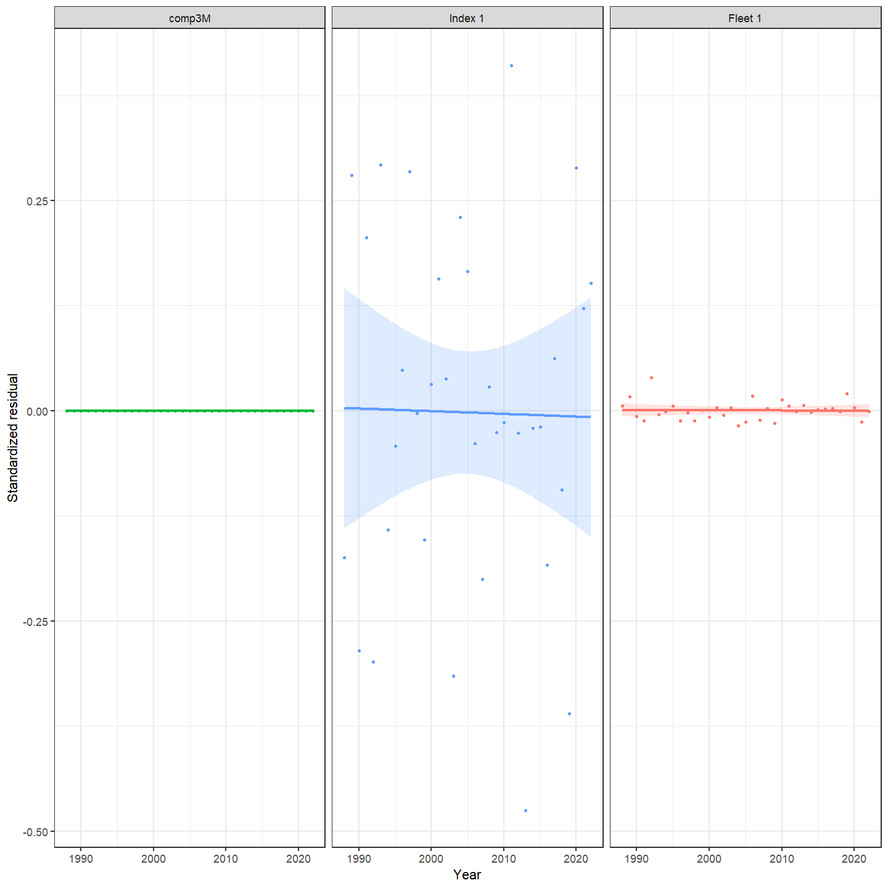
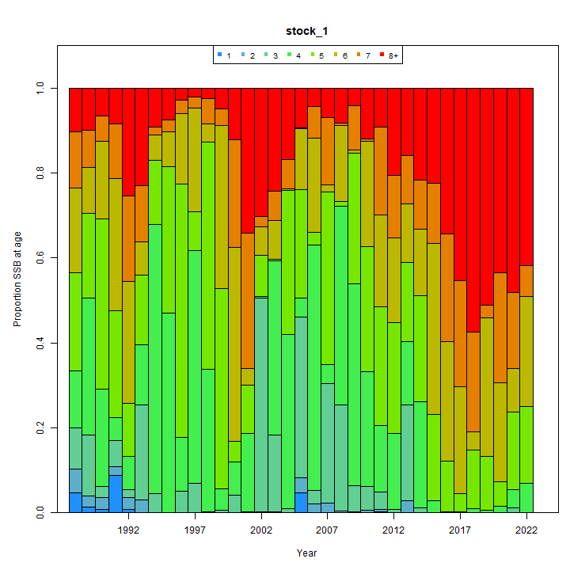
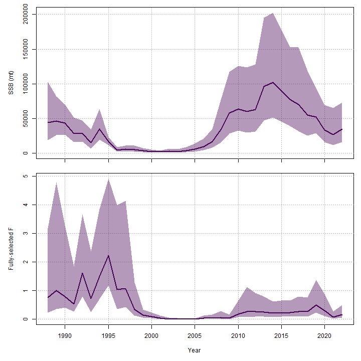
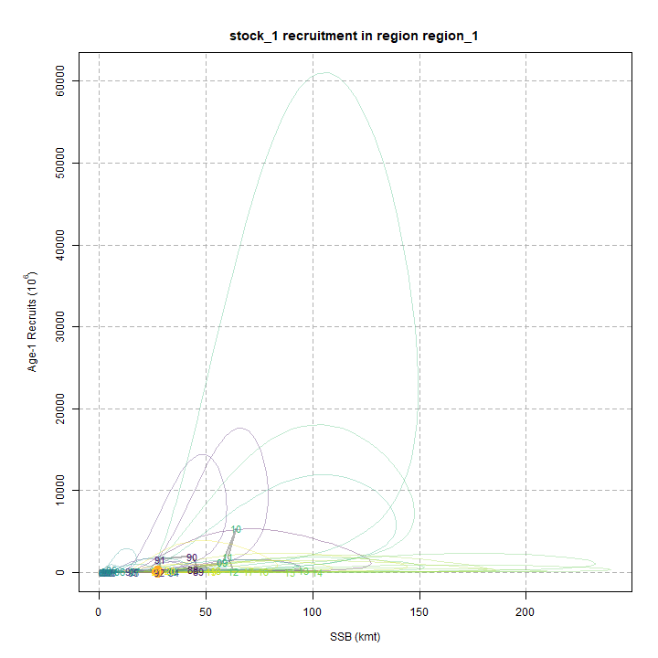
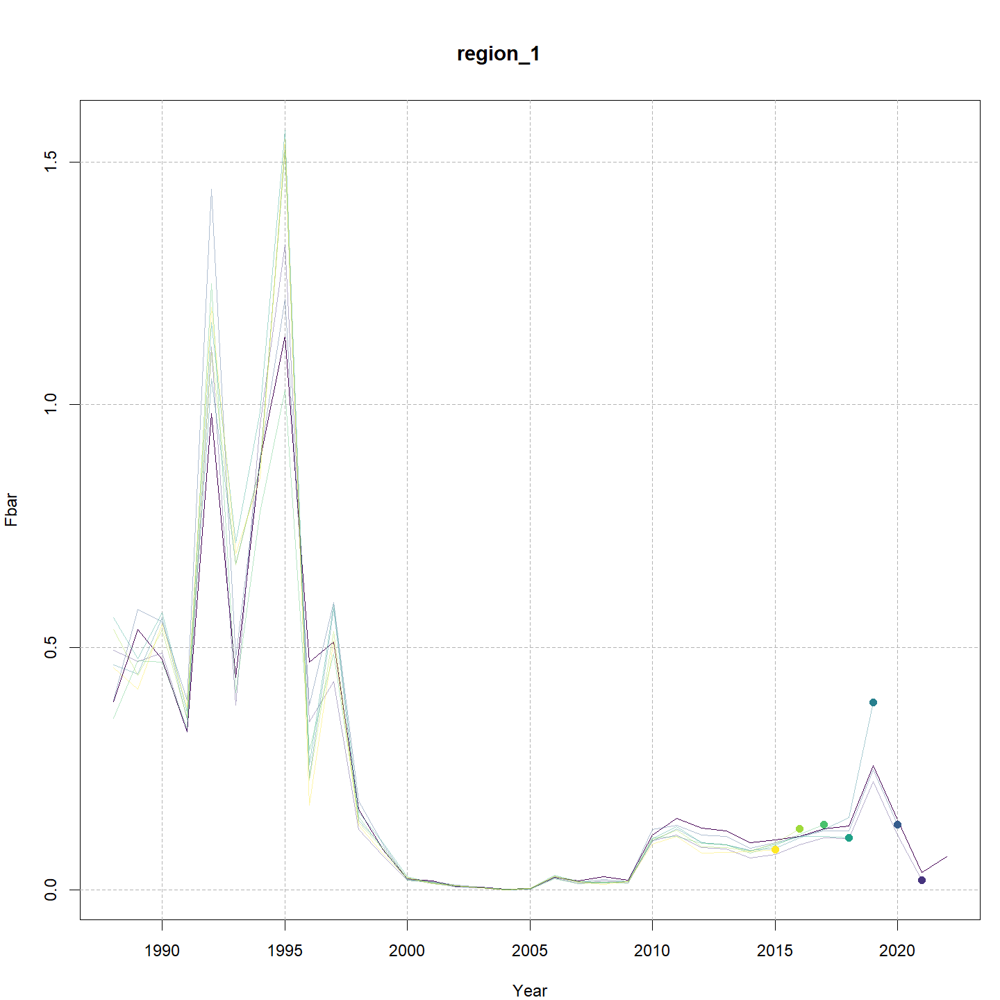
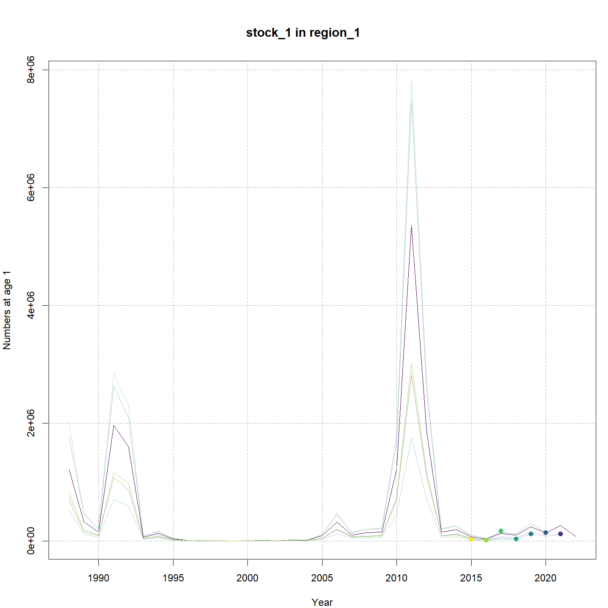
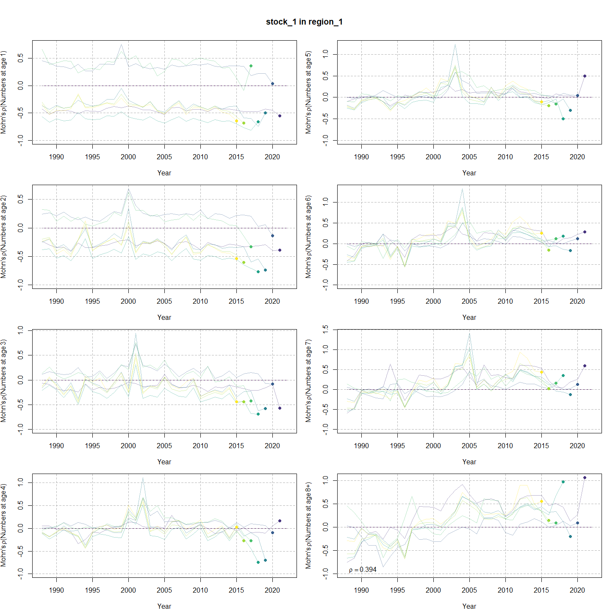
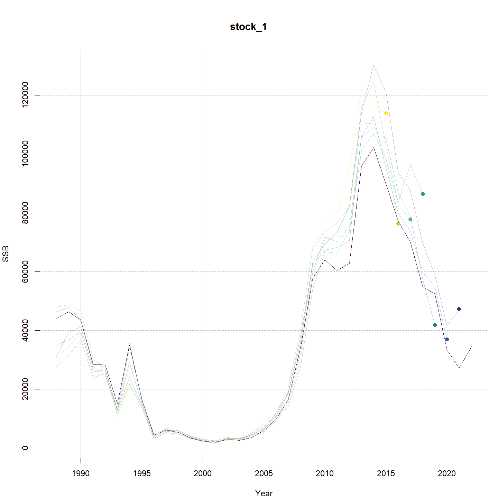

---
output:
  html_document:
    df_print: paged
    keep_md: yes
  word_document: default
  pdf_document:
    fig_caption: yes
    includes:
    keep_tex: yes
    number_sections: no
title: "WHAM figures and tables"
header-includes:
  - \usepackage{longtable}
  - \usepackage{booktabs}
  - \usepackage{caption,graphics}
  - \usepackage{makecell}
  - \usepackage{lscape}
  - \renewcommand\figurename{Fig.}
  - \captionsetup{labelsep=period, singlelinecheck=false}
  - \newcommand{\changesize}[1]{\fontsize{#1pt}{#1pt}\selectfont}
  - \renewcommand{\arraystretch}{1.5}
  - \renewcommand\theadfont{}
---

# {.tabset}

## Figures {.tabset}

### Input

### Diagnostics

### Results

### Retro

### Reference points

### Miscellaneous

## Tables {.tabset}

### Parameter estimates

<table class="table" style="margin-left: auto; margin-right: auto;">
<caption>Parameter estimates, standard errors, and confidence intervals. Rounded to 3 decimal places.</caption>
 <thead>
  <tr>
   <th style="text-align:left;">   </th>
   <th style="text-align:right;"> Estimate </th>
   <th style="text-align:right;"> Std. Error </th>
   <th style="text-align:right;"> 95\% CI lower </th>
   <th style="text-align:right;"> 95\% CI upper </th>
  </tr>
 </thead>
<tbody>
  <tr>
   <td style="text-align:left;"> stock.1.mean.log.Ricker.a..intercept </td>
   <td style="text-align:right;"> $1.449$ </td>
   <td style="text-align:right;"> $1.089$ </td>
   <td style="text-align:right;"> $-0.686$ </td>
   <td style="text-align:right;"> $3.584$ </td>
  </tr>
  <tr>
   <td style="text-align:left;"> stock.1.Ricker.b </td>
   <td style="text-align:right;"> $7.437\times 10^{-6}$ </td>
   <td style="text-align:right;"> $1.895\times 10^{-5}$ </td>
   <td style="text-align:right;"> $5.043\times 10^{-8}$ </td>
   <td style="text-align:right;"> $0.001$ </td>
  </tr>
  <tr>
   <td style="text-align:left;"> stock.1.NAA...sigma...age.1. </td>
   <td style="text-align:right;"> $1.461$ </td>
   <td style="text-align:right;"> $0.228$ </td>
   <td style="text-align:right;"> $1.076$ </td>
   <td style="text-align:right;"> $1.982$ </td>
  </tr>
  <tr>
   <td style="text-align:left;"> stock.1.NAA...sigma...ages.2.8.. </td>
   <td style="text-align:right;"> $0.569$ </td>
   <td style="text-align:right;"> $0.061$ </td>
   <td style="text-align:right;"> $0.461$ </td>
   <td style="text-align:right;"> $0.703$ </td>
  </tr>
  <tr>
   <td style="text-align:left;"> stock.1...Recruitment.AR1...rho..year </td>
   <td style="text-align:right;"> $0.000$ </td>
   <td style="text-align:right;"> -- </td>
   <td style="text-align:right;"> -- </td>
   <td style="text-align:right;"> -- </td>
  </tr>
  <tr>
   <td style="text-align:left;"> Index.1.fully.selected.q </td>
   <td style="text-align:right;"> $1.299$ </td>
   <td style="text-align:right;"> $0.382$ </td>
   <td style="text-align:right;"> $0.729$ </td>
   <td style="text-align:right;"> $2.312$ </td>
  </tr>
  <tr>
   <td style="text-align:left;"> Block.1..Fleet.1.Mean.Selectivity.for.age.1 </td>
   <td style="text-align:right;"> $7.659\times 10^{-7}$ </td>
   <td style="text-align:right;"> $9.397\times 10^{-7}$ </td>
   <td style="text-align:right;"> $6.914\times 10^{-8}$ </td>
   <td style="text-align:right;"> $8.483\times 10^{-6}$ </td>
  </tr>
  <tr>
   <td style="text-align:left;"> Block.1..Fleet.1.Mean.Selectivity.for.age.2 </td>
   <td style="text-align:right;"> $2.710\times 10^{-4}$ </td>
   <td style="text-align:right;"> $2.131\times 10^{-4}$ </td>
   <td style="text-align:right;"> $5.803\times 10^{-5}$ </td>
   <td style="text-align:right;"> $0.001$ </td>
  </tr>
  <tr>
   <td style="text-align:left;"> Block.1..Fleet.1.Mean.Selectivity.for.age.3 </td>
   <td style="text-align:right;"> $0.007$ </td>
   <td style="text-align:right;"> $0.004$ </td>
   <td style="text-align:right;"> $0.002$ </td>
   <td style="text-align:right;"> $0.023$ </td>
  </tr>
  <tr>
   <td style="text-align:left;"> Block.1..Fleet.1.Mean.Selectivity.for.age.4 </td>
   <td style="text-align:right;"> $0.017$ </td>
   <td style="text-align:right;"> $0.010$ </td>
   <td style="text-align:right;"> $0.005$ </td>
   <td style="text-align:right;"> $0.053$ </td>
  </tr>
  <tr>
   <td style="text-align:left;"> Block.1..Fleet.1.Mean.Selectivity.for.age.5 </td>
   <td style="text-align:right;"> $0.027$ </td>
   <td style="text-align:right;"> $0.016$ </td>
   <td style="text-align:right;"> $0.008$ </td>
   <td style="text-align:right;"> $0.081$ </td>
  </tr>
  <tr>
   <td style="text-align:left;"> Block.1..Fleet.1.Mean.Selectivity.for.age.6 </td>
   <td style="text-align:right;"> $0.032$ </td>
   <td style="text-align:right;"> $0.019$ </td>
   <td style="text-align:right;"> $0.010$ </td>
   <td style="text-align:right;"> $0.098$ </td>
  </tr>
  <tr>
   <td style="text-align:left;"> Block.1..Fleet.1.Mean.Selectivity.for.age.7 </td>
   <td style="text-align:right;"> $0.035$ </td>
   <td style="text-align:right;"> $0.021$ </td>
   <td style="text-align:right;"> $0.011$ </td>
   <td style="text-align:right;"> $0.112$ </td>
  </tr>
  <tr>
   <td style="text-align:left;"> Block.1..Fleet.1.Mean.Selectivity.for.age.8. </td>
   <td style="text-align:right;"> $0.032$ </td>
   <td style="text-align:right;"> $0.020$ </td>
   <td style="text-align:right;"> $0.009$ </td>
   <td style="text-align:right;"> $0.108$ </td>
  </tr>
  <tr>
   <td style="text-align:left;"> Block.2..Index.1..a_.50.. </td>
   <td style="text-align:right;"> $2.707$ </td>
   <td style="text-align:right;"> $0.451$ </td>
   <td style="text-align:right;"> $1.903$ </td>
   <td style="text-align:right;"> $3.647$ </td>
  </tr>
  <tr>
   <td style="text-align:left;"> Block.2..Index.1.1.slope..increasing. </td>
   <td style="text-align:right;"> $0.695$ </td>
   <td style="text-align:right;"> $0.125$ </td>
   <td style="text-align:right;"> $0.486$ </td>
   <td style="text-align:right;"> $0.982$ </td>
  </tr>
  <tr>
   <td style="text-align:left;"> Block.1..Fleet.1.Selectivity.RE...sigma. </td>
   <td style="text-align:right;"> $0.504$ </td>
   <td style="text-align:right;"> $0.070$ </td>
   <td style="text-align:right;"> $0.384$ </td>
   <td style="text-align:right;"> $0.661$ </td>
  </tr>
  <tr>
   <td style="text-align:left;"> Block.1..Fleet.1.Selectivity.RE.AR1...rho...age. </td>
   <td style="text-align:right;"> $0.901$ </td>
   <td style="text-align:right;"> $0.030$ </td>
   <td style="text-align:right;"> $0.823$ </td>
   <td style="text-align:right;"> $0.946$ </td>
  </tr>
  <tr>
   <td style="text-align:left;"> Block.1..Fleet.1.Selectivity.RE.AR1...rho...year. </td>
   <td style="text-align:right;"> $0.651$ </td>
   <td style="text-align:right;"> $0.082$ </td>
   <td style="text-align:right;"> $0.461$ </td>
   <td style="text-align:right;"> $0.784$ </td>
  </tr>
  <tr>
   <td style="text-align:left;"> stock.1.region.1.mean.log.M..intercept.for.log.WAA..effects </td>
   <td style="text-align:right;"> $-0.546$ </td>
   <td style="text-align:right;"> $0.228$ </td>
   <td style="text-align:right;"> $-0.992$ </td>
   <td style="text-align:right;"> $-0.099$ </td>
  </tr>
  <tr>
   <td style="text-align:left;"> stock.1.region.1.mean.log.M..intercept.for.log.WAA..effects.1 </td>
   <td style="text-align:right;"> $-0.546$ </td>
   <td style="text-align:right;"> $0.228$ </td>
   <td style="text-align:right;"> $-0.992$ </td>
   <td style="text-align:right;"> $-0.099$ </td>
  </tr>
  <tr>
   <td style="text-align:left;"> stock.1.region.1.mean.log.M..intercept.for.log.WAA..effects.2 </td>
   <td style="text-align:right;"> $-0.546$ </td>
   <td style="text-align:right;"> $0.228$ </td>
   <td style="text-align:right;"> $-0.992$ </td>
   <td style="text-align:right;"> $-0.099$ </td>
  </tr>
  <tr>
   <td style="text-align:left;"> stock.1.region.1.mean.log.M..intercept.for.log.WAA..effects.3 </td>
   <td style="text-align:right;"> $-0.546$ </td>
   <td style="text-align:right;"> $0.228$ </td>
   <td style="text-align:right;"> $-0.992$ </td>
   <td style="text-align:right;"> $-0.099$ </td>
  </tr>
  <tr>
   <td style="text-align:left;"> stock.1.region.1.mean.log.M..intercept.for.log.WAA..effects.4 </td>
   <td style="text-align:right;"> $-0.546$ </td>
   <td style="text-align:right;"> $0.228$ </td>
   <td style="text-align:right;"> $-0.992$ </td>
   <td style="text-align:right;"> $-0.099$ </td>
  </tr>
  <tr>
   <td style="text-align:left;"> stock.1.region.1.mean.log.M..intercept.for.log.WAA..effects.5 </td>
   <td style="text-align:right;"> $-0.546$ </td>
   <td style="text-align:right;"> $0.228$ </td>
   <td style="text-align:right;"> $-0.992$ </td>
   <td style="text-align:right;"> $-0.099$ </td>
  </tr>
  <tr>
   <td style="text-align:left;"> stock.1.region.1.mean.log.M..intercept.for.log.WAA..effects.6 </td>
   <td style="text-align:right;"> $-0.546$ </td>
   <td style="text-align:right;"> $0.228$ </td>
   <td style="text-align:right;"> $-0.992$ </td>
   <td style="text-align:right;"> $-0.099$ </td>
  </tr>
  <tr>
   <td style="text-align:left;"> stock.1.region.1.mean.log.M..intercept.for.log.WAA..effects.7 </td>
   <td style="text-align:right;"> $-0.546$ </td>
   <td style="text-align:right;"> $0.228$ </td>
   <td style="text-align:right;"> $-0.992$ </td>
   <td style="text-align:right;"> $-0.099$ </td>
  </tr>
  <tr>
   <td style="text-align:left;"> stock.1.region.1log.M..slope.for.log.WAA..effect </td>
   <td style="text-align:right;"> $0.295$ </td>
   <td style="text-align:right;"> $0.023$ </td>
   <td style="text-align:right;"> $0.253$ </td>
   <td style="text-align:right;"> $0.343$ </td>
  </tr>
  <tr>
   <td style="text-align:left;"> Ecov.comp3M....mu. </td>
   <td style="text-align:right;"> $-0.028$ </td>
   <td style="text-align:right;"> $0.303$ </td>
   <td style="text-align:right;"> $-0.621$ </td>
   <td style="text-align:right;"> $0.565$ </td>
  </tr>
  <tr>
   <td style="text-align:left;"> Ecov.comp3M....sigma. </td>
   <td style="text-align:right;"> $0.446$ </td>
   <td style="text-align:right;"> $0.053$ </td>
   <td style="text-align:right;"> $0.353$ </td>
   <td style="text-align:right;"> $0.564$ </td>
  </tr>
  <tr>
   <td style="text-align:left;"> Ecov.comp3M..AR1...rho. </td>
   <td style="text-align:right;"> $0.772$ </td>
   <td style="text-align:right;"> $0.099$ </td>
   <td style="text-align:right;"> $0.496$ </td>
   <td style="text-align:right;"> $0.906$ </td>
  </tr>
  <tr>
   <td style="text-align:left;"> stock.1.Recruitment.Ecov..comp3M...beta_1. </td>
   <td style="text-align:right;"> $0.013$ </td>
   <td style="text-align:right;"> $0.613$ </td>
   <td style="text-align:right;"> $-1.189$ </td>
   <td style="text-align:right;"> $1.215$ </td>
  </tr>
  <tr>
   <td style="text-align:left;"> Ecov..comp3M.obs..sd. </td>
   <td style="text-align:right;"> $2.336\times 10^{-5}$ </td>
   <td style="text-align:right;"> $0.181$ </td>
   <td style="text-align:right;"> $0.000$ </td>
   <td style="text-align:right;"> $ Inf$ </td>
  </tr>
</tbody>
</table>

### Abundance at age

<table class="table" style="margin-left: auto; margin-right: auto;">
<caption>Abundance at age (1000s) for stock 1 in region 1.</caption>
 <thead>
  <tr>
   <th style="text-align:left;">   </th>
   <th style="text-align:right;"> 1 </th>
   <th style="text-align:right;"> 2 </th>
   <th style="text-align:right;"> 3 </th>
   <th style="text-align:right;"> 4 </th>
   <th style="text-align:right;"> 5 </th>
   <th style="text-align:right;"> 6 </th>
   <th style="text-align:right;"> 7 </th>
   <th style="text-align:right;"> 8+ </th>
  </tr>
 </thead>
<tbody>
  <tr>
   <td style="text-align:left;"> 1988 </td>
   <td style="text-align:right;"> 1212797 </td>
   <td style="text-align:right;"> 245100 </td>
   <td style="text-align:right;"> 79374 </td>
   <td style="text-align:right;"> 31380 </td>
   <td style="text-align:right;"> 11705 </td>
   <td style="text-align:right;"> 4203 </td>
   <td style="text-align:right;"> 1367 </td>
   <td style="text-align:right;"> 738 </td>
  </tr>
  <tr>
   <td style="text-align:left;"> 1989 </td>
   <td style="text-align:right;"> 326684 </td>
   <td style="text-align:right;"> 129229 </td>
   <td style="text-align:right;"> 116151 </td>
   <td style="text-align:right;"> 62488 </td>
   <td style="text-align:right;"> 16325 </td>
   <td style="text-align:right;"> 3963 </td>
   <td style="text-align:right;"> 1300 </td>
   <td style="text-align:right;"> 708 </td>
  </tr>
  <tr>
   <td style="text-align:left;"> 1990 </td>
   <td style="text-align:right;"> 149489 </td>
   <td style="text-align:right;"> 71288 </td>
   <td style="text-align:right;"> 18216 </td>
   <td style="text-align:right;"> 40124 </td>
   <td style="text-align:right;"> 25423 </td>
   <td style="text-align:right;"> 5272 </td>
   <td style="text-align:right;"> 852 </td>
   <td style="text-align:right;"> 489 </td>
  </tr>
  <tr>
   <td style="text-align:left;"> 1991 </td>
   <td style="text-align:right;"> 1962336 </td>
   <td style="text-align:right;"> 69059 </td>
   <td style="text-align:right;"> 30500 </td>
   <td style="text-align:right;"> 7078 </td>
   <td style="text-align:right;"> 9756 </td>
   <td style="text-align:right;"> 5155 </td>
   <td style="text-align:right;"> 1306 </td>
   <td style="text-align:right;"> 420 </td>
  </tr>
  <tr>
   <td style="text-align:left;"> 1992 </td>
   <td style="text-align:right;"> 1596246 </td>
   <td style="text-align:right;"> 307231 </td>
   <td style="text-align:right;"> 23651 </td>
   <td style="text-align:right;"> 8627 </td>
   <td style="text-align:right;"> 4103 </td>
   <td style="text-align:right;"> 3849 </td>
   <td style="text-align:right;"> 1943 </td>
   <td style="text-align:right;"> 769 </td>
  </tr>
  <tr>
   <td style="text-align:left;"> 1993 </td>
   <td style="text-align:right;"> 64182 </td>
   <td style="text-align:right;"> 316874 </td>
   <td style="text-align:right;"> 108135 </td>
   <td style="text-align:right;"> 6219 </td>
   <td style="text-align:right;"> 1435 </td>
   <td style="text-align:right;"> 517 </td>
   <td style="text-align:right;"> 588 </td>
   <td style="text-align:right;"> 604 </td>
  </tr>
  <tr>
   <td style="text-align:left;"> 1994 </td>
   <td style="text-align:right;"> 122658 </td>
   <td style="text-align:right;"> 9541 </td>
   <td style="text-align:right;"> 54936 </td>
   <td style="text-align:right;"> 25569 </td>
   <td style="text-align:right;"> 2525 </td>
   <td style="text-align:right;"> 503 </td>
   <td style="text-align:right;"> 163 </td>
   <td style="text-align:right;"> 489 </td>
  </tr>
  <tr>
   <td style="text-align:left;"> 1995 </td>
   <td style="text-align:right;"> 36322 </td>
   <td style="text-align:right;"> 48295 </td>
   <td style="text-align:right;"> 2485 </td>
   <td style="text-align:right;"> 9898 </td>
   <td style="text-align:right;"> 3043 </td>
   <td style="text-align:right;"> 499 </td>
   <td style="text-align:right;"> 86 </td>
   <td style="text-align:right;"> 167 </td>
  </tr>
  <tr>
   <td style="text-align:left;"> 1996 </td>
   <td style="text-align:right;"> 3302 </td>
   <td style="text-align:right;"> 11316 </td>
   <td style="text-align:right;"> 14538 </td>
   <td style="text-align:right;"> 1005 </td>
   <td style="text-align:right;"> 1952 </td>
   <td style="text-align:right;"> 318 </td>
   <td style="text-align:right;"> 33 </td>
   <td style="text-align:right;"> 24 </td>
  </tr>
  <tr>
   <td style="text-align:left;"> 1997 </td>
   <td style="text-align:right;"> 1225 </td>
   <td style="text-align:right;"> 595 </td>
   <td style="text-align:right;"> 5920 </td>
   <td style="text-align:right;"> 4811 </td>
   <td style="text-align:right;"> 427 </td>
   <td style="text-align:right;"> 701 </td>
   <td style="text-align:right;"> 79 </td>
   <td style="text-align:right;"> 13 </td>
  </tr>
  <tr>
   <td style="text-align:left;"> 1998 </td>
   <td style="text-align:right;"> 1400 </td>
   <td style="text-align:right;"> 384 </td>
   <td style="text-align:right;"> 219 </td>
   <td style="text-align:right;"> 1675 </td>
   <td style="text-align:right;"> 1666 </td>
   <td style="text-align:right;"> 111 </td>
   <td style="text-align:right;"> 103 </td>
   <td style="text-align:right;"> 17 </td>
  </tr>
  <tr>
   <td style="text-align:left;"> 1999 </td>
   <td style="text-align:right;"> 215 </td>
   <td style="text-align:right;"> 563 </td>
   <td style="text-align:right;"> 201 </td>
   <td style="text-align:right;"> 145 </td>
   <td style="text-align:right;"> 862 </td>
   <td style="text-align:right;"> 538 </td>
   <td style="text-align:right;"> 37 </td>
   <td style="text-align:right;"> 34 </td>
  </tr>
  <tr>
   <td style="text-align:left;"> 2000 </td>
   <td style="text-align:right;"> 4747 </td>
   <td style="text-align:right;"> 42 </td>
   <td style="text-align:right;"> 661 </td>
   <td style="text-align:right;"> 116 </td>
   <td style="text-align:right;"> 59 </td>
   <td style="text-align:right;"> 376 </td>
   <td style="text-align:right;"> 172 </td>
   <td style="text-align:right;"> 36 </td>
  </tr>
  <tr>
   <td style="text-align:left;"> 2001 </td>
   <td style="text-align:right;"> 7003 </td>
   <td style="text-align:right;"> 6372 </td>
   <td style="text-align:right;"> 13 </td>
   <td style="text-align:right;"> 203 </td>
   <td style="text-align:right;"> 84 </td>
   <td style="text-align:right;"> 21 </td>
   <td style="text-align:right;"> 157 </td>
   <td style="text-align:right;"> 126 </td>
  </tr>
  <tr>
   <td style="text-align:left;"> 2002 </td>
   <td style="text-align:right;"> 2888 </td>
   <td style="text-align:right;"> 2099 </td>
   <td style="text-align:right;"> 1964 </td>
   <td style="text-align:right;"> 7 </td>
   <td style="text-align:right;"> 107 </td>
   <td style="text-align:right;"> 50 </td>
   <td style="text-align:right;"> 14 </td>
   <td style="text-align:right;"> 157 </td>
  </tr>
  <tr>
   <td style="text-align:left;"> 2003 </td>
   <td style="text-align:right;"> 13949 </td>
   <td style="text-align:right;"> 667 </td>
   <td style="text-align:right;"> 970 </td>
   <td style="text-align:right;"> 682 </td>
   <td style="text-align:right;"> 4 </td>
   <td style="text-align:right;"> 61 </td>
   <td style="text-align:right;"> 31 </td>
   <td style="text-align:right;"> 96 </td>
  </tr>
  <tr>
   <td style="text-align:left;"> 2004 </td>
   <td style="text-align:right;"> 10986 </td>
   <td style="text-align:right;"> 6025 </td>
   <td style="text-align:right;"> 266 </td>
   <td style="text-align:right;"> 697 </td>
   <td style="text-align:right;"> 351 </td>
   <td style="text-align:right;"> 3 </td>
   <td style="text-align:right;"> 38 </td>
   <td style="text-align:right;"> 74 </td>
  </tr>
  <tr>
   <td style="text-align:left;"> 2005 </td>
   <td style="text-align:right;"> 88057 </td>
   <td style="text-align:right;"> 2237 </td>
   <td style="text-align:right;"> 3572 </td>
   <td style="text-align:right;"> 141 </td>
   <td style="text-align:right;"> 549 </td>
   <td style="text-align:right;"> 207 </td>
   <td style="text-align:right;"> 2 </td>
   <td style="text-align:right;"> 68 </td>
  </tr>
  <tr>
   <td style="text-align:left;"> 2006 </td>
   <td style="text-align:right;"> 321999 </td>
   <td style="text-align:right;"> 20916 </td>
   <td style="text-align:right;"> 781 </td>
   <td style="text-align:right;"> 2294 </td>
   <td style="text-align:right;"> 79 </td>
   <td style="text-align:right;"> 450 </td>
   <td style="text-align:right;"> 125 </td>
   <td style="text-align:right;"> 43 </td>
  </tr>
  <tr>
   <td style="text-align:left;"> 2007 </td>
   <td style="text-align:right;"> 100770 </td>
   <td style="text-align:right;"> 52980 </td>
   <td style="text-align:right;"> 10611 </td>
   <td style="text-align:right;"> 229 </td>
   <td style="text-align:right;"> 1630 </td>
   <td style="text-align:right;"> 50 </td>
   <td style="text-align:right;"> 409 </td>
   <td style="text-align:right;"> 137 </td>
  </tr>
  <tr>
   <td style="text-align:left;"> 2008 </td>
   <td style="text-align:right;"> 142904 </td>
   <td style="text-align:right;"> 33636 </td>
   <td style="text-align:right;"> 27496 </td>
   <td style="text-align:right;"> 6724 </td>
   <td style="text-align:right;"> 127 </td>
   <td style="text-align:right;"> 1216 </td>
   <td style="text-align:right;"> 34 </td>
   <td style="text-align:right;"> 354 </td>
  </tr>
  <tr>
   <td style="text-align:left;"> 2009 </td>
   <td style="text-align:right;"> 149979 </td>
   <td style="text-align:right;"> 41223 </td>
   <td style="text-align:right;"> 20199 </td>
   <td style="text-align:right;"> 15941 </td>
   <td style="text-align:right;"> 4603 </td>
   <td style="text-align:right;"> 69 </td>
   <td style="text-align:right;"> 912 </td>
   <td style="text-align:right;"> 250 </td>
  </tr>
  <tr>
   <td style="text-align:left;"> 2010 </td>
   <td style="text-align:right;"> 1216031 </td>
   <td style="text-align:right;"> 98817 </td>
   <td style="text-align:right;"> 20490 </td>
   <td style="text-align:right;"> 12657 </td>
   <td style="text-align:right;"> 6443 </td>
   <td style="text-align:right;"> 2966 </td>
   <td style="text-align:right;"> 47 </td>
   <td style="text-align:right;"> 831 </td>
  </tr>
  <tr>
   <td style="text-align:left;"> 2011 </td>
   <td style="text-align:right;"> 5358468 </td>
   <td style="text-align:right;"> 210652 </td>
   <td style="text-align:right;"> 38011 </td>
   <td style="text-align:right;"> 13795 </td>
   <td style="text-align:right;"> 8195 </td>
   <td style="text-align:right;"> 3685 </td>
   <td style="text-align:right;"> 2071 </td>
   <td style="text-align:right;"> 583 </td>
  </tr>
  <tr>
   <td style="text-align:left;"> 2012 </td>
   <td style="text-align:right;"> 1864117 </td>
   <td style="text-align:right;"> 510411 </td>
   <td style="text-align:right;"> 44384 </td>
   <td style="text-align:right;"> 14429 </td>
   <td style="text-align:right;"> 8329 </td>
   <td style="text-align:right;"> 4732 </td>
   <td style="text-align:right;"> 1873 </td>
   <td style="text-align:right;"> 1644 </td>
  </tr>
  <tr>
   <td style="text-align:left;"> 2013 </td>
   <td style="text-align:right;"> 151093 </td>
   <td style="text-align:right;"> 440202 </td>
   <td style="text-align:right;"> 111557 </td>
   <td style="text-align:right;"> 15336 </td>
   <td style="text-align:right;"> 9137 </td>
   <td style="text-align:right;"> 4799 </td>
   <td style="text-align:right;"> 2608 </td>
   <td style="text-align:right;"> 2005 </td>
  </tr>
  <tr>
   <td style="text-align:left;"> 2014 </td>
   <td style="text-align:right;"> 190842 </td>
   <td style="text-align:right;"> 31594 </td>
   <td style="text-align:right;"> 82214 </td>
   <td style="text-align:right;"> 60774 </td>
   <td style="text-align:right;"> 17434 </td>
   <td style="text-align:right;"> 6344 </td>
   <td style="text-align:right;"> 3034 </td>
   <td style="text-align:right;"> 2631 </td>
  </tr>
  <tr>
   <td style="text-align:left;"> 2015 </td>
   <td style="text-align:right;"> 70004 </td>
   <td style="text-align:right;"> 64865 </td>
   <td style="text-align:right;"> 14939 </td>
   <td style="text-align:right;"> 30410 </td>
   <td style="text-align:right;"> 18867 </td>
   <td style="text-align:right;"> 19735 </td>
   <td style="text-align:right;"> 3671 </td>
   <td style="text-align:right;"> 2971 </td>
  </tr>
  <tr>
   <td style="text-align:left;"> 2016 </td>
   <td style="text-align:right;"> 31445 </td>
   <td style="text-align:right;"> 25002 </td>
   <td style="text-align:right;"> 31043 </td>
   <td style="text-align:right;"> 6600 </td>
   <td style="text-align:right;"> 18012 </td>
   <td style="text-align:right;"> 12014 </td>
   <td style="text-align:right;"> 6859 </td>
   <td style="text-align:right;"> 3838 </td>
  </tr>
  <tr>
   <td style="text-align:left;"> 2017 </td>
   <td style="text-align:right;"> 124399 </td>
   <td style="text-align:right;"> 8418 </td>
   <td style="text-align:right;"> 13497 </td>
   <td style="text-align:right;"> 19528 </td>
   <td style="text-align:right;"> 2958 </td>
   <td style="text-align:right;"> 9621 </td>
   <td style="text-align:right;"> 6828 </td>
   <td style="text-align:right;"> 6212 </td>
  </tr>
  <tr>
   <td style="text-align:left;"> 2018 </td>
   <td style="text-align:right;"> 99064 </td>
   <td style="text-align:right;"> 32486 </td>
   <td style="text-align:right;"> 3796 </td>
   <td style="text-align:right;"> 8427 </td>
   <td style="text-align:right;"> 11863 </td>
   <td style="text-align:right;"> 1360 </td>
   <td style="text-align:right;"> 4926 </td>
   <td style="text-align:right;"> 7020 </td>
  </tr>
  <tr>
   <td style="text-align:left;"> 2019 </td>
   <td style="text-align:right;"> 244086 </td>
   <td style="text-align:right;"> 22190 </td>
   <td style="text-align:right;"> 16532 </td>
   <td style="text-align:right;"> 2214 </td>
   <td style="text-align:right;"> 6271 </td>
   <td style="text-align:right;"> 8235 </td>
   <td style="text-align:right;"> 637 </td>
   <td style="text-align:right;"> 6639 </td>
  </tr>
  <tr>
   <td style="text-align:left;"> 2020 </td>
   <td style="text-align:right;"> 132634 </td>
   <td style="text-align:right;"> 36102 </td>
   <td style="text-align:right;"> 26034 </td>
   <td style="text-align:right;"> 12654 </td>
   <td style="text-align:right;"> 2875 </td>
   <td style="text-align:right;"> 3463 </td>
   <td style="text-align:right;"> 2919 </td>
   <td style="text-align:right;"> 3085 </td>
  </tr>
  <tr>
   <td style="text-align:left;"> 2021 </td>
   <td style="text-align:right;"> 263280 </td>
   <td style="text-align:right;"> 41620 </td>
   <td style="text-align:right;"> 25079 </td>
   <td style="text-align:right;"> 12068 </td>
   <td style="text-align:right;"> 6216 </td>
   <td style="text-align:right;"> 1274 </td>
   <td style="text-align:right;"> 1591 </td>
   <td style="text-align:right;"> 2598 </td>
  </tr>
  <tr>
   <td style="text-align:left;"> 2022 </td>
   <td style="text-align:right;"> 77015 </td>
   <td style="text-align:right;"> 68896 </td>
   <td style="text-align:right;"> 18550 </td>
   <td style="text-align:right;"> 20418 </td>
   <td style="text-align:right;"> 6308 </td>
   <td style="text-align:right;"> 3549 </td>
   <td style="text-align:right;"> 696 </td>
   <td style="text-align:right;"> 2898 </td>
  </tr>
</tbody>
</table>

### Fishing mortality at age by region

<table class="table" style="margin-left: auto; margin-right: auto;">
<caption>Total fishing mortality at age in region 1.</caption>
 <thead>
  <tr>
   <th style="text-align:left;">   </th>
   <th style="text-align:right;"> 1 </th>
   <th style="text-align:right;"> 2 </th>
   <th style="text-align:right;"> 3 </th>
   <th style="text-align:right;"> 4 </th>
   <th style="text-align:right;"> 5 </th>
   <th style="text-align:right;"> 6 </th>
   <th style="text-align:right;"> 7 </th>
   <th style="text-align:right;"> 8+ </th>
  </tr>
 </thead>
<tbody>
  <tr>
   <td style="text-align:left;"> 1988 </td>
   <td style="text-align:right;"> 0 </td>
   <td style="text-align:right;"> 0.004 </td>
   <td style="text-align:right;"> 0.108 </td>
   <td style="text-align:right;"> 0.333 </td>
   <td style="text-align:right;"> 0.551 </td>
   <td style="text-align:right;"> 0.724 </td>
   <td style="text-align:right;"> 0.763 </td>
   <td style="text-align:right;"> 0.620 </td>
  </tr>
  <tr>
   <td style="text-align:left;"> 1989 </td>
   <td style="text-align:right;"> 0 </td>
   <td style="text-align:right;"> 0.007 </td>
   <td style="text-align:right;"> 0.188 </td>
   <td style="text-align:right;"> 0.553 </td>
   <td style="text-align:right;"> 0.777 </td>
   <td style="text-align:right;"> 0.966 </td>
   <td style="text-align:right;"> 1.004 </td>
   <td style="text-align:right;"> 0.800 </td>
  </tr>
  <tr>
   <td style="text-align:left;"> 1990 </td>
   <td style="text-align:right;"> 0 </td>
   <td style="text-align:right;"> 0.009 </td>
   <td style="text-align:right;"> 0.224 </td>
   <td style="text-align:right;"> 0.666 </td>
   <td style="text-align:right;"> 0.757 </td>
   <td style="text-align:right;"> 0.787 </td>
   <td style="text-align:right;"> 0.769 </td>
   <td style="text-align:right;"> 0.591 </td>
  </tr>
  <tr>
   <td style="text-align:left;"> 1991 </td>
   <td style="text-align:right;"> 0 </td>
   <td style="text-align:right;"> 0.013 </td>
   <td style="text-align:right;"> 0.258 </td>
   <td style="text-align:right;"> 0.469 </td>
   <td style="text-align:right;"> 0.522 </td>
   <td style="text-align:right;"> 0.513 </td>
   <td style="text-align:right;"> 0.471 </td>
   <td style="text-align:right;"> 0.364 </td>
  </tr>
  <tr>
   <td style="text-align:left;"> 1992 </td>
   <td style="text-align:right;"> 0 </td>
   <td style="text-align:right;"> 0.073 </td>
   <td style="text-align:right;"> 0.901 </td>
   <td style="text-align:right;"> 1.414 </td>
   <td style="text-align:right;"> 1.615 </td>
   <td style="text-align:right;"> 1.508 </td>
   <td style="text-align:right;"> 1.332 </td>
   <td style="text-align:right;"> 1.011 </td>
  </tr>
  <tr>
   <td style="text-align:left;"> 1993 </td>
   <td style="text-align:right;"> 0 </td>
   <td style="text-align:right;"> 0.014 </td>
   <td style="text-align:right;"> 0.281 </td>
   <td style="text-align:right;"> 0.584 </td>
   <td style="text-align:right;"> 0.698 </td>
   <td style="text-align:right;"> 0.725 </td>
   <td style="text-align:right;"> 0.680 </td>
   <td style="text-align:right;"> 0.527 </td>
  </tr>
  <tr>
   <td style="text-align:left;"> 1994 </td>
   <td style="text-align:right;"> 0 </td>
   <td style="text-align:right;"> 0.015 </td>
   <td style="text-align:right;"> 0.483 </td>
   <td style="text-align:right;"> 1.252 </td>
   <td style="text-align:right;"> 1.408 </td>
   <td style="text-align:right;"> 1.487 </td>
   <td style="text-align:right;"> 1.387 </td>
   <td style="text-align:right;"> 1.054 </td>
  </tr>
  <tr>
   <td style="text-align:left;"> 1995 </td>
   <td style="text-align:right;"> 0 </td>
   <td style="text-align:right;"> 0.004 </td>
   <td style="text-align:right;"> 0.214 </td>
   <td style="text-align:right;"> 0.985 </td>
   <td style="text-align:right;"> 1.695 </td>
   <td style="text-align:right;"> 2.198 </td>
   <td style="text-align:right;"> 2.224 </td>
   <td style="text-align:right;"> 1.822 </td>
  </tr>
  <tr>
   <td style="text-align:left;"> 1996 </td>
   <td style="text-align:right;"> 0 </td>
   <td style="text-align:right;"> 0.003 </td>
   <td style="text-align:right;"> 0.111 </td>
   <td style="text-align:right;"> 0.292 </td>
   <td style="text-align:right;"> 0.582 </td>
   <td style="text-align:right;"> 0.913 </td>
   <td style="text-align:right;"> 1.032 </td>
   <td style="text-align:right;"> 0.823 </td>
  </tr>
  <tr>
   <td style="text-align:left;"> 1997 </td>
   <td style="text-align:right;"> 0 </td>
   <td style="text-align:right;"> 0.006 </td>
   <td style="text-align:right;"> 0.239 </td>
   <td style="text-align:right;"> 0.325 </td>
   <td style="text-align:right;"> 0.672 </td>
   <td style="text-align:right;"> 1.003 </td>
   <td style="text-align:right;"> 1.066 </td>
   <td style="text-align:right;"> 0.781 </td>
  </tr>
  <tr>
   <td style="text-align:left;"> 1998 </td>
   <td style="text-align:right;"> 0 </td>
   <td style="text-align:right;"> 0.003 </td>
   <td style="text-align:right;"> 0.089 </td>
   <td style="text-align:right;"> 0.138 </td>
   <td style="text-align:right;"> 0.245 </td>
   <td style="text-align:right;"> 0.342 </td>
   <td style="text-align:right;"> 0.299 </td>
   <td style="text-align:right;"> 0.217 </td>
  </tr>
  <tr>
   <td style="text-align:left;"> 1999 </td>
   <td style="text-align:right;"> 0 </td>
   <td style="text-align:right;"> 0.003 </td>
   <td style="text-align:right;"> 0.106 </td>
   <td style="text-align:right;"> 0.112 </td>
   <td style="text-align:right;"> 0.142 </td>
   <td style="text-align:right;"> 0.136 </td>
   <td style="text-align:right;"> 0.099 </td>
   <td style="text-align:right;"> 0.072 </td>
  </tr>
  <tr>
   <td style="text-align:left;"> 2000 </td>
   <td style="text-align:right;"> 0 </td>
   <td style="text-align:right;"> 0.003 </td>
   <td style="text-align:right;"> 0.093 </td>
   <td style="text-align:right;"> 0.031 </td>
   <td style="text-align:right;"> 0.024 </td>
   <td style="text-align:right;"> 0.013 </td>
   <td style="text-align:right;"> 0.010 </td>
   <td style="text-align:right;"> 0.010 </td>
  </tr>
  <tr>
   <td style="text-align:left;"> 2001 </td>
   <td style="text-align:right;"> 0 </td>
   <td style="text-align:right;"> 0.002 </td>
   <td style="text-align:right;"> 0.036 </td>
   <td style="text-align:right;"> 0.027 </td>
   <td style="text-align:right;"> 0.028 </td>
   <td style="text-align:right;"> 0.016 </td>
   <td style="text-align:right;"> 0.017 </td>
   <td style="text-align:right;"> 0.019 </td>
  </tr>
  <tr>
   <td style="text-align:left;"> 2002 </td>
   <td style="text-align:right;"> 0 </td>
   <td style="text-align:right;"> 0.001 </td>
   <td style="text-align:right;"> 0.010 </td>
   <td style="text-align:right;"> 0.011 </td>
   <td style="text-align:right;"> 0.012 </td>
   <td style="text-align:right;"> 0.009 </td>
   <td style="text-align:right;"> 0.010 </td>
   <td style="text-align:right;"> 0.011 </td>
  </tr>
  <tr>
   <td style="text-align:left;"> 2003 </td>
   <td style="text-align:right;"> 0 </td>
   <td style="text-align:right;"> 0.000 </td>
   <td style="text-align:right;"> 0.005 </td>
   <td style="text-align:right;"> 0.007 </td>
   <td style="text-align:right;"> 0.008 </td>
   <td style="text-align:right;"> 0.007 </td>
   <td style="text-align:right;"> 0.008 </td>
   <td style="text-align:right;"> 0.009 </td>
  </tr>
  <tr>
   <td style="text-align:left;"> 2004 </td>
   <td style="text-align:right;"> 0 </td>
   <td style="text-align:right;"> 0.000 </td>
   <td style="text-align:right;"> 0.001 </td>
   <td style="text-align:right;"> 0.001 </td>
   <td style="text-align:right;"> 0.002 </td>
   <td style="text-align:right;"> 0.002 </td>
   <td style="text-align:right;"> 0.002 </td>
   <td style="text-align:right;"> 0.002 </td>
  </tr>
  <tr>
   <td style="text-align:left;"> 2005 </td>
   <td style="text-align:right;"> 0 </td>
   <td style="text-align:right;"> 0.000 </td>
   <td style="text-align:right;"> 0.002 </td>
   <td style="text-align:right;"> 0.003 </td>
   <td style="text-align:right;"> 0.003 </td>
   <td style="text-align:right;"> 0.003 </td>
   <td style="text-align:right;"> 0.004 </td>
   <td style="text-align:right;"> 0.004 </td>
  </tr>
  <tr>
   <td style="text-align:left;"> 2006 </td>
   <td style="text-align:right;"> 0 </td>
   <td style="text-align:right;"> 0.001 </td>
   <td style="text-align:right;"> 0.030 </td>
   <td style="text-align:right;"> 0.046 </td>
   <td style="text-align:right;"> 0.041 </td>
   <td style="text-align:right;"> 0.030 </td>
   <td style="text-align:right;"> 0.030 </td>
   <td style="text-align:right;"> 0.026 </td>
  </tr>
  <tr>
   <td style="text-align:left;"> 2007 </td>
   <td style="text-align:right;"> 0 </td>
   <td style="text-align:right;"> 0.000 </td>
   <td style="text-align:right;"> 0.004 </td>
   <td style="text-align:right;"> 0.011 </td>
   <td style="text-align:right;"> 0.022 </td>
   <td style="text-align:right;"> 0.028 </td>
   <td style="text-align:right;"> 0.043 </td>
   <td style="text-align:right;"> 0.043 </td>
  </tr>
  <tr>
   <td style="text-align:left;"> 2008 </td>
   <td style="text-align:right;"> 0 </td>
   <td style="text-align:right;"> 0.000 </td>
   <td style="text-align:right;"> 0.006 </td>
   <td style="text-align:right;"> 0.020 </td>
   <td style="text-align:right;"> 0.036 </td>
   <td style="text-align:right;"> 0.042 </td>
   <td style="text-align:right;"> 0.058 </td>
   <td style="text-align:right;"> 0.055 </td>
  </tr>
  <tr>
   <td style="text-align:left;"> 2009 </td>
   <td style="text-align:right;"> 0 </td>
   <td style="text-align:right;"> 0.000 </td>
   <td style="text-align:right;"> 0.005 </td>
   <td style="text-align:right;"> 0.017 </td>
   <td style="text-align:right;"> 0.028 </td>
   <td style="text-align:right;"> 0.031 </td>
   <td style="text-align:right;"> 0.041 </td>
   <td style="text-align:right;"> 0.038 </td>
  </tr>
  <tr>
   <td style="text-align:left;"> 2010 </td>
   <td style="text-align:right;"> 0 </td>
   <td style="text-align:right;"> 0.006 </td>
   <td style="text-align:right;"> 0.070 </td>
   <td style="text-align:right;"> 0.150 </td>
   <td style="text-align:right;"> 0.169 </td>
   <td style="text-align:right;"> 0.166 </td>
   <td style="text-align:right;"> 0.187 </td>
   <td style="text-align:right;"> 0.159 </td>
  </tr>
  <tr>
   <td style="text-align:left;"> 2011 </td>
   <td style="text-align:right;"> 0 </td>
   <td style="text-align:right;"> 0.003 </td>
   <td style="text-align:right;"> 0.068 </td>
   <td style="text-align:right;"> 0.143 </td>
   <td style="text-align:right;"> 0.208 </td>
   <td style="text-align:right;"> 0.238 </td>
   <td style="text-align:right;"> 0.274 </td>
   <td style="text-align:right;"> 0.245 </td>
  </tr>
  <tr>
   <td style="text-align:left;"> 2012 </td>
   <td style="text-align:right;"> 0 </td>
   <td style="text-align:right;"> 0.001 </td>
   <td style="text-align:right;"> 0.042 </td>
   <td style="text-align:right;"> 0.085 </td>
   <td style="text-align:right;"> 0.159 </td>
   <td style="text-align:right;"> 0.211 </td>
   <td style="text-align:right;"> 0.262 </td>
   <td style="text-align:right;"> 0.257 </td>
  </tr>
  <tr>
   <td style="text-align:left;"> 2013 </td>
   <td style="text-align:right;"> 0 </td>
   <td style="text-align:right;"> 0.002 </td>
   <td style="text-align:right;"> 0.046 </td>
   <td style="text-align:right;"> 0.093 </td>
   <td style="text-align:right;"> 0.149 </td>
   <td style="text-align:right;"> 0.200 </td>
   <td style="text-align:right;"> 0.249 </td>
   <td style="text-align:right;"> 0.235 </td>
  </tr>
  <tr>
   <td style="text-align:left;"> 2014 </td>
   <td style="text-align:right;"> 0 </td>
   <td style="text-align:right;"> 0.001 </td>
   <td style="text-align:right;"> 0.017 </td>
   <td style="text-align:right;"> 0.079 </td>
   <td style="text-align:right;"> 0.108 </td>
   <td style="text-align:right;"> 0.166 </td>
   <td style="text-align:right;"> 0.211 </td>
   <td style="text-align:right;"> 0.194 </td>
  </tr>
  <tr>
   <td style="text-align:left;"> 2015 </td>
   <td style="text-align:right;"> 0 </td>
   <td style="text-align:right;"> 0.002 </td>
   <td style="text-align:right;"> 0.029 </td>
   <td style="text-align:right;"> 0.079 </td>
   <td style="text-align:right;"> 0.109 </td>
   <td style="text-align:right;"> 0.172 </td>
   <td style="text-align:right;"> 0.216 </td>
   <td style="text-align:right;"> 0.218 </td>
  </tr>
  <tr>
   <td style="text-align:left;"> 2016 </td>
   <td style="text-align:right;"> 0 </td>
   <td style="text-align:right;"> 0.002 </td>
   <td style="text-align:right;"> 0.042 </td>
   <td style="text-align:right;"> 0.130 </td>
   <td style="text-align:right;"> 0.139 </td>
   <td style="text-align:right;"> 0.142 </td>
   <td style="text-align:right;"> 0.190 </td>
   <td style="text-align:right;"> 0.237 </td>
  </tr>
  <tr>
   <td style="text-align:left;"> 2017 </td>
   <td style="text-align:right;"> 0 </td>
   <td style="text-align:right;"> 0.002 </td>
   <td style="text-align:right;"> 0.036 </td>
   <td style="text-align:right;"> 0.115 </td>
   <td style="text-align:right;"> 0.167 </td>
   <td style="text-align:right;"> 0.192 </td>
   <td style="text-align:right;"> 0.234 </td>
   <td style="text-align:right;"> 0.262 </td>
  </tr>
  <tr>
   <td style="text-align:left;"> 2018 </td>
   <td style="text-align:right;"> 0 </td>
   <td style="text-align:right;"> 0.001 </td>
   <td style="text-align:right;"> 0.030 </td>
   <td style="text-align:right;"> 0.100 </td>
   <td style="text-align:right;"> 0.185 </td>
   <td style="text-align:right;"> 0.228 </td>
   <td style="text-align:right;"> 0.252 </td>
   <td style="text-align:right;"> 0.261 </td>
  </tr>
  <tr>
   <td style="text-align:left;"> 2019 </td>
   <td style="text-align:right;"> 0 </td>
   <td style="text-align:right;"> 0.001 </td>
   <td style="text-align:right;"> 0.043 </td>
   <td style="text-align:right;"> 0.165 </td>
   <td style="text-align:right;"> 0.400 </td>
   <td style="text-align:right;"> 0.495 </td>
   <td style="text-align:right;"> 0.484 </td>
   <td style="text-align:right;"> 0.461 </td>
  </tr>
  <tr>
   <td style="text-align:left;"> 2020 </td>
   <td style="text-align:right;"> 0 </td>
   <td style="text-align:right;"> 0.000 </td>
   <td style="text-align:right;"> 0.007 </td>
   <td style="text-align:right;"> 0.055 </td>
   <td style="text-align:right;"> 0.191 </td>
   <td style="text-align:right;"> 0.296 </td>
   <td style="text-align:right;"> 0.303 </td>
   <td style="text-align:right;"> 0.305 </td>
  </tr>
  <tr>
   <td style="text-align:left;"> 2021 </td>
   <td style="text-align:right;"> 0 </td>
   <td style="text-align:right;"> 0.000 </td>
   <td style="text-align:right;"> 0.002 </td>
   <td style="text-align:right;"> 0.016 </td>
   <td style="text-align:right;"> 0.044 </td>
   <td style="text-align:right;"> 0.073 </td>
   <td style="text-align:right;"> 0.077 </td>
   <td style="text-align:right;"> 0.079 </td>
  </tr>
  <tr>
   <td style="text-align:left;"> 2022 </td>
   <td style="text-align:right;"> 0 </td>
   <td style="text-align:right;"> 0.000 </td>
   <td style="text-align:right;"> 0.003 </td>
   <td style="text-align:right;"> 0.025 </td>
   <td style="text-align:right;"> 0.069 </td>
   <td style="text-align:right;"> 0.139 </td>
   <td style="text-align:right;"> 0.156 </td>
   <td style="text-align:right;"> 0.163 </td>
  </tr>
</tbody>
</table>

### Fishing mortality at age by fleet

<table class="table" style="margin-left: auto; margin-right: auto;">
<caption>Total fishing mortality at age in Fleet 1.</caption>
 <thead>
  <tr>
   <th style="text-align:left;">   </th>
   <th style="text-align:right;"> 1 </th>
   <th style="text-align:right;"> 2 </th>
   <th style="text-align:right;"> 3 </th>
   <th style="text-align:right;"> 4 </th>
   <th style="text-align:right;"> 5 </th>
   <th style="text-align:right;"> 6 </th>
   <th style="text-align:right;"> 7 </th>
   <th style="text-align:right;"> 8+ </th>
  </tr>
 </thead>
<tbody>
  <tr>
   <td style="text-align:left;"> 1988 </td>
   <td style="text-align:right;"> 0 </td>
   <td style="text-align:right;"> 0.004 </td>
   <td style="text-align:right;"> 0.108 </td>
   <td style="text-align:right;"> 0.333 </td>
   <td style="text-align:right;"> 0.551 </td>
   <td style="text-align:right;"> 0.724 </td>
   <td style="text-align:right;"> 0.763 </td>
   <td style="text-align:right;"> 0.620 </td>
  </tr>
  <tr>
   <td style="text-align:left;"> 1989 </td>
   <td style="text-align:right;"> 0 </td>
   <td style="text-align:right;"> 0.007 </td>
   <td style="text-align:right;"> 0.188 </td>
   <td style="text-align:right;"> 0.553 </td>
   <td style="text-align:right;"> 0.777 </td>
   <td style="text-align:right;"> 0.966 </td>
   <td style="text-align:right;"> 1.004 </td>
   <td style="text-align:right;"> 0.800 </td>
  </tr>
  <tr>
   <td style="text-align:left;"> 1990 </td>
   <td style="text-align:right;"> 0 </td>
   <td style="text-align:right;"> 0.009 </td>
   <td style="text-align:right;"> 0.224 </td>
   <td style="text-align:right;"> 0.666 </td>
   <td style="text-align:right;"> 0.757 </td>
   <td style="text-align:right;"> 0.787 </td>
   <td style="text-align:right;"> 0.769 </td>
   <td style="text-align:right;"> 0.591 </td>
  </tr>
  <tr>
   <td style="text-align:left;"> 1991 </td>
   <td style="text-align:right;"> 0 </td>
   <td style="text-align:right;"> 0.013 </td>
   <td style="text-align:right;"> 0.258 </td>
   <td style="text-align:right;"> 0.469 </td>
   <td style="text-align:right;"> 0.522 </td>
   <td style="text-align:right;"> 0.513 </td>
   <td style="text-align:right;"> 0.471 </td>
   <td style="text-align:right;"> 0.364 </td>
  </tr>
  <tr>
   <td style="text-align:left;"> 1992 </td>
   <td style="text-align:right;"> 0 </td>
   <td style="text-align:right;"> 0.073 </td>
   <td style="text-align:right;"> 0.901 </td>
   <td style="text-align:right;"> 1.414 </td>
   <td style="text-align:right;"> 1.615 </td>
   <td style="text-align:right;"> 1.508 </td>
   <td style="text-align:right;"> 1.332 </td>
   <td style="text-align:right;"> 1.011 </td>
  </tr>
  <tr>
   <td style="text-align:left;"> 1993 </td>
   <td style="text-align:right;"> 0 </td>
   <td style="text-align:right;"> 0.014 </td>
   <td style="text-align:right;"> 0.281 </td>
   <td style="text-align:right;"> 0.584 </td>
   <td style="text-align:right;"> 0.698 </td>
   <td style="text-align:right;"> 0.725 </td>
   <td style="text-align:right;"> 0.680 </td>
   <td style="text-align:right;"> 0.527 </td>
  </tr>
  <tr>
   <td style="text-align:left;"> 1994 </td>
   <td style="text-align:right;"> 0 </td>
   <td style="text-align:right;"> 0.015 </td>
   <td style="text-align:right;"> 0.483 </td>
   <td style="text-align:right;"> 1.252 </td>
   <td style="text-align:right;"> 1.408 </td>
   <td style="text-align:right;"> 1.487 </td>
   <td style="text-align:right;"> 1.387 </td>
   <td style="text-align:right;"> 1.054 </td>
  </tr>
  <tr>
   <td style="text-align:left;"> 1995 </td>
   <td style="text-align:right;"> 0 </td>
   <td style="text-align:right;"> 0.004 </td>
   <td style="text-align:right;"> 0.214 </td>
   <td style="text-align:right;"> 0.985 </td>
   <td style="text-align:right;"> 1.695 </td>
   <td style="text-align:right;"> 2.198 </td>
   <td style="text-align:right;"> 2.224 </td>
   <td style="text-align:right;"> 1.822 </td>
  </tr>
  <tr>
   <td style="text-align:left;"> 1996 </td>
   <td style="text-align:right;"> 0 </td>
   <td style="text-align:right;"> 0.003 </td>
   <td style="text-align:right;"> 0.111 </td>
   <td style="text-align:right;"> 0.292 </td>
   <td style="text-align:right;"> 0.582 </td>
   <td style="text-align:right;"> 0.913 </td>
   <td style="text-align:right;"> 1.032 </td>
   <td style="text-align:right;"> 0.823 </td>
  </tr>
  <tr>
   <td style="text-align:left;"> 1997 </td>
   <td style="text-align:right;"> 0 </td>
   <td style="text-align:right;"> 0.006 </td>
   <td style="text-align:right;"> 0.239 </td>
   <td style="text-align:right;"> 0.325 </td>
   <td style="text-align:right;"> 0.672 </td>
   <td style="text-align:right;"> 1.003 </td>
   <td style="text-align:right;"> 1.066 </td>
   <td style="text-align:right;"> 0.781 </td>
  </tr>
  <tr>
   <td style="text-align:left;"> 1998 </td>
   <td style="text-align:right;"> 0 </td>
   <td style="text-align:right;"> 0.003 </td>
   <td style="text-align:right;"> 0.089 </td>
   <td style="text-align:right;"> 0.138 </td>
   <td style="text-align:right;"> 0.245 </td>
   <td style="text-align:right;"> 0.342 </td>
   <td style="text-align:right;"> 0.299 </td>
   <td style="text-align:right;"> 0.217 </td>
  </tr>
  <tr>
   <td style="text-align:left;"> 1999 </td>
   <td style="text-align:right;"> 0 </td>
   <td style="text-align:right;"> 0.003 </td>
   <td style="text-align:right;"> 0.106 </td>
   <td style="text-align:right;"> 0.112 </td>
   <td style="text-align:right;"> 0.142 </td>
   <td style="text-align:right;"> 0.136 </td>
   <td style="text-align:right;"> 0.099 </td>
   <td style="text-align:right;"> 0.072 </td>
  </tr>
  <tr>
   <td style="text-align:left;"> 2000 </td>
   <td style="text-align:right;"> 0 </td>
   <td style="text-align:right;"> 0.003 </td>
   <td style="text-align:right;"> 0.093 </td>
   <td style="text-align:right;"> 0.031 </td>
   <td style="text-align:right;"> 0.024 </td>
   <td style="text-align:right;"> 0.013 </td>
   <td style="text-align:right;"> 0.010 </td>
   <td style="text-align:right;"> 0.010 </td>
  </tr>
  <tr>
   <td style="text-align:left;"> 2001 </td>
   <td style="text-align:right;"> 0 </td>
   <td style="text-align:right;"> 0.002 </td>
   <td style="text-align:right;"> 0.036 </td>
   <td style="text-align:right;"> 0.027 </td>
   <td style="text-align:right;"> 0.028 </td>
   <td style="text-align:right;"> 0.016 </td>
   <td style="text-align:right;"> 0.017 </td>
   <td style="text-align:right;"> 0.019 </td>
  </tr>
  <tr>
   <td style="text-align:left;"> 2002 </td>
   <td style="text-align:right;"> 0 </td>
   <td style="text-align:right;"> 0.001 </td>
   <td style="text-align:right;"> 0.010 </td>
   <td style="text-align:right;"> 0.011 </td>
   <td style="text-align:right;"> 0.012 </td>
   <td style="text-align:right;"> 0.009 </td>
   <td style="text-align:right;"> 0.010 </td>
   <td style="text-align:right;"> 0.011 </td>
  </tr>
  <tr>
   <td style="text-align:left;"> 2003 </td>
   <td style="text-align:right;"> 0 </td>
   <td style="text-align:right;"> 0.000 </td>
   <td style="text-align:right;"> 0.005 </td>
   <td style="text-align:right;"> 0.007 </td>
   <td style="text-align:right;"> 0.008 </td>
   <td style="text-align:right;"> 0.007 </td>
   <td style="text-align:right;"> 0.008 </td>
   <td style="text-align:right;"> 0.009 </td>
  </tr>
  <tr>
   <td style="text-align:left;"> 2004 </td>
   <td style="text-align:right;"> 0 </td>
   <td style="text-align:right;"> 0.000 </td>
   <td style="text-align:right;"> 0.001 </td>
   <td style="text-align:right;"> 0.001 </td>
   <td style="text-align:right;"> 0.002 </td>
   <td style="text-align:right;"> 0.002 </td>
   <td style="text-align:right;"> 0.002 </td>
   <td style="text-align:right;"> 0.002 </td>
  </tr>
  <tr>
   <td style="text-align:left;"> 2005 </td>
   <td style="text-align:right;"> 0 </td>
   <td style="text-align:right;"> 0.000 </td>
   <td style="text-align:right;"> 0.002 </td>
   <td style="text-align:right;"> 0.003 </td>
   <td style="text-align:right;"> 0.003 </td>
   <td style="text-align:right;"> 0.003 </td>
   <td style="text-align:right;"> 0.004 </td>
   <td style="text-align:right;"> 0.004 </td>
  </tr>
  <tr>
   <td style="text-align:left;"> 2006 </td>
   <td style="text-align:right;"> 0 </td>
   <td style="text-align:right;"> 0.001 </td>
   <td style="text-align:right;"> 0.030 </td>
   <td style="text-align:right;"> 0.046 </td>
   <td style="text-align:right;"> 0.041 </td>
   <td style="text-align:right;"> 0.030 </td>
   <td style="text-align:right;"> 0.030 </td>
   <td style="text-align:right;"> 0.026 </td>
  </tr>
  <tr>
   <td style="text-align:left;"> 2007 </td>
   <td style="text-align:right;"> 0 </td>
   <td style="text-align:right;"> 0.000 </td>
   <td style="text-align:right;"> 0.004 </td>
   <td style="text-align:right;"> 0.011 </td>
   <td style="text-align:right;"> 0.022 </td>
   <td style="text-align:right;"> 0.028 </td>
   <td style="text-align:right;"> 0.043 </td>
   <td style="text-align:right;"> 0.043 </td>
  </tr>
  <tr>
   <td style="text-align:left;"> 2008 </td>
   <td style="text-align:right;"> 0 </td>
   <td style="text-align:right;"> 0.000 </td>
   <td style="text-align:right;"> 0.006 </td>
   <td style="text-align:right;"> 0.020 </td>
   <td style="text-align:right;"> 0.036 </td>
   <td style="text-align:right;"> 0.042 </td>
   <td style="text-align:right;"> 0.058 </td>
   <td style="text-align:right;"> 0.055 </td>
  </tr>
  <tr>
   <td style="text-align:left;"> 2009 </td>
   <td style="text-align:right;"> 0 </td>
   <td style="text-align:right;"> 0.000 </td>
   <td style="text-align:right;"> 0.005 </td>
   <td style="text-align:right;"> 0.017 </td>
   <td style="text-align:right;"> 0.028 </td>
   <td style="text-align:right;"> 0.031 </td>
   <td style="text-align:right;"> 0.041 </td>
   <td style="text-align:right;"> 0.038 </td>
  </tr>
  <tr>
   <td style="text-align:left;"> 2010 </td>
   <td style="text-align:right;"> 0 </td>
   <td style="text-align:right;"> 0.006 </td>
   <td style="text-align:right;"> 0.070 </td>
   <td style="text-align:right;"> 0.150 </td>
   <td style="text-align:right;"> 0.169 </td>
   <td style="text-align:right;"> 0.166 </td>
   <td style="text-align:right;"> 0.187 </td>
   <td style="text-align:right;"> 0.159 </td>
  </tr>
  <tr>
   <td style="text-align:left;"> 2011 </td>
   <td style="text-align:right;"> 0 </td>
   <td style="text-align:right;"> 0.003 </td>
   <td style="text-align:right;"> 0.068 </td>
   <td style="text-align:right;"> 0.143 </td>
   <td style="text-align:right;"> 0.208 </td>
   <td style="text-align:right;"> 0.238 </td>
   <td style="text-align:right;"> 0.274 </td>
   <td style="text-align:right;"> 0.245 </td>
  </tr>
  <tr>
   <td style="text-align:left;"> 2012 </td>
   <td style="text-align:right;"> 0 </td>
   <td style="text-align:right;"> 0.001 </td>
   <td style="text-align:right;"> 0.042 </td>
   <td style="text-align:right;"> 0.085 </td>
   <td style="text-align:right;"> 0.159 </td>
   <td style="text-align:right;"> 0.211 </td>
   <td style="text-align:right;"> 0.262 </td>
   <td style="text-align:right;"> 0.257 </td>
  </tr>
  <tr>
   <td style="text-align:left;"> 2013 </td>
   <td style="text-align:right;"> 0 </td>
   <td style="text-align:right;"> 0.002 </td>
   <td style="text-align:right;"> 0.046 </td>
   <td style="text-align:right;"> 0.093 </td>
   <td style="text-align:right;"> 0.149 </td>
   <td style="text-align:right;"> 0.200 </td>
   <td style="text-align:right;"> 0.249 </td>
   <td style="text-align:right;"> 0.235 </td>
  </tr>
  <tr>
   <td style="text-align:left;"> 2014 </td>
   <td style="text-align:right;"> 0 </td>
   <td style="text-align:right;"> 0.001 </td>
   <td style="text-align:right;"> 0.017 </td>
   <td style="text-align:right;"> 0.079 </td>
   <td style="text-align:right;"> 0.108 </td>
   <td style="text-align:right;"> 0.166 </td>
   <td style="text-align:right;"> 0.211 </td>
   <td style="text-align:right;"> 0.194 </td>
  </tr>
  <tr>
   <td style="text-align:left;"> 2015 </td>
   <td style="text-align:right;"> 0 </td>
   <td style="text-align:right;"> 0.002 </td>
   <td style="text-align:right;"> 0.029 </td>
   <td style="text-align:right;"> 0.079 </td>
   <td style="text-align:right;"> 0.109 </td>
   <td style="text-align:right;"> 0.172 </td>
   <td style="text-align:right;"> 0.216 </td>
   <td style="text-align:right;"> 0.218 </td>
  </tr>
  <tr>
   <td style="text-align:left;"> 2016 </td>
   <td style="text-align:right;"> 0 </td>
   <td style="text-align:right;"> 0.002 </td>
   <td style="text-align:right;"> 0.042 </td>
   <td style="text-align:right;"> 0.130 </td>
   <td style="text-align:right;"> 0.139 </td>
   <td style="text-align:right;"> 0.142 </td>
   <td style="text-align:right;"> 0.190 </td>
   <td style="text-align:right;"> 0.237 </td>
  </tr>
  <tr>
   <td style="text-align:left;"> 2017 </td>
   <td style="text-align:right;"> 0 </td>
   <td style="text-align:right;"> 0.002 </td>
   <td style="text-align:right;"> 0.036 </td>
   <td style="text-align:right;"> 0.115 </td>
   <td style="text-align:right;"> 0.167 </td>
   <td style="text-align:right;"> 0.192 </td>
   <td style="text-align:right;"> 0.234 </td>
   <td style="text-align:right;"> 0.262 </td>
  </tr>
  <tr>
   <td style="text-align:left;"> 2018 </td>
   <td style="text-align:right;"> 0 </td>
   <td style="text-align:right;"> 0.001 </td>
   <td style="text-align:right;"> 0.030 </td>
   <td style="text-align:right;"> 0.100 </td>
   <td style="text-align:right;"> 0.185 </td>
   <td style="text-align:right;"> 0.228 </td>
   <td style="text-align:right;"> 0.252 </td>
   <td style="text-align:right;"> 0.261 </td>
  </tr>
  <tr>
   <td style="text-align:left;"> 2019 </td>
   <td style="text-align:right;"> 0 </td>
   <td style="text-align:right;"> 0.001 </td>
   <td style="text-align:right;"> 0.043 </td>
   <td style="text-align:right;"> 0.165 </td>
   <td style="text-align:right;"> 0.400 </td>
   <td style="text-align:right;"> 0.495 </td>
   <td style="text-align:right;"> 0.484 </td>
   <td style="text-align:right;"> 0.461 </td>
  </tr>
  <tr>
   <td style="text-align:left;"> 2020 </td>
   <td style="text-align:right;"> 0 </td>
   <td style="text-align:right;"> 0.000 </td>
   <td style="text-align:right;"> 0.007 </td>
   <td style="text-align:right;"> 0.055 </td>
   <td style="text-align:right;"> 0.191 </td>
   <td style="text-align:right;"> 0.296 </td>
   <td style="text-align:right;"> 0.303 </td>
   <td style="text-align:right;"> 0.305 </td>
  </tr>
  <tr>
   <td style="text-align:left;"> 2021 </td>
   <td style="text-align:right;"> 0 </td>
   <td style="text-align:right;"> 0.000 </td>
   <td style="text-align:right;"> 0.002 </td>
   <td style="text-align:right;"> 0.016 </td>
   <td style="text-align:right;"> 0.044 </td>
   <td style="text-align:right;"> 0.073 </td>
   <td style="text-align:right;"> 0.077 </td>
   <td style="text-align:right;"> 0.079 </td>
  </tr>
  <tr>
   <td style="text-align:left;"> 2022 </td>
   <td style="text-align:right;"> 0 </td>
   <td style="text-align:right;"> 0.000 </td>
   <td style="text-align:right;"> 0.003 </td>
   <td style="text-align:right;"> 0.025 </td>
   <td style="text-align:right;"> 0.069 </td>
   <td style="text-align:right;"> 0.139 </td>
   <td style="text-align:right;"> 0.156 </td>
   <td style="text-align:right;"> 0.163 </td>
  </tr>
</tbody>
</table>
