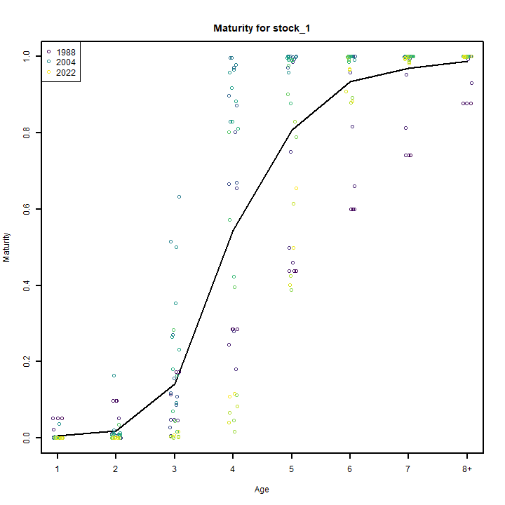
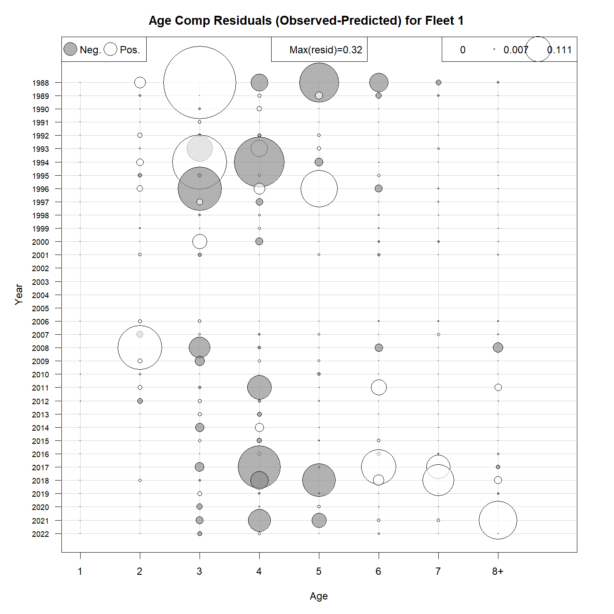
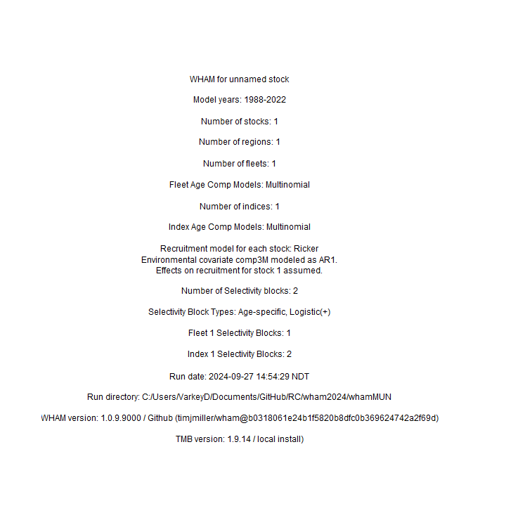
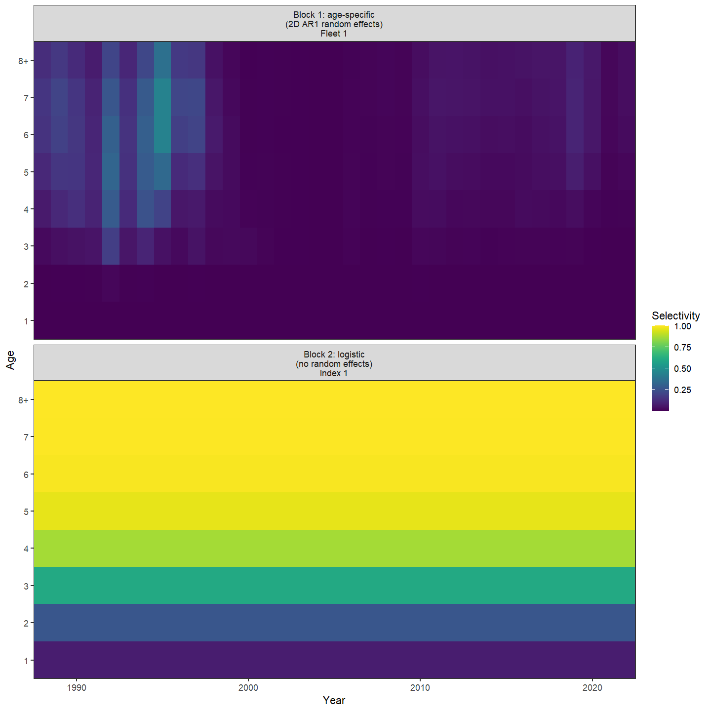
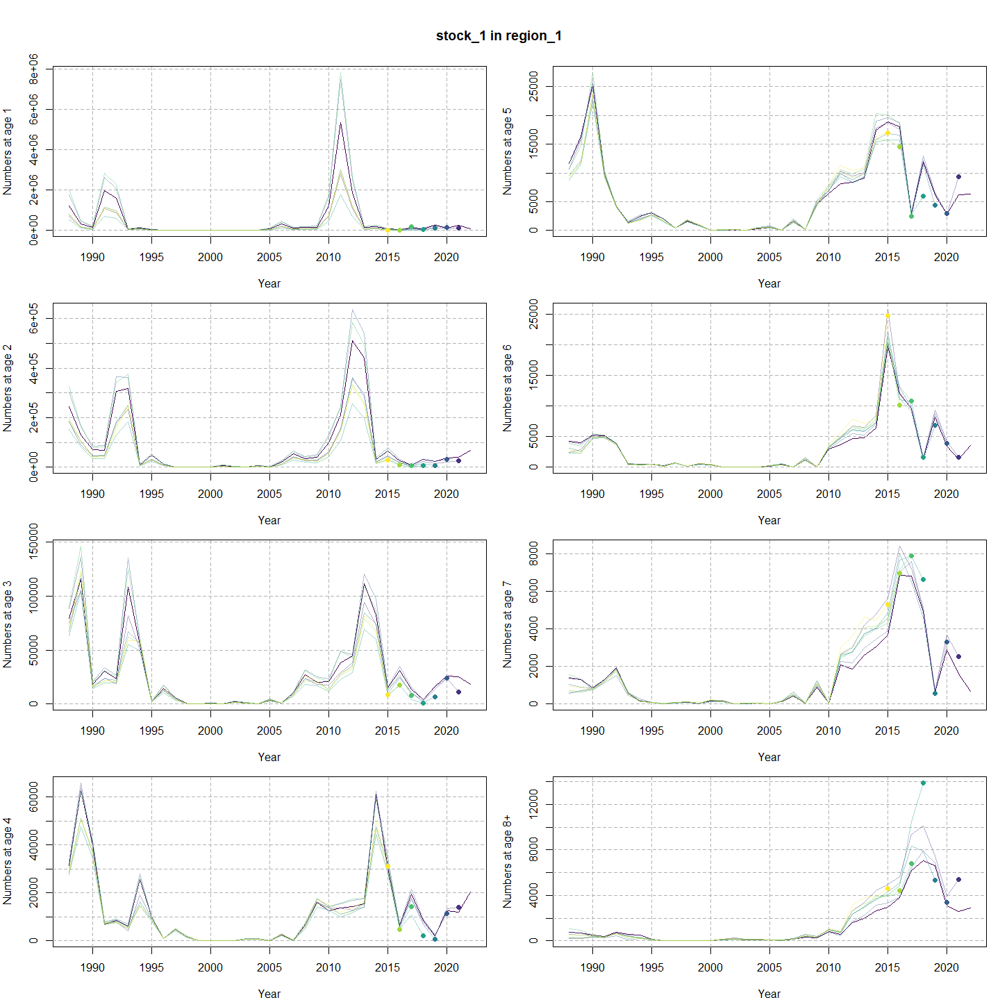
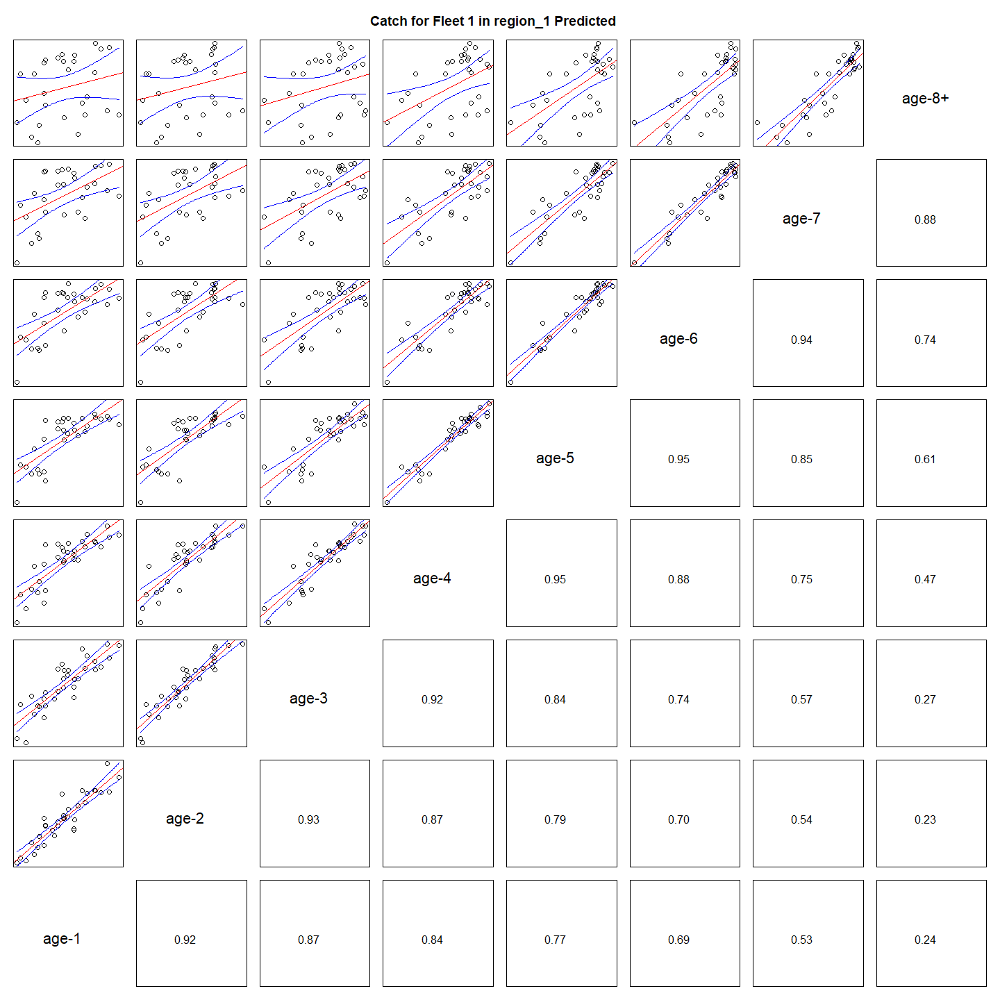

---
output:
  html_document:
    df_print: paged
    keep_md: yes
  word_document: default
  pdf_document:
    fig_caption: yes
    includes:
    keep_tex: yes
    number_sections: no
title: "WHAM figures and tables"
header-includes:
  - \usepackage{longtable}
  - \usepackage{booktabs}
  - \usepackage{caption,graphics}
  - \usepackage{makecell}
  - \usepackage{lscape}
  - \renewcommand\figurename{Fig.}
  - \captionsetup{labelsep=period, singlelinecheck=false}
  - \newcommand{\changesize}[1]{\fontsize{#1pt}{#1pt}\selectfont}
  - \renewcommand{\arraystretch}{1.5}
  - \renewcommand\theadfont{}
---

# {.tabset}

## Figures {.tabset}

### Input

### Diagnostics

### Results

### Retro

### Reference points

### Miscellaneous

## Tables {.tabset}

### Parameter estimates

<table class="table" style="margin-left: auto; margin-right: auto;">
<caption>Parameter estimates, standard errors, and confidence intervals. Rounded to 3 decimal places.</caption>
 <thead>
  <tr>
   <th style="text-align:left;">   </th>
   <th style="text-align:right;"> Estimate </th>
   <th style="text-align:right;"> Std. Error </th>
   <th style="text-align:right;"> 95\% CI lower </th>
   <th style="text-align:right;"> 95\% CI upper </th>
  </tr>
 </thead>
<tbody>
  <tr>
   <td style="text-align:left;"> stock.1.Mean.Recruitment </td>
   <td style="text-align:right;"> $80198.713$ </td>
   <td style="text-align:right;"> $117305.910$ </td>
   <td style="text-align:right;"> $4561.659$ </td>
   <td style="text-align:right;"> $1409976.782$ </td>
  </tr>
  <tr>
   <td style="text-align:left;"> stock.1.NAA...sigma...age.1. </td>
   <td style="text-align:right;"> $1.646$ </td>
   <td style="text-align:right;"> $0.262$ </td>
   <td style="text-align:right;"> $1.205$ </td>
   <td style="text-align:right;"> $2.248$ </td>
  </tr>
  <tr>
   <td style="text-align:left;"> stock.1.NAA...sigma...ages.2.8.. </td>
   <td style="text-align:right;"> $0.523$ </td>
   <td style="text-align:right;"> $0.067$ </td>
   <td style="text-align:right;"> $0.407$ </td>
   <td style="text-align:right;"> $0.672$ </td>
  </tr>
  <tr>
   <td style="text-align:left;"> stock.1...NAA.AR1...rho..age </td>
   <td style="text-align:right;"> $0.425$ </td>
   <td style="text-align:right;"> $0.159$ </td>
   <td style="text-align:right;"> $0.073$ </td>
   <td style="text-align:right;"> $0.682$ </td>
  </tr>
  <tr>
   <td style="text-align:left;"> stock.1...NAA.AR1...rho..year </td>
   <td style="text-align:right;"> $0.186$ </td>
   <td style="text-align:right;"> $0.255$ </td>
   <td style="text-align:right;"> $-0.318$ </td>
   <td style="text-align:right;"> $0.609$ </td>
  </tr>
  <tr>
   <td style="text-align:left;"> stock.1...Recruitment.AR1...rho..year </td>
   <td style="text-align:right;"> $0.186$ </td>
   <td style="text-align:right;"> $0.255$ </td>
   <td style="text-align:right;"> $-0.318$ </td>
   <td style="text-align:right;"> $0.609$ </td>
  </tr>
  <tr>
   <td style="text-align:left;"> Index.1.fully.selected.q </td>
   <td style="text-align:right;"> $1.083$ </td>
   <td style="text-align:right;"> $0.435$ </td>
   <td style="text-align:right;"> $0.492$ </td>
   <td style="text-align:right;"> $2.380$ </td>
  </tr>
  <tr>
   <td style="text-align:left;"> Block.1..Fleet.1.Mean.Selectivity.for.age.1 </td>
   <td style="text-align:right;"> $6.704\times 10^{-7}$ </td>
   <td style="text-align:right;"> $8.836\times 10^{-7}$ </td>
   <td style="text-align:right;"> $5.064\times 10^{-8}$ </td>
   <td style="text-align:right;"> $8.876\times 10^{-6}$ </td>
  </tr>
  <tr>
   <td style="text-align:left;"> Block.1..Fleet.1.Mean.Selectivity.for.age.2 </td>
   <td style="text-align:right;"> $2.632\times 10^{-4}$ </td>
   <td style="text-align:right;"> $2.208\times 10^{-4}$ </td>
   <td style="text-align:right;"> $5.087\times 10^{-5}$ </td>
   <td style="text-align:right;"> $0.001$ </td>
  </tr>
  <tr>
   <td style="text-align:left;"> Block.1..Fleet.1.Mean.Selectivity.for.age.3 </td>
   <td style="text-align:right;"> $0.006$ </td>
   <td style="text-align:right;"> $0.004$ </td>
   <td style="text-align:right;"> $0.002$ </td>
   <td style="text-align:right;"> $0.024$ </td>
  </tr>
  <tr>
   <td style="text-align:left;"> Block.1..Fleet.1.Mean.Selectivity.for.age.4 </td>
   <td style="text-align:right;"> $0.016$ </td>
   <td style="text-align:right;"> $0.010$ </td>
   <td style="text-align:right;"> $0.005$ </td>
   <td style="text-align:right;"> $0.052$ </td>
  </tr>
  <tr>
   <td style="text-align:left;"> Block.1..Fleet.1.Mean.Selectivity.for.age.5 </td>
   <td style="text-align:right;"> $0.024$ </td>
   <td style="text-align:right;"> $0.015$ </td>
   <td style="text-align:right;"> $0.007$ </td>
   <td style="text-align:right;"> $0.079$ </td>
  </tr>
  <tr>
   <td style="text-align:left;"> Block.1..Fleet.1.Mean.Selectivity.for.age.6 </td>
   <td style="text-align:right;"> $0.029$ </td>
   <td style="text-align:right;"> $0.018$ </td>
   <td style="text-align:right;"> $0.008$ </td>
   <td style="text-align:right;"> $0.095$ </td>
  </tr>
  <tr>
   <td style="text-align:left;"> Block.1..Fleet.1.Mean.Selectivity.for.age.7 </td>
   <td style="text-align:right;"> $0.030$ </td>
   <td style="text-align:right;"> $0.020$ </td>
   <td style="text-align:right;"> $0.008$ </td>
   <td style="text-align:right;"> $0.104$ </td>
  </tr>
  <tr>
   <td style="text-align:left;"> Block.1..Fleet.1.Mean.Selectivity.for.age.8. </td>
   <td style="text-align:right;"> $0.029$ </td>
   <td style="text-align:right;"> $0.020$ </td>
   <td style="text-align:right;"> $0.007$ </td>
   <td style="text-align:right;"> $0.108$ </td>
  </tr>
  <tr>
   <td style="text-align:left;"> Block.2..Index.1..a_.50.. </td>
   <td style="text-align:right;"> $2.515$ </td>
   <td style="text-align:right;"> $0.426$ </td>
   <td style="text-align:right;"> $1.763$ </td>
   <td style="text-align:right;"> $3.413$ </td>
  </tr>
  <tr>
   <td style="text-align:left;"> Block.2..Index.1.1.slope..increasing. </td>
   <td style="text-align:right;"> $0.616$ </td>
   <td style="text-align:right;"> $0.123$ </td>
   <td style="text-align:right;"> $0.414$ </td>
   <td style="text-align:right;"> $0.905$ </td>
  </tr>
  <tr>
   <td style="text-align:left;"> Block.1..Fleet.1.Selectivity.RE...sigma. </td>
   <td style="text-align:right;"> $0.503$ </td>
   <td style="text-align:right;"> $0.072$ </td>
   <td style="text-align:right;"> $0.380$ </td>
   <td style="text-align:right;"> $0.666$ </td>
  </tr>
  <tr>
   <td style="text-align:left;"> Block.1..Fleet.1.Selectivity.RE.AR1...rho...age. </td>
   <td style="text-align:right;"> $0.900$ </td>
   <td style="text-align:right;"> $0.031$ </td>
   <td style="text-align:right;"> $0.818$ </td>
   <td style="text-align:right;"> $0.946$ </td>
  </tr>
  <tr>
   <td style="text-align:left;"> Block.1..Fleet.1.Selectivity.RE.AR1...rho...year. </td>
   <td style="text-align:right;"> $0.631$ </td>
   <td style="text-align:right;"> $0.088$ </td>
   <td style="text-align:right;"> $0.427$ </td>
   <td style="text-align:right;"> $0.774$ </td>
  </tr>
  <tr>
   <td style="text-align:left;"> stock.1.region.1.mean.log.M..intercept.for.log.WAA..effects </td>
   <td style="text-align:right;"> $-0.563$ </td>
   <td style="text-align:right;"> $0.281$ </td>
   <td style="text-align:right;"> $-1.114$ </td>
   <td style="text-align:right;"> $-0.013$ </td>
  </tr>
  <tr>
   <td style="text-align:left;"> stock.1.region.1.mean.log.M..intercept.for.log.WAA..effects.1 </td>
   <td style="text-align:right;"> $-0.563$ </td>
   <td style="text-align:right;"> $0.281$ </td>
   <td style="text-align:right;"> $-1.114$ </td>
   <td style="text-align:right;"> $-0.013$ </td>
  </tr>
  <tr>
   <td style="text-align:left;"> stock.1.region.1.mean.log.M..intercept.for.log.WAA..effects.2 </td>
   <td style="text-align:right;"> $-0.563$ </td>
   <td style="text-align:right;"> $0.281$ </td>
   <td style="text-align:right;"> $-1.114$ </td>
   <td style="text-align:right;"> $-0.013$ </td>
  </tr>
  <tr>
   <td style="text-align:left;"> stock.1.region.1.mean.log.M..intercept.for.log.WAA..effects.3 </td>
   <td style="text-align:right;"> $-0.563$ </td>
   <td style="text-align:right;"> $0.281$ </td>
   <td style="text-align:right;"> $-1.114$ </td>
   <td style="text-align:right;"> $-0.013$ </td>
  </tr>
  <tr>
   <td style="text-align:left;"> stock.1.region.1.mean.log.M..intercept.for.log.WAA..effects.4 </td>
   <td style="text-align:right;"> $-0.563$ </td>
   <td style="text-align:right;"> $0.281$ </td>
   <td style="text-align:right;"> $-1.114$ </td>
   <td style="text-align:right;"> $-0.013$ </td>
  </tr>
  <tr>
   <td style="text-align:left;"> stock.1.region.1.mean.log.M..intercept.for.log.WAA..effects.5 </td>
   <td style="text-align:right;"> $-0.563$ </td>
   <td style="text-align:right;"> $0.281$ </td>
   <td style="text-align:right;"> $-1.114$ </td>
   <td style="text-align:right;"> $-0.013$ </td>
  </tr>
  <tr>
   <td style="text-align:left;"> stock.1.region.1.mean.log.M..intercept.for.log.WAA..effects.6 </td>
   <td style="text-align:right;"> $-0.563$ </td>
   <td style="text-align:right;"> $0.281$ </td>
   <td style="text-align:right;"> $-1.114$ </td>
   <td style="text-align:right;"> $-0.013$ </td>
  </tr>
  <tr>
   <td style="text-align:left;"> stock.1.region.1.mean.log.M..intercept.for.log.WAA..effects.7 </td>
   <td style="text-align:right;"> $-0.563$ </td>
   <td style="text-align:right;"> $0.281$ </td>
   <td style="text-align:right;"> $-1.114$ </td>
   <td style="text-align:right;"> $-0.013$ </td>
  </tr>
  <tr>
   <td style="text-align:left;"> stock.1.region.1log.M..slope.for.log.WAA..effect </td>
   <td style="text-align:right;"> $0.297$ </td>
   <td style="text-align:right;"> $0.023$ </td>
   <td style="text-align:right;"> $0.255$ </td>
   <td style="text-align:right;"> $0.346$ </td>
  </tr>
</tbody>
</table>

### Abundance at age

<table class="table" style="margin-left: auto; margin-right: auto;">
<caption>Abundance at age (1000s) for stock 1 in region 1.</caption>
 <thead>
  <tr>
   <th style="text-align:left;">   </th>
   <th style="text-align:right;"> 1 </th>
   <th style="text-align:right;"> 2 </th>
   <th style="text-align:right;"> 3 </th>
   <th style="text-align:right;"> 4 </th>
   <th style="text-align:right;"> 5 </th>
   <th style="text-align:right;"> 6 </th>
   <th style="text-align:right;"> 7 </th>
   <th style="text-align:right;"> 8+ </th>
  </tr>
 </thead>
<tbody>
  <tr>
   <td style="text-align:left;"> 1988 </td>
   <td style="text-align:right;"> 1265405 </td>
   <td style="text-align:right;"> 259842 </td>
   <td style="text-align:right;"> 85278 </td>
   <td style="text-align:right;"> 33273 </td>
   <td style="text-align:right;"> 11602 </td>
   <td style="text-align:right;"> 3753 </td>
   <td style="text-align:right;"> 1146 </td>
   <td style="text-align:right;"> 607 </td>
  </tr>
  <tr>
   <td style="text-align:left;"> 1989 </td>
   <td style="text-align:right;"> 470175 </td>
   <td style="text-align:right;"> 142447 </td>
   <td style="text-align:right;"> 114720 </td>
   <td style="text-align:right;"> 71061 </td>
   <td style="text-align:right;"> 20479 </td>
   <td style="text-align:right;"> 4440 </td>
   <td style="text-align:right;"> 1187 </td>
   <td style="text-align:right;"> 613 </td>
  </tr>
  <tr>
   <td style="text-align:left;"> 1990 </td>
   <td style="text-align:right;"> 180900 </td>
   <td style="text-align:right;"> 70729 </td>
   <td style="text-align:right;"> 19949 </td>
   <td style="text-align:right;"> 41571 </td>
   <td style="text-align:right;"> 27331 </td>
   <td style="text-align:right;"> 5965 </td>
   <td style="text-align:right;"> 1000 </td>
   <td style="text-align:right;"> 487 </td>
  </tr>
  <tr>
   <td style="text-align:left;"> 1991 </td>
   <td style="text-align:right;"> 2238007 </td>
   <td style="text-align:right;"> 76639 </td>
   <td style="text-align:right;"> 30194 </td>
   <td style="text-align:right;"> 7439 </td>
   <td style="text-align:right;"> 9915 </td>
   <td style="text-align:right;"> 5220 </td>
   <td style="text-align:right;"> 1326 </td>
   <td style="text-align:right;"> 436 </td>
  </tr>
  <tr>
   <td style="text-align:left;"> 1992 </td>
   <td style="text-align:right;"> 2026758 </td>
   <td style="text-align:right;"> 338509 </td>
   <td style="text-align:right;"> 23885 </td>
   <td style="text-align:right;"> 9032 </td>
   <td style="text-align:right;"> 3950 </td>
   <td style="text-align:right;"> 4060 </td>
   <td style="text-align:right;"> 2043 </td>
   <td style="text-align:right;"> 812 </td>
  </tr>
  <tr>
   <td style="text-align:left;"> 1993 </td>
   <td style="text-align:right;"> 105456 </td>
   <td style="text-align:right;"> 379883 </td>
   <td style="text-align:right;"> 109574 </td>
   <td style="text-align:right;"> 6126 </td>
   <td style="text-align:right;"> 1843 </td>
   <td style="text-align:right;"> 581 </td>
   <td style="text-align:right;"> 663 </td>
   <td style="text-align:right;"> 658 </td>
  </tr>
  <tr>
   <td style="text-align:left;"> 1994 </td>
   <td style="text-align:right;"> 182251 </td>
   <td style="text-align:right;"> 12545 </td>
   <td style="text-align:right;"> 59015 </td>
   <td style="text-align:right;"> 24830 </td>
   <td style="text-align:right;"> 2333 </td>
   <td style="text-align:right;"> 697 </td>
   <td style="text-align:right;"> 201 </td>
   <td style="text-align:right;"> 566 </td>
  </tr>
  <tr>
   <td style="text-align:left;"> 1995 </td>
   <td style="text-align:right;"> 43986 </td>
   <td style="text-align:right;"> 50499 </td>
   <td style="text-align:right;"> 2825 </td>
   <td style="text-align:right;"> 10578 </td>
   <td style="text-align:right;"> 3222 </td>
   <td style="text-align:right;"> 478 </td>
   <td style="text-align:right;"> 118 </td>
   <td style="text-align:right;"> 190 </td>
  </tr>
  <tr>
   <td style="text-align:left;"> 1996 </td>
   <td style="text-align:right;"> 2870 </td>
   <td style="text-align:right;"> 13673 </td>
   <td style="text-align:right;"> 15550 </td>
   <td style="text-align:right;"> 1079 </td>
   <td style="text-align:right;"> 2268 </td>
   <td style="text-align:right;"> 410 </td>
   <td style="text-align:right;"> 36 </td>
   <td style="text-align:right;"> 33 </td>
  </tr>
  <tr>
   <td style="text-align:left;"> 1997 </td>
   <td style="text-align:right;"> 1305 </td>
   <td style="text-align:right;"> 649 </td>
   <td style="text-align:right;"> 6595 </td>
   <td style="text-align:right;"> 5831 </td>
   <td style="text-align:right;"> 525 </td>
   <td style="text-align:right;"> 863 </td>
   <td style="text-align:right;"> 104 </td>
   <td style="text-align:right;"> 18 </td>
  </tr>
  <tr>
   <td style="text-align:left;"> 1998 </td>
   <td style="text-align:right;"> 1460 </td>
   <td style="text-align:right;"> 355 </td>
   <td style="text-align:right;"> 240 </td>
   <td style="text-align:right;"> 2028 </td>
   <td style="text-align:right;"> 2097 </td>
   <td style="text-align:right;"> 144 </td>
   <td style="text-align:right;"> 140 </td>
   <td style="text-align:right;"> 23 </td>
  </tr>
  <tr>
   <td style="text-align:left;"> 1999 </td>
   <td style="text-align:right;"> 103 </td>
   <td style="text-align:right;"> 647 </td>
   <td style="text-align:right;"> 229 </td>
   <td style="text-align:right;"> 162 </td>
   <td style="text-align:right;"> 1045 </td>
   <td style="text-align:right;"> 654 </td>
   <td style="text-align:right;"> 38 </td>
   <td style="text-align:right;"> 41 </td>
  </tr>
  <tr>
   <td style="text-align:left;"> 2000 </td>
   <td style="text-align:right;"> 5699 </td>
   <td style="text-align:right;"> 38 </td>
   <td style="text-align:right;"> 683 </td>
   <td style="text-align:right;"> 148 </td>
   <td style="text-align:right;"> 71 </td>
   <td style="text-align:right;"> 422 </td>
   <td style="text-align:right;"> 199 </td>
   <td style="text-align:right;"> 33 </td>
  </tr>
  <tr>
   <td style="text-align:left;"> 2001 </td>
   <td style="text-align:right;"> 8592 </td>
   <td style="text-align:right;"> 6381 </td>
   <td style="text-align:right;"> 17 </td>
   <td style="text-align:right;"> 225 </td>
   <td style="text-align:right;"> 80 </td>
   <td style="text-align:right;"> 23 </td>
   <td style="text-align:right;"> 158 </td>
   <td style="text-align:right;"> 124 </td>
  </tr>
  <tr>
   <td style="text-align:left;"> 2002 </td>
   <td style="text-align:right;"> 2404 </td>
   <td style="text-align:right;"> 2987 </td>
   <td style="text-align:right;"> 1898 </td>
   <td style="text-align:right;"> 6 </td>
   <td style="text-align:right;"> 101 </td>
   <td style="text-align:right;"> 36 </td>
   <td style="text-align:right;"> 11 </td>
   <td style="text-align:right;"> 141 </td>
  </tr>
  <tr>
   <td style="text-align:left;"> 2003 </td>
   <td style="text-align:right;"> 20220 </td>
   <td style="text-align:right;"> 519 </td>
   <td style="text-align:right;"> 1014 </td>
   <td style="text-align:right;"> 601 </td>
   <td style="text-align:right;"> 3 </td>
   <td style="text-align:right;"> 47 </td>
   <td style="text-align:right;"> 18 </td>
   <td style="text-align:right;"> 77 </td>
  </tr>
  <tr>
   <td style="text-align:left;"> 2004 </td>
   <td style="text-align:right;"> 10698 </td>
   <td style="text-align:right;"> 8484 </td>
   <td style="text-align:right;"> 236 </td>
   <td style="text-align:right;"> 602 </td>
   <td style="text-align:right;"> 288 </td>
   <td style="text-align:right;"> 1 </td>
   <td style="text-align:right;"> 24 </td>
   <td style="text-align:right;"> 48 </td>
  </tr>
  <tr>
   <td style="text-align:left;"> 2005 </td>
   <td style="text-align:right;"> 120580 </td>
   <td style="text-align:right;"> 2218 </td>
   <td style="text-align:right;"> 4092 </td>
   <td style="text-align:right;"> 127 </td>
   <td style="text-align:right;"> 442 </td>
   <td style="text-align:right;"> 177 </td>
   <td style="text-align:right;"> 1 </td>
   <td style="text-align:right;"> 41 </td>
  </tr>
  <tr>
   <td style="text-align:left;"> 2006 </td>
   <td style="text-align:right;"> 378683 </td>
   <td style="text-align:right;"> 23840 </td>
   <td style="text-align:right;"> 785 </td>
   <td style="text-align:right;"> 2473 </td>
   <td style="text-align:right;"> 83 </td>
   <td style="text-align:right;"> 404 </td>
   <td style="text-align:right;"> 124 </td>
   <td style="text-align:right;"> 27 </td>
  </tr>
  <tr>
   <td style="text-align:left;"> 2007 </td>
   <td style="text-align:right;"> 116917 </td>
   <td style="text-align:right;"> 53671 </td>
   <td style="text-align:right;"> 10293 </td>
   <td style="text-align:right;"> 260 </td>
   <td style="text-align:right;"> 1673 </td>
   <td style="text-align:right;"> 64 </td>
   <td style="text-align:right;"> 413 </td>
   <td style="text-align:right;"> 135 </td>
  </tr>
  <tr>
   <td style="text-align:left;"> 2008 </td>
   <td style="text-align:right;"> 119226 </td>
   <td style="text-align:right;"> 36524 </td>
   <td style="text-align:right;"> 30591 </td>
   <td style="text-align:right;"> 7366 </td>
   <td style="text-align:right;"> 173 </td>
   <td style="text-align:right;"> 1319 </td>
   <td style="text-align:right;"> 50 </td>
   <td style="text-align:right;"> 374 </td>
  </tr>
  <tr>
   <td style="text-align:left;"> 2009 </td>
   <td style="text-align:right;"> 173570 </td>
   <td style="text-align:right;"> 40867 </td>
   <td style="text-align:right;"> 21409 </td>
   <td style="text-align:right;"> 17446 </td>
   <td style="text-align:right;"> 5000 </td>
   <td style="text-align:right;"> 102 </td>
   <td style="text-align:right;"> 978 </td>
   <td style="text-align:right;"> 280 </td>
  </tr>
  <tr>
   <td style="text-align:left;"> 2010 </td>
   <td style="text-align:right;"> 1508028 </td>
   <td style="text-align:right;"> 108921 </td>
   <td style="text-align:right;"> 23376 </td>
   <td style="text-align:right;"> 13386 </td>
   <td style="text-align:right;"> 7047 </td>
   <td style="text-align:right;"> 2917 </td>
   <td style="text-align:right;"> 69 </td>
   <td style="text-align:right;"> 880 </td>
  </tr>
  <tr>
   <td style="text-align:left;"> 2011 </td>
   <td style="text-align:right;"> 6618537 </td>
   <td style="text-align:right;"> 306240 </td>
   <td style="text-align:right;"> 42010 </td>
   <td style="text-align:right;"> 14983 </td>
   <td style="text-align:right;"> 8501 </td>
   <td style="text-align:right;"> 4218 </td>
   <td style="text-align:right;"> 2037 </td>
   <td style="text-align:right;"> 691 </td>
  </tr>
  <tr>
   <td style="text-align:left;"> 2012 </td>
   <td style="text-align:right;"> 2333626 </td>
   <td style="text-align:right;"> 540935 </td>
   <td style="text-align:right;"> 46282 </td>
   <td style="text-align:right;"> 14119 </td>
   <td style="text-align:right;"> 8413 </td>
   <td style="text-align:right;"> 5018 </td>
   <td style="text-align:right;"> 2252 </td>
   <td style="text-align:right;"> 1760 </td>
  </tr>
  <tr>
   <td style="text-align:left;"> 2013 </td>
   <td style="text-align:right;"> 172424 </td>
   <td style="text-align:right;"> 412470 </td>
   <td style="text-align:right;"> 104254 </td>
   <td style="text-align:right;"> 15143 </td>
   <td style="text-align:right;"> 8316 </td>
   <td style="text-align:right;"> 4971 </td>
   <td style="text-align:right;"> 2843 </td>
   <td style="text-align:right;"> 2262 </td>
  </tr>
  <tr>
   <td style="text-align:left;"> 2014 </td>
   <td style="text-align:right;"> 194207 </td>
   <td style="text-align:right;"> 30852 </td>
   <td style="text-align:right;"> 81622 </td>
   <td style="text-align:right;"> 60096 </td>
   <td style="text-align:right;"> 19298 </td>
   <td style="text-align:right;"> 7526 </td>
   <td style="text-align:right;"> 3618 </td>
   <td style="text-align:right;"> 3124 </td>
  </tr>
  <tr>
   <td style="text-align:left;"> 2015 </td>
   <td style="text-align:right;"> 64165 </td>
   <td style="text-align:right;"> 64328 </td>
   <td style="text-align:right;"> 14074 </td>
   <td style="text-align:right;"> 33114 </td>
   <td style="text-align:right;"> 22585 </td>
   <td style="text-align:right;"> 21647 </td>
   <td style="text-align:right;"> 4735 </td>
   <td style="text-align:right;"> 3699 </td>
  </tr>
  <tr>
   <td style="text-align:left;"> 2016 </td>
   <td style="text-align:right;"> 23073 </td>
   <td style="text-align:right;"> 24052 </td>
   <td style="text-align:right;"> 32292 </td>
   <td style="text-align:right;"> 7166 </td>
   <td style="text-align:right;"> 20060 </td>
   <td style="text-align:right;"> 13923 </td>
   <td style="text-align:right;"> 8258 </td>
   <td style="text-align:right;"> 4387 </td>
  </tr>
  <tr>
   <td style="text-align:left;"> 2017 </td>
   <td style="text-align:right;"> 90943 </td>
   <td style="text-align:right;"> 6922 </td>
   <td style="text-align:right;"> 13506 </td>
   <td style="text-align:right;"> 22005 </td>
   <td style="text-align:right;"> 3800 </td>
   <td style="text-align:right;"> 11592 </td>
   <td style="text-align:right;"> 7812 </td>
   <td style="text-align:right;"> 7577 </td>
  </tr>
  <tr>
   <td style="text-align:left;"> 2018 </td>
   <td style="text-align:right;"> 100248 </td>
   <td style="text-align:right;"> 24852 </td>
   <td style="text-align:right;"> 3523 </td>
   <td style="text-align:right;"> 8360 </td>
   <td style="text-align:right;"> 13652 </td>
   <td style="text-align:right;"> 1822 </td>
   <td style="text-align:right;"> 5649 </td>
   <td style="text-align:right;"> 8150 </td>
  </tr>
  <tr>
   <td style="text-align:left;"> 2019 </td>
   <td style="text-align:right;"> 251402 </td>
   <td style="text-align:right;"> 22860 </td>
   <td style="text-align:right;"> 14785 </td>
   <td style="text-align:right;"> 2415 </td>
   <td style="text-align:right;"> 6711 </td>
   <td style="text-align:right;"> 9126 </td>
   <td style="text-align:right;"> 856 </td>
   <td style="text-align:right;"> 7435 </td>
  </tr>
  <tr>
   <td style="text-align:left;"> 2020 </td>
   <td style="text-align:right;"> 145997 </td>
   <td style="text-align:right;"> 44420 </td>
   <td style="text-align:right;"> 27087 </td>
   <td style="text-align:right;"> 16127 </td>
   <td style="text-align:right;"> 3668 </td>
   <td style="text-align:right;"> 4583 </td>
   <td style="text-align:right;"> 3842 </td>
   <td style="text-align:right;"> 3728 </td>
  </tr>
  <tr>
   <td style="text-align:left;"> 2021 </td>
   <td style="text-align:right;"> 265874 </td>
   <td style="text-align:right;"> 41727 </td>
   <td style="text-align:right;"> 32447 </td>
   <td style="text-align:right;"> 14961 </td>
   <td style="text-align:right;"> 8827 </td>
   <td style="text-align:right;"> 1684 </td>
   <td style="text-align:right;"> 2018 </td>
   <td style="text-align:right;"> 3460 </td>
  </tr>
  <tr>
   <td style="text-align:left;"> 2022 </td>
   <td style="text-align:right;"> 95605 </td>
   <td style="text-align:right;"> 76733 </td>
   <td style="text-align:right;"> 21696 </td>
   <td style="text-align:right;"> 24957 </td>
   <td style="text-align:right;"> 8196 </td>
   <td style="text-align:right;"> 4691 </td>
   <td style="text-align:right;"> 929 </td>
   <td style="text-align:right;"> 3609 </td>
  </tr>
</tbody>
</table>

### Fishing mortality at age by region

<table class="table" style="margin-left: auto; margin-right: auto;">
<caption>Total fishing mortality at age in region 1.</caption>
 <thead>
  <tr>
   <th style="text-align:left;">   </th>
   <th style="text-align:right;"> 1 </th>
   <th style="text-align:right;"> 2 </th>
   <th style="text-align:right;"> 3 </th>
   <th style="text-align:right;"> 4 </th>
   <th style="text-align:right;"> 5 </th>
   <th style="text-align:right;"> 6 </th>
   <th style="text-align:right;"> 7 </th>
   <th style="text-align:right;"> 8+ </th>
  </tr>
 </thead>
<tbody>
  <tr>
   <td style="text-align:left;"> 1988 </td>
   <td style="text-align:right;"> 0 </td>
   <td style="text-align:right;"> 0.005 </td>
   <td style="text-align:right;"> 0.120 </td>
   <td style="text-align:right;"> 0.368 </td>
   <td style="text-align:right;"> 0.595 </td>
   <td style="text-align:right;"> 0.713 </td>
   <td style="text-align:right;"> 0.691 </td>
   <td style="text-align:right;"> 0.588 </td>
  </tr>
  <tr>
   <td style="text-align:left;"> 1989 </td>
   <td style="text-align:right;"> 0 </td>
   <td style="text-align:right;"> 0.006 </td>
   <td style="text-align:right;"> 0.164 </td>
   <td style="text-align:right;"> 0.497 </td>
   <td style="text-align:right;"> 0.698 </td>
   <td style="text-align:right;"> 0.816 </td>
   <td style="text-align:right;"> 0.790 </td>
   <td style="text-align:right;"> 0.661 </td>
  </tr>
  <tr>
   <td style="text-align:left;"> 1990 </td>
   <td style="text-align:right;"> 0 </td>
   <td style="text-align:right;"> 0.008 </td>
   <td style="text-align:right;"> 0.207 </td>
   <td style="text-align:right;"> 0.622 </td>
   <td style="text-align:right;"> 0.684 </td>
   <td style="text-align:right;"> 0.676 </td>
   <td style="text-align:right;"> 0.627 </td>
   <td style="text-align:right;"> 0.513 </td>
  </tr>
  <tr>
   <td style="text-align:left;"> 1991 </td>
   <td style="text-align:right;"> 0 </td>
   <td style="text-align:right;"> 0.012 </td>
   <td style="text-align:right;"> 0.258 </td>
   <td style="text-align:right;"> 0.448 </td>
   <td style="text-align:right;"> 0.512 </td>
   <td style="text-align:right;"> 0.499 </td>
   <td style="text-align:right;"> 0.438 </td>
   <td style="text-align:right;"> 0.358 </td>
  </tr>
  <tr>
   <td style="text-align:left;"> 1992 </td>
   <td style="text-align:right;"> 0 </td>
   <td style="text-align:right;"> 0.065 </td>
   <td style="text-align:right;"> 0.852 </td>
   <td style="text-align:right;"> 1.343 </td>
   <td style="text-align:right;"> 1.581 </td>
   <td style="text-align:right;"> 1.480 </td>
   <td style="text-align:right;"> 1.266 </td>
   <td style="text-align:right;"> 1.012 </td>
  </tr>
  <tr>
   <td style="text-align:left;"> 1993 </td>
   <td style="text-align:right;"> 0 </td>
   <td style="text-align:right;"> 0.013 </td>
   <td style="text-align:right;"> 0.260 </td>
   <td style="text-align:right;"> 0.537 </td>
   <td style="text-align:right;"> 0.673 </td>
   <td style="text-align:right;"> 0.731 </td>
   <td style="text-align:right;"> 0.660 </td>
   <td style="text-align:right;"> 0.548 </td>
  </tr>
  <tr>
   <td style="text-align:left;"> 1994 </td>
   <td style="text-align:right;"> 0 </td>
   <td style="text-align:right;"> 0.014 </td>
   <td style="text-align:right;"> 0.451 </td>
   <td style="text-align:right;"> 1.179 </td>
   <td style="text-align:right;"> 1.327 </td>
   <td style="text-align:right;"> 1.511 </td>
   <td style="text-align:right;"> 1.358 </td>
   <td style="text-align:right;"> 1.099 </td>
  </tr>
  <tr>
   <td style="text-align:left;"> 1995 </td>
   <td style="text-align:right;"> 0 </td>
   <td style="text-align:right;"> 0.004 </td>
   <td style="text-align:right;"> 0.187 </td>
   <td style="text-align:right;"> 0.866 </td>
   <td style="text-align:right;"> 1.487 </td>
   <td style="text-align:right;"> 2.010 </td>
   <td style="text-align:right;"> 1.949 </td>
   <td style="text-align:right;"> 1.651 </td>
  </tr>
  <tr>
   <td style="text-align:left;"> 1996 </td>
   <td style="text-align:right;"> 0 </td>
   <td style="text-align:right;"> 0.003 </td>
   <td style="text-align:right;"> 0.100 </td>
   <td style="text-align:right;"> 0.245 </td>
   <td style="text-align:right;"> 0.470 </td>
   <td style="text-align:right;"> 0.736 </td>
   <td style="text-align:right;"> 0.778 </td>
   <td style="text-align:right;"> 0.652 </td>
  </tr>
  <tr>
   <td style="text-align:left;"> 1997 </td>
   <td style="text-align:right;"> 0 </td>
   <td style="text-align:right;"> 0.006 </td>
   <td style="text-align:right;"> 0.209 </td>
   <td style="text-align:right;"> 0.258 </td>
   <td style="text-align:right;"> 0.494 </td>
   <td style="text-align:right;"> 0.721 </td>
   <td style="text-align:right;"> 0.720 </td>
   <td style="text-align:right;"> 0.549 </td>
  </tr>
  <tr>
   <td style="text-align:left;"> 1998 </td>
   <td style="text-align:right;"> 0 </td>
   <td style="text-align:right;"> 0.002 </td>
   <td style="text-align:right;"> 0.078 </td>
   <td style="text-align:right;"> 0.113 </td>
   <td style="text-align:right;"> 0.189 </td>
   <td style="text-align:right;"> 0.250 </td>
   <td style="text-align:right;"> 0.207 </td>
   <td style="text-align:right;"> 0.160 </td>
  </tr>
  <tr>
   <td style="text-align:left;"> 1999 </td>
   <td style="text-align:right;"> 0 </td>
   <td style="text-align:right;"> 0.003 </td>
   <td style="text-align:right;"> 0.094 </td>
   <td style="text-align:right;"> 0.095 </td>
   <td style="text-align:right;"> 0.116 </td>
   <td style="text-align:right;"> 0.110 </td>
   <td style="text-align:right;"> 0.081 </td>
   <td style="text-align:right;"> 0.062 </td>
  </tr>
  <tr>
   <td style="text-align:left;"> 2000 </td>
   <td style="text-align:right;"> 0 </td>
   <td style="text-align:right;"> 0.004 </td>
   <td style="text-align:right;"> 0.088 </td>
   <td style="text-align:right;"> 0.026 </td>
   <td style="text-align:right;"> 0.021 </td>
   <td style="text-align:right;"> 0.012 </td>
   <td style="text-align:right;"> 0.009 </td>
   <td style="text-align:right;"> 0.009 </td>
  </tr>
  <tr>
   <td style="text-align:left;"> 2001 </td>
   <td style="text-align:right;"> 0 </td>
   <td style="text-align:right;"> 0.002 </td>
   <td style="text-align:right;"> 0.033 </td>
   <td style="text-align:right;"> 0.024 </td>
   <td style="text-align:right;"> 0.029 </td>
   <td style="text-align:right;"> 0.016 </td>
   <td style="text-align:right;"> 0.017 </td>
   <td style="text-align:right;"> 0.020 </td>
  </tr>
  <tr>
   <td style="text-align:left;"> 2002 </td>
   <td style="text-align:right;"> 0 </td>
   <td style="text-align:right;"> 0.001 </td>
   <td style="text-align:right;"> 0.010 </td>
   <td style="text-align:right;"> 0.011 </td>
   <td style="text-align:right;"> 0.014 </td>
   <td style="text-align:right;"> 0.011 </td>
   <td style="text-align:right;"> 0.011 </td>
   <td style="text-align:right;"> 0.013 </td>
  </tr>
  <tr>
   <td style="text-align:left;"> 2003 </td>
   <td style="text-align:right;"> 0 </td>
   <td style="text-align:right;"> 0.000 </td>
   <td style="text-align:right;"> 0.005 </td>
   <td style="text-align:right;"> 0.007 </td>
   <td style="text-align:right;"> 0.009 </td>
   <td style="text-align:right;"> 0.008 </td>
   <td style="text-align:right;"> 0.010 </td>
   <td style="text-align:right;"> 0.011 </td>
  </tr>
  <tr>
   <td style="text-align:left;"> 2004 </td>
   <td style="text-align:right;"> 0 </td>
   <td style="text-align:right;"> 0.000 </td>
   <td style="text-align:right;"> 0.001 </td>
   <td style="text-align:right;"> 0.002 </td>
   <td style="text-align:right;"> 0.002 </td>
   <td style="text-align:right;"> 0.002 </td>
   <td style="text-align:right;"> 0.002 </td>
   <td style="text-align:right;"> 0.003 </td>
  </tr>
  <tr>
   <td style="text-align:left;"> 2005 </td>
   <td style="text-align:right;"> 0 </td>
   <td style="text-align:right;"> 0.000 </td>
   <td style="text-align:right;"> 0.002 </td>
   <td style="text-align:right;"> 0.003 </td>
   <td style="text-align:right;"> 0.004 </td>
   <td style="text-align:right;"> 0.004 </td>
   <td style="text-align:right;"> 0.004 </td>
   <td style="text-align:right;"> 0.005 </td>
  </tr>
  <tr>
   <td style="text-align:left;"> 2006 </td>
   <td style="text-align:right;"> 0 </td>
   <td style="text-align:right;"> 0.001 </td>
   <td style="text-align:right;"> 0.029 </td>
   <td style="text-align:right;"> 0.043 </td>
   <td style="text-align:right;"> 0.042 </td>
   <td style="text-align:right;"> 0.033 </td>
   <td style="text-align:right;"> 0.032 </td>
   <td style="text-align:right;"> 0.030 </td>
  </tr>
  <tr>
   <td style="text-align:left;"> 2007 </td>
   <td style="text-align:right;"> 0 </td>
   <td style="text-align:right;"> 0.000 </td>
   <td style="text-align:right;"> 0.004 </td>
   <td style="text-align:right;"> 0.010 </td>
   <td style="text-align:right;"> 0.021 </td>
   <td style="text-align:right;"> 0.027 </td>
   <td style="text-align:right;"> 0.042 </td>
   <td style="text-align:right;"> 0.045 </td>
  </tr>
  <tr>
   <td style="text-align:left;"> 2008 </td>
   <td style="text-align:right;"> 0 </td>
   <td style="text-align:right;"> 0.000 </td>
   <td style="text-align:right;"> 0.006 </td>
   <td style="text-align:right;"> 0.017 </td>
   <td style="text-align:right;"> 0.032 </td>
   <td style="text-align:right;"> 0.037 </td>
   <td style="text-align:right;"> 0.052 </td>
   <td style="text-align:right;"> 0.052 </td>
  </tr>
  <tr>
   <td style="text-align:left;"> 2009 </td>
   <td style="text-align:right;"> 0 </td>
   <td style="text-align:right;"> 0.000 </td>
   <td style="text-align:right;"> 0.004 </td>
   <td style="text-align:right;"> 0.015 </td>
   <td style="text-align:right;"> 0.025 </td>
   <td style="text-align:right;"> 0.028 </td>
   <td style="text-align:right;"> 0.037 </td>
   <td style="text-align:right;"> 0.036 </td>
  </tr>
  <tr>
   <td style="text-align:left;"> 2010 </td>
   <td style="text-align:right;"> 0 </td>
   <td style="text-align:right;"> 0.005 </td>
   <td style="text-align:right;"> 0.062 </td>
   <td style="text-align:right;"> 0.140 </td>
   <td style="text-align:right;"> 0.156 </td>
   <td style="text-align:right;"> 0.162 </td>
   <td style="text-align:right;"> 0.169 </td>
   <td style="text-align:right;"> 0.151 </td>
  </tr>
  <tr>
   <td style="text-align:left;"> 2011 </td>
   <td style="text-align:right;"> 0 </td>
   <td style="text-align:right;"> 0.003 </td>
   <td style="text-align:right;"> 0.061 </td>
   <td style="text-align:right;"> 0.134 </td>
   <td style="text-align:right;"> 0.194 </td>
   <td style="text-align:right;"> 0.225 </td>
   <td style="text-align:right;"> 0.237 </td>
   <td style="text-align:right;"> 0.224 </td>
  </tr>
  <tr>
   <td style="text-align:left;"> 2012 </td>
   <td style="text-align:right;"> 0 </td>
   <td style="text-align:right;"> 0.001 </td>
   <td style="text-align:right;"> 0.041 </td>
   <td style="text-align:right;"> 0.085 </td>
   <td style="text-align:right;"> 0.157 </td>
   <td style="text-align:right;"> 0.197 </td>
   <td style="text-align:right;"> 0.221 </td>
   <td style="text-align:right;"> 0.231 </td>
  </tr>
  <tr>
   <td style="text-align:left;"> 2013 </td>
   <td style="text-align:right;"> 0 </td>
   <td style="text-align:right;"> 0.002 </td>
   <td style="text-align:right;"> 0.049 </td>
   <td style="text-align:right;"> 0.096 </td>
   <td style="text-align:right;"> 0.157 </td>
   <td style="text-align:right;"> 0.194 </td>
   <td style="text-align:right;"> 0.220 </td>
   <td style="text-align:right;"> 0.212 </td>
  </tr>
  <tr>
   <td style="text-align:left;"> 2014 </td>
   <td style="text-align:right;"> 0 </td>
   <td style="text-align:right;"> 0.001 </td>
   <td style="text-align:right;"> 0.018 </td>
   <td style="text-align:right;"> 0.079 </td>
   <td style="text-align:right;"> 0.097 </td>
   <td style="text-align:right;"> 0.143 </td>
   <td style="text-align:right;"> 0.169 </td>
   <td style="text-align:right;"> 0.160 </td>
  </tr>
  <tr>
   <td style="text-align:left;"> 2015 </td>
   <td style="text-align:right;"> 0 </td>
   <td style="text-align:right;"> 0.002 </td>
   <td style="text-align:right;"> 0.029 </td>
   <td style="text-align:right;"> 0.072 </td>
   <td style="text-align:right;"> 0.092 </td>
   <td style="text-align:right;"> 0.151 </td>
   <td style="text-align:right;"> 0.167 </td>
   <td style="text-align:right;"> 0.173 </td>
  </tr>
  <tr>
   <td style="text-align:left;"> 2016 </td>
   <td style="text-align:right;"> 0 </td>
   <td style="text-align:right;"> 0.002 </td>
   <td style="text-align:right;"> 0.041 </td>
   <td style="text-align:right;"> 0.120 </td>
   <td style="text-align:right;"> 0.123 </td>
   <td style="text-align:right;"> 0.123 </td>
   <td style="text-align:right;"> 0.154 </td>
   <td style="text-align:right;"> 0.202 </td>
  </tr>
  <tr>
   <td style="text-align:left;"> 2017 </td>
   <td style="text-align:right;"> 0 </td>
   <td style="text-align:right;"> 0.002 </td>
   <td style="text-align:right;"> 0.037 </td>
   <td style="text-align:right;"> 0.107 </td>
   <td style="text-align:right;"> 0.150 </td>
   <td style="text-align:right;"> 0.163 </td>
   <td style="text-align:right;"> 0.180 </td>
   <td style="text-align:right;"> 0.211 </td>
  </tr>
  <tr>
   <td style="text-align:left;"> 2018 </td>
   <td style="text-align:right;"> 0 </td>
   <td style="text-align:right;"> 0.001 </td>
   <td style="text-align:right;"> 0.033 </td>
   <td style="text-align:right;"> 0.098 </td>
   <td style="text-align:right;"> 0.174 </td>
   <td style="text-align:right;"> 0.201 </td>
   <td style="text-align:right;"> 0.198 </td>
   <td style="text-align:right;"> 0.215 </td>
  </tr>
  <tr>
   <td style="text-align:left;"> 2019 </td>
   <td style="text-align:right;"> 0 </td>
   <td style="text-align:right;"> 0.002 </td>
   <td style="text-align:right;"> 0.047 </td>
   <td style="text-align:right;"> 0.158 </td>
   <td style="text-align:right;"> 0.373 </td>
   <td style="text-align:right;"> 0.436 </td>
   <td style="text-align:right;"> 0.387 </td>
   <td style="text-align:right;"> 0.399 </td>
  </tr>
  <tr>
   <td style="text-align:left;"> 2020 </td>
   <td style="text-align:right;"> 0 </td>
   <td style="text-align:right;"> 0.000 </td>
   <td style="text-align:right;"> 0.006 </td>
   <td style="text-align:right;"> 0.044 </td>
   <td style="text-align:right;"> 0.147 </td>
   <td style="text-align:right;"> 0.218 </td>
   <td style="text-align:right;"> 0.220 </td>
   <td style="text-align:right;"> 0.244 </td>
  </tr>
  <tr>
   <td style="text-align:left;"> 2021 </td>
   <td style="text-align:right;"> 0 </td>
   <td style="text-align:right;"> 0.000 </td>
   <td style="text-align:right;"> 0.002 </td>
   <td style="text-align:right;"> 0.012 </td>
   <td style="text-align:right;"> 0.032 </td>
   <td style="text-align:right;"> 0.052 </td>
   <td style="text-align:right;"> 0.053 </td>
   <td style="text-align:right;"> 0.059 </td>
  </tr>
  <tr>
   <td style="text-align:left;"> 2022 </td>
   <td style="text-align:right;"> 0 </td>
   <td style="text-align:right;"> 0.000 </td>
   <td style="text-align:right;"> 0.002 </td>
   <td style="text-align:right;"> 0.020 </td>
   <td style="text-align:right;"> 0.053 </td>
   <td style="text-align:right;"> 0.103 </td>
   <td style="text-align:right;"> 0.113 </td>
   <td style="text-align:right;"> 0.128 </td>
  </tr>
</tbody>
</table>

### Fishing mortality at age by fleet

<table class="table" style="margin-left: auto; margin-right: auto;">
<caption>Total fishing mortality at age in Fleet 1.</caption>
 <thead>
  <tr>
   <th style="text-align:left;">   </th>
   <th style="text-align:right;"> 1 </th>
   <th style="text-align:right;"> 2 </th>
   <th style="text-align:right;"> 3 </th>
   <th style="text-align:right;"> 4 </th>
   <th style="text-align:right;"> 5 </th>
   <th style="text-align:right;"> 6 </th>
   <th style="text-align:right;"> 7 </th>
   <th style="text-align:right;"> 8+ </th>
  </tr>
 </thead>
<tbody>
  <tr>
   <td style="text-align:left;"> 1988 </td>
   <td style="text-align:right;"> 0 </td>
   <td style="text-align:right;"> 0.005 </td>
   <td style="text-align:right;"> 0.120 </td>
   <td style="text-align:right;"> 0.368 </td>
   <td style="text-align:right;"> 0.595 </td>
   <td style="text-align:right;"> 0.713 </td>
   <td style="text-align:right;"> 0.691 </td>
   <td style="text-align:right;"> 0.588 </td>
  </tr>
  <tr>
   <td style="text-align:left;"> 1989 </td>
   <td style="text-align:right;"> 0 </td>
   <td style="text-align:right;"> 0.006 </td>
   <td style="text-align:right;"> 0.164 </td>
   <td style="text-align:right;"> 0.497 </td>
   <td style="text-align:right;"> 0.698 </td>
   <td style="text-align:right;"> 0.816 </td>
   <td style="text-align:right;"> 0.790 </td>
   <td style="text-align:right;"> 0.661 </td>
  </tr>
  <tr>
   <td style="text-align:left;"> 1990 </td>
   <td style="text-align:right;"> 0 </td>
   <td style="text-align:right;"> 0.008 </td>
   <td style="text-align:right;"> 0.207 </td>
   <td style="text-align:right;"> 0.622 </td>
   <td style="text-align:right;"> 0.684 </td>
   <td style="text-align:right;"> 0.676 </td>
   <td style="text-align:right;"> 0.627 </td>
   <td style="text-align:right;"> 0.513 </td>
  </tr>
  <tr>
   <td style="text-align:left;"> 1991 </td>
   <td style="text-align:right;"> 0 </td>
   <td style="text-align:right;"> 0.012 </td>
   <td style="text-align:right;"> 0.258 </td>
   <td style="text-align:right;"> 0.448 </td>
   <td style="text-align:right;"> 0.512 </td>
   <td style="text-align:right;"> 0.499 </td>
   <td style="text-align:right;"> 0.438 </td>
   <td style="text-align:right;"> 0.358 </td>
  </tr>
  <tr>
   <td style="text-align:left;"> 1992 </td>
   <td style="text-align:right;"> 0 </td>
   <td style="text-align:right;"> 0.065 </td>
   <td style="text-align:right;"> 0.852 </td>
   <td style="text-align:right;"> 1.343 </td>
   <td style="text-align:right;"> 1.581 </td>
   <td style="text-align:right;"> 1.480 </td>
   <td style="text-align:right;"> 1.266 </td>
   <td style="text-align:right;"> 1.012 </td>
  </tr>
  <tr>
   <td style="text-align:left;"> 1993 </td>
   <td style="text-align:right;"> 0 </td>
   <td style="text-align:right;"> 0.013 </td>
   <td style="text-align:right;"> 0.260 </td>
   <td style="text-align:right;"> 0.537 </td>
   <td style="text-align:right;"> 0.673 </td>
   <td style="text-align:right;"> 0.731 </td>
   <td style="text-align:right;"> 0.660 </td>
   <td style="text-align:right;"> 0.548 </td>
  </tr>
  <tr>
   <td style="text-align:left;"> 1994 </td>
   <td style="text-align:right;"> 0 </td>
   <td style="text-align:right;"> 0.014 </td>
   <td style="text-align:right;"> 0.451 </td>
   <td style="text-align:right;"> 1.179 </td>
   <td style="text-align:right;"> 1.327 </td>
   <td style="text-align:right;"> 1.511 </td>
   <td style="text-align:right;"> 1.358 </td>
   <td style="text-align:right;"> 1.099 </td>
  </tr>
  <tr>
   <td style="text-align:left;"> 1995 </td>
   <td style="text-align:right;"> 0 </td>
   <td style="text-align:right;"> 0.004 </td>
   <td style="text-align:right;"> 0.187 </td>
   <td style="text-align:right;"> 0.866 </td>
   <td style="text-align:right;"> 1.487 </td>
   <td style="text-align:right;"> 2.010 </td>
   <td style="text-align:right;"> 1.949 </td>
   <td style="text-align:right;"> 1.651 </td>
  </tr>
  <tr>
   <td style="text-align:left;"> 1996 </td>
   <td style="text-align:right;"> 0 </td>
   <td style="text-align:right;"> 0.003 </td>
   <td style="text-align:right;"> 0.100 </td>
   <td style="text-align:right;"> 0.245 </td>
   <td style="text-align:right;"> 0.470 </td>
   <td style="text-align:right;"> 0.736 </td>
   <td style="text-align:right;"> 0.778 </td>
   <td style="text-align:right;"> 0.652 </td>
  </tr>
  <tr>
   <td style="text-align:left;"> 1997 </td>
   <td style="text-align:right;"> 0 </td>
   <td style="text-align:right;"> 0.006 </td>
   <td style="text-align:right;"> 0.209 </td>
   <td style="text-align:right;"> 0.258 </td>
   <td style="text-align:right;"> 0.494 </td>
   <td style="text-align:right;"> 0.721 </td>
   <td style="text-align:right;"> 0.720 </td>
   <td style="text-align:right;"> 0.549 </td>
  </tr>
  <tr>
   <td style="text-align:left;"> 1998 </td>
   <td style="text-align:right;"> 0 </td>
   <td style="text-align:right;"> 0.002 </td>
   <td style="text-align:right;"> 0.078 </td>
   <td style="text-align:right;"> 0.113 </td>
   <td style="text-align:right;"> 0.189 </td>
   <td style="text-align:right;"> 0.250 </td>
   <td style="text-align:right;"> 0.207 </td>
   <td style="text-align:right;"> 0.160 </td>
  </tr>
  <tr>
   <td style="text-align:left;"> 1999 </td>
   <td style="text-align:right;"> 0 </td>
   <td style="text-align:right;"> 0.003 </td>
   <td style="text-align:right;"> 0.094 </td>
   <td style="text-align:right;"> 0.095 </td>
   <td style="text-align:right;"> 0.116 </td>
   <td style="text-align:right;"> 0.110 </td>
   <td style="text-align:right;"> 0.081 </td>
   <td style="text-align:right;"> 0.062 </td>
  </tr>
  <tr>
   <td style="text-align:left;"> 2000 </td>
   <td style="text-align:right;"> 0 </td>
   <td style="text-align:right;"> 0.004 </td>
   <td style="text-align:right;"> 0.088 </td>
   <td style="text-align:right;"> 0.026 </td>
   <td style="text-align:right;"> 0.021 </td>
   <td style="text-align:right;"> 0.012 </td>
   <td style="text-align:right;"> 0.009 </td>
   <td style="text-align:right;"> 0.009 </td>
  </tr>
  <tr>
   <td style="text-align:left;"> 2001 </td>
   <td style="text-align:right;"> 0 </td>
   <td style="text-align:right;"> 0.002 </td>
   <td style="text-align:right;"> 0.033 </td>
   <td style="text-align:right;"> 0.024 </td>
   <td style="text-align:right;"> 0.029 </td>
   <td style="text-align:right;"> 0.016 </td>
   <td style="text-align:right;"> 0.017 </td>
   <td style="text-align:right;"> 0.020 </td>
  </tr>
  <tr>
   <td style="text-align:left;"> 2002 </td>
   <td style="text-align:right;"> 0 </td>
   <td style="text-align:right;"> 0.001 </td>
   <td style="text-align:right;"> 0.010 </td>
   <td style="text-align:right;"> 0.011 </td>
   <td style="text-align:right;"> 0.014 </td>
   <td style="text-align:right;"> 0.011 </td>
   <td style="text-align:right;"> 0.011 </td>
   <td style="text-align:right;"> 0.013 </td>
  </tr>
  <tr>
   <td style="text-align:left;"> 2003 </td>
   <td style="text-align:right;"> 0 </td>
   <td style="text-align:right;"> 0.000 </td>
   <td style="text-align:right;"> 0.005 </td>
   <td style="text-align:right;"> 0.007 </td>
   <td style="text-align:right;"> 0.009 </td>
   <td style="text-align:right;"> 0.008 </td>
   <td style="text-align:right;"> 0.010 </td>
   <td style="text-align:right;"> 0.011 </td>
  </tr>
  <tr>
   <td style="text-align:left;"> 2004 </td>
   <td style="text-align:right;"> 0 </td>
   <td style="text-align:right;"> 0.000 </td>
   <td style="text-align:right;"> 0.001 </td>
   <td style="text-align:right;"> 0.002 </td>
   <td style="text-align:right;"> 0.002 </td>
   <td style="text-align:right;"> 0.002 </td>
   <td style="text-align:right;"> 0.002 </td>
   <td style="text-align:right;"> 0.003 </td>
  </tr>
  <tr>
   <td style="text-align:left;"> 2005 </td>
   <td style="text-align:right;"> 0 </td>
   <td style="text-align:right;"> 0.000 </td>
   <td style="text-align:right;"> 0.002 </td>
   <td style="text-align:right;"> 0.003 </td>
   <td style="text-align:right;"> 0.004 </td>
   <td style="text-align:right;"> 0.004 </td>
   <td style="text-align:right;"> 0.004 </td>
   <td style="text-align:right;"> 0.005 </td>
  </tr>
  <tr>
   <td style="text-align:left;"> 2006 </td>
   <td style="text-align:right;"> 0 </td>
   <td style="text-align:right;"> 0.001 </td>
   <td style="text-align:right;"> 0.029 </td>
   <td style="text-align:right;"> 0.043 </td>
   <td style="text-align:right;"> 0.042 </td>
   <td style="text-align:right;"> 0.033 </td>
   <td style="text-align:right;"> 0.032 </td>
   <td style="text-align:right;"> 0.030 </td>
  </tr>
  <tr>
   <td style="text-align:left;"> 2007 </td>
   <td style="text-align:right;"> 0 </td>
   <td style="text-align:right;"> 0.000 </td>
   <td style="text-align:right;"> 0.004 </td>
   <td style="text-align:right;"> 0.010 </td>
   <td style="text-align:right;"> 0.021 </td>
   <td style="text-align:right;"> 0.027 </td>
   <td style="text-align:right;"> 0.042 </td>
   <td style="text-align:right;"> 0.045 </td>
  </tr>
  <tr>
   <td style="text-align:left;"> 2008 </td>
   <td style="text-align:right;"> 0 </td>
   <td style="text-align:right;"> 0.000 </td>
   <td style="text-align:right;"> 0.006 </td>
   <td style="text-align:right;"> 0.017 </td>
   <td style="text-align:right;"> 0.032 </td>
   <td style="text-align:right;"> 0.037 </td>
   <td style="text-align:right;"> 0.052 </td>
   <td style="text-align:right;"> 0.052 </td>
  </tr>
  <tr>
   <td style="text-align:left;"> 2009 </td>
   <td style="text-align:right;"> 0 </td>
   <td style="text-align:right;"> 0.000 </td>
   <td style="text-align:right;"> 0.004 </td>
   <td style="text-align:right;"> 0.015 </td>
   <td style="text-align:right;"> 0.025 </td>
   <td style="text-align:right;"> 0.028 </td>
   <td style="text-align:right;"> 0.037 </td>
   <td style="text-align:right;"> 0.036 </td>
  </tr>
  <tr>
   <td style="text-align:left;"> 2010 </td>
   <td style="text-align:right;"> 0 </td>
   <td style="text-align:right;"> 0.005 </td>
   <td style="text-align:right;"> 0.062 </td>
   <td style="text-align:right;"> 0.140 </td>
   <td style="text-align:right;"> 0.156 </td>
   <td style="text-align:right;"> 0.162 </td>
   <td style="text-align:right;"> 0.169 </td>
   <td style="text-align:right;"> 0.151 </td>
  </tr>
  <tr>
   <td style="text-align:left;"> 2011 </td>
   <td style="text-align:right;"> 0 </td>
   <td style="text-align:right;"> 0.003 </td>
   <td style="text-align:right;"> 0.061 </td>
   <td style="text-align:right;"> 0.134 </td>
   <td style="text-align:right;"> 0.194 </td>
   <td style="text-align:right;"> 0.225 </td>
   <td style="text-align:right;"> 0.237 </td>
   <td style="text-align:right;"> 0.224 </td>
  </tr>
  <tr>
   <td style="text-align:left;"> 2012 </td>
   <td style="text-align:right;"> 0 </td>
   <td style="text-align:right;"> 0.001 </td>
   <td style="text-align:right;"> 0.041 </td>
   <td style="text-align:right;"> 0.085 </td>
   <td style="text-align:right;"> 0.157 </td>
   <td style="text-align:right;"> 0.197 </td>
   <td style="text-align:right;"> 0.221 </td>
   <td style="text-align:right;"> 0.231 </td>
  </tr>
  <tr>
   <td style="text-align:left;"> 2013 </td>
   <td style="text-align:right;"> 0 </td>
   <td style="text-align:right;"> 0.002 </td>
   <td style="text-align:right;"> 0.049 </td>
   <td style="text-align:right;"> 0.096 </td>
   <td style="text-align:right;"> 0.157 </td>
   <td style="text-align:right;"> 0.194 </td>
   <td style="text-align:right;"> 0.220 </td>
   <td style="text-align:right;"> 0.212 </td>
  </tr>
  <tr>
   <td style="text-align:left;"> 2014 </td>
   <td style="text-align:right;"> 0 </td>
   <td style="text-align:right;"> 0.001 </td>
   <td style="text-align:right;"> 0.018 </td>
   <td style="text-align:right;"> 0.079 </td>
   <td style="text-align:right;"> 0.097 </td>
   <td style="text-align:right;"> 0.143 </td>
   <td style="text-align:right;"> 0.169 </td>
   <td style="text-align:right;"> 0.160 </td>
  </tr>
  <tr>
   <td style="text-align:left;"> 2015 </td>
   <td style="text-align:right;"> 0 </td>
   <td style="text-align:right;"> 0.002 </td>
   <td style="text-align:right;"> 0.029 </td>
   <td style="text-align:right;"> 0.072 </td>
   <td style="text-align:right;"> 0.092 </td>
   <td style="text-align:right;"> 0.151 </td>
   <td style="text-align:right;"> 0.167 </td>
   <td style="text-align:right;"> 0.173 </td>
  </tr>
  <tr>
   <td style="text-align:left;"> 2016 </td>
   <td style="text-align:right;"> 0 </td>
   <td style="text-align:right;"> 0.002 </td>
   <td style="text-align:right;"> 0.041 </td>
   <td style="text-align:right;"> 0.120 </td>
   <td style="text-align:right;"> 0.123 </td>
   <td style="text-align:right;"> 0.123 </td>
   <td style="text-align:right;"> 0.154 </td>
   <td style="text-align:right;"> 0.202 </td>
  </tr>
  <tr>
   <td style="text-align:left;"> 2017 </td>
   <td style="text-align:right;"> 0 </td>
   <td style="text-align:right;"> 0.002 </td>
   <td style="text-align:right;"> 0.037 </td>
   <td style="text-align:right;"> 0.107 </td>
   <td style="text-align:right;"> 0.150 </td>
   <td style="text-align:right;"> 0.163 </td>
   <td style="text-align:right;"> 0.180 </td>
   <td style="text-align:right;"> 0.211 </td>
  </tr>
  <tr>
   <td style="text-align:left;"> 2018 </td>
   <td style="text-align:right;"> 0 </td>
   <td style="text-align:right;"> 0.001 </td>
   <td style="text-align:right;"> 0.033 </td>
   <td style="text-align:right;"> 0.098 </td>
   <td style="text-align:right;"> 0.174 </td>
   <td style="text-align:right;"> 0.201 </td>
   <td style="text-align:right;"> 0.198 </td>
   <td style="text-align:right;"> 0.215 </td>
  </tr>
  <tr>
   <td style="text-align:left;"> 2019 </td>
   <td style="text-align:right;"> 0 </td>
   <td style="text-align:right;"> 0.002 </td>
   <td style="text-align:right;"> 0.047 </td>
   <td style="text-align:right;"> 0.158 </td>
   <td style="text-align:right;"> 0.373 </td>
   <td style="text-align:right;"> 0.436 </td>
   <td style="text-align:right;"> 0.387 </td>
   <td style="text-align:right;"> 0.399 </td>
  </tr>
  <tr>
   <td style="text-align:left;"> 2020 </td>
   <td style="text-align:right;"> 0 </td>
   <td style="text-align:right;"> 0.000 </td>
   <td style="text-align:right;"> 0.006 </td>
   <td style="text-align:right;"> 0.044 </td>
   <td style="text-align:right;"> 0.147 </td>
   <td style="text-align:right;"> 0.218 </td>
   <td style="text-align:right;"> 0.220 </td>
   <td style="text-align:right;"> 0.244 </td>
  </tr>
  <tr>
   <td style="text-align:left;"> 2021 </td>
   <td style="text-align:right;"> 0 </td>
   <td style="text-align:right;"> 0.000 </td>
   <td style="text-align:right;"> 0.002 </td>
   <td style="text-align:right;"> 0.012 </td>
   <td style="text-align:right;"> 0.032 </td>
   <td style="text-align:right;"> 0.052 </td>
   <td style="text-align:right;"> 0.053 </td>
   <td style="text-align:right;"> 0.059 </td>
  </tr>
  <tr>
   <td style="text-align:left;"> 2022 </td>
   <td style="text-align:right;"> 0 </td>
   <td style="text-align:right;"> 0.000 </td>
   <td style="text-align:right;"> 0.002 </td>
   <td style="text-align:right;"> 0.020 </td>
   <td style="text-align:right;"> 0.053 </td>
   <td style="text-align:right;"> 0.103 </td>
   <td style="text-align:right;"> 0.113 </td>
   <td style="text-align:right;"> 0.128 </td>
  </tr>
</tbody>
</table>
